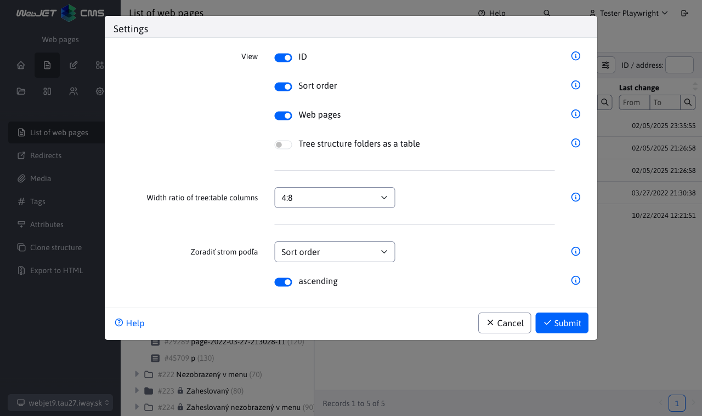
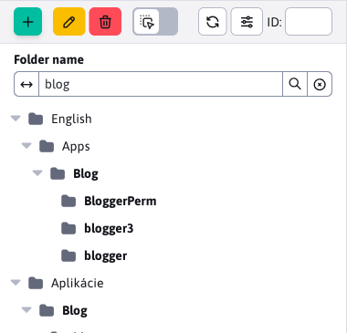
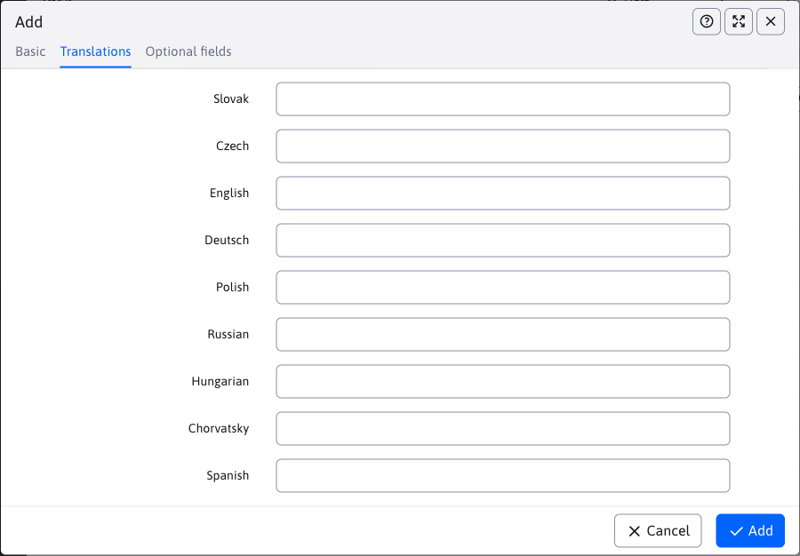
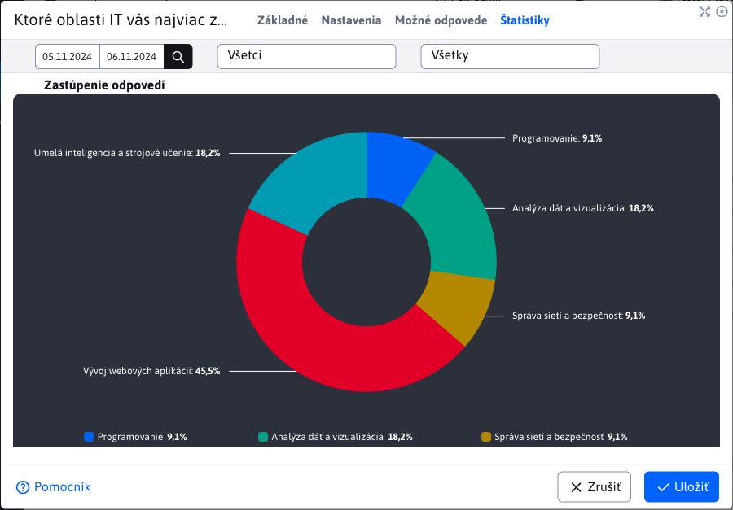
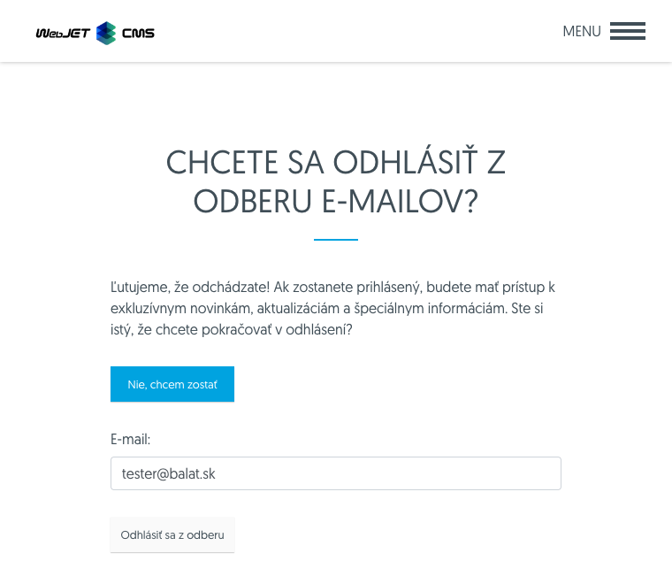
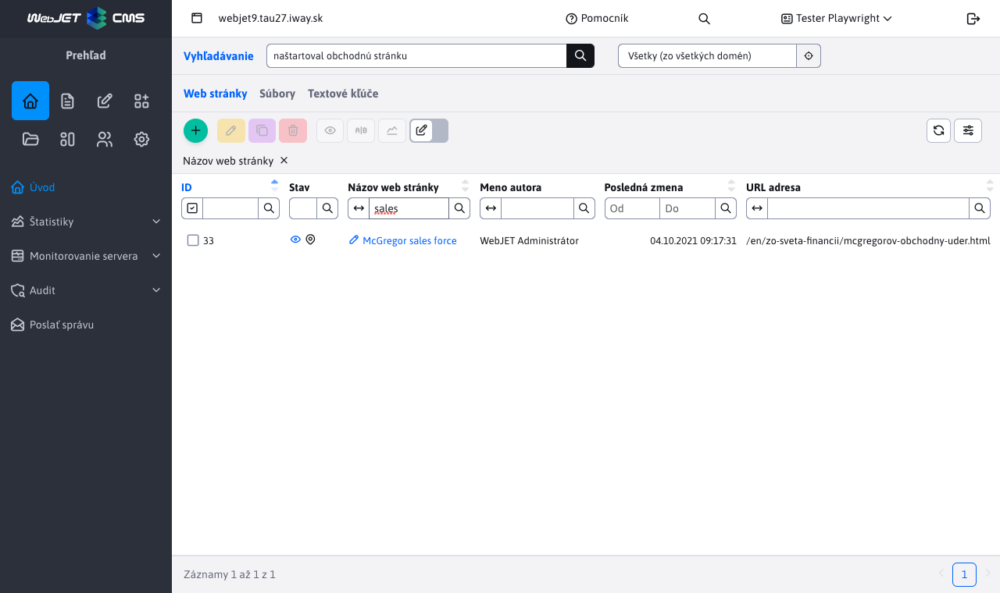

# WebJET CMS 2024

Welcome to the documentation for WebJET CMS version 2024. We recommend to read [list of changes](CHANGELOG-2024.md) a [roadmap](ROADMAP.md).

# List of changes in the latest version

## 2024.52

> In version 2024.52, the Web site adds the ability to set **method of arrangement** a **search in tree structure**, ZIP import allows you to set the way to compare the existing version of the page. **Ecommerce** received a new design of the order list and products. Added **survey statistics**, a better image editor in the explorer and improved search in the administration. V **bulk emails** option added **set the logout confirmation**. The gallery contains a new field for **the URL of the image source**, which is filled in automatically when you use the photo bank, **Tags** They add **language mutations** and optional fields.

### Groundbreaking changes

- Updated Java and JavaScript libraries to newer versions, check the changes in the programmer section below. You can use the update script `/admin/update/update-2023-18.jsp`.
- Increased security [public REST services](custom-apps/spring/public-services.md) if you use them, you need to complete the permits. Cancelled REST service `/admin/rest/property/set` (#57202).
- FontAwesome - modified embedding [FontAwesome Icons](frontend/webpages/fontawesome/README.md) in the editor (#57461).
- E-commerce - methods in `DocDetails` to obtain the price adjusted from the return value `double` at `BigDecimal`. You can use the script `/admin/update/update-2023-18.jsp` for basic updating of your JSP files. If necessary, you can temporarily use the methods `getPriceDouble/getVatDouble/getLocalPriceDouble/getLocalPriceDouble` (#56385).

### Web pages

- Added option to select the method and direction for the arrangement [tree structures](redactor/webpages/README.md#setting-the-tree-structure-view) (#57257).



- Tree structure - adding options [searches in tree structure](redactor/webpages/README.md#search-in-tree-structure) web site folders in depth (#57265).



- Tags - added option [language settings](redactor/webpages/perexgroups.md#card-translations) name of the perex group to display the title tag according to the language of the web page (#57273).



- FontAwesome - modified embedding [FontAwesome Icons](frontend/webpages/fontawesome/README.md) in the editor (#57461).
- Importing web pages from a ZIP archive - adding the option to select a parameter [to compare the existence](redactor/webpages/import-export.md#importing-web-pages-from-zip-archive) web pages, modified visuals, added options about/from/label all pages/files, open/close folders and added information about import progress. Optional Field Comparison allows pages to set a Unique Identifier to uniquely identify the web page (#57441) via the Optional Field Type.


- Importing web pages from the ZIP archive - added data separation at `multi-domain` where the data of another domain is ignored when looking for an existing version of the imported data (#57493).
- Improved transfer of installation name from template to `CombineTag`. The value is stored in the `session` and will also be used in the retrieval of files during the execution of `combine` (#56325).
- The JSP template file search takes into account the installation name set in the template (#56325).
- Tags - added tab with [optional fields](redactor/webpages/perexgroups.md#tab-optional-fields) for the ability to add custom data to tags. For example, setting the tag color, tag design, etc (#57449).
- Cloning structure - during cloning, the synchronization of the web page and folder name is disabled to preserve the names according to the original folder. Configuration variable `syncGroupAndWebpageTitle` is set to `false` and set to the original value (#57489) after the cloning is finished.
- Modified numbering if there is a web page with the same name/URL address - the newly created page starts from number 2 instead of number 1, this creates URLs of the type `/en/page.html,/en/page-2.html,/en/page-3.html` instead of `/en/page.html,/en/page-1.html,/en/page-2.html` Where `-1.html` was not semantically optimal (#54273-50).
- Added option to change the behaviour of the last `/` At [generating URLs for pages](frontend/setup/config.md). By default for the main page of a folder, the URL ends with the `/`, so for example `/en/products/`, after setting the configuration variable `virtualPathLastSlash` to the value of `false` the URL will be generated without the last `/` thus as `/en/products` (#54273-50).

### Survey

- Added [response statistics](redactor/apps/inquiry/inquiry-stat.md) polls (#57337).



### Ecommerce

- [List of orders](redactor/apps/eshop/invoice/README.md) a [List of products](redactor/apps/eshop/product-list/README.md) modified to new design for datatables (#56325).


- Methods in `DocDetails` to obtain the price adjusted from the return value `double` at `BigDecimal` (#56385).

### Gallery

- The default visual style type of the gallery can be set via the conf. variable `galleryDefaultStyle`, by default `photoSwipe` (#56393-18).
- Added option to select the method and direction for the arrangement [tree structures](redactor/webpages/README.md#setting-the-tree-structure-view) (#57257).
- Added an image source URL field with an option to specify the address from which you got the image. The field is automatically set when using [photo banks](redactor/webpages/working-in-editor/README.md#photobank-card) in the list of websites (#57313).
- Added option **search in tree structure** by name, similar to the website (#57437).


### Bulk e-mail
- Sending - when sending, the SSL certificate of the web page is ignored, as often a temporary SSL certificate (#57525) is used in the internal environment.
- Logout - created a new application for logout settings. Added the ability to enter custom text before unsubscribing and the ability to display a confirmation instead of immediately unsubscribing by clicking a link in the email (#57525).
- Unsubscribe - modified bulk email unsubscribe form - added option to show confirmation of unsubscribe and option to return email again after unsubscribing (#57525).



### Explorer

- Complete image editor replacement in action [file editing](redactor/files/fbrowser/file-edit/README.md) in the explorer section after the editor in the form `DataTable` according to the photo gallery (#57313).
- Improved display on mobile phones for better usability - adjusted height, size (#55645).

### Other

- Redesigned search in administration to data tables (#57333).



- Renamed the Edit Cell option to Edit in the grid view according to the nomenclature used in `Microsoft SharePoint`.
- Search - modified the search form on the web page for the possibility of defining placeholder text (`placeholder`) instead of the standard Search. You can then enter custom text to be displayed in the form, such as Search Web Page (#54273-53).

### Security

- Modified startup log - sensitive information like passwords, token, certificates from configuration variables are replaced with expression `********` (#MR643).
- [For public REST services](custom-apps/spring/public-services.md) added option to set allowed IP addresses for each service separately (#57202).
- Translation keys - added the ability to filter keys in the REST service [/rest/properties/](custom-apps/spring/public-services.md) by conf. variable `propertiesRestControllerAllowedKeysPrefixes` to make it impossible to publicly retrieve all keys from the WebJET CMS (#57202).
- HTTP header added to audit `Referer` (#57565).

### Error correction

- Fixed URL generation for AB Testing if the original URL contains a character `*` (#54273-50).
- Image editor - fixed renaming of image in image editor opened from explorer (#57269).
- Domain redirects - fixed the ability to specify a protocol for the redirect domain. Added redirection logic to `https` version when selecting the option `http` of the original protocol - assumed redirection to `https` Version (#56393-20).
- Web pages - Page Builder - fixed inserting applications and blocks at the correct cursor location (#57613).
- Web Pages - Blocks - Fixed deleting blank space in Firefox when inserting a block (#57613).

### Documentation

- Documentation created for [improve server performance](sysadmin/performance/README.md) (#57357).
- Created documentation in PDF for [of the editor](_media/manuals/webjetcms-redactor.pdf), [Administrator](_media/manuals/webjetcms-admin.pdf), [traffic](_media/manuals/webjetcms-sysadmin.pdf) a [install](_media/manuals/webjetcms-install.pdf). The PDF documentation is generated automatically from the current MarkDown documentation and includes the WebJET CMS version date (#57269).

### For the programmer

- Changed API for datatable `table.ajax.url(newUrl); -> table.setAjaxUrl(newUrl);`, `table.ajax.url() -> table.getAjaxUrl()` (#57365).
- Updated `Swagger-UI` at `/admin/swagger-ui/` to version `org.webjars:swagger-ui:5.17.14` (#57365).
- Updated library `Bootstrap` from 4.6.1 to 5.3.3 and `jQuery` from 3.5.1 to 3.7.1 for old v8 administration (#57365).
- Libraries removed in version 8 `bootstrap-modal,bootstrap-switch,bootstrap-toastr,uniform,simple-line-icons` (#57365).
- Need to edit the tab switching in your JSP files, search for `data-toggle="tab"` and replace with `data-bs-toggle="tab"`, `LI` set the element `class="nav-item"` and to the first `A` set the element `class="active"`:

```html
<ul class="nav nav-tabs">
    <li class="nav-item">
        <a class="active" href="#tabMenu1" data-bs-toggle="tab">
            <iwcm:text key="components.filter"/>
        </a>
    </li>
    <li class="nav-item">
        <a href="#tabMenu2" data-bs-toggle="tab" onclick="loadComponentIframe();">
            <iwcm:text key="components.file_archiv.waiting_files"/>
        </a>
    </li>
</ul>
```
- Removed methods `DocDB.searchTextAll,searchTextUrl`, use the class `sk.iway.iwcm.search.SearchService` (#57333).
- Applications via `!INCLUDE` can also be inserted from folders `/apps` a `/templates` (#56325).
- [Optional fields](frontend/webpages/customfields/README.md#paint) - added field type `color` for color selection (#57449).
- For [application in the editor](custom-apps/appstore/README.md#use-of-annotation) it is possible to define multiple JSP files for which it will be used, for example `@WebjetAppStore(...componentPath = "/components/search/search.jsp,/components/search/lucene_search.jsp")`. The first JSP file in the list (#54273-53) is used when inserting a new application.

[Full list of changes >>](CHANGELOG-2024.md)


