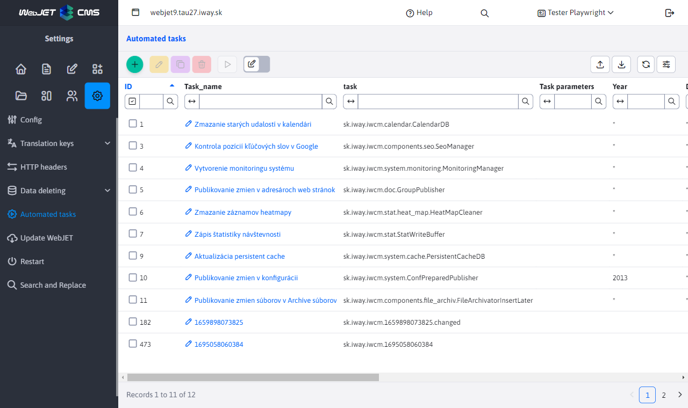
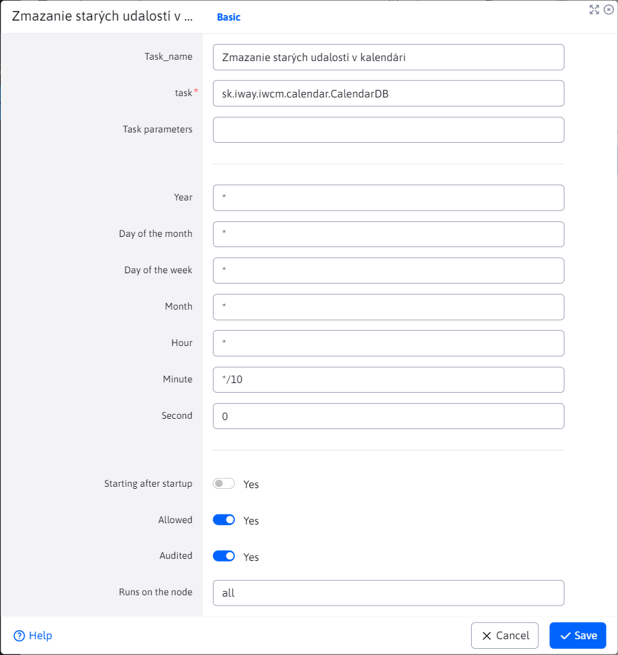

# Automated tasks

Automated tasks allow you to define tasks that are performed automatically on the server. The item can be found in the section **Settings** under the heading **Automated tasks**.

In the record editor window you can set:
- **Name of the task** - Enter a task name that describes what the task does (your own name).
- **Task** - reference to the Java class implementing the method `main` to be carried out. For example, a data download task is ready [en.iway.iwcm.system.cron.DownloadURL](../../../../../src/webjet8/java/sk/iway/iwcm/system/cron/DownloadURL.java)
- **Task parameters** - parameters passed for the specified task separated by a character `|`. In the case of a task `DownloadURL` are the parameters:
  - `URL-adresa|[fromEmail]|[toEmail]|[subject]`
  - Required parameter **URL** must be a complete address including `http://`.
  - Optional parameters `fromEmail,toEmail,subject` after downloading the page, you can send it to the specified email (for checking).
- **Year, day of the month, day of the week, month, hour, minute, second** - the time interval when the specified task is to be executed. Possible values are for example:
  - `*` - is always performed.
  - `*/10` - every 10 (or other specified number).
  - `20` - when the type has a value of 20.
  - `3-5` - 3rd, 4th and 5th time unit. It is counted from zero, so each second can be written as a span of 0-59.
  - For example, if you want to trigger an event every 10 minutes, you enter the `*` and into the field **Minutes** you enter `*/10`.
- **Startup after boot** - Specifies whether to run the task automatically when WebJET starts (e.g., to update data).
- **Allowed** - Indicates whether the task is currently enabled or disabled. If enabled, it will execute according to the specified schedule. If it is disabled, it will not run at all.
- **Audited** - Determines whether records of task performance are recorded in the audit. This option is useful for tracking and controlling task execution.
- **Running on a knot** - Specifies on which node or server to run the task if you are working in a multinode cluster environment.

Changes to task timing are applied immediately, but tasks that have already started will remain running until they finish.

## Standard tasks

[sk.iway.iwcm.system.cron.Echo](../../../../../src/webjet8/java/sk/iway/iwcm/system/cron/Echo.java) - Diagnostic task - prints its first parameter to the console.

**Parameters:**

1. The text you want to type.

[en.iway.iwcm.system.cron.DownloadURL](../../../../../src/webjet8/java/sk/iway/iwcm/system/cron/DownloadURL.java) - It downloads the URL and sends it to your email.

**Parameters:**

1. URL, including `http://` prefixes, e.g. `https://www.interway.sk/`.

2. Sender's email.

3. Recipient (possibly several separated by a comma).

4. Subject of the report.

[sk.iway.iwcm.system.cron.SqlBatchRunner](../../../../../src/webjet8/java/sk/iway/iwcm/system/cron/SqlBatchRunner.java) - Executes SQL statements specified as parameters.

**Parameters:** SQL statements, separated by a character `|`.

[en.iway.iwcm.filebrowser.UnusedFilesCleaner](../../../../../src/webjet8/java/sk/iway/iwcm/filebrowser/UnusedFilesCleaner.java) - Scans the specified directory (file directory) for indexed files that are no longer referenced by any page, and unpublishes such files. This is because such unused files could appear in search results. Automatic purging is only meaningful for automatic indexing, which is enabled by the configuration variable `fileIndexerIndexAllFiles`.

**Parameters:**

1. A directory for scanning, e.g.: `/files`.

2. The email to which notifications of deleted files will be sent.

3. `true/false` Value. If the value is set `true`, the site will be unpublished. If `false`, only a notification will be sent.

[en.iway.iwcm.doc.GroupPublisher](../../../../../src/webjet8/java/sk/iway/iwcm/doc/GroupPublisher.java) - Publishes scheduled changes to web page folders.

**Parameters:**

- He doesn't.

[en.iway.iwcm.calendar.CalendarDB](../../../../../src/webjet8/java/sk/iway/iwcm/calendar/CalendarDB.java) - Sends email notifications about upcoming events in the event calendar.

**Parameters:**

- He doesn't.

[en.iway.iwcm.components.seo.SeoManager](../../../../../src/webjet8/java/sk/iway/iwcm/components/seo/SeoManager.java) - It detects the ranking of a page in search engines according to keywords.

**Parameters:**

- He doesn't.

[en.iway.iwcm.system.monitoring.MonitoringManager](../../../../../src/webjet8/java/sk/iway/iwcm/system/monitoring/MonitoringManager.java) - Stores data for server monitoring.

**Parameters:**

- He doesn't.

[en.iway.iwcm.stat.StatWriteBuffer](../../../../../src/webjet8/java/sk/iway/iwcm/stat/StatWriteBuffer.java) - The data on web page traffic statistics are collected in memory. When this class is executed, the memory is cleared and written to the database.

**Parameters:**

- He doesn't.

[en.iway.iwcm.stat.heat\_map.HeatMapCleaner](../../../../../src/webjet8/java/sk/iway/iwcm/stat/heat_map/HeatMapCleaner.java) - Deletes the generated images of the temperature maps of the clicks in the statistics.

**Parameters:**

- He doesn't.

[en.iway.iwcm.system.ConfPreparedPublisher](../../../../../src/webjet8/java/sk/iway/iwcm/system/ConfPreparedPublisher.java) - Publishes scheduled changes to configuration variables.

**Parameters:**

- He doesn't.

[en.iway.iwcm.components.file\_archiv.FileArchivatorInsertLater](../../../../../src/webjet8/java/sk/iway/iwcm/components/file_archiv/FileArchivatorInsertLater.java) - Publishes scheduled changes to the file archive.

**Parameters:**

- He doesn't.
