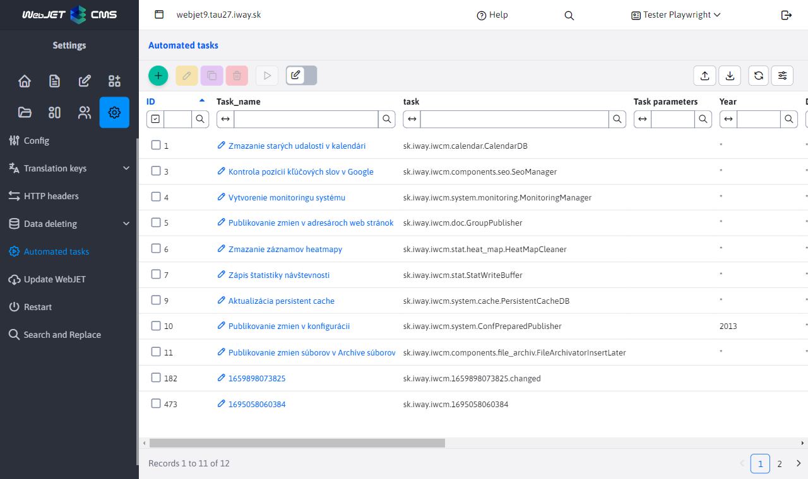
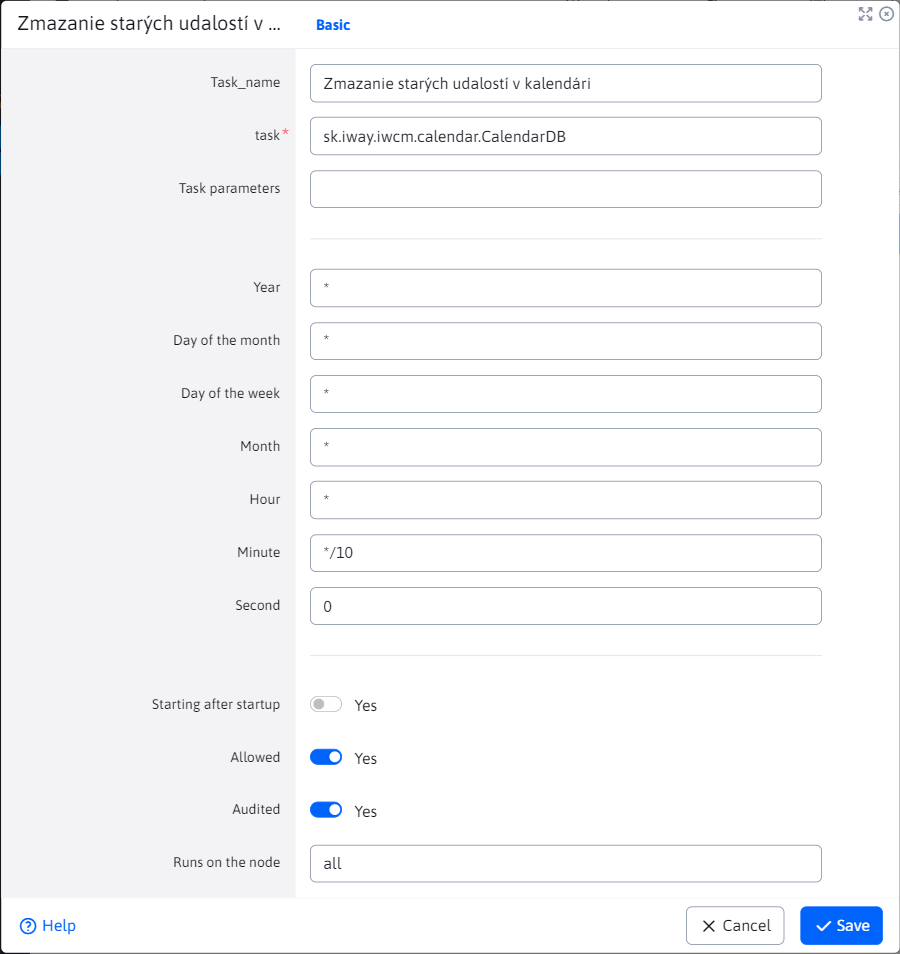

# Automated tasks

Automated tasks allow you to define tasks that are performed automatically on the server.
You can find the item in the **Settings** section under **Automated tasks**.

In the record editor window, you can set:

- **Task Name** - Enter a task name that describes what the task does (your own name).
- **Task** - a reference to a Java class implementing the method `main`, which will be executed. For example, a task for downloading data [sk.iway.iwcm.system.cron.DownloadURL](../../../../../src/main/java/sk/iway/iwcm/system/cron/DownloadURL.java) is prepared.
- **Task parameters** - parameters passed for the specified task separated by the `|` character. In the case of task `DownloadURL`, the parameters are:
  - `URL-adresa|[fromEmail]|[toEmail]|[subject]`
  - The mandatory parameter **URL-address** must be the complete address including `http://`.
  - Optional parameters `fromEmail,toEmail,subject` allow the page to be sent to the specified email address (for review) after downloading.
- **Year, day of the month, day of the week, month, hour, minute, second** - time interval when the specified task should be performed. Possible values ​​are, for example:
  - `*` - ​​will always be executed.
  - `*/10` - ​​every 10 (or other specified number).
  - `20` - ​​when the given type has the value 20.
  - `3-5` - ​​3rd, 4th and 5th time units. It is counted from zero, so each second can be written as a range of 0-59.
  - For example, if you want to trigger an event every 10 minutes, enter the character `*` everywhere and enter `*/10` in the **Minutes** field.
- **Run after startup** - Determines whether the task should be run automatically after WebJET starts (e.g. for data updates).
- **Enabled** - Specifies whether the task is currently enabled or disabled. If enabled, it will run according to the specified schedule. If disabled, it will not run at all.
- **Audited** - Specifies whether task execution records are recorded in an audit. This option is useful for tracking and auditing task execution.
- **Runs on node** - Specifies which node or server the task should run on if you are working in a multi-node cluster environment.

Changes to task timing are applied immediately, but tasks that have already started will continue to run until they finish.

## Standard tasks

[sk.iway.iwcm.system.cron.Echo](../../../../../src/main/java/sk/iway/iwcm/system/cron/Echo.java) - Diagnostic task - prints its first parameter to the console.

**Parameters:**

1. The text you want to print.

[sk.iway.iwcm.system.cron.DownloadURL](../../../../../src/main/java/sk/iway/iwcm/system/cron/DownloadURL.java) - Downloads the specified URL and sends it to email.

**Parameters:**

1. URL, including the `http://` prefix, e.g. `https://www.interway.sk/`.
2. Sender's email.
3. Recipient (possibly multiple, separated by a comma).
4. Subject of the report.

[sk.iway.iwcm.system.cron.SqlBatchRunner](../../../../../src/main/java/sk/iway/iwcm/system/cron/SqlBatchRunner.java) - Runs SQL commands specified as parameters.

**Parameters:**

SQL commands, separated by the `|` character.

[sk.iway.iwcm.filebrowser.UnusedFilesCleaner](../../../../../src/main/java/sk/iway/iwcm/filebrowser/UnusedFilesCleaner.java) - Examines the specified directory (file) for indexed files that are no longer referenced by any page, and unpublishes such files. Such unused files could be displayed in search results. Automatic cleaning is only relevant for automatic indexing, which is enabled by the configuration variable `fileIndexerIndexAllFiles`.

**Parameters:**

1. Directory to scan, e.g.: `/files`.
2. Email to which notification of deleted files will be sent.
3. `true/false` value. If the value is set to `true`, the pages will be unpublished. If `false`, only a notification will be sent.

[sk.iway.iwcm.doc.GroupPublisher](../../../../../src/main/java/sk/iway/iwcm/doc/GroupPublisher.java) - Publishes scheduled changes to website folders.

**Parameters:**

- No.

[sk.iway.iwcm.calendar.CalendarDB](../../../../../src/main/java/sk/iway/iwcm/calendar/CalendarDB.java) - Sends email notifications about upcoming events in the event calendar.

**Parameters:**

- No.

[sk.iway.iwcm.components.seo.SeoManager](../../../../../src/main/java/sk/iway/iwcm/components/seo/SeoManager.java) - Determines the page's ranking in search engines by keywords.

**Parameters:**

- No.

[sk.iway.iwcm.system.monitoring.MonitoringManager](../../../../../src/main/java/sk/iway/iwcm/system/monitoring/MonitoringManager.java) - Stores data for server monitoring.

**Parameters:**

- No.

[sk.iway.iwcm.stat.StatWriteBuffer](../../../../../src/main/java/sk/iway/iwcm/stat/StatWriteBuffer.java) - Website traffic statistics data is collected in memory. When this class is run, the memory is cleared and written to the database.

**Parameters:**

- No.

[sk.iway.iwcm.stat.heat_map.HeatMapCleaner](../../../../../src/main/java/sk/iway/iwcm/stat/heat_map/HeatMapCleaner.java) - Deletes generated images of click heat maps in statistics.

**Parameters:**

- No.

[sk.iway.iwcm.system.ConfPreparedPublisher](../../../../../src/main/java/sk/iway/iwcm/system/ConfPreparedPublisher.java) - Publishes scheduled changes to configuration variables.

**Parameters:**

- No.

[sk.iway.iwcm.components.file_archiv.FileArchivatorInsertLater](../../../../../src/main/java/sk/iway/iwcm/components/file_archiv/FileArchivatorInsertLater.java) - Publishes scheduled changes to the file archive.

**Parameters:**

- No.