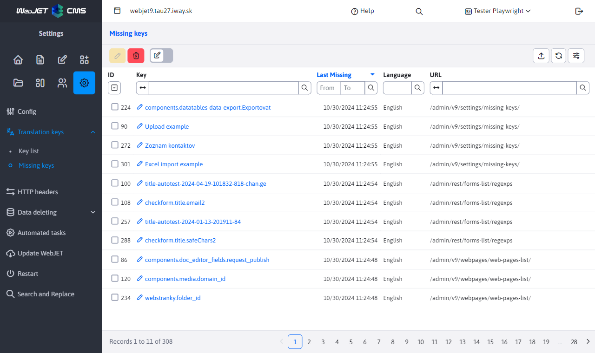
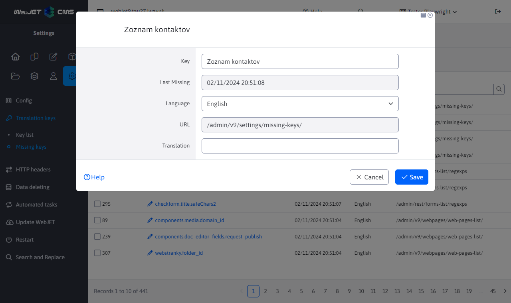

# Missing keys

The Missing Keys section displays translation keys that were requested for translation but were not found. No type of record editing is allowed in this section. Only export of records is allowed.

In addition to the missing key and language itself, the table shows the time at which the translation of the key was last requested and the last URL of the page on which the translation was called.

Click on the button **Delete all** delete the memory of the list of missing keys, then the list will start filling up again. This is useful if, for example, you need to check if a page is missing translations.

Note: the ID column only contains a sequence number for correct display, the key may always have a random ID value, it cannot be navigated by it.

Clicking on the key will bring up an editor where you can complete the translation and save it immediately.

