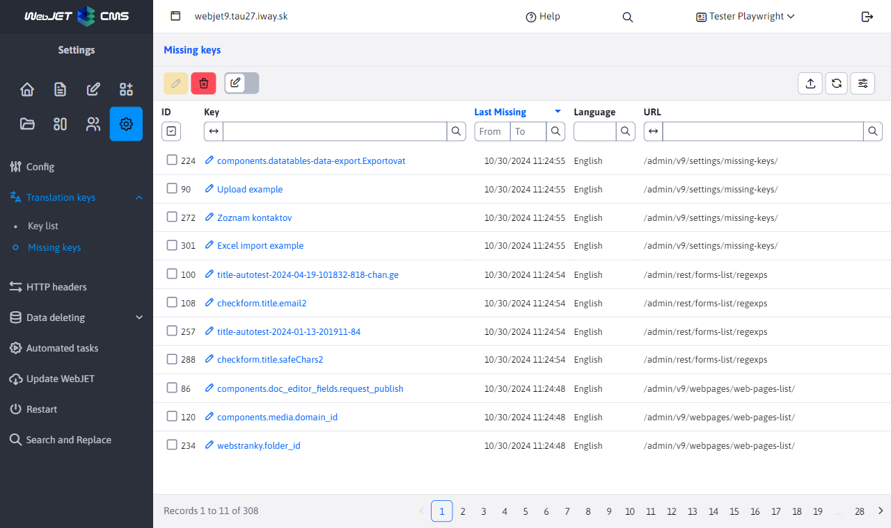
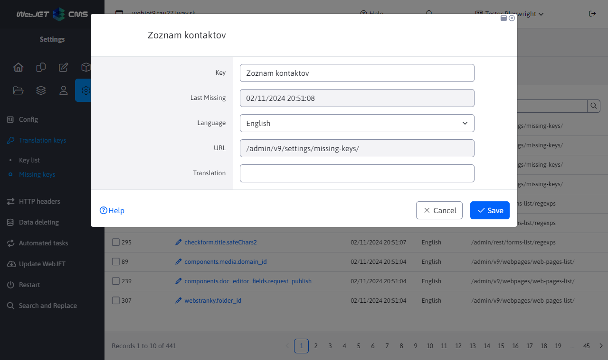

# Missing keys

The Missing Keys section displays translation keys that were requested for translation but were not found. No type of record editing is allowed in this section. Only record export is allowed.

In addition to the missing key and language itself, the table shows the time when the translation of the given key was last requested and the last URL address of the page on which the translation was requested.

Clicking the **Clear All** button will clear the memory of the list of missing keys, after which the list will start to fill up again. This is useful if, for example, you need to check if a page is missing translations.

Warning: the ID column only contains a sequential number for the purpose of correct display, the key can always have a random ID value, it cannot be used to navigate.

Clicking on the key will display an editor where you can complete the translation and save it immediately.

