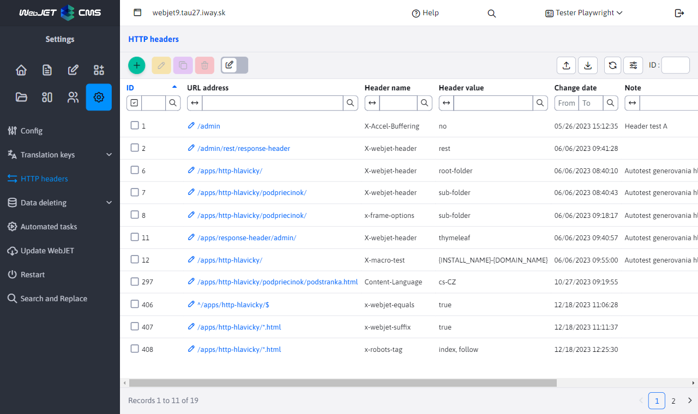
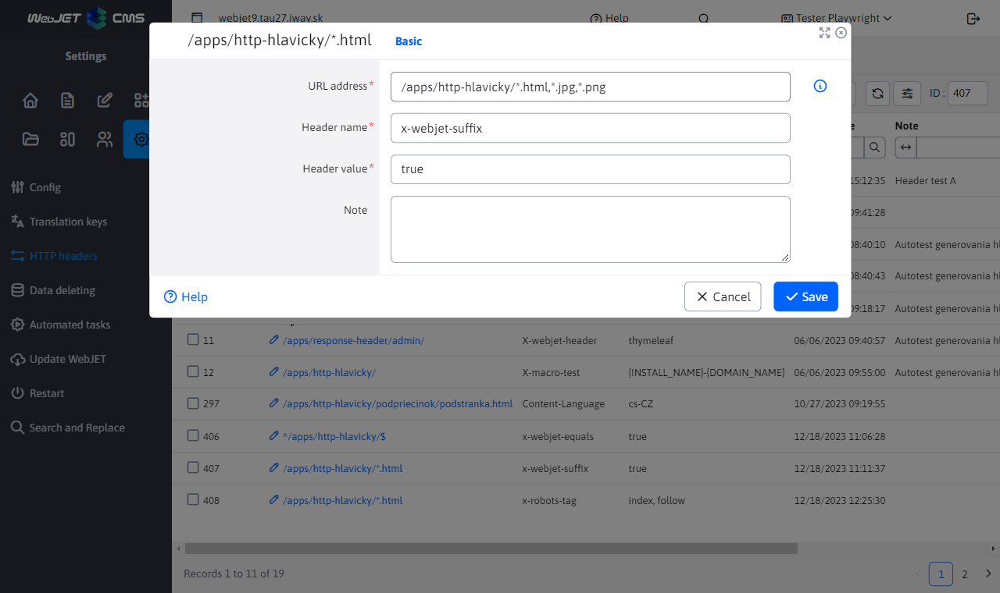

# HTTP headers

The HTTP Headers application in the Settings section allows you to define HTTP response headers (`HTTP Response Header`) based on the URLs of the displayed page. The headers are separated by domain, and are set separately for each domain.



If there are multiple headers with the same name, the header with the longest match in the URL will be used. The example shows different values ​​for the `X-webjet-header` header for URLs `/apps/http-hlavicky/` and `/apps/http-hlavicky/podpriecinok/`. The value for the `/apps/http-hlavicky/podpriecinok/stranka.html` page will be used based on the longest URL match, which means it will have the value `sub-folder`.

## Editor



The header editor contains the following fields:

- **URL address** specifies for which URLs the header is defined. The following notation is supported:
    - `/folder/subfolder/` - ​​header is generated for all URLs that start with the specified value.
    - `^/path/subpath/    -  - ​​header is generated for exact URL match.
    - `/path/subpath/*.pdf` or `/path/subpath/*.pdf,*.jpg` - the header is generated for URL addresses starting with `/path/subpath/` and ending with `.pdf` or in the latter case also for `.jpg`.
- **Header name** specifies the name of the header itself that is being added.
- **Header value** indicates the value of the set header.
- **Note** additional information, e.g. who requested the setting of the given header and when. The value is only displayed in the administration.


As an example, we will use the image above with the editor of an already created record. These values ​​determine that for every URL that starts with `/apps/http-hlavicky/`, an HTTP header `x-webjet-header` with a value of `root-folder` will be generated.

In both the name and value, you can use the macro ```{HTTP_PROTOCOL}, {SERVER_NAME}/{DOMAIN_NAME}/{DOMAIN_ALIAS}, {HTTP_PORT}```, which will be replaced by the value obtained on the server. ```SERVER_NAME``` is the domain name from ```request.getServerName()```, ```DOMAIN_NAME``` and ```DOMAIN_ALIAS``` are the domain or alias values ​​set in the web pages. The value ```{INSTALL_NAME}``` represents the installation name. The value ```{HEADER_ORIGIN}``` contains the value of the HTTP header ```origin```.

Warning: some headers are set directly via configuration variables and may sometimes change the set value (e.g. `x-robots-tag` for a page with crawling disabled), see the list for [Security Tests](../../../sysadmin/pentests/README.md#http-headers).

## Website

When displaying a web page, the HTTP header `Content-Language` is automatically set according to the language of the folder/template. If you set a different value in the header application, the set value will be used regardless of the language of the folder/template.

## Settings for files

For URLs starting with `/files,/images,/shared`, the HTTP header `Content-Language` is automatically set according to the basic administration language in the config variable `defaultLanguage`. In addition, they are set according to the following rules:

- if the URL contains `/en/`, `en-GB` will be set
- if the URL contains `/de/`, `de-DE` will be set
- if the URL contains `/cz/`, `cs-CZ` will be set
- if the URL contains `/sk/`, `sk-SK` will be set

The country based on the language is obtained from the config variable `countryForLng`, if not specified, the same value as the desired language will be used as the country.