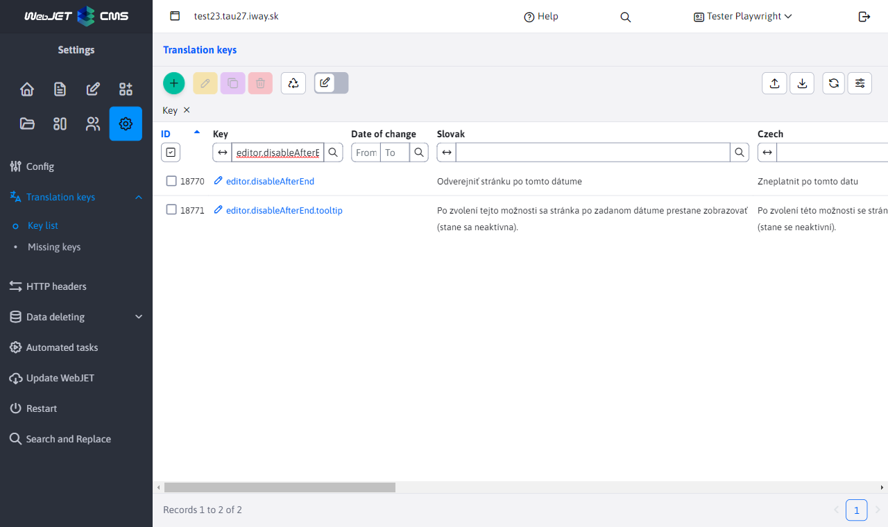
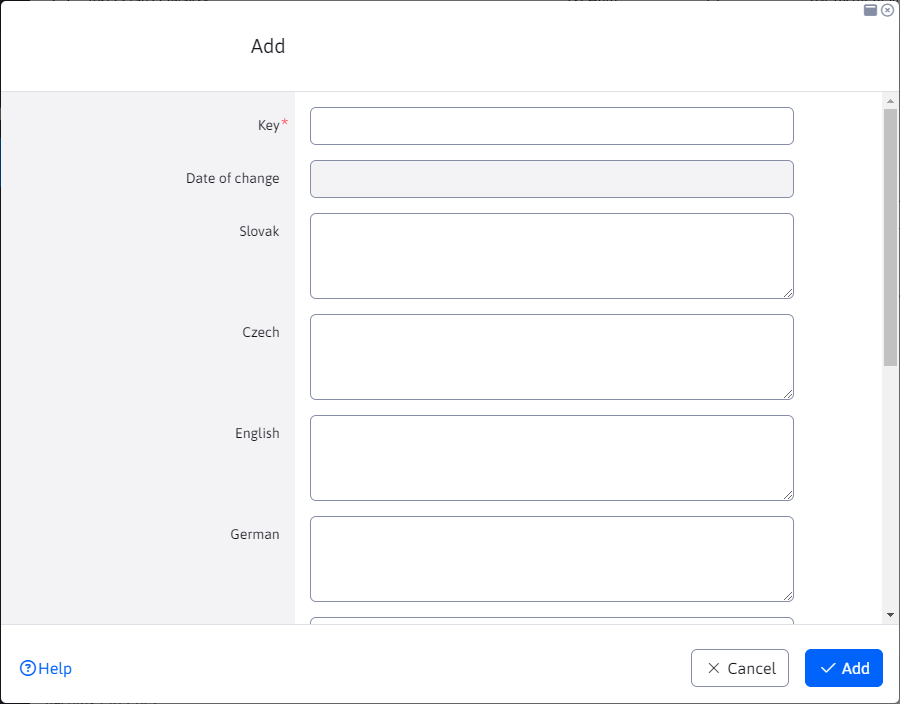
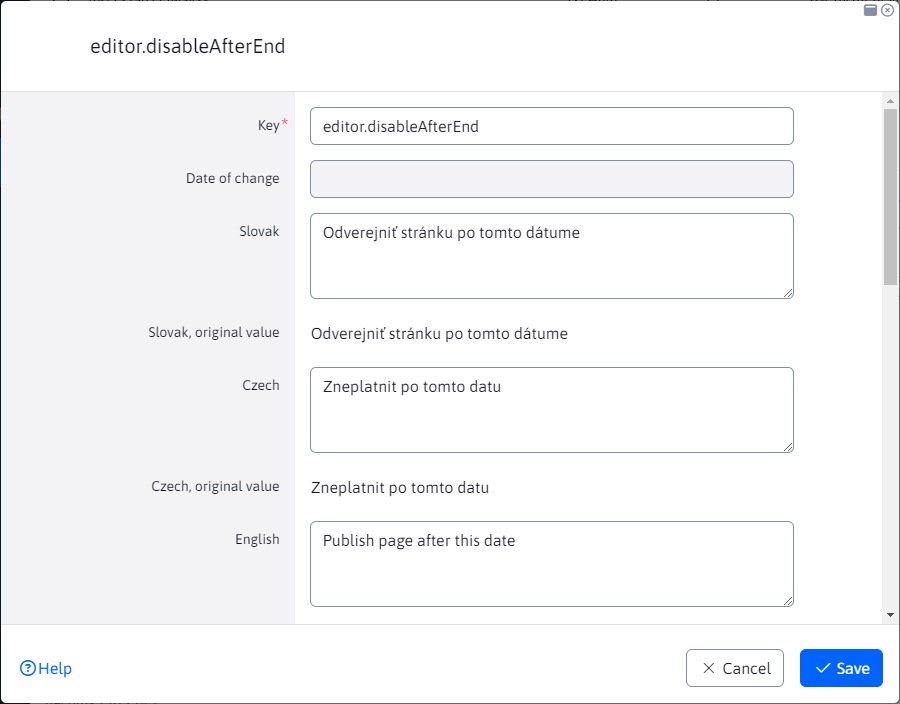
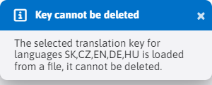
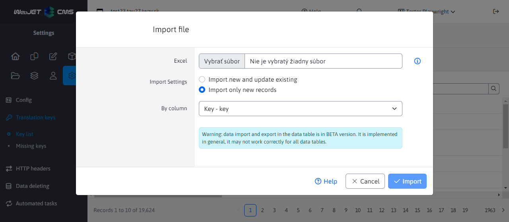

# Translation keys

The Translation Keys section allows you to create/edit/duplicate translation keys or import or export them.

Each entry in the table contains all language combinations for the translation key, as well as their original values before the change. Their original value is given by the file, and you can update this value or keep it.

## Types of translation keys

Translation keys can have imaginary types, depending on how the key was created and what operations were performed on it.

- The original handle - it was loaded from a translation key file and has never been modified.
- Modified key - created if you modify the value of the original key read from the file. Whether the value is the same as the one from the file or not, the new version of this key and all values will be saved in the database and the original values from the file will be displayed in the original value fields.
- A new key is one that was not obtained from the translation key file, but was created using the editor. Such a key is stored in the database together with all language translations.

## Creating a new key

When creating a new translation key, you need to specify the key itself (it should be unique and include the application/module name in the prefix to clearly distinguish it) and its translation value in the defined languages. You may also notice that when creating a new key, the fields with the original values are hidden, as this is a new record.

## Modifying an existing key

When editing an existing record, the editor will also display fields with the original values for each language separately. The original values are those that were obtained from the translation key file. You can see these original value fields but you cannot edit them.

## Deleting the key

Deleting a translation key is a more complex process that can vary depending on the type of translation key. Only keys created/modified in the database that are not directly in the translation file can be deleted:
- New key - if you try to delete it, all its language translations are deleted from the database. This means that you will no longer be able to find this translation key in the table.
- Original key with new values - when attempting to delete this key, only the new database values are deleted and the translation key becomes the original key defined in the file (so that the values are set again as they were read from the file). We will be able to find this key further in the table.
- Original handle - **cannot be removed**. These keys were obtained from a translation key file and the file cannot be modified. When you attempt to delete such a key, you will be notified that this key cannot be deleted.

## Import

When importing, you can choose to import only new (not yet existing) keys. The existence of a key is checked for each language during import, so the key is only imported if it does not exist. Thus, the value of an existing key is not overwritten.

