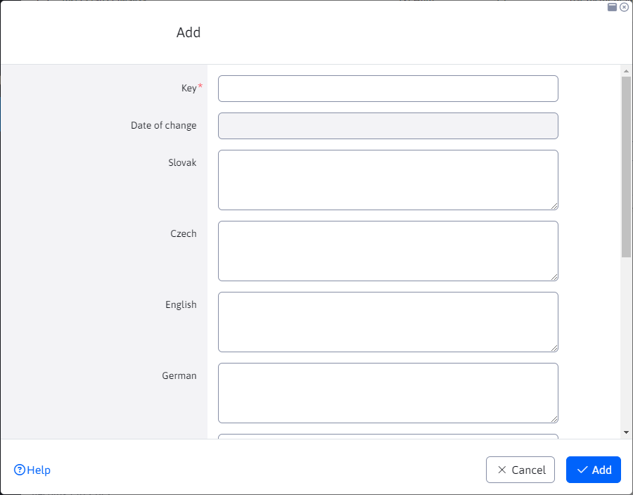
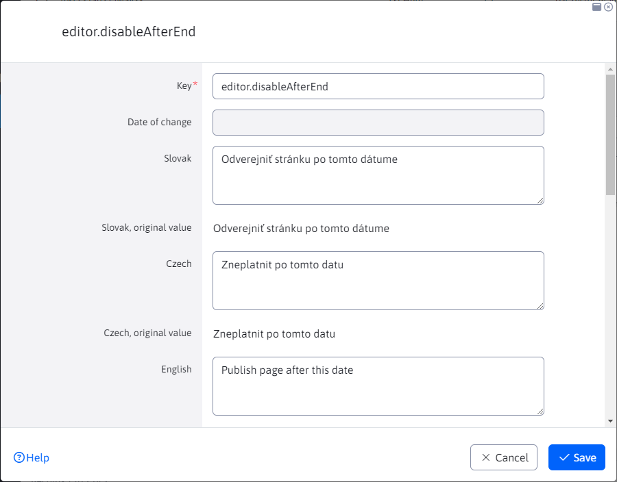
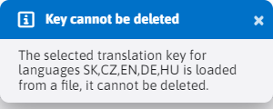

# List of keys

The Translation Keys section allows you to create/edit/duplicate translation keys or import or export them.

Each entry in the table contains all the language combinations for a given translation key, as well as their original values ​​before the change. Their original value is given by the file, and you can update or leave this value as it is.

## Types of translation keys

Translation keys can have imaginary types, depending on how the key was created and what operations were performed on it.

- Original key - was loaded from the translation key file and has never been modified.
- Modified key - created if you modify the value of the original key loaded from the file. Whether the value is the same as the one from the file or not, the new version of this key with all values ​​will be saved to the database and the original values ​​from the file will be displayed in the original value fields.
- New key - is one that was not obtained from the translation key file, but was created using the editor. Such a key is stored in the database along with all language translations.

## Creating a new key

When creating a new translation key, you need to specify the key itself (it should be unique and contain the application/module name in the prefix for its clear differentiation) and its translation value in the defined languages. You may also notice that when creating a new key, the fields with the original values ​​are hidden, since this is a new record.

## Editing an existing key

When editing an existing record, the editor will also display the fields with the original values ​​for each language separately. The original values ​​are those that were obtained from the translation key file. You can see these fields with the original value, but you cannot edit them.

## Deleting a key

Deleting a translation key is a more complex process that may vary depending on the type of translation key. Only keys created/modified in the database that are not directly in the translation file can be deleted:

- New key - when you try to delete it, all its language translations will be deleted from the database. This means that you will no longer be able to find this translation key in the table.
- Original key with new values ​​- when trying to delete this key, only the new database values ​​will be deleted and the translation key will become the original key defined in the file (so the values ​​will be set again as they were read from the file). We will be able to find this key in the table later.
- Original key - **cannot be deleted**. These keys were obtained from the translation key file and the file cannot be modified. When attempting to delete such a key, you will be notified that this key cannot be deleted.

## Import

When importing, you can choose to import only new (not yet existing) keys. The existence of the key is checked for each language during import, and the key is therefore imported only if it does not exist. The value of the existing key is therefore not overwritten.

