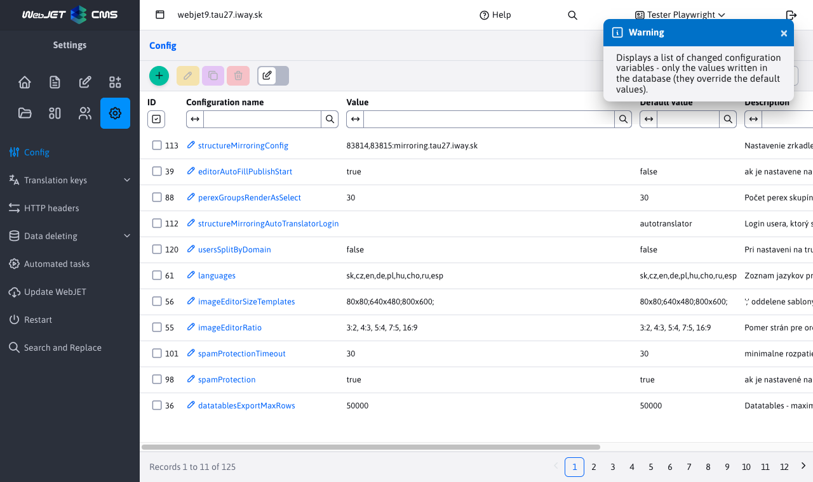
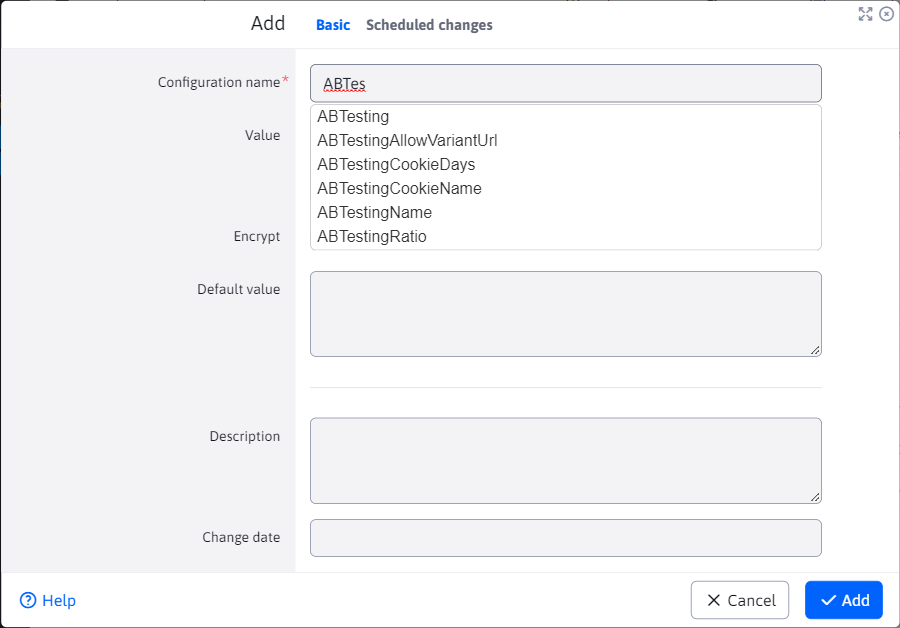
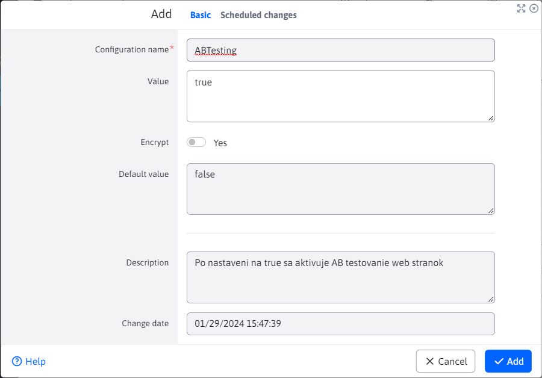

# Configuration

The configuration section is used to view and manage individual configuration variables that differ from the preset values.

In the installation section there is a list of [the most commonly used configuration variables](../../../install/config/README.md).

## Adding configuration variables

When adding, the most important parameter is **Configuration name** which behaves as a text field with autocomplete function. When you enter a configuration name, it will offer the names of existing variables, including those that are not yet modified (not in the table).

3  situations can occur:
- use autocompletion and select an existing configuration
  - if this configuration IS already in the table, **only the adjustment is made** (an existing entry in the table will be modified)
  - if this configuration is NOT in the table, **the addition is made** a new record in the table **But** no new configuration variable is added (we just changed its default value)
- we do not use autocomplete, **the addition is made** a new record in the table **and at the same time** thus defining a completely new configuration variable

If we select the offered option, the current/default value of the specified configuration variable is displayed in the editor.

The change will usually take effect immediately after the add/edit action. However, some configuration variables require a restart of the application server.

## Editing configuration items

3  situations can occur:
- we will not change **Configuration name**, so it's **shall make the adjustment** of the variable that we adjusted
- we will change **Configuration name**, so it's **does not make an adjustment** the original configuration variable
  - if changed name, for the name **existing** configuration variable, so the **shall make the adjustment**
  - if changed name, for the name **defunct** configuration variable, so the **performs the addition** new variable

## Deleting configuration items

When deleting a configuration variable, 2 situations can occur:
- delete the value from the table and **there is a preset value** to this configuration variable to start using (the variable still exists)
- delete the value from the table and **there is no preset value** to this configuration variable (the variable will no longer exist)

!>**Warning:** versus create/edit, on deletion a blank value is set. If a configuration variable has a preset value, this will be reflected **only after rebooting** application server.
