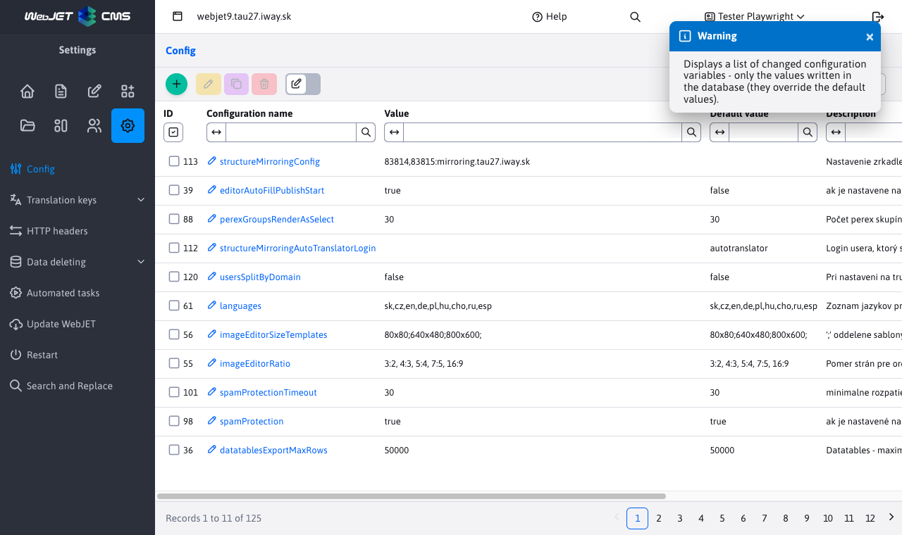
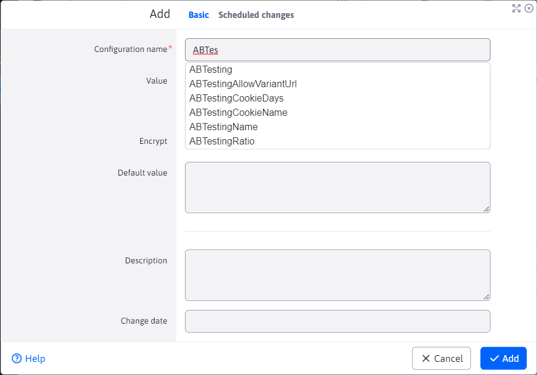
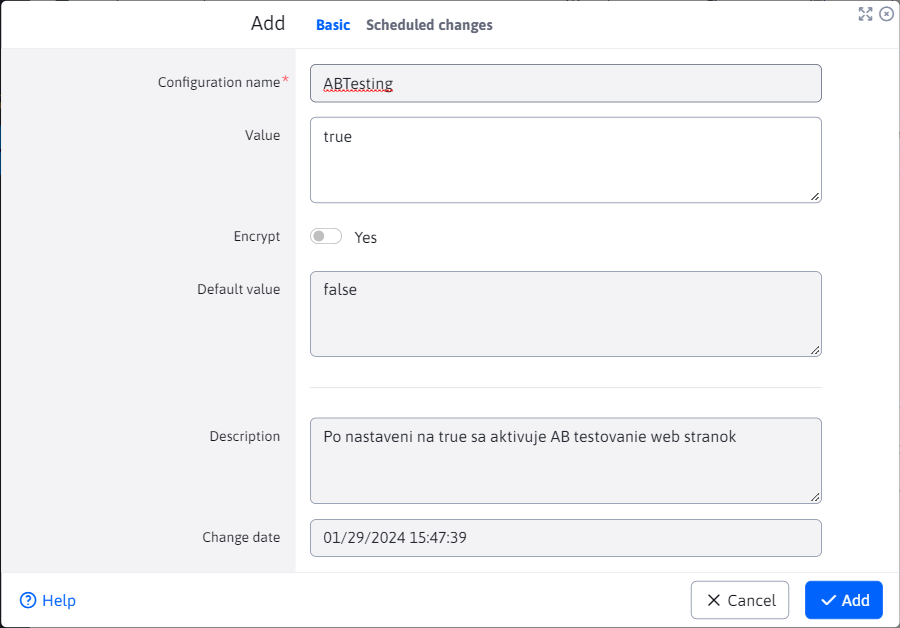

# Configuration

The configuration section is used to display and manage individual configuration variables that differ from the default values.

The installation section contains a list of [most commonly used configuration variables](../../../install/config/README.md).

## Adding configuration variables

When adding, the most important parameter is **Configuration Name**, which behaves like a text field with auto-complete. When entering a configuration name, it will offer names of already existing variables, including those that are not yet edited (not in the table).

3 situations can occur:

- we will use autocomplete and select an existing configuration
  - if this configuration IS already in the table, **only an edit will be performed** (the existing record in the table will be edited)
  - if this configuration is NOT in the table, **a new entry is added** to the table **but** a new configuration variable is not added (we just changed its default value)
- we will not use autocomplete, **a new record will be added** to the table **and at the same time** we will define a completely new configuration variable

If we select the offered option, the current/default value of the entered configuration variable will be displayed in the editor.

The change usually takes effect immediately after the add/edit action. However, some configuration variables require a restart of the application server.

## Editing configuration items

3 situations can occur:

- we do not change the **Configuration name**, so the **edit** of the variable we were editing will be made
- we change the **Configuration name**, so the original configuration variable **will not be modified**
  - if the changed name is the name of an **existing** configuration variable, then the **edit** is performed
  - if the changed name is for the name of a **non-existent** configuration variable, then a new variable will be **added**

## Deleting configuration items

When deleting a configuration variable, 2 situations can occur:

- we delete the value from the table and **there is a default value** for this configuration variable, which will be used (the variable still exists)
- we delete the value from the table and **there is no default value** for this configuration variable (the variable will no longer exist)

!>**Warning:** Unlike creation/editing, deleting sets an empty value. If a configuration variable has a preset value, it will take effect **only after restarting** the application server.