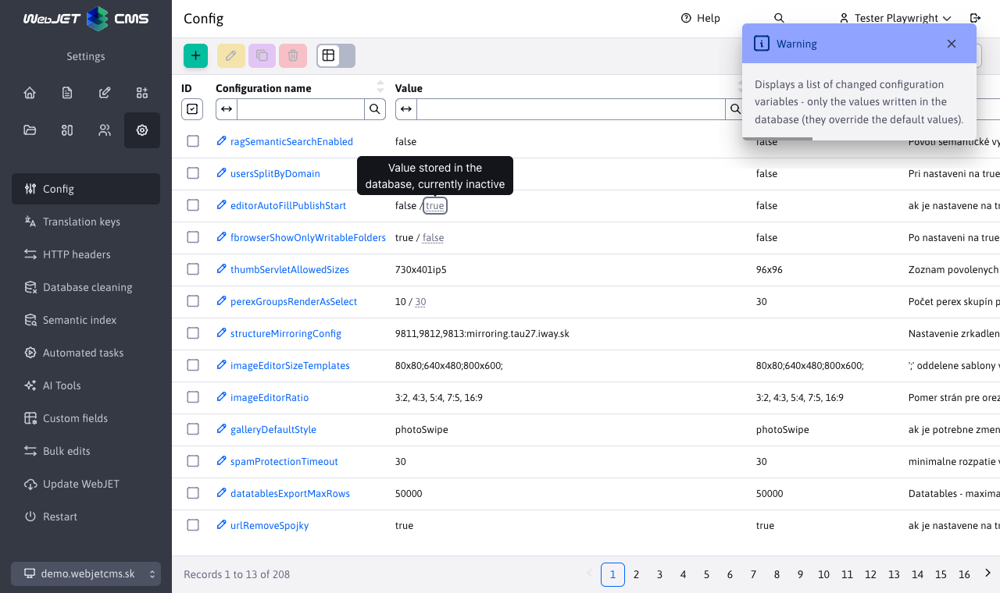
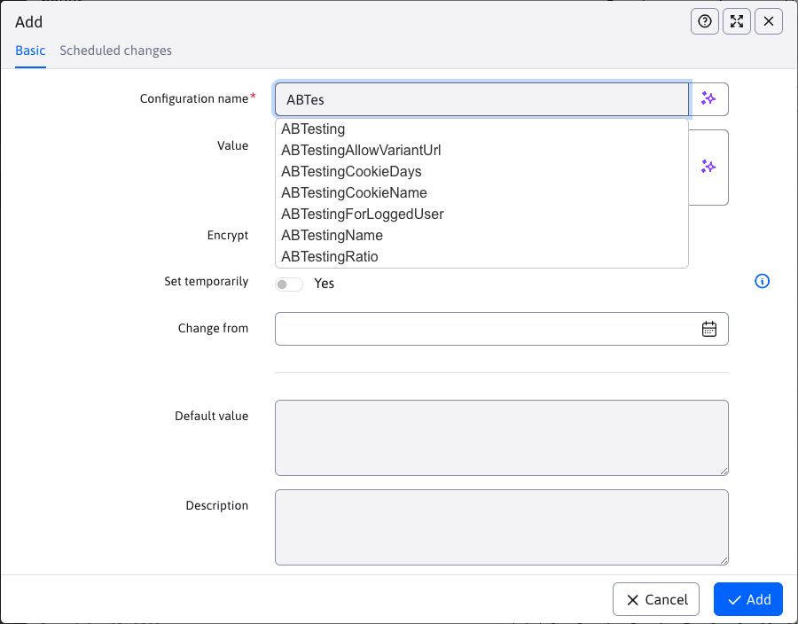
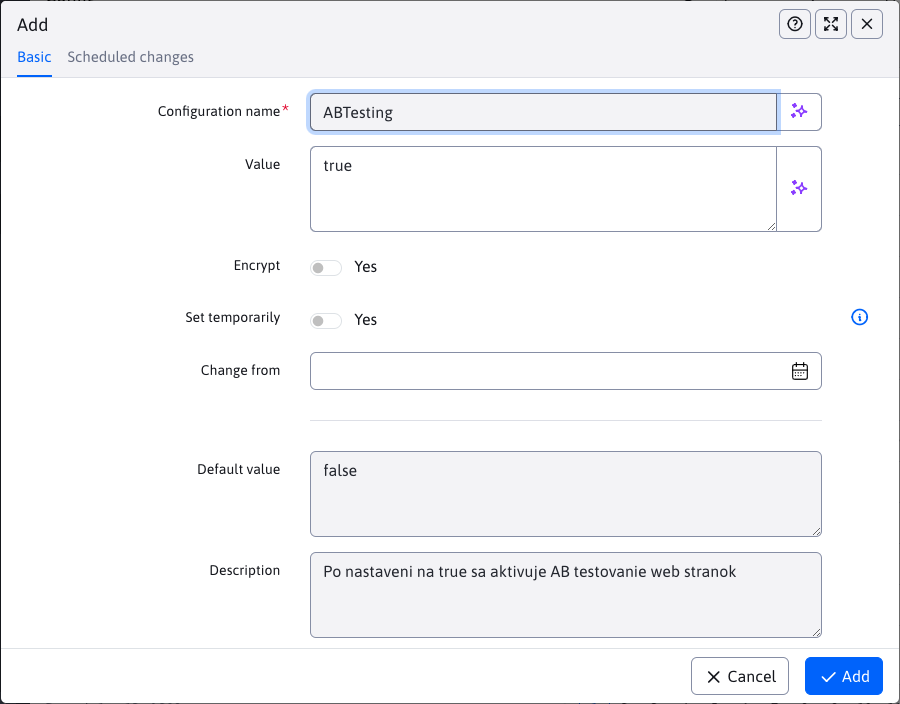

# Configuration

The configuration section displays and manages configuration variables. The tree on the left divides them into the following views:

- **Changed** - variables whose value is stored in the database. This view is selected when the page opens.
- **Custom** - variables stored only in the database without a definition in `Constants`/`ConstantsV9`, or variables whose name starts with the current `Constants.getInstallName()` value (for example, `aceintegration_test`).
- **All** - all registered variables, including their default values and custom variables stored only in the database.
- **Modules** - hierarchical groups such as `apps.gallery` or `security.oauth2`. Selecting a parent node also displays variables from all its descendants. A variable can belong to multiple branches.

The tree can be searched. Module names are technical names and are not translated. An existing variable can be edited in a selected module, but creating a new variable and importing are disabled because a custom database variable does not contain module metadata.

The installation section contains a list of [most commonly used configuration variables](../../../install/config/README.md).

## Adding configuration variables

When adding, the most important parameter is **Configuration Name**, which behaves like a text field with auto-complete. When entering a configuration name, it will offer names of already existing variables, including those that are not yet edited (not in the table).

3 situations can occur:

- we will use autocomplete and select an existing configuration
  - if this configuration IS already in the table, **only an edit will be performed** (the existing record in the table will be edited)
  - if this configuration is NOT in the table, **a new entry is added** to the table **but** a new configuration variable is not added (we just changed its default value)
- we will not use autocomplete, **a new record will be added** to the table **and at the same time** we will define a completely new configuration variable

If we select the offered option, the current/default value of the entered configuration variable will be displayed in the editor.

The change usually takes effect immediately after the add/edit action. However, some configuration variables require a restart of the application server.

## Editing configuration items

3 situations can occur:

- we do not change the **Configuration name**, so the **edit** of the variable we were editing will be made
- we change the **Configuration name**, so the original configuration variable **will not be modified**
  - if the changed name is the name of an **existing** configuration variable, then the **edit** is performed
  - if the changed name is for the name of a **non-existent** configuration variable, then a new variable will be **added**

## Temporary value setting

If you need to change the value of a configuration variable only to verify its behavior, enable the **Set temporarily** option in the editor. The value is set only in memory on the current node, and is not stored in the database or propagated to other nodes in the cluster. After the application server is restarted, the value stored in the database is used again.

When set temporarily, the value cannot be encrypted or scheduled to change, so the **Encrypt** and **Change from** fields in the editor are hidden.

If the current value on the node differs from the stored value, the **Value** column displays both values in the format "current value / stored value". The second value is dimmed and marked as currently inactive on hover. It can be either a value stored in the database or the default value of a variable without a database record. When the editor is reopened, the **Value** field loads the stored value, not the temporary value.

## Deleting configuration items

Deleting resets the database value. Two situations can occur:

- if **a default value exists**, it starts being used and the variable remains visible in **All** and its module views; it disappears from **Changed**,
- if **no default value exists**, the custom database variable ceases to exist after the reset.

A variable without a database value cannot be deleted.
