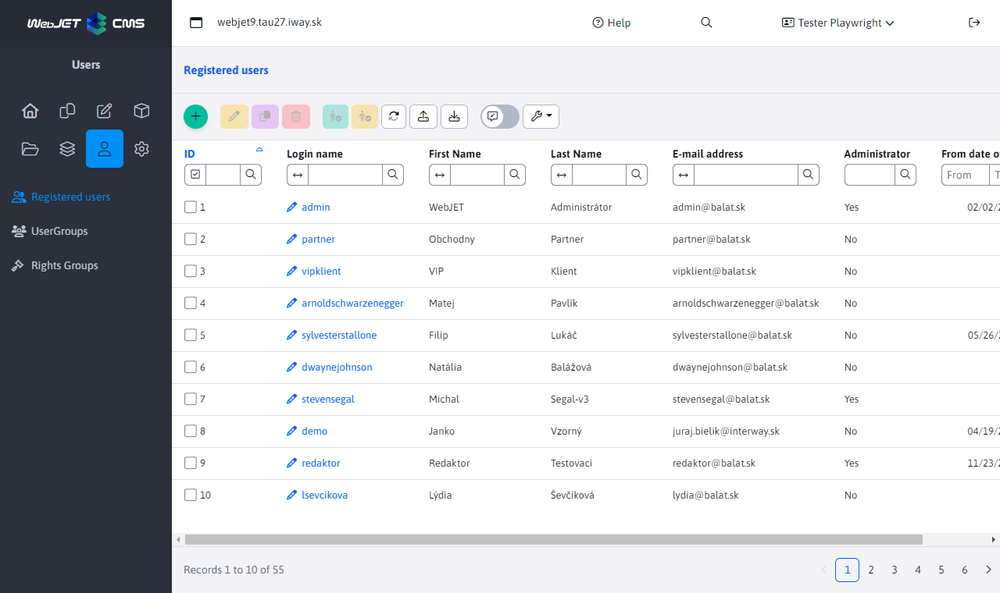
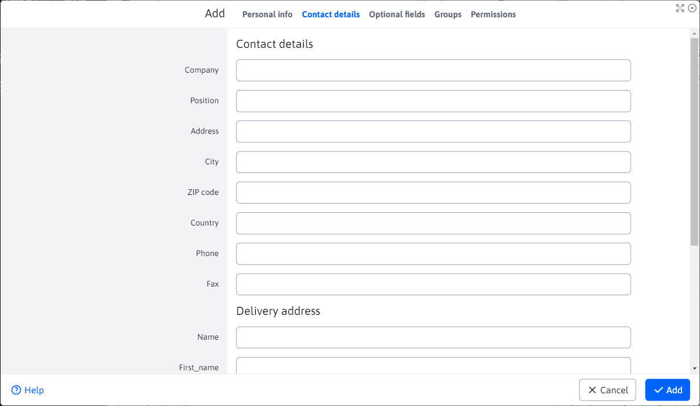
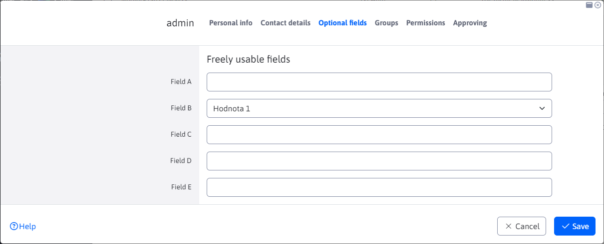
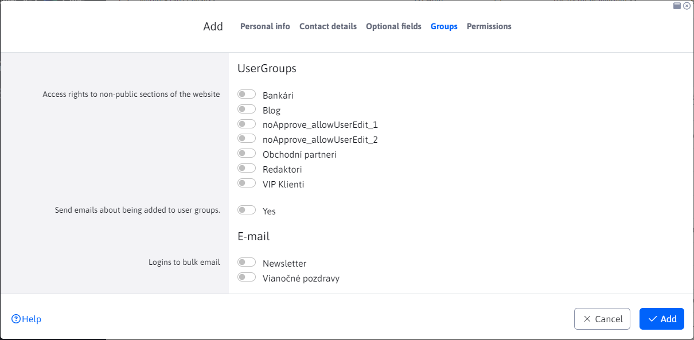
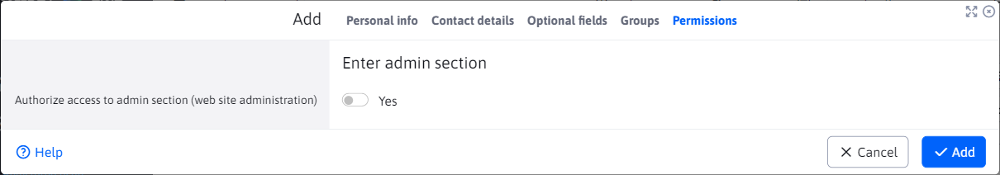
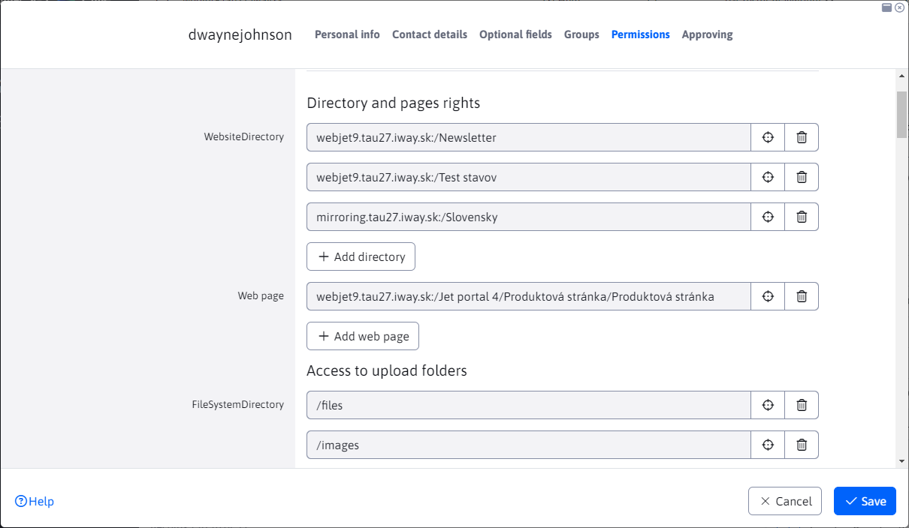
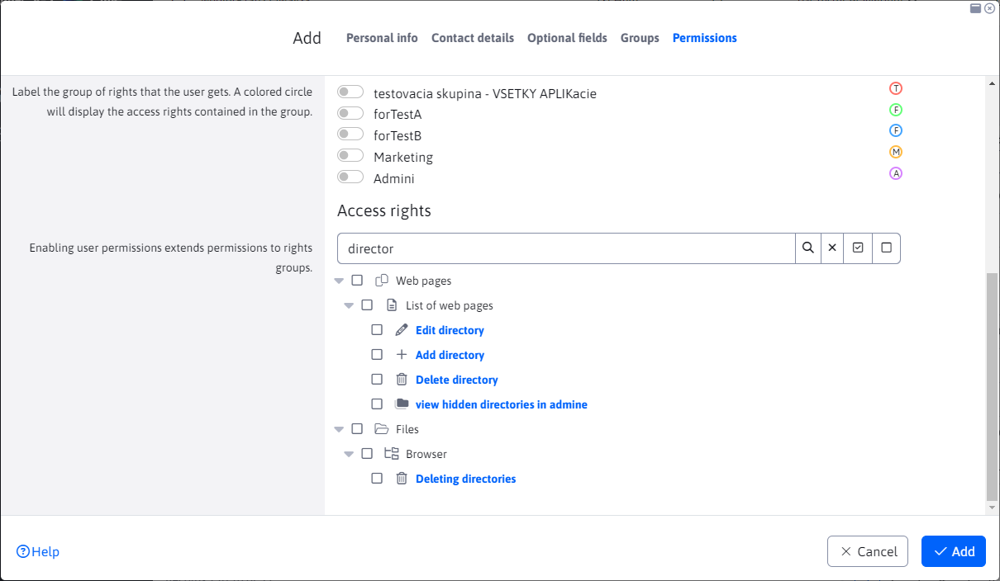
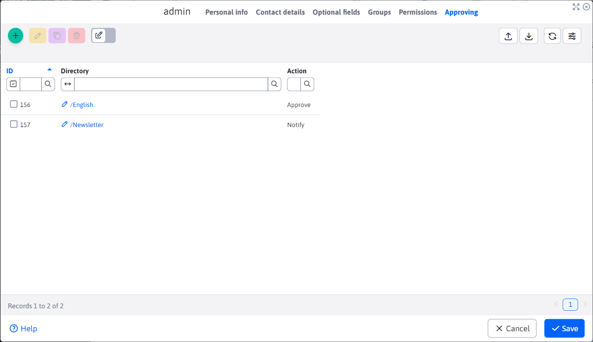

# List of users

You can manage administrators in the user list (requires the right `správa administrátorov`) and registered website users/users for bulk email (requires the right to `správa registrovaných používateľov`).

When filtering in the table, the Access rights to non-public sections of the Web site or Bulk e-mail login columns are searched by the name of the specified group. If you select Equal, the search is applied by the exact name of the specified group and also searches for users who have only that one group (not multiple groups).

## Personal data

Card **Personal data** contains basic user data. It is divided into two parts, namely "Personal data" and "Access".

### Personal data

In this section of the card, the user's details such as Title, First Name, Last Name, Date of Birth, etc. are filled in. The mandatory fields in this section that must be filled in are :
- Name
- Last name

### Access

This section of the card is used to fill in user account details such as Start and End Date (allows you to date limit the validity of the user's login), Login Name (must be unique), Password, etc. The mandatory fields in this section that must be filled in are :
- Login name
- E-mail address
- Password

The password field contains a quality check on the password entered and it is recommended that the password be as secure as possible. If "Enable weak password" is selected, the quality of the password entered will not be checked when the user is saved.

Entering a character `*` or text `random` in the password field, the password is randomly generated when the user is saved.

For a user to be able to log in, it is important that the user has the "Approved User" option selected.

## Contact details

Card **Contact details** is divided into two parts, namely :
- Contact details - contains user details such as Address, City, Phone, etc.
- Delivery Address - contains additional data necessary for delivery of the parcel such as First Name, Last Name, Address, City, etc. (typically used within an e-commerce application).

The card does not contain a mandatory field that must be filled in.

## Optional fields

Card **Optional fields** contains freely usable fields. For more information on how to configure them, see the documentation [optional fields](../../frontend/webpages/customfields/README.md).

## Groups

Card **Groups** is divided into two parts, namely :
- User groups - by selecting the name of a user group, the user gains access rights to non-public sections of the website.
- Bulk email - selecting a group name logs the user into the bulk email group.

The tab also includes an option to Send emails about being added to user groups.

!>**Warning:** emails will only be sent if the user group has set `ID stránky s textom e-mailu`.

## Rights

Card **Rights** is used to set the rights for the administration section (defines what the user will have access to / rights). Necessary sections for setting will be displayed only if the option to enter the admin section (web site administration) is selected. If the user does not have this option selected, he is only in the system as a Registered User and will not be allowed to enter the administration section of the web site.

This permission can only be added by a user with administrative rights already assigned. Without administrative rights, the Permissions tab will not even appear.

After selecting the option to access the admin section, the user is presented with the rest of the tab, which is divided into the following sections:
- Rights to directories and pages
- Uploading files to directories
- Groups of rights
- Access rights

### Rights to directories and pages

Under Directory and page permissions, you can restrict the ability to edit the Web site to a specific section (directory) or Web page. When you click on one of the add buttons, a tree structure of web pages is displayed where you can select a Web Page or Directory.

By clicking on the pencil icon next to an already added directory/page you can change the directory/page, by clicking on the trash icon you can delete the right.

By default, an administrator who **has no directory/website right selected automatically gets rights to all directories and web pages**.

In a multi-domain installation, the user and rights group editing allows you to select Web page folders and individual Web pages regardless of the currently selected domain. Domains are displayed as root folders, while the domain name folder cannot be selected. You need to select individual folders within a domain, as the domain itself is not a real folder. The display of the selected item includes a prefix with the domain name to distinguish the individual folders (they are often called the same in different domains, e.g. Slovak).

### Uploading files to directories

In this section, you can select the rights to upload files to the file system directories. After clicking on the add button, the file system tree structure is displayed where you can select the appropriate directory.

By default, an administrator who has no filesystem directory selected can upload files to any directory. The behavior can be changed by setting a configuration variable `defaultDisableUpload` to the value of `true`, which will make it possible to upload files only to the selected directories (and if the user has no directories selected, he will not be able to upload files at all).

If you set a configuration variable `userPermsActualPageAutomatic` to the value of `true` so the rights to the folders `/images` a `/files` set automatically according to the rights on the tree structure of the web pages, so that for the allowed folders of the web pages, the editor has the rights to write images and files to the corresponding Media folders of this page.

### Rights Groups and Access Rights

The rights tab displays a list of rights groups. For each group, the **coloured circle with the first letter of the group name**. The same circles are then displayed in the individual rights. They highlight the individual rights of the group.

Selecting a rights group **the color of the circle also sets into the background of the circle** to better highlight selected rights. We therefore recommend to prepare groups of rights for editors, marketing, administrator, etc. and not to set individual rights to users but to assign them rights as a group.

When editing/adding a new user and selecting rights groups in the Access Rights list, you can see the rights that the group contains and you can optionally give the user **add a specific right** (if necessary). When logging in, the user automatically **gets the rights set in the rights group and the rights set for the user**.

Individual access rights are represented in the Access Rights tree structure. We distinguish:
- a node that contains descendants - is not a right itself, it only represents the placement of a right in the tree structure
- terminal node - represents the law itself

Select the check box next to a node that contains children to select or deselect all children of that node at once. This allows you to efficiently mark/unmark multiple rights at once.

**Searching for rights**

Under the Access Rights heading, there is a search box. You can enter the name of the right and click the magnifying glass icon to filter the tree structure to only the rights containing the specified term. To clear a filtered term, click the cross icon in the search box.

The field at the end also contains an icon for selecting all rights and deselecting all rights. So you can check/uncheck all rights at once with one click.

## Approval

In the charts **Approval** it is possible to define an action when a change is made in the selected web site directory (typically approval). The tab will only appear for an already saved user (a newly created user must be saved first and then the approval process must be set up).

When you add a record, click the + (Add) icon to select Directory (from the web page structure) and Action. Both attributes are required. You can select one of the following actions :
- Approve (default option) - if a change occurs in the selected directory, the currently edited user will approve the change.
- Notification - if a change occurs in the selected directory, an email notification is sent to the currently edited user about the change in the web page.
- None - No action is performed, but at the same time the edited user does not invoke the approval process in the given directory. This option is useful if you have multiple approvers and also need to set an exception for a user so that changes made by that user are automatically approved.
- Approval - second level - if you need multi-level approval, set this option to the second level approval user.

More information is in [documentation for the editor](../../redactor/webpages/approve/README.md).

