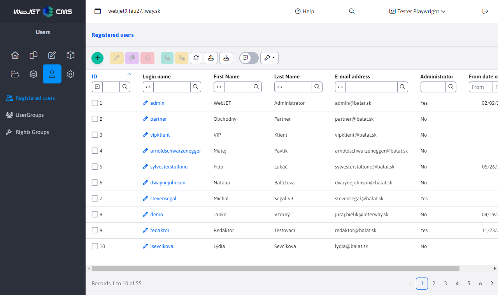
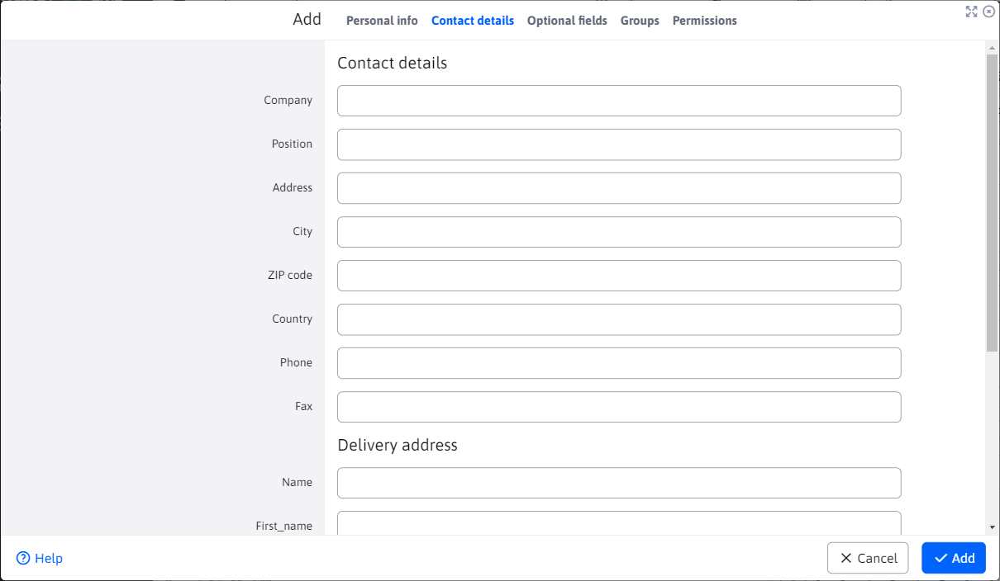
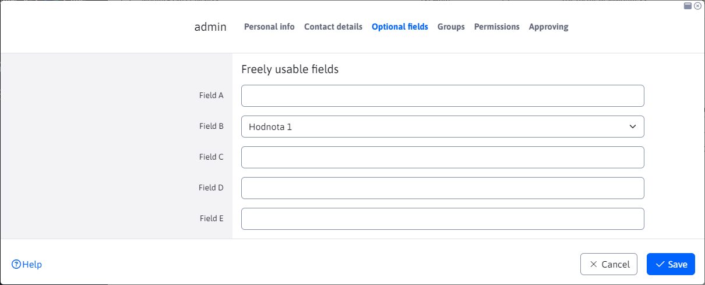
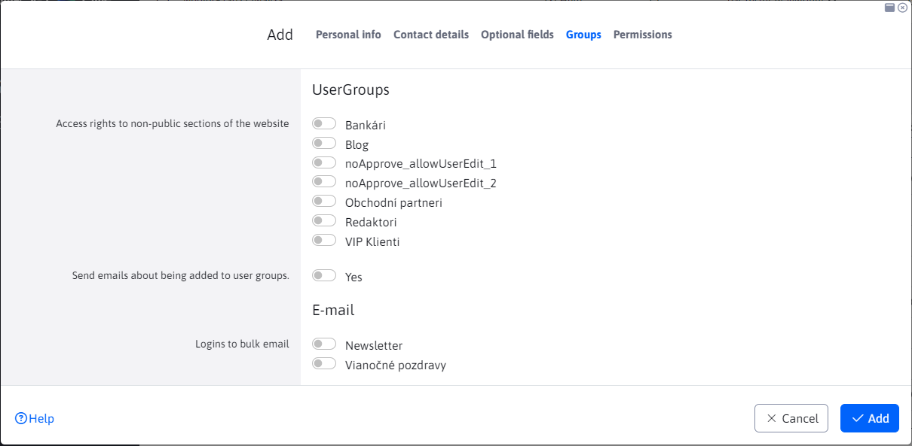
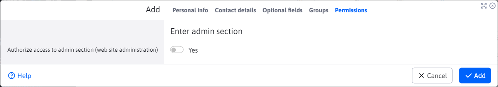
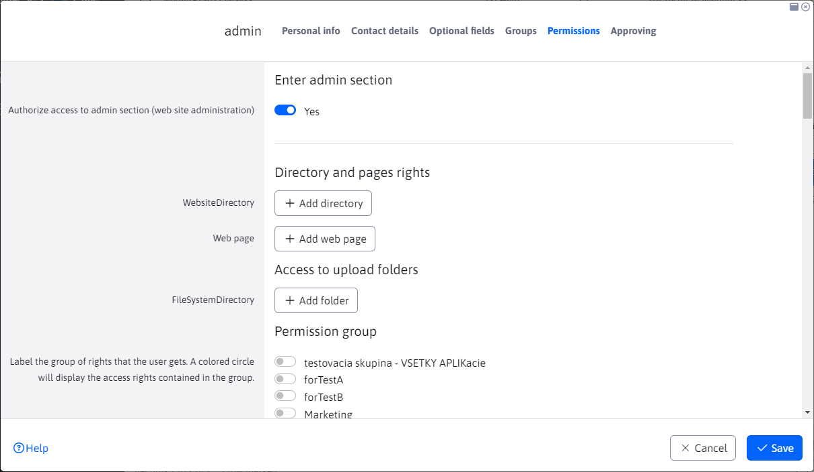
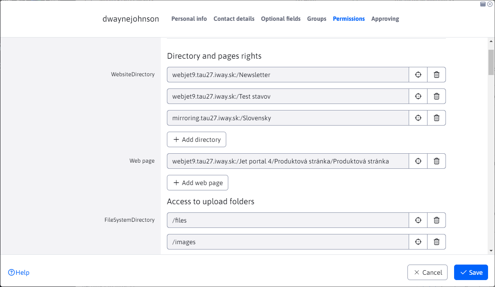
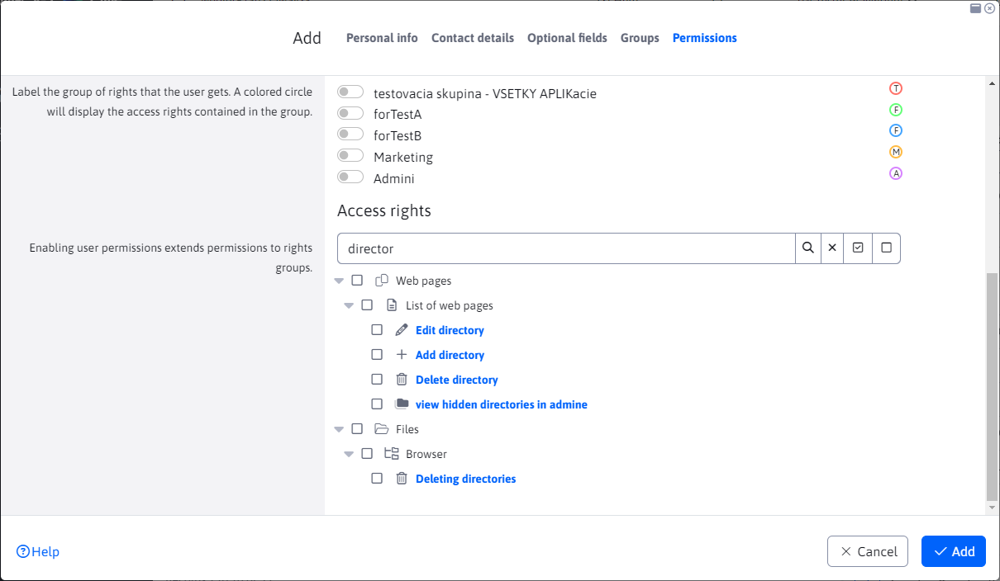
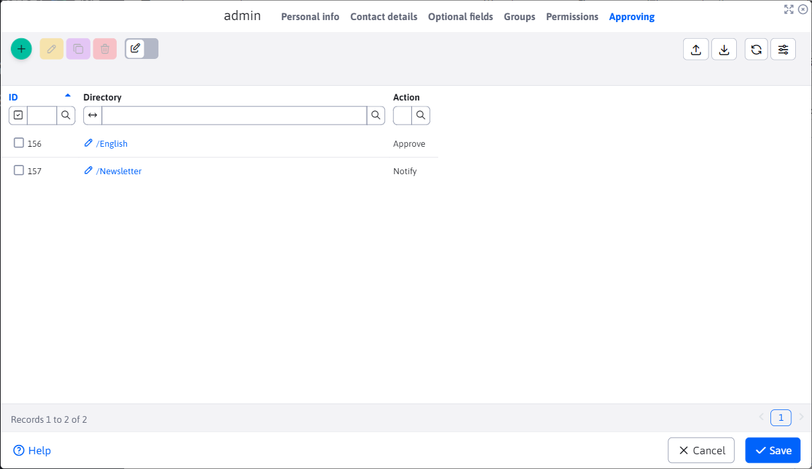

# User list

In the user list, it is possible to manage administrators (requires ```správa administrátorov``` right) and registered website users/bulk email users (requires ```správa registrovaných používateľov``` right).



When filtering in the table, the Access rights to non-public sections of the website or Bulk email subscription columns are searched for by the name of the specified group. If you select the Equals option, the search is performed by the exact name of the specified group and users who have only this one group (not multiple groups) are searched for.


## Personal data

The **Personal Data** tab contains basic user data. It is divided into two sections: "Personal Data" and "Access".


### Personal data

In this part of the card, user data such as Title, First Name, Last Name, Date of Birth, etc. are filled in. The mandatory fields in this part that must be filled in are:

- Name
- Last name

### Access

In this part of the card, user account data such as Start and End of validity (allows you to limit the validity of the user's login by date), Login name (must be unique), Password, etc. are filled in. The mandatory fields in this part that must be filled in are:

- Login name
- Email address
- Password

The password field contains a quality check for the entered password and it is recommended that the password be as secure as possible. If the "Allow weak password" option is selected, the quality of the entered password will not be checked when saving the user.

By entering the character `*` or the text `random` in the password field, a password will be randomly generated when the user is saved.

For the user to be able to log in, it is important that the user has the "Approved user" option selected.

## Contact details

The **Contact details** tab is divided into two parts:

- Contact information - contains user information such as Address, City, Phone, etc.
- Delivery address - contains additional data necessary for delivery of the shipment, such as Name, Surname, Address, City, etc. (typically used within the e-commerce application).

The card does not contain a mandatory field that needs to be filled out.



## Optional fields

The **Optional Fields** tab contains freely usable fields. For more information on configuring them, see the [optional fields] documentation(../../frontend/webpages/customfields/README.md).



## Groups

The **Groups** tab is divided into two parts:

- User groups - by selecting the name of a user group, the user will gain access rights to non-public sections of the website.
- Mass email - by selecting the group name, the user will log in to the mass email group.

The tab also includes the option to Send emails about being added to user groups.

!>**Warning:** emails will only be sent if the given user group has ``ID stránky s textom e-mailu`` set.



## Rights

The **Rights** tab is used to set rights for the administration section (it defines what the given user will have access to / rights). The necessary parts for setting will be displayed only if the option to enter the admin section (website administration) is selected. If the user does not have this option selected, he is in the system only as a Registered user and will not be allowed to enter the administration section of the website.



This permission can only be added by a user with already assigned administrative rights. Without administrative rights, the Rights tab will not even appear.


After selecting the option to access the admin section, the user will see the rest of the card, which is divided into the following sections:

- Rights to directories and pages
- Uploading files to directories
- Rights groups
- Access rights



### Rights to directories and pages

In the Directory and Page Rights section, you can limit the ability to edit a website to a specific section (directory) or web page. When you click one of the add buttons, a tree structure of web pages will appear, where you can select a Web page or Directory.

By clicking on the pencil icon next to an already added directory/page, the directory/page can be changed, and by clicking on the trash can icon, the right can be deleted.

By default, an administrator who **does not have any rights selected for a directory/site automatically gains rights to all directories and websites**.

In a multi-domain installation, in the user and rights group editing, it is possible to select website folders and individual websites regardless of the currently selected domain. Domains are displayed as root folders, while the folder with the domain name cannot be selected. It is necessary to select individual folders in the domain, since the domain itself is not a real folder. The display of the selected item contains a prefix with the domain name to distinguish individual folders (they are often called the same in different domains, e.g. Slovak).



### Uploading files to directories

In this section you can choose the permissions for uploading files to file system directories. After clicking the add button, the file system tree structure will be displayed where you can select the appropriate directory.

By default, an administrator who has no file system directory selected can upload files to any directory. The behavior can be changed by setting the configuration variable ```defaultDisableUpload``` to the value ```true```, which will cause files to be uploaded only to the selected directories (and if the user has no directory selected, they will not be able to upload files at all).


If you set the configuration variable `userPermsActualPageAutomatic` to the value `true`, the permissions to the folders `/images` and `/files` will be set automatically according to the permissions on the website tree structure so that for the allowed website folders, the editor has the rights to write images and files to the corresponding Media folders of this page.

### Rights Groups and Access Rights

The rights tab displays a list of rights groups. Each group displays a **colored circle with the first letter of the group name**. The same circles are then displayed in individual rights. They highlight individual rights from the given group.


By selecting a rights group, **the color of the circle will also be set to the background of the circle** to better highlight the selected rights. We therefore recommend preparing rights groups for editors, marketing, administrators, etc. and not setting individual rights for users, but assigning rights to them as a group.

When editing/adding a new user and selecting a rights group in the Access rights list, you can see the rights that the group contains and you can optionally **add a specific right** to the user (if necessary). When logging in, the user automatically **gets the rights set in the rights group and the rights set for the user**.

Individual access rights are represented in the Access Rights tree structure. We distinguish between:

- a node that contains descendants - is not a law in itself, it only represents the placement of a law in the tree structure
- end node - represents the law itself

By selecting the checkbox next to a node that contains children, you can select or deselect all children of that node at once. This allows you to efficiently select/deselect multiple rights at once.

**Rights Search**

There is a search field under the Access Rights heading. You can enter the name of the right in it and click the magnifying glass icon to filter the tree structure to only rights containing the entered term. You can clear the filtered term by clicking the cross icon in the search field.

The field at the end also contains an icon for selecting all rights and deselecting all rights. This allows you to select/deselect all rights at once with one click.



## Approval

In the **Approval** tab, you can define an action for a change in the selected website directory (typically approval). The tab is displayed only for an already saved user (a newly created user must first be saved and then the approval process set up).

When adding a record by clicking the + (Add) icon, you select Directory (from the website structure) and Action. Both attributes are required. You can select one of the following actions:

- Approval (default option) - if a change occurs in the selected directory, the currently editing user will approve this change.
- Notification - if a change occurs in the selected directory, an email notification about the change in the web page will be sent to the currently editing user.
- None - no action will be taken, but the edited user will not trigger the approval process in the given directory. This option is suitable if you have multiple approvers and you also need to set an exception for the user so that changes made by this user will be automatically approved.
- Approval - second level - if you need multi-level approval, set this option for the second-level approval user.

More information is available in the [editor documentation](../../redactor/webpages/approve/README.md).


