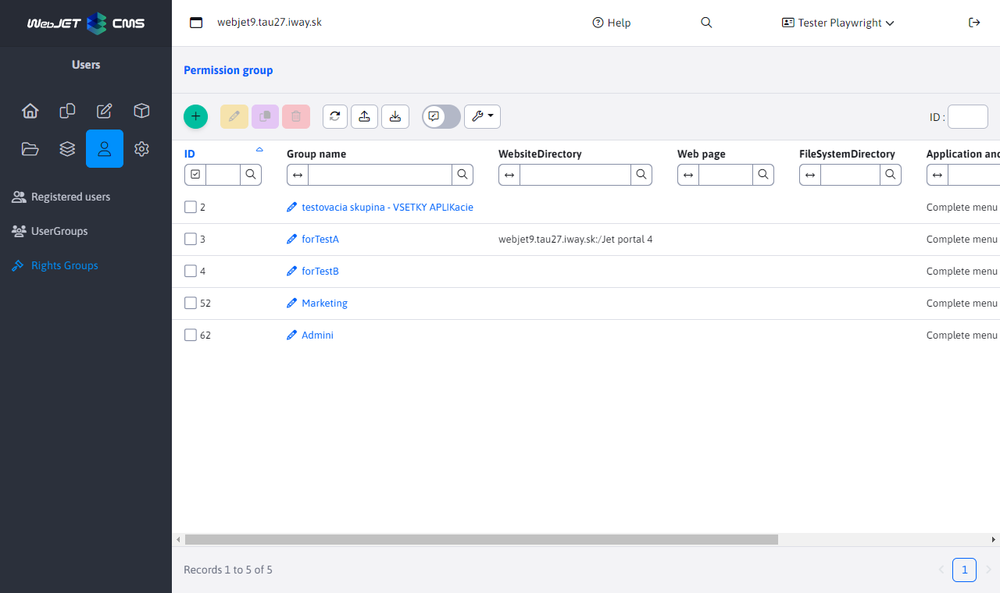
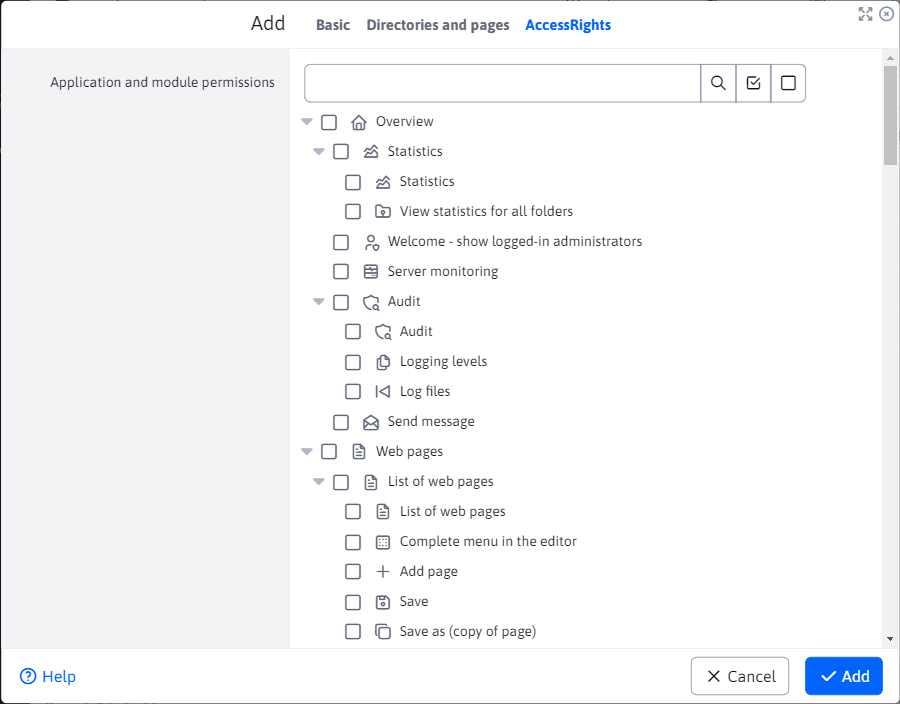

# Groups of rights

You can define group permissions in rights groups. You can create/edit/duplicate/delete rights groups, export rights groups to excel or import them from excel using the buttons on the top left of the page.

So you can create a group of rights called "Editor" to which you define the rights to the web pages and the most frequently used applications (news, photo gallery). This way you don't have to set the rights individually. When creating and duplicating a rights group, the only mandatory parameter is "Group name". Important is the Access Rights tab where you set the rights to the applications/modules that the group will contain.

When a user logs in, they are set all the rights from the rights groups they have selected, and their individually set rights are also added.

