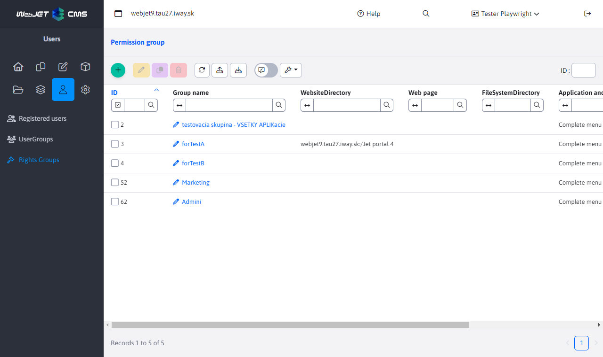
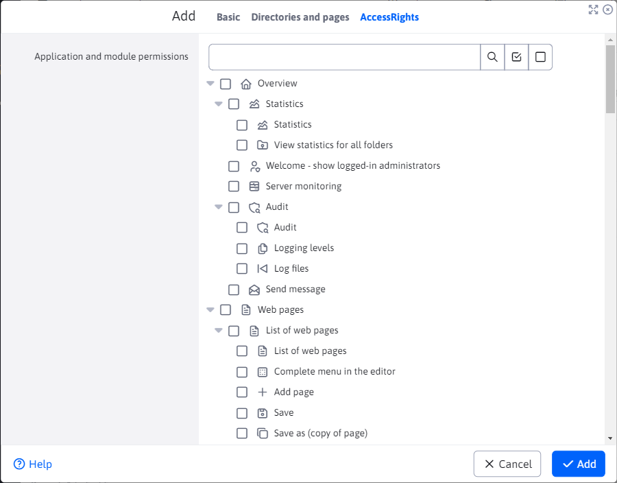

# Rights groups

You can define group permissions in rights groups. Using the buttons located in the upper left part of the page, you can create/edit/duplicate/delete rights groups, export rights groups to Excel or import them from Excel.

When a user logs in, all rights from the rights groups they have selected are set, and their individually set rights are also added.

You can therefore create a rights group called "Editor" for which you define rights to web pages and the most frequently used applications (news, photo gallery). This way you do not have to set the rights individually. When creating and duplicating a rights group, the only mandatory parameter is "Group name". The Access rights tab is important, where you set the rights to the applications/modules that the group will contain.

It is mandatory to enter a group name:

In the Directories and Pages tab, you can set which directories and pages the user can modify:

The tab contains the following options:

- **Access to all website directories** - if you enable this option, rights from multiple groups will not be added together, but the user will have access to all website directories regardless of the rights settings in other groups. When enabled, the fields for selecting individual directories and pages will be hidden.
- **Access to all file system folders** - if you enable this option, the user will have access to all file system folders (e.g. `/images`, `/files`) regardless of the rights settings in other groups. When enabled, the field for selecting individual folders will be hidden.

These options are useful, for example, for the "Administrator" group, where you want to ensure access to all directories and folders regardless of restrictions defined in other rights groups assigned to the user.

In the Access rights tab, you can set individual rights for functions and applications:

