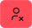
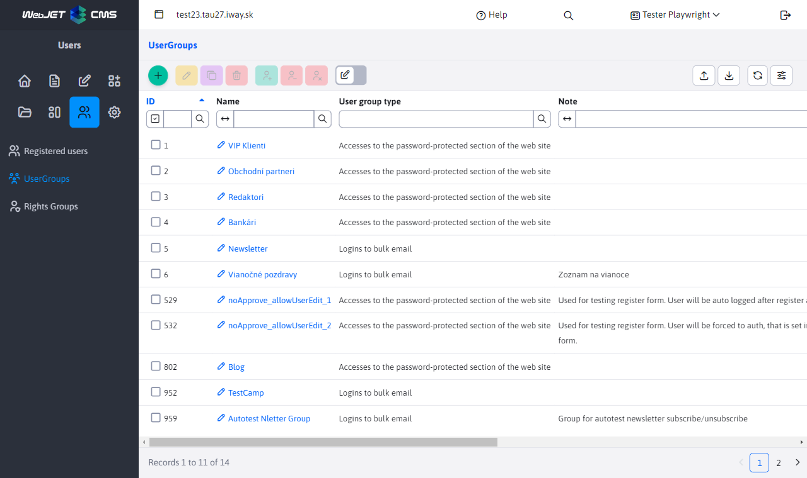

# User groups

Section **User groups** displays a list of groups into which you can categorize visitors/users/recipients of the bulk email.

Systematically, we distinguish two types of groups:
- **Accesses to the password-protected section of the website** - group for access rights to non-public sections of the website
- **Signing up for bulk email** - group for distribution list for sending mass emails

The table offers quick actions over the groups using the buttons:
- , **Add the selected group to all users** - the selected groups will be added to all existing users.
- , **Remove the selected group from all users** - the selected groups will be removed from all existing users.
- , **Delete all users of the selected group** - users who have at least one of the selected groups will be deleted.

## Editor

In the group definition editor dialog, you have the following options:
- **Name** - the unique name of the user group.
- **Type of group** - group type, either access rights for a rights control group or a bulk email group.
- **Note** - Any comment.
- **Requires approval** - if checked, after registering a user to this group, an email is first sent to the administrator to approve the registration. The user will be created in the database, but will not have the Approved field selected and will not be able to log in
- **Allow adding/removing from a group by the user themselves** - if set, the user will be able to add/remove the group. Usually this is set for email groups, so that the user themselves can set what distribution lists they will be subscribed to. For groups with access rights, leave unchecked.
- **Require email address confirmation** - if selected, a link will be sent to confirm the email address when the user registers via the registration form. Only after clicking on the link in the email message will the user be assigned to the group.
- **Page ID with the text of the email** - selecting the page with the text of the email that will be sent to the user after approval.
- **Price discount in %** - percentage discount for users in this group. The user discount can be used in various applications such as [Reservations](../../redactor/apps/reservation/reservations/README.md).

