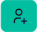
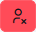
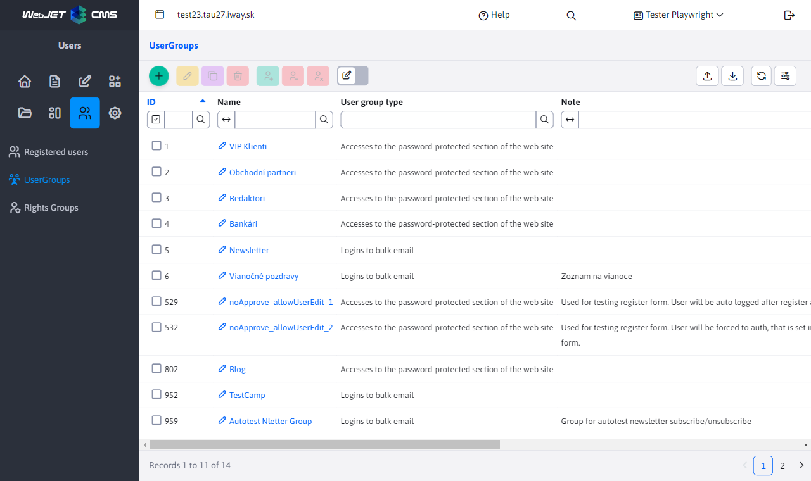
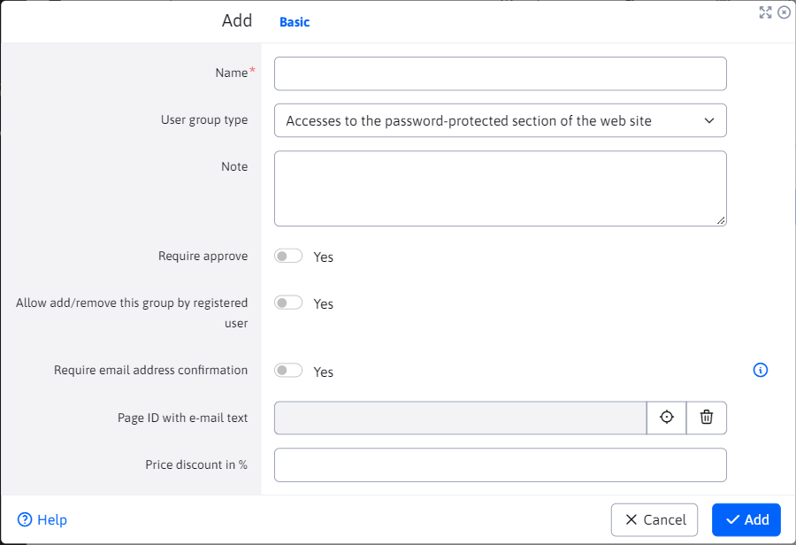

# User groups

The **User Groups** section displays a list of groups into which you can categorize visitors/users/bulk email recipients.

Systematically, we distinguish two types of groups:

- **Access to password-protected section of the website** - group for access rights to non-public sections of the website
- **Bulk Email Subscription** - a group for a distribution list for sending bulk emails

The table offers quick actions over groups using buttons:

- , **Add selected group to all users** - selected groups will be added to all existing users.
- , **Remove selected group from all users** - the selected groups will be removed from all existing users.
- , **Delete all users from the selected group** - users who have at least one from the selected group will be deleted.

## Editor

In the editor dialog box for defining a group, you have the following options:

- **Name** - unique name of the user group.
- **Group type** - group type, either access rights for a rights control group or a group for mass email.
- **Note** - any note.
- **Requires approval** - if checked, after registering a user to this group, an email will first be sent to the administrator to approve the registration. The user will be created in the database, but the Approved field will not be selected and they will not be able to log in
- **Allow users to add/remove from group** - if set, the user will be able to add/remove the group themselves. This is usually set for group email so that the user can set which distribution lists they will be subscribed to. For groups with access rights, leave it unchecked.
- **Require email address confirmation** - if selected, a link to confirm the email address will be sent when a user registers via the registration form. Only after clicking on the link in the email message will the user be assigned to the group.
- **Email text page ID** - selection of the page with the email text that will be sent to the user after approval.
- **Price discount in %** - percentage discount for users in this group. The user discount can be used in various applications such as [Reservations](../../redactor/apps/reservation/reservations/README.md).

