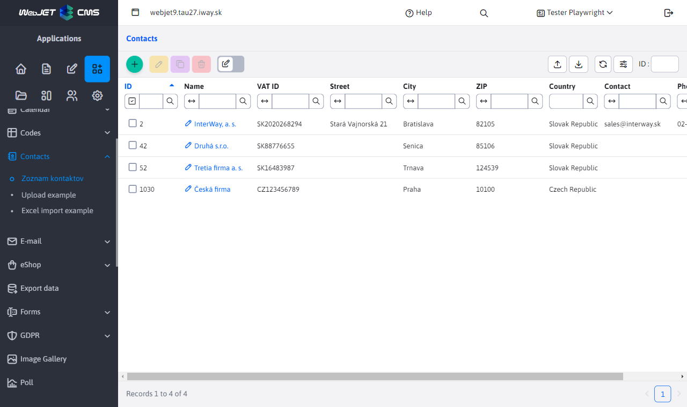
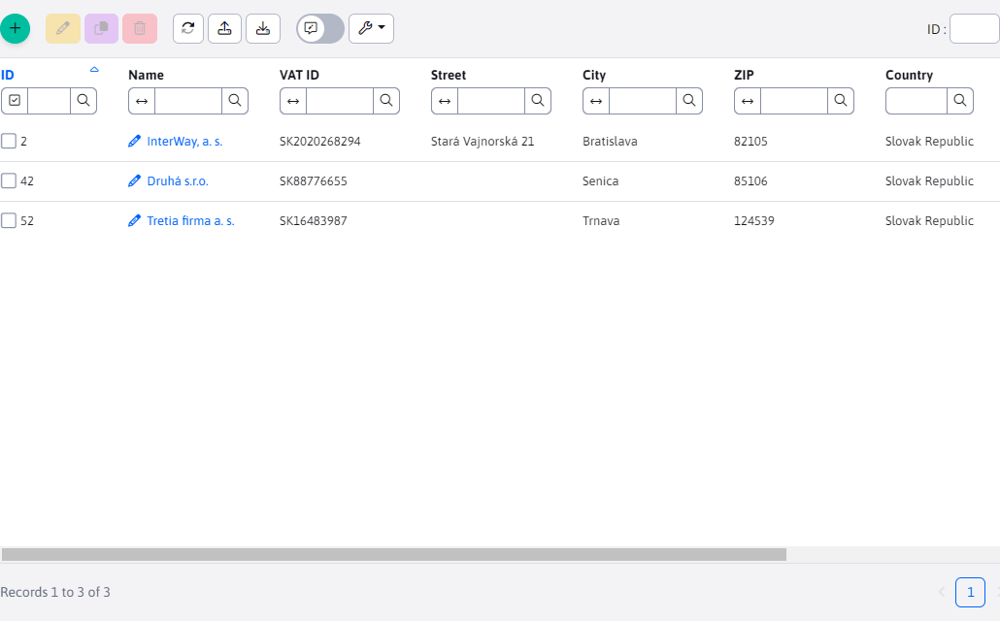

# Admin menu item

The administration is based on [data tables](../../developer/datatables/README.md) and [REST interfaces](../../developer/datatables/restcontroller.md). As a basis, it is necessary to understand their functioning according to the documentation for [WebJET CMS Programmer](../../developer/README.md).

In this example, we will program contact management, using the ```contact``` table, which exists in the standard WebJET CMS installation (but is typically not used).



## Backend

The ideal solution uses a `Spring DATA` repository, a REST controller, and a datatable generated from ```@DataTableColumn```, [annotations](../../developer/datatables-editor/datatable-columns.md).

Sample JPA entity also with ```@DataTableColumn``` annotations, [for datatable and editor](../../developer/datatables-editor/datatable-columns.md). Also note the ```@EntityListeners``` annotation for automatic [audit logging](../../developer/backend/auditing.md) when changing the entity.

Required fields and other validations [are set with annotations](../../developer/datatables/restcontroller.md#validation--required-fields), ```@NotBlank,@Size,@Email``` etc.

!>**Warning:** Do not use primitive types `int, long` in the entity, but only object types `Integer, Long`, otherwise filtering/searching will not work correctly.

```java
package sk.iway.basecms.contact;

import jakarta.persistence.Column;
import jakarta.persistence.Entity;
import jakarta.persistence.EntityListeners;
import jakarta.persistence.GeneratedValue;
import jakarta.persistence.Id;
import jakarta.persistence.Table;
import jakarta.persistence.TableGenerator;
import jakarta.validation.constraints.Email;
import jakarta.validation.constraints.NotBlank;
import jakarta.validation.constraints.Size;

import lombok.Getter;
import lombok.Setter;
import sk.iway.iwcm.system.adminlog.EntityListenersType;
import sk.iway.iwcm.system.datatable.DataTableColumnType;
import sk.iway.iwcm.system.datatable.annotations.DataTableColumn;

/**
 * Ukazkova JPA entita pre pouzitie v datatabulke
 * http://docs.webjetcms.sk/v2022/#/custom-apps/admin-menu-item
 */

//nastavenie JPA entity
@Entity
@Table(name = "contact")
//automaticke generovanie getter/setter metod cez lombok
@Getter
@Setter
//nastavenie automatickeho auditovania zmien, dolezite je nastavit Adminlog.TYPE_XXX
@EntityListeners(sk.iway.iwcm.system.adminlog.AuditEntityListener.class)
@EntityListenersType(sk.iway.iwcm.Adminlog.TYPE_CLIENT_SPECIFIC)
public class ContactEntity {

    @Id
    @Column(name = "contact_id")
	@GeneratedValue(generator = "WJGen_contact")
	@TableGenerator(name = "WJGen_contact", pkColumnValue = "contact")
    @DataTableColumn(inputType = DataTableColumnType.ID)
    private Long id;

    @DataTableColumn(inputType = DataTableColumnType.OPEN_EDITOR, title="components.contact.property.name")
    @NotBlank
    private String name;

    @DataTableColumn(inputType = DataTableColumnType.TEXT, title="components.contact.property.vatid")
    private String vatid;

    @DataTableColumn(inputType = DataTableColumnType.TEXT, title="components.contact.property.street")
    private String street;

    @DataTableColumn(inputType = DataTableColumnType.TEXT, title="components.contact.property.city")
    private String city;

    @DataTableColumn(inputType = DataTableColumnType.TEXT, title="components.contact.property.zip")
    @Size(min=5, max=8)
    private String zip;

    @DataTableColumn(inputType = DataTableColumnType.SELECT, title="components.contact.property.country")
    private String country;

    @DataTableColumn(inputType = DataTableColumnType.TEXT, title="components.contact.property.contact")
    @Email
    private String contact;

    @DataTableColumn(inputType = DataTableColumnType.TEXT, title="components.contact.property.phone")
    private String phone;

}
```

Sample JPA repository, when using it always use the ```Pageable``` object for pagination and ordering. To support dynamic generation of search criteria (in the REST controller, the ```addSpecSearch``` method), the repository also extends ```JpaSpecificationExecutor```.

```java
package sk.iway.basecms.contact;

import org.springframework.data.domain.Page;
import org.springframework.data.domain.Pageable;
import org.springframework.data.jpa.repository.JpaRepository;
import org.springframework.data.jpa.repository.JpaSpecificationExecutor;

/**
 * Ukazkovy Spring DATA repozitar pre pouzitie v datatabulke
 * http://docs.webjetcms.sk/v2022/#/custom-apps/admin-menu-item
 */
public interface ContactRepository extends JpaRepository<ContactEntity, Long>, JpaSpecificationExecutor<ContactEntity> {

    //citanie firiem podla zadanej krajiny pre MVC ukazku
    public Page<ContactEntity> findAllByCountry(String country, Pageable pageable);

}
```

!>**Warning:** note the use of ```JpaSpecificationExecutor```. This allows for dynamic creation of SQL statements for searching/filtering/sorting records in a datatable. If you do not use it, the search is performed in the form of [Query By Example](https://www.baeldung.com/spring-data-query-by-example) where you **must** not use primitive types and initialization values ​​in the Entity (e.g. ```String text="test"```). When searching, the value ```test``` would then be automatically searched for even if it is not specified. This is solved by ```JpaSpecificationExecutor```, which searches only for parameters specified in the filter (by testing request parameters starting with ```search```).

Sample REST controller, always pay attention to checking permissions via the ```@PreAuthorize``` annotation and don't forget the ```@Datatable``` annotation for correct generation of error responses.

In the ```getOptions``` method, it sets the options for the country selection field.

In the ```beforeSave``` method, it is possible to set additional (non-editable) data before saving the entity to the database.

```java
package sk.iway.basecms.contact;

import java.util.ArrayList;
import java.util.List;

import org.springframework.beans.factory.annotation.Autowired;
import org.springframework.security.access.prepost.PreAuthorize;
import org.springframework.web.bind.annotation.RequestMapping;
import org.springframework.web.bind.annotation.RestController;

import sk.iway.iwcm.system.datatable.Datatable;
import sk.iway.iwcm.system.datatable.DatatablePageImpl;
import sk.iway.iwcm.system.datatable.DatatableRestControllerV2;
import sk.iway.iwcm.system.datatable.json.LabelValue;

/**
 * Ukazkovy Spring REST pre pouzitie v datatabulke
 * http://docs.webjetcms.sk/v2022/#/custom-apps/admin-menu-item
 */

@RestController
//nastavenie URL adresy REST controllera
@RequestMapping("/admin/rest/apps/contact/")
//nastavenie kontroly prav na alikaciu cmp_contact (tento kluc sa definuje v modinfo.properties)
@PreAuthorize("@WebjetSecurityService.hasPermission('cmp_contact')")
@Datatable
public class ContactRestController extends DatatableRestControllerV2<ContactEntity, Long> {

    @SuppressWarnings("unused")
    private final ContactRepository contactRepository;

    @Autowired
    public ContactRestController(ContactRepository contactRepository) {
        super(contactRepository, ContactEntity.class);
        //odlozme si repozitar na pripadne specialne pouzitie
        this.contactRepository = contactRepository;
    }

    @Override
    public void getOptions(DatatablePageImpl<ContactEntity> page) {

        //pridaj zoznam pre pole country
        page.addOptions("country", getCountries(), "label", "value", false);
    }

    @Override
    public void beforeSave(ContactEntity entity) {
        //tu mozete vykonat nastavenie pred ulozenim, napr. nastavit datum poslednej zmeny
    }

    /**
     * Vrati zoznam vyberoveho pola pre krajinu
     * @return
     */
    public static List<LabelValue> getCountries() {
        //vytvor zoznam krajin, toto by sa idealne malo citat z nejakeho ciselnika
        List<LabelValue> countries = new ArrayList<>();
        countries.add(new LabelValue("Slovenská republika", "sk"));
        countries.add(new LabelValue("Česká republika", "cz"));
        countries.add(new LabelValue("Rakúsko", "at"));

        return countries;
    }
}
```

## Frontend

As mentioned above, data tables are used for the frontend. The administration is compiled from pug files into html and then displayed.

To easily create a new page in the administration, we have introduced a ready-made page layout template. You only need to fill in the middle part of the page (the template will generate the header and menu). [URL mapping](../../src/main/java/sk/iway/iwcm/admin/ThymeleafAdminController.java) is prepared as ```/apps/{app}/admin/``` or ```/apps/{app}/admin/{subpage}```.

Just prepare the file ```/apps/{app}/admin/index.html``` or ```/apps/{app}/admin/{subpage}.html``` where ```{app}``` is the name of the directory where the application is located (without diacritics and spaces) and ```{subpage}``` is the possible file name without an extension (if it is not index.html).

An example is the application ```src/main/webapp/apps/contact/admin/index.html``` called via the URL address ```/apps/contact/admin/```:

```html
<script>
    var dataTable;

    window.domReady.add(function () {

        WJ.breadcrumb({
            id: "contact",
            tabs: [
                {
                    url: '/apps/contact/admin/',
                    title: '[[#{components.contact.title}]]',
                    active: true
                }
            ]
        })

        //URL adresa REST rozhrania
        let url = "/admin/rest/apps/contact";
        //package a meno triedy s JPA entitou
        let columns = [(${layout.getDataTableColumns("sk.iway.basecms.contact.ContactEntity")})];

        dataTable = WJ.DataTable({
            url: url,
            serverSide: true,
            columns: columns,
            //id musi byt zhodne s tagom table nizsie
            id: "dataTable",
            fetchOnEdit: true,
            fetchOnCreate: true
        });
    });

</script>

<table id="dataTable" class="datatableInit table"></table>
```

Using the [WJ.breadcrumb](../../developer/frameworks/webjetjs.md#navigation-bar) function, a navigation bar is generated.


The function [WJ.DataTable](../../developer/datatables/README.md#configuration-options) initializes the datatable in the page into an HTML table with ```id=dataTable```. Please note the call ```window.domReady.add```, which must be used instead of ```$(document).ready``` - the call waits for the initialization of [translation keys](../../developer/libraries/translator.md) and only after they are obtained is the specified function called.



To display the menu item and display the user rights, it is still necessary to create a configuration file ```modinfo.properties```, place it in ```/apps/MENO_APLIKACIE/```, in our case ```src/main/webapp/apps/contact/modinfo.properties```:

```sh
#prekladovy kluc menu polozky
leftMenuNameKey=components.contact.title
#pouzivatelske pravo
itemKey=cmp_contact
#ak je true, je mozne pravo nastavovat
userItem=true
#linka v menu
leftMenuLink=/apps/contact/admin/
#ikona v menu (https://fontawesome.com/v5/search?s=solid%2Cbrands)
icon=address-book
#ak je true bude po pridani aplikacie zakazana pre vsetkych pouzivatelov a musi sa implicitne povolit
defaultDisabled=true
#ak je true, bude v zozname aplikacii na zaciatku (je to zakaznicka aplikacia)
custom=true

#submenu
#leftSubmenu1NameKey=components.contact.subpage.title
#leftSubmenu1Link=/apps/contact/admin/subpage/
```

If you have a page of type ```master-detail``` that is not defined in ```modinfo.properties```, the left menu may not display correctly because it does not know which item to highlight. The simplest solution is to name such a page ```meno-details.html``` (such as the URL address ```/apps/stat/admin/top-details/?docId=35267&dateRange=``` in the file ```/apps/stat/admin/top-details.html```). The expression ```-details``` or ```-detail``` will be removed when searching for an item to highlight in the menu, and the main (```master```) page will be highlighted.

If this is not appropriate, you can use the ```WJ.selectMenuItem(href)``` JavaScript function in your page to highlight the specified menu item. In the ```href``` parameter, you directly enter the URL address of the page in the menu that you want to highlight:

```JavaScript
window.domReady.add(function () {
    WJ.selectMenuItem("/admin/v9/apps/gallery/");
});
```

In the case of an old JSP component, call the function using ```setTimeout``` so that it is executed only after the page is displayed.

### Attaching a JavaScript file

If you need to connect a JavaScript module to your application, WebJET automatically looks for the file ```/apps/{app}/admin/{app}.js``` and, if it exists, inserts it into the HTML code header as a module, importing it as the object ```appModule```:

```html
<script type="module">
        import * as appModule from "[[${appIncludePathJs}]]";
        window.appModule = appModule;
</script>
```

For example, in the stat application there would be a file ```/apps/stat/admin/stat.js```:

```javascript
export const ChartType = {
    Bar: "bar"
    ...
}

export class ChartForm {
    constructor(chartType, yAxeName, xAxeName, chartTitle) {
        this.chartType = chartType;
        ...
    }
}

export async function setAmchart(chartForm) {
    ...
}
```

which is then called in JavaScript/HTML code as ```appModule.ChartType.Bar``` etc.

## Automated test

There is a [basic automated test](../../developer/testing/datatable.md) ready for the datatable, which you just need to configure. Create a new test scenario in ```src/test/webapp/tests/apps/contact.js``` with at least a basic test:

```javascript
Feature('contact');

Before(({ I, login }) => {
    login('admin');
    I.amOnPage("/apps/contact/admin/");
});

Scenario('contact-zakladne testy', async ({ I, DataTables, DTE }) => {
    await DataTables.baseTest({
         dataTable: 'dataTable',
         //meno prava na kontrolu podla modinfo.properties
         perms: 'cmp_contact',
         createSteps: function(I, options) {
            //toto pole musime vyplnit rucne, kedze ma specialnu validaciu
            DTE.fillField("zip", "85106");
         }
    });
});
```