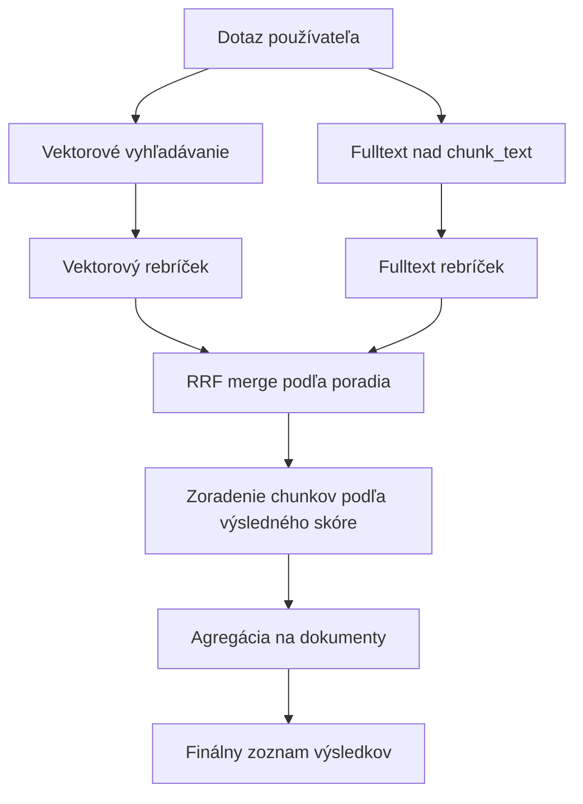
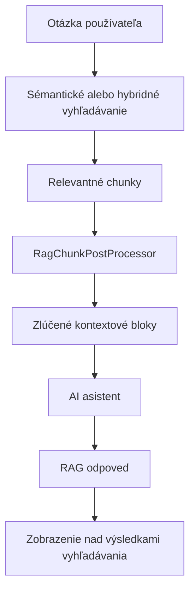

# Semantic Search (RAG)

Semantic search allows visitors to find relevant pages based on the **meaning of the question**, not just keyword matches. It uses the vector database [pgvector](https://github.com/pgvector/pgvector) and embedding vectors generated via the OpenAI API.

Above the same index, it is also possible to use:

- **hybrid search** - a combination of vector search and fulltext over chunked text,
- **RAG response** - AI response generated only from the found context.

## How it works

The system works in two main phases: indexing and online search.

### 1. Indexing

When a web page is saved, restored from the trash, or deleted, the [DocSaveEventListener](../../../../../../src/main/java/sk/iway/iwcm/rag/listener/DocSaveEventListener.java) listener queues the request. The background task [RagIndexCronTask](../../../../../../src/main/java/sk/iway/iwcm/rag/service/RagIndexCronTask.java) then processes the queue via the [SemanticIndexService](../../../../../../src/main/java/sk/iway/iwcm/rag/service/SemanticIndexService.java).

Indexing process:

1. **Content extraction** - from `DocDetails`, pure text without HTML tags is obtained via [DocDetailsContentExtractor](../../../../../../src/main/java/sk/iway/iwcm/rag/indexing/DocDetailsContentExtractor.java).
2. **Dividing into parts** - the text is split using [SlidingWindowChunker](../../../../../src/main/java/sk/iway/iwcm/rag/indexing/SlidingWindowChunker.java). The configuration variables `ragEmbeddingChunkSize` and `ragEmbeddingChunkOverlap` are used.
3. **Reuse of embeddings** - a hash is calculated for each chunk. If the chunk text has not changed and the embedding has the correct dimension, the existing vector is used.
4. **Generating embeddings** - new or changed chunks are sent to the OpenAI API (`/v1/embeddings`) via [OpenAiEmbeddingProvider](../../../../../../src/main/java/sk/iway/iwcm/rag/embedding/OpenAiEmbeddingProvider.java).
5. **Saving to database** - chunk metadata is stored via the JPA repository [EmbeddingChunkRepository](../../../../../../src/main/java/sk/iway/iwcm/rag/pgvector/EmbeddingChunkRepository.java), the `vector(N)` column itself is updated with native SQL via [PgVectorStore](../../../../../../src/main/java/sk/iway/iwcm/rag/vectorstore/PgVectorStore.java).

Chunking prefers natural text boundaries: paragraph, line, sentence, space, and then hard splitting by limit. For decimal numbers, a period is not considered the end of a sentence.

### 2. Search

When a visitor enters a search query:

1. [SearchAction](../../../../../src/main/java/sk/iway/iwcm/doc/SearchAction.java) determines the search type from the application parameter `searchType`. If the value is `auto` or empty, it uses the global configuration variable `searchType`.
2. For values ​​of `semantic` or `hybrid`, [SemanticSearchAction](../../../../../../src/main/java/sk/iway/iwcm/doc/SemanticSearchAction.java) is used.
3. [SemanticSearchService](../../../../../../src/main/java/sk/iway/iwcm/rag/search/SemanticSearchService.java) generates a query embedding and searches for the nearest chunks in the pgvector database.
4. Results will be limited by domain, language, entity type, and by folders selected in the **Search** application.
5. If hybrid mode is enabled, fulltext is also run over `rag_embedding_chunks.chunk_text` and the results are merged via `RRF` (Reciprocal Rank Fusion).
6. The resulting chunks are aggregated into documents and the documents are displayed in the same way as in a standard search.
7. If the RAG response is enabled, the context for the AI ​​response is prepared from the found chunks.

## Requirements

- **PostgreSQL** with the **pgvector** extension (image: `pgvector/pgvector:pg18-trixie` or later).
- **OpenAI API key** - the same key is used as for AI assistants (`ai_openAiAuthKey`).
- Semantic search only works over PostgreSQL/pgvector storage. If the primary database of WebJET CMS is not PostgreSQL, set up a separate PostgreSQL database via datasource `rag_jpa`.

### PostgreSQL as primary database

If WebJET CMS runs directly on PostgreSQL, the vector database will be used automatically without further configuration.

The datasource must be set as in [poolman-docker-pgsql.xml](../../../../../src/main/resources/poolman-docker-pgsql.xml).

### Standalone vector database

If the primary database is not PostgreSQL, create a Docker container with pgvector.

For local development, the file [.devcontainer/db/docker-compose-rag-pgsql.yml](../../../../../../.devcontainer/db/docker-compose-rag-pgsql.yml) is prepared:

```bash
docker compose -f .devcontainer/db/docker-compose-rag-pgsql.yml up -d
```

Examples of datasource configurations:

- [poolman-docker-mariadb.xml](../../../../../../src/main/resources/poolman-docker-mariadb.xml)
- [poolman-docker-mssql.xml](../../../../../../src/main/resources/poolman-docker-mssql.xml)
- [poolman-docker-oracle.xml](../../../../../../src/main/resources/poolman-docker-oracle.xml)

## Configuration

Activation and settings are done in [Configuration](../../../../admin/setup/configuration/README.md).

### Basic settings

| Variable | Default value | Description |
| --- | --- | --- |
| `ragSemanticSearchEnabled` | `false` | Enables semantic search over the pgvector vector database. |
| `searchType` | `db` | Global search type: `db`, `lucene`, `semantic`, `hybrid`. |
| `luceneAsDefaultSearch` | `false` | If `true`, Lucene has higher priority than `searchType`. |

!> To enable semantic search, set `ragSemanticSearchEnabled=true` and use `searchType=semantic` or `searchType=hybrid`. The search type can also be overridden locally in the **Search** application.

### Embedding and indexing

| Variable | Default value | Description |
| --- | --- | --- |
| `ragEmbeddingModel` | `text-embedding-3-small` | The name of the OpenAI embedding model. |
| `ragEmbeddingDimensions` | `1536` | Number of dimensions of the vector. Must match the model and database table used. |
| `ragEmbeddingChunkSize` | `1000` | Maximum size of one piece of text in characters. |
| `ragEmbeddingChunkOverlap` | `200` | The number of characters by which adjacent chunks overlap. |

!>**Note:** The older names `ragChunkSize` and `ragChunkOverlap` are no longer used.

!>**Warning:** Changing `ragEmbeddingDimensions` will erase data for the current embedding model because the vectors will not be compatible. Run a full content index after changing the model or dimension.

### Vector search

| Variable | Default value | Description |
| --- | --- | --- |
| `ragSearchEfSearch` | `40` | The `HNSW` parameter of the `ef_search` index. A higher value improves recall, but may slow down the search. |
| `ragSearchDistanceMetric` | `cosine` | Distance metrics: `cosine`, `inner_product`, `l2`. Change requires reindex of `HNSW` index. |
| `ragSemanticSearchMinSimilarity` | `0.2` | Minimum similarity value for results. Used in conjunction with the adaptive threshold based on the best result. |
| `ragSemanticSearchMinResults` | `3` | The minimum number of results that will be returned even with a stricter similarity threshold. |

### Hybrid search

Hybrid search combines vector results and full-text results above `rag_embedding_chunks.chunk_text`. It is used when `ragHybridSearchEnabled` is enabled and hybrid search mode is not `off`.

| Variable | Default value | Description |
| --- | --- | --- |
| `ragHybridSearchEnabled` | `true` | Enables hybrid search globally. |
| `ragHybridSearchMode` | `short_query_only` | Mode: `off`, `always`, `short_query_only`, `fallback_on_low_vector`. |
| `ragHybridShortQueryMaxChars` | `12` | Maximum query length in characters for `short_query_only` mode. |
| `ragHybridShortQueryMaxTerms` | `2` | Maximum number of query words for `short_query_only` mode. |
| `ragHybridFallbackTopSimilarity` | `0.35` | The best vector similarity threshold for `fallback_on_low_vector` mode. |
| `ragHybridVectorWeight` | `0.7` | Vector order weight in RRF merge. |
| `ragHybridFtsWeight` | `0.3` | Full-text order weight in RRF merge. |
| `ragHybridRrfK` | `60` | The `k` parameter for Reciprocal Rank Fusion. |
| `ragHybridChunkFetchMultiplier` | `3` | Multiplier of the number of chunks loaded versus the requested number of results. |
| `ragHybridFtsUseIlikeFallback` | `true` | If PostgreSQL FTS returns an empty result, it will use a fallback via `ILIKE`. |

In the local application settings, the value `searchType=semantic` means pure vector search without hybrid branch. The value `searchType=hybrid` will use hybrid if globally enabled.



## RAG search answer

RAG response is an optional addition to semantic or hybrid search. After finding relevant chunks, a limited context is prepared and sent to the AI ​​assistant. The response is displayed above the results list in the JSP template [search.jsp](../../../../../../src/main/webapp/components/search/search.jsp).

### Configuring RAG Response

| Variable | Default value | Description |
| --- | --- | --- |
| `ragAnswerAllowed` | `false` | Globally enables generation of RAG responses in searches. |
| `ragAnswerModel` | `gpt-5.4-mini` | Default model for the automatically created RAG assistant. |
| `ragAnswerMinSimilarity` | `0.3` | Soft similarity threshold for chunks entering the response context. |
| `ragAnswerTopK` | `12` | Number of most relevant chunks used before post-processing. |
| `ragAnswerMaxChunkGap` | `1` | The maximum gap between chunk indices that can still be merged. A value of `1` means adjacent chunks. |
| `ragAnswerMaxBlocks` | `4` | The maximum number of merged context blocks sent to the model. |
| `ragAnswerMaxCharacters` | `6000` | Maximum total number of context characters. |
| `ragAnswerMaxMergedBlockCharacters` | `2200` | Maximum number of characters of a single merged context block. |

In the **Search** application, these values ​​can be overridden locally. Empty numbers mean using the global configuration.

### Context post-processing

[RagChunkPostProcessor](../../../../../../src/main/java/sk/iway/iwcm/rag/search/RagChunkPostProcessor.java) prepares the context for the model:

1. sorts chunks by similarity and selects the top K,
2. uses an adaptive similarity threshold, but never discards everything if there is at least one usable result,
3. groups chunks by entity,
4. merges adjacent chunks and removes duplicate text from the overlay,
5. limit the number of blocks and the total number of characters.

The result is [MergedContextBlock](../../../../../src/main/java/sk/iway/iwcm/rag/search/MergedContextBlock.java) objects that are sent to the model as JSON.

### AI assistant

[RagService](../../../../../../src/main/java/sk/iway/iwcm/rag/search/RagService.java) uses WebJET CMS AI assistants. If no specific assistant is selected, the system will find or create a default assistant:

- name: `RAG-SEARCH`,
- group: `92-rag-answer`,
- provider: `openai`,
- model: value `ragAnswerModel`,
- class: `sk.iway.iwcm.rag.search.RagService`.

The application editor will also display assistants in the current domain that have the same value `className`.

The assistant receives macros prepared by the backend:

| Macro | Value |
| --- | --- |
| `{userQuestion}` | User question as a JSON string. |
| `{retrievedContext}` | JSON array of merged context blocks. |

The `bonusParams` macros are ignored in public REST calls to the assistant and are only set on the backend. The response must be based on `retrievedContext` only. If the model returns a sentinel `CANNOT_ANSWER_QUESTION`, the user will see a localized fallback response.



## Use in templates

Semantic search is enabled by embedding the **Search** application into the page. The search type can be set globally or directly in the application parameter.

Global setting:

```properties
ragSemanticSearchEnabled=true
searchType=semantic
```

Example of local application settings:

```html
!INCLUDE(/components/search/search.jsp, searchType=hybrid, answerAllowed=trueValue)!
```

Selected application parameters:

| Parameters | Values | Description |
| --- | --- | --- |
| `searchType` | `auto`, `db`, `lucene`, `semantic`, `hybrid` | Search type for a specific application. |
| `answerAllowed` | `auto`, `trueValue`, `falseValue` | Locally enable or disable RAG response. |
| `semanticSearchMinSimilarity` | number | Local value `ragSemanticSearchMinSimilarity`. |
| `semanticSearchMinResults` | number | Local value `ragSemanticSearchMinResults`. |
| `hybridSearchMode` | `auto`, `off`, `always`, `short_query_only`, `fallback_on_low_vector` | Local hybrid search mode. |
| `hybridFtsUseIlikeFallback` | `auto`, `trueValue`, `falseValue` | Local fallback for fulltext. |
| `ragAssistantId` | Assistant ID or `-1` | Selecting an assistant for RAG answer. |

## Automatic indexing

The system automatically places a page in the indexing queue when it:

- **save** - create or edit a page,
- **restore from trash** - the page is being re-indexed,
- **deleted** - embeddings are removed from the vector database.

Manual indexing in the administration only works with pages that are enabled for search.

## Automated tasks

The queue is processed by an automated task [sk.iway.iwcm.rag.service.RagIndexCronTask](../../../../../src/main/java/sk/iway/iwcm/rag/service/RagIndexCronTask.java). The recommended setting is to run every 5 minutes.

The cron job is safe from concurrent execution. When running, a flag is set in the cache with a validity of 60 minutes and its validity is renewed when processing is slower. Processed items are deleted from the queue in batches; in case of a deletion error, row-by-row deletion is used. Errors in indexing a specific page are stored as the **ERROR** status in the chunk table. If processing of an item fails at the queue level, the item remains in the queue and is processed again on the next run.

## Database schema

The system creates two tables:

### `rag_index_queue`

Queue for asynchronous indexing. Implemented by class [IndexQueueEntity](../../../../../src/main/java/sk/iway/iwcm/rag/jpa/IndexQueueEntity.java).

### `rag_embedding_chunks`

Stored embedding vectors and chunk metadata. Implemented by class [EmbeddingChunkEntity](../../../../../src/main/java/sk/iway/iwcm/rag/pgvector/EmbeddingChunkEntity.java).

Important columns:

- `entity_type`, `entity_id`, `chunk_index` - identification of the source entity and chunk order.
- `chunk_text` - ​​text used for embedding and fulltext.
- `content_hash` - ​​hash of chunk text for embedding reuse.
- `embedding` - ​​native pgvector type `vector(N)`.
- `embedding_model`, `dimensions` - model and dimension of the embedding.
- `language`, `domain_id` - language and domain.
- `group_id`, `root_group_l1`, `root_group_l2`, `root_group_l3` - optimized document filtering by folders.
- `status`, `error_message` - processing status.

!>**Warning:** Column `embedding` is not mapped via JPA. All vector operations are performed via native SQL queries in the [PgVectorStore](../../../../../../src/main/java/sk/iway/iwcm/rag/vectorstore/PgVectorStore.java) class.

The missing columns `group_id` and `root_group_l1..3` will be added when the schema is initialized. However, existing data does not have these values ​​backfilled, so re-index after the update.

## Recommendations for Slovak and Czech content

The default values ​​(`text-embedding-3-small`, `ragEmbeddingChunkSize=1000`, `ragEmbeddingChunkOverlap=200`) are a balanced compromise between price, speed, and accuracy for common websites in Slovak and Czech.

When tuning, follow these recommendations:

- **Section size (`ragEmbeddingChunkSize`)** - for websites in SK/CZ, the appropriate range is **800-1,200 characters**. With shorter sections, the context of the paragraph is lost, with longer sections, the accuracy of selecting a specific passage decreases.
- **Overlap (`ragEmbeddingChunkOverlap`)** - maintain a ratio of **15-25%** of `ragEmbeddingChunkSize`. Overlap prevents loss of context at the boundaries between sections.
- **Model limit** - `text-embedding-3-*` models can handle a maximum of 8,191 tokens per input. For Slovak and Czech, this is approximately 6,000 characters with a margin.
- **Quality assessment** - prepare 10-20 representative questions in Slovak or Czech and compare the TOP-5 results with different settings.

## Alternative embedding models

The default model `text-embedding-3-small` is multilingual and handles Slovak/Czech with sufficient quality for most web projects. If you require higher accuracy, the following alternatives are available:

| Model | `ragEmbeddingModel` | `ragEmbeddingDimensions` | Quality for SK/CZ | Note |
| --- | --- | --- | --- | --- |
| OpenAI `text-embedding-3-small` | `text-embedding-3-small` | `1536` | Good | Default model - cheap and fast. |
| OpenAI `text-embedding-3-large` | `text-embedding-3-large` | `3072` | High | The most accurate OpenAI multilingual model, more expensive than `small`. |
| OpenAI `text-embedding-3-large` abbreviated | `text-embedding-3-large` | `1024` or `1536` | High | Thanks to MRL, the vector can be shortened without significant loss of quality. |

!>**Warning:** All vectors in the `rag_embedding_chunks` table must come from the same model and have the same dimension. You must run a full content index when changing the model or dimension.

### What is Matryoshka (MRL)

Both `text-embedding-3-small` and `text-embedding-3-large` models are trained using the `Matryoshka Representation Learning` technique. The most important information is concentrated at the beginning of the vector, so the vector can be safely shortened, for example, using only the first 1,024 or 1,536 values ​​out of 3,072.

In practice, this means that you can use the higher quality `text-embedding-3-large`, but have the output returned in, for example, 1,536 dimensions. You will get higher accuracy than `small@1536` with the same table size and similar search speed.
