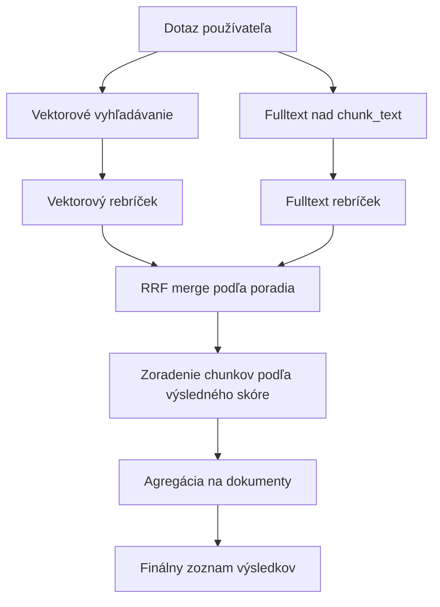

# Semantic Search (RAG)

Semantic search allows visitors to find relevant pages based on the **meaning of the query**, not just keyword matches. It uses technology built on the [pgvector](https://github.com/pgvector/pgvector) vector database and vectors generated via the OpenAI API.

## How it works

The system works in two phases:

### 1. Indexing

When a web page is saved or modified, the system queues it for indexing. A background task ([RagIndexCronTask](../../../../../src/main/java/sk/iway/iwcm/rag/service/RagIndexCronTask.java)) periodically processes the queue:

1. **Content extraction** – pure text (title + perex + page body without HTML tags) is extracted from `DocDetails`.
2. **Chunking** – the text is divided into overlapping chunks using a sliding window algorithm (`SlidingWindowChunker`). The default chunk size is 500 characters with an overlap of 100 characters.
3. **Generating vectors** - each part is sent to the OpenAI API (`/v1/embeddings`) and a 1,536-dimensional vector (model `text-embedding-3-small`) is returned.
4. **Saving to database** – vectors are saved to table `rag_embedding_chunks` in `PostgreSQL` database with extension `pgvector`.

### 2. Search (online)

When a visitor enters a search query:

1. The query is converted to an embedding vector via the OpenAI API.
2. A vector search in the database (cosine similarity) is performed.
3. Results are aggregated by document – ​​the best chunk is selected for each document.
4. Documents are returned sorted by similarity and displayed in the same way as standard search results.

## Requirements

- **PostgreSQL** with **pgvector** extension (image: `pgvector/pgvector:pg18-trixie` or later)
- **OpenAI API key** – the same one used for AI assistants (`ai_openAiAuthKey`)
- Semantic search works **only in PostgreSQL**. For other databases (MySQL/MariaDB, MSSQL, Oracle) you need to set up a separate vector database via datasource `rag_jpa`. So you can use, for example, MariaDB for the WebJET CMS database and a separate PostgreSQL for the vector part.

### PostgreSQL as primary database

If WebJET CMS runs directly on PostgreSQL, the vector database will be used automatically without further configuration.

Only the datasource must be set as in the case of [poolman-docker-pgsql.xml](../../../../../src/main/resources/poolman-docker-pgsql.xml).

### Separate vector database (secondary)

If the primary database is not PostgreSQL, create a Docker container with `pgvector`.

For local development, the file [.devcontainer/db/docker-compose-rag-pgsql.yml](../../../../../../.devcontainer/db/docker-compose-rag-pgsql.yml) is prepared:

```bash
docker compose -f .devcontainer/db/docker-compose-rag-pgsql.yml up -d
```

with already configured datasources:

- [poolman-docker-mariadb.xml](../../../../../../src/main/resources/poolman-docker-mariadb.xml)
- [poolman-docker-mssql.xml](../../../../../../src/main/resources/poolman-docker-mssql.xml)
- [poolman-docker-oracle.xml](../../../../../../src/main/resources/poolman-docker-oracle.xml)

## Configuration

Activating and setting up semantic search in [Configuration](../../../../admin/setup/configuration/README.md):

| Variable | Default value | Description |
| --- | --- | --- |
| `ragSemanticSearchEnabled` | `false` | Enables semantic search. Set to `true` to enable. |
| `ragEmbeddingModel` | `text-embedding-3-small` | OpenAI embedding model name |
| `ragEmbeddingDimensions` | `1536` | Number of dimensions of the vector. Must match the model used and the table in the database. |
| `ragChunkSize` | `1000` | Maximum size of one piece of text in characters. |
| `ragChunkOverlap` | `200` | The number of characters by which adjacent parts overlap. |
| `searchType` | `db` | Search type: `db` (database), `lucene` (Lucene fulltext), `semantic` (semantic). |
| `ragSemanticSearchMinSimilarity` | `0.2` | minimum similarity value for results. A value outside the 0-1 interval is trimmed to the nearest boundary |
| `ragSemanticSearchMinResults` | `3` | minimum number of semantic search results; if there are fewer, they will be added according to the highest similarity |
| `ragSearchEfSearch` | `40` | `HNSW` index parameter `ef_search` — the higher the value, the better recall but the slower the search. Default is 40, for larger websites consider increasing to 100 or more. |
| `ragSearchDistanceMetric` | `cosine` | Distance metric for `pgvector` search. Possible values: 'cosine' (cosine distance), 'inner_product' (inner product, faster for normalized vectors), 'l2' (Euclidean distance). Changing requires reindexing the `HNSW` index. |

!> To activate semantic search, set `ragSemanticSearchEnabled=true` **and** `searchType=semantic`.

!>**Warning:** Changing the configuration variable `ragEmbeddingDimensions` will delete the entire table `rag_embedding_chunks` because the vectors will not be compatible. Consider backing up your data before changing this value. The table will be automatically recreated with the new dimension.

Set up an [automated task](../../../../admin/settings/cronjob/README.md) with a value of `sk.iway.iwcm.rag.service.RagIndexCronTask` to run, for example, every 5 minutes - a value of `*/5` in the Minute field.

### Hybrid search (vector + fulltext)

In `short_query_only` mode, fulltext is turned on mainly for short queries, where vector similarity itself may be less stable.

In `fallback_on_low_vector` mode, fulltext is only performed when the top vector similarity is low or there are too few results.

The results are merged using `RRF` (Reciprocal Rank Fusion). In practice, this means that the similarity numbers between the vector and fulltext branches are not compared, but only their rank in each branch.

Simplified:

1. Vector search returns a list of results sorted from best to worst.
2. Fulltext search returns its own list sorted from best to worst.
3. Each result receives points according to its position in the list, where a better position means more points.
4. If the same chunk appears in both branches, its points are added together.
5. Then the results are sorted by the sum of the points and only then are the documents selected.

In this way, a result that is slightly weaker in vector but very good in fulltext can be moved up. Conversely, a result that is strong in only one branch will not beat the combined result from both branches by just a randomly large similarity number.



The following configuration variables can be set:

| Variable | Default value | Description |
| --- | --- | --- |
| `ragHybridSearchEnabled` | `true` | Enables hybrid search combining vector and fulltext results over `rag_embedding_chunks.chunk_text`. |
| `ragHybridSearchMode` | `short_query_only` | Hybrid search mode: `off`, `always`, `short_query_only`, `fallback_on_low_vector`. |
| `ragHybridShortQueryMaxChars` | `12` | Maximum query length in characters for `short_query_only` mode. |
| `ragHybridShortQueryMaxTerms` | `2` | Maximum number of query words for `short_query_only` mode. |
| `ragHybridFallbackTopSimilarity` | `0.35` | Top similarity threshold for `fallback_on_low_vector` mode. |
| `ragHybridVectorWeight` | `0.7` | Vector order weight in RRF merge. |
| `ragHybridFtsWeight` | `0.3` | Fulltext ranking weight in RRF merge. |
| `ragHybridRrfK` | `60` | The `k` parameter for Reciprocal Rank Fusion. |
| `ragHybridChunkFetchMultiplier` | `3` | Multiplier of the number of chunks loaded versus the requested number of results. |
| `ragHybridFtsUseIlikeFallback` | `true` | If FTS returns an empty result, a fallback via `ILIKE` over `chunk_text` is used. |

### Recommendations for Slovak and Czech content

The default values ​​(`text-embedding-3-small`, `chunkSize=1000`, `chunkOverlap=200`) are a balanced compromise between price, speed, and accuracy for common websites in Slovak and Czech.

When tuning, follow these recommendations:

- **Section size (`ragChunkSize`)** – for websites in SK/CZ, a suitable range is **800–1,200 characters** (approx. 6–10 sentences). Shorter sections lose the context of the paragraph, while longer sections reduce the accuracy of selecting a specific passage.
- **Overlap (`ragChunkOverlap`)** – maintain a ratio of **15–25%** of `ragChunkSize`. Overlap prevents loss of context at the boundaries between sections.
- **Model limit** – `text-embedding-3-*` models can handle a maximum of 8,191 tokens per input. For Slovak and Czech, this is ~6,000 characters, so with the recommended chunk size, there is no need to worry about the limit.
- **Quality assessment** – prepare a test set of 10–20 representative questions in Slovak/Czech and compare the TOP-5 results with different model settings and chunk sizes.

### Alternative embedding models

The default model `text-embedding-3-small` is multilingual and handles Slovak/Czech well enough for most web projects. If you require higher accuracy for Slavic languages, the following alternatives are available:

| Model | `ragEmbeddingModel` | `ragEmbeddingDimensions` | Quality for SK/CZ | Note |
| --- | --- | --- | --- | --- |
| OpenAI `text-embedding-3-small` | `text-embedding-3-small` | `1536` | Good | Default model – cheap and fast. |
| OpenAI `text-embedding-3-large` | `text-embedding-3-large` | `3072` | High | The most accurate OpenAI multilingual model, about 6x more expensive than `small`. |
| OpenAI `text-embedding-3-large` (shortened) | `text-embedding-3-large` | `1024` or `1536` | High | Thanks to the `Matryoshka` (MRL) technique, the vector can be safely shortened without significant loss of quality. You will save space in the database and speed up searches while maintaining higher accuracy than `small`. |

!>**Warning:** all vectors in the table `rag_embedding_chunks` must come from the same model and have the same dimension. Changing the model or dimension will clear the table and you must run a full content index.

#### What is Matryoshka (MRL)

Both `text-embedding-3-small` and `text-embedding-3-large` models are trained using the `Matryoshka Representation Learning` technique. The most important information is concentrated at the beginning of the vector, so the vector can be **safely truncated** (e.g., using only the first 1,024 or 1,536 values ​​out of 3,072) without geometric decomposition of the representation.

In practice, this means that you can use the higher-quality `text-embedding-3-large`, but have the output returned in, for example, 1,536 dimensions - you will get higher accuracy than `small@1536` with the same table size and the same search speed.

## Use in templates

Semantic search is activated in the same way as standard search - by inserting the **Search** application into the page. The only difference is in the setting of the `searchType` parameter.

### Global enablement via configuration

Set `searchType=semantic` in the WebJET CMS configuration. All searches will use vectors.

## Automatic indexing

The system automatically places a page in the indexing queue when it:

- **Save** (create or edit)
- **Deleted** (embedding is deleted from the vector database)

This is provided by the [DocSaveEventListener](../../../../../../src/main/java/sk/iway/iwcm/rag/listener/DocSaveEventListener.java) listener, which responds to document saving events.

## Automated tasks

The queue is processed by an automated task [sk.iway.iwcm.rag.service.RagIndexCronTask](../../../../../src/main/java/sk/iway/iwcm/rag/service/RagIndexCronTask.java). The recommended setting is to run every 5 minutes.

The cron job is safe from concurrent execution - when running, a flag is set in the cache with a validity of 60 minutes. Invalid entries are not deleted and are reprocessed on the next run.

## Database schema

The system creates two tables (automatic update via `autoupdate-webjet9.xml`):

### `rag_index_queue`

Queue for asynchronous indexing. Implemented by class [IndexQueueEntity](../../../../../src/main/java/sk/iway/iwcm/rag/jpa/IndexQueueEntity.java).

### `rag_embedding_chunks` (pgvector database)

Stored embedding vectors. Implemented by class [EmbeddingChunkEntity](../../../../../src/main/java/sk/iway/iwcm/rag/pgvector/EmbeddingChunkEntity.java).

!>**Warning:** Column `embedding` is of type `vector(N)` – native pgvector type. It is not mapped via JPA, all vector operations are performed via native SQL queries in the class [PgVectorStore](../../../../../../src/main/java/sk/iway/iwcm/rag/vectorstore/PgVectorStore.java).