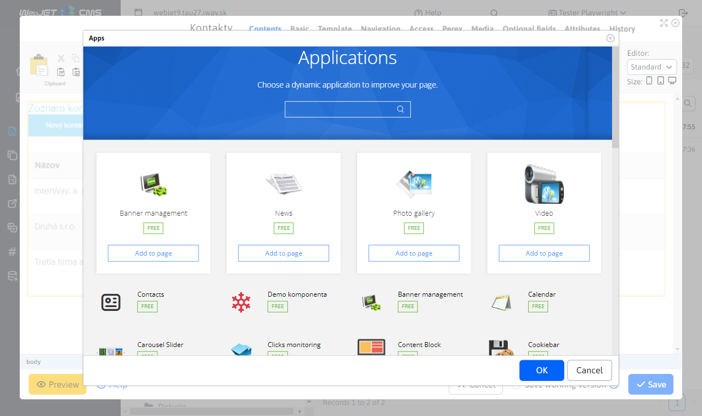
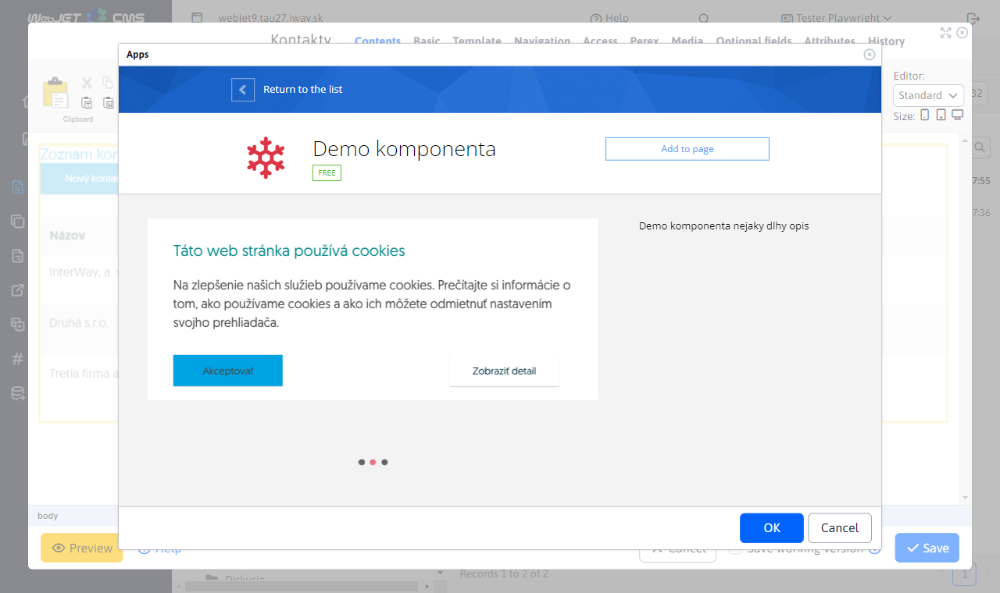
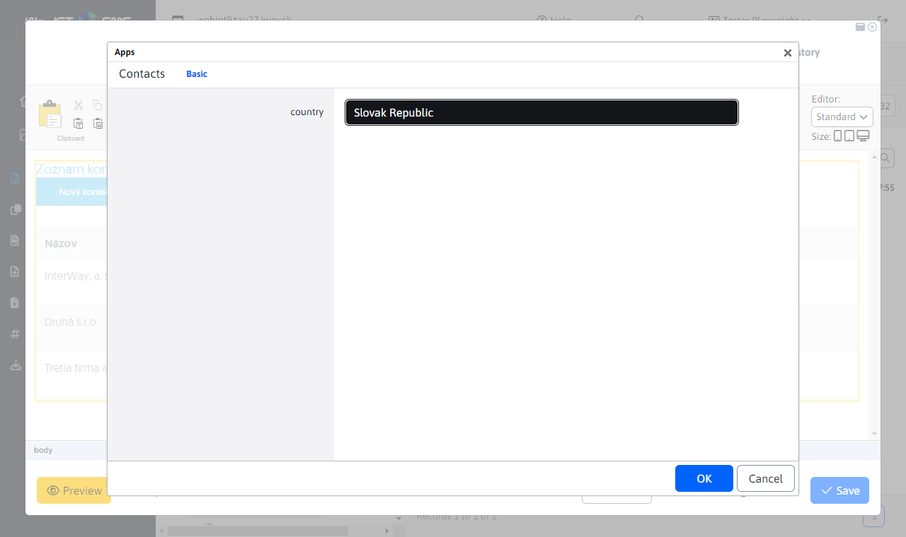

# To view in the App list

If you have created an application, you can simply display it in the list of applications in the editor. In the screenshot you can see the Contacts application and the Demo component, which are applications for WebJET written in [Spring](../spring-mvc/README.md).



<div class="video-container">
  <iframe width="560" height="315" src="https://www.youtube.com/embed/2r6-0zk5ZNQ" title="YouTube video player" frameborder="0" allow="accelerometer; autoplay; clipboard-write; encrypted-media; gyroscope; picture-in-picture" allowfullscreen></iframe>
</div>

## Use of annotation

In order for an application to appear in the list, its class must have an annotation `@WebjetAppStore`, examples:

```java
@WebjetComponent("sk.iway.demo8.DemoComponent")
@WebjetAppStore(nameKey = "Demo komponenta", descKey = "Demo komponenta nejaky dlhy opis", imagePath = "fa fa-snowflake text-danger", galleryImages = "/components/map/screenshot-1.jpg,/components/gdpr/screenshot-2.png,/components/gallery/screenshot-3.jpg")
public class DemoComponent extends WebjetComponentAbstract {
	...
}

@WebjetComponent("sk.iway.basecms.contact.ContactApp")
@WebjetAppStore(nameKey = "Kontakty", descKey = "Ukazkova aplikacia so zoznamom kontaktov", imagePath = "fas fa-address-card", galleryImages = "/components/map/screenshot-1.jpg,/components/gdpr/screenshot-2.png,/components/gallery/screenshot-3.jpg")
public class ContactApp extends WebjetComponentAbstract {
	...
}
```

The annotation has the following parameters:
- `nameKey` - translation key **application name** (in the examples it is directly text, but we recommend to use the translation key), e.g. `components.DemoComponent.title`.
- `descKey` - translation key **description of the application**, if not specified the translation key specified as `nameKey.desc` (if `nameKey` ends at `.title` shall be replaced `.title` For `.desc`).
- `imagePath` - the way to the picture **icons** Application. It can be a file, or it can be a CSS class for an icon [FontAwesome](https://fontawesome.com/v5/search?s=solid%2Cbrands) Like `fa fa-meno-ikony`.
- `galleryImages` - a comma-separated list of images that appear in the app description, e.g. `/components/map/screenshot-1.jpg,/components/gdpr/screenshot-2.png`.
- `domainName` - if you have a multi-domain installation, you can restrict the application to display only on the specified domain. You can specify multiple domains separated by a comma.
- `commonSettings` - A parameter that determines whether the View tab for Common Settings appears in the application editor. The default value is `true`, so the card will be displayed.



The annotation is searched in the following packages (including sub packages):
- `sk.iway.iwcm` - standard WebJET CMS applications.
- `sk.iway.INSTALL_NAME` - applications by installation name (conf. variable `installName`), you should have standard customer applications here.
- `sk.iway.LOG_INSTALL_NAME` - application by installation logging name (conf. variable `logInstallName`), it is used if you have a customer application but deployed in multiple variants or environments.
- packages defined in conf. variable `springAddPackages` - additional packages for Spring applications, used if the application is programmed outside the WebJET CMS, or uses a different prefix than `sk.iway`.
Applications with package starting with `sk.iway.iwcm` are placed at the end of the list of applications, others are placed at the beginning. It is assumed that you want to have customer applications displayed at the top of the application list.

If you want to place the application also in the promo list (at the top), edit the conf. variable `appstorePromo`, which contains a list of app promo keys.

**Warning:** the application is embedded in the page as `@Scope(value = WebApplicationContext.SCOPE_REQUEST, proxyMode = ScopedProxyMode.TARGET_CLASS)`if it is found multiple times in the page, the class is reused and its attributes and variables are preserved during the execution of the HTTP request.
## Application parameters

Each application can have configurable parameters. These are defined directly in the class as its attributes:

```java

@WebjetComponent("sk.iway.demo8.DemoComponent")
@WebjetAppStore(nameKey = "Demo komponenta", descKey = "Demo komponenta nejaky dlhy opis", imagePath = "fa fa-snowflake text-danger", galleryImages = "/components/map/screenshot-1.jpg,/components/gdpr/screenshot-2.png,/components/gallery/screenshot-3.jpg")
public class DemoComponent extends WebjetComponentAbstract {

	private String stringField;
	private Boolean booleanField;
	private Float floatField;
	...

}
```

these attributes are linked to the brand `!INCLUDE(... stringField=hodnota, booleanField=false)!` and are used for [Parameterization of the application display](../spring-mvc/README.md#používanie-parametrov-aplikácie).

WebJET supports displaying parameter settings in a dialog box using `@DataTableColumn` annotations as well as for [standard datatable editor](../../developer/datatables-editor/datatable-columns.md). Also supported are cards set with the attribute `tab` Annotation. The translation key with the name `editor.tab.MENO`.

In addition to primitive/basic data types and `java.util.Date` conversion of objects of type `DocDetails/GroupDetails` including `List` using the field type `DataTableColumnType.JSON`.

Example of use:


```java
package sk.iway.demo8;

import org.springframework.ui.Model;

import lombok.Getter;
import lombok.Setter;
import sk.iway.iwcm.Logger;
import sk.iway.iwcm.components.WebjetComponentAbstract;
import sk.iway.iwcm.doc.DocDetails;
import sk.iway.iwcm.doc.GroupDetails;
import sk.iway.iwcm.system.annotations.DefaultHandler;
import sk.iway.iwcm.system.annotations.WebjetAppStore;
import sk.iway.iwcm.system.annotations.WebjetComponent;
import sk.iway.iwcm.system.datatable.DataTableColumnType;
import sk.iway.iwcm.system.datatable.annotations.DataTableColumn;

import java.math.BigDecimal;
import java.util.Date;
import java.util.List;

@WebjetComponent("sk.iway.demo8.DemoComponent")
@WebjetAppStore(nameKey = "Demo komponenta", descKey = "Demo komponenta nejaky dlhy opis", imagePath = "fa fa-snowflake text-danger", galleryImages = "/components/map/screenshot-1.jpg,/components/gdpr/screenshot-2.png,/components/gallery/screenshot-3.jpg")
@Getter
@Setter
public class DemoComponent extends WebjetComponentAbstract {

	@DataTableColumn(inputType = DataTableColumnType.TEXT, tab = "basic")
	private String stringField;

	@DataTableColumn(inputType = DataTableColumnType.CHECKBOX, tab = "basic")
	private boolean primitiveBooleanField;

	@DataTableColumn(inputType = DataTableColumnType.TEXT_NUMBER, tab = "basic")
	private int primitiveIntegerField;

	@DataTableColumn(inputType = DataTableColumnType.TEXT_NUMBER, tab = "basic")
	private double primitiveDoubleField;

	@DataTableColumn(inputType = DataTableColumnType.TEXT_NUMBER, tab = "basic")
	private float primitiveFloatField;


	@DataTableColumn(inputType = DataTableColumnType.TEXT_NUMBER, tab = "advanced")
	private BigDecimal bigDecimalField;

	@DataTableColumn(inputType = DataTableColumnType.CHECKBOX, tab = "advanced")
	private Boolean booleanField;

	@DataTableColumn(inputType = DataTableColumnType.TEXT_NUMBER, tab = "advanced")
	private Integer integerField;

	@DataTableColumn(inputType = DataTableColumnType.TEXT_NUMBER, tab = "advanced")
	private Double doubleField;

	@DataTableColumn(inputType = DataTableColumnType.TEXT_NUMBER, tab = "advanced")
	private Float floatField;

	@DataTableColumn(inputType = DataTableColumnType.DATETIME, title = "date", tab = "advanced")
    private Date date;


	@DataTableColumn(inputType = DataTableColumnType.JSON, title = "groupDetails", tab = "json", className = "dt-tree-group")
    private GroupDetails groupDetails;

    @DataTableColumn(inputType = DataTableColumnType.JSON, title = "docDetails", tab = "json", className = "dt-tree-page")
    private DocDetails docDetails;

    @DataTableColumn(inputType = DataTableColumnType.JSON, title = "groupDetailsList", tab = "json", className = "dt-tree-group-array")
    private List<GroupDetails> groupDetailsList;

    @DataTableColumn(inputType = DataTableColumnType.JSON, title = "docDetailsList", tab = "json", className = "dt-tree-page-array")
    private List<GroupDetails> docDetailsList;

    @DataTableColumn(inputType = DataTableColumnType.JSON, title = "dirSimple", tab = "json", className = "dt-tree-dir-simple")
    private String dirSimple;


	@DefaultHandler
	public String render(Model model)
	{
		Logger.debug(this.getClass(), "groupDetails="+groupDetails+" docDetails="+docDetails+" groupDetailsList="+groupDetailsList+" docDetailsList="+docDetailsList+" dirSimple="+dirSimple+" date="+date);

        model.addAttribute("test", "Toto je test");
		model.addAttribute("demoComponent", this);

		return "/components/aceintegration/demo-component/view";
	}

	/**
	 * To call this method there should be URL parameter ?save (value is not important) OR page parameter !INCLUDE(... ,defaultHandler=save)!
	 * @param model
	 * @return
	 */
	public String save(Model model)
	{
		Logger.debug(this.getClass(), "groupDetails="+groupDetails+" docDetails="+docDetails+" groupDetailsList="+groupDetailsList+" docDetailsList="+docDetailsList+" dirSimple="+dirSimple+" date="+date);

        model.addAttribute("test", "This is save method");
		model.addAttribute("demoComponent", this);

		return "/components/aceintegration/demo-component/view";
	}

	@Override
	public void init()
	{
		//There should be initialization of component
		Logger.debug(this.getClass(), "DemoComponent init");
	}

	@Override
	public String getViewFolder()
	{
		return null;
	}
}
```

Sample HTML code `/components/aceintegration/demo-component/view.html`:

```html
<p>

	Demo component view, params:
	<br />
	test1: <span data-th-utext="${test}"></span>
	<br />
	stringField: <span data-th-utext="${demoComponent.stringField}"></span>
	<br />
	primitiveBooleanField: <span data-th-utext="${demoComponent.primitiveBooleanField}"></span>
	<br />
	primitiveIntegerField: <span data-th-utext="${demoComponent.primitiveIntegerField}"></span>
	<br />
	primitiveDoubleField: <span data-th-utext="${demoComponent.primitiveDoubleField}"></span>
	<br />
	primitiveFloatField: <span data-th-utext="${demoComponent.primitiveFloatField}"></span>
</p>

<p>date: <span data-th-text="${T(sk.iway.iwcm.Tools).formatDateTimeSeconds(demoComponent.date)}"></span></p>

<p>dirSimple: <span data-th-utext="${demoComponent.dirSimple}"></span></p>

<p>groupDetails: <span data-th-text="${demoComponent.groupDetails}"></span></p>

<p>docDetails: <span data-th-text="${demoComponent.docDetails}"></span></p>

<p>groupDetailsList:</p>
<ul data-th-each="grp : ${demoComponent.groupDetailsList}">
	<li data-th-text="${grp}">GroupDetails</li>
</ul>

<p>docDetailsList:</p>
<ul data-th-each="doc : ${demoComponent.docDetailsList}">
	<li data-th-text="${doc}">DocDetails</li>
</ul>
```

Example of setting [selection field](../../developer/datatables-editor/datatable-columns.md#možnosti-výberového-poľa) in Contacts. Note also the options `@JsonIgnore` set above the repository. Otherwise, the repository itself would be serialized into the JSON object for editing application parameters, causing a JSON error.



```java
package sk.iway.basecms.contact;

import javax.servlet.http.HttpServletRequest;
import javax.servlet.http.HttpServletResponse;
import javax.validation.Valid;

import com.fasterxml.jackson.annotation.JsonIgnore;

import org.springframework.beans.factory.annotation.Autowired;
import org.springframework.ui.Model;
import org.springframework.validation.BindingResult;
import org.springframework.web.bind.annotation.ModelAttribute;
import org.springframework.web.bind.annotation.RequestParam;

import lombok.Getter;
import lombok.Setter;
import sk.iway.iwcm.Logger;
import sk.iway.iwcm.PathFilter;
import sk.iway.iwcm.components.WebjetComponentAbstract;
import sk.iway.iwcm.system.annotations.DefaultHandler;
import sk.iway.iwcm.system.annotations.WebjetAppStore;
import sk.iway.iwcm.system.annotations.WebjetComponent;
import sk.iway.iwcm.system.datatable.DataTableColumnType;
import sk.iway.iwcm.system.datatable.annotations.DataTableColumn;
import sk.iway.iwcm.system.datatable.annotations.DataTableColumnEditor;
import sk.iway.iwcm.system.datatable.annotations.DataTableColumnEditorAttr;

/**
 * <p>Príkladová trieda pre komponentu - http://docs.webjetcms.sk/v2022/#/custom-apps/spring-mvc/</p>
 * <p>Trieda musí byt anotovaná @WebjetComponent, pre názov v anotácii sa musí použiť celý názov triedy aj s package</p>
 * <p>Príklad include:</p>
 * <code>!INCLUDE(sk.iway.basecms.contact.ContactApp, country="sk")!</code>
 *
 * Anotacia @WebjetAppStore zabezpeci zobrazenie aplikacie v zozname aplikacii v editore (v AppStore)
 *

 * V pripade, ze nejaka metoda ma byt dostupna len pre prihlaseneho pouzivatela, admina, prip. nejaku pouzivatelsku skupinu mozeme pouzit anotacie:
 * @PreAuthorize("@WebjetSecurityService.isLogged()") - prihalseny pouzivatel
 * @PreAuthorize("@WebjetSecurityService.isAdmin()") - admin
 * @PreAuthorize("@WebjetSecurityService.isInUserGroup('nazov-skupiny')") - patri do skupiny
 * @see sk.iway.iwcm.system.spring.services.WebjetSecurityService
 */
@WebjetComponent("sk.iway.basecms.contact.ContactApp")
@WebjetAppStore(nameKey = "Kontakty", descKey = "Ukazkova aplikacia so zoznamom kontaktov", imagePath = "fas fa-address-card", galleryImages = "/components/map/screenshot-1.jpg,/components/gdpr/screenshot-2.png,/components/gallery/screenshot-3.jpg")
@Getter
@Setter
public class ContactApp extends WebjetComponentAbstract {

    //Spring DATA repozitar
    @JsonIgnore
    private ContactRepository contactRepository;

    /**
     * Privatne vlastnosti s get/set-rami slúžia na prenesenie parametrov pageParams z !INCLUDE()! do triedy
     * Pomocou anotacie @DataTableColumn vytvarame pole pre nastavenie aplikacie
     */
    @DataTableColumn(inputType = DataTableColumnType.SELECT, tab = "basic", editor = {
        @DataTableColumnEditor(
            options = {
                //klasicky option tag
                //@DataTableColumnEditorAttr(key = "Slovensky", value = "sk"),

                //ukazka ziskania zoznamu krajin volanim statickej metody, vo value su mena property pre text a hodnotu option pola
                @DataTableColumnEditorAttr(key = "method:sk.iway.basecms.contact.ContactRestController.getCountries", value = "label:value")

                //ukazka napojenia na ciselnik, mozne je zadat meno alebo ID ciselnika, vo value su mena property pre text a hodnotu option pola
                //@DataTableColumnEditorAttr(key = "enumeration:Okresne Mestá", value = "string1:string2")
            }
        )
    })
    private String country;

    @Autowired
    public ContactApp(ContactRepository contactRepository) {
        this.contactRepository = contactRepository;
    }

    /**
     * metoda init sa vola po vytvoreni objektu a nastaveni parametrov,
     * je volana pred kazdym view volanim a umozni nastavit pripadne atributy
     * @param request
     * @param response
     */
    @Override
    public void init(HttpServletRequest request, HttpServletResponse response) {
        Logger.debug(ContactApp.class, "Init call, request.getHeader(User-Agent)="+request.getHeader("User-Agent"));
    }

    /**
     * Metóda anotovaná @DefaultHandler sa vykoná, ak v requeste nie je žiaden parameter, ktorý by sa zhodoval s názvom inej metódy v triede
     * Metóda môže mať ľubovolný názov
     * @param model
     * @param request
     * @return String URL adresa súboru ktorý bude v contente renderovaný namiesto !INCLUDE()!
     */
    @DefaultHandler
	public String view(Model model, HttpServletRequest request)
	{
        model.addAttribute("contants", contactRepository.findAllByCountry(country, null));
		return "/apps/contact/mvc/list";
	}

    /**
     * Metóda edit slúži na zobrazenie formuláru pre úpravu existujúceho záznamu
     * @param id
     * @param model
     * @param request
     * @return
     */
    public String edit(@RequestParam("id") long id, Model model, HttpServletRequest request) {
        ContactEntity contact = contactRepository.getById(id);
        model.addAttribute("entity", contact);

        //pridaj do modelu moznosti pre select country
        model.addAttribute("countries", ContactRestController.getCountries());

        return "/apps/contact/mvc/edit";
    }

    /**
     * Metóda edit slúži na zobrazenie formuláru pre úpravu existujúceho záznamu
     * @param model
     * @param request
     * @return
     */
    public String add(Model model) {
        ContactEntity contact = new ContactEntity();
        //tu mozete nastavit nejake default hodnoty
        contact.setCountry("sk");

        model.addAttribute("entity", contact);
        return "/apps/contact/mvc/edit";
    }

    /**
     * Metóda saveForm slúži na validáciu a uloženie úpravy existujúceho záznamu
     * @param entity
     * @param result
     * @param model
     * @param request
     * @return
     */
    public String saveForm(@Valid @ModelAttribute("entity") ContactEntity entity, BindingResult result, Model model, HttpServletRequest request) {
        if (!result.hasErrors()) {
            contactRepository.save(entity);
            return "redirect:" + PathFilter.getOrigPath(request);
        }
        model.addAttribute("error", result);
        model.addAttribute("entity", entity);
        return "/apps/contact/mvc/edit";
    }

}
```

## View tab

The View tab for Common Settings, is displayed by default for each application, unless otherwise set for that application ( [more information here](#parametre-aplikácie) ).


The card contains the parameters:
- View on devices, used for setting up [conditional display application](#podmienené-zobrazenie-aplikácie).
- Buffer time (minutes), used to set the amount of time in minutes that the initialized application should be buffered.

### Conditional application view

If `PageParams` object contains a parameter `device=XXX` the app will only be displayed for the device you specify. This is detected on the server by the HTTP header `User-Agent`. The phone is detected when an expression is found `iphone`, or `mobile` and at the same time the expression `android`. Tablet as `ipad||tablet||kindle` or if it contains `android` and does not contain `mobile`. Supported options for value `device` are `phone,tablet,pc`. Supported if combinations of type `phone+pc`. If a blank value or all combinations are entered, the application will be displayed for all devices.

When previewing an application in the editor that has a conditional view, the preview displays text of type `Zobrazenie na zariadeniach: XXX`:


To test when displaying a web page, you can use the URL parameter `?forceBrowserDetector=`that we can convince WebJET that we are accessing a specific type of device. The supported types for this parameter are `phone`, `tablet` a `pc`.

When using old `editor_component.jsp` you can add a display settings tab for the device by calling `$(document).ready(function() { addAdvancedSettingsTab(); });` and get the set value as `oEditor.FCK.InsertHtml("!INCLUDE(/components/..." + getCommonAdvancedParameters() + ")!");`. The implementation of the function is in `/components/bottom.jsp` and is thus ready for your easy use.

### Buffer time (minutes)

The number of minutes during which the HTML code of an application that has already been executed should be stored in memory. It speeds up the display of a web page.

The cache is not used if:
- is logged in as administrator (but the cache value is updated when the page is displayed, so you can easily update the cache for non-logged in users). You can also enable caching for administrators by setting the conf. variable `cacheStaticContentForAdmin` to the value of `true`.
- specified value of the parameter `cacheMinutes` \&lt; 1
- there is a parameter in the URL address `page` (not applicable if the value is 1, i.e. for the first page of e.g. the news list)
- there is a parameter in the URL address `_disableCache=true`

## Implementation details

- The datatable is inserted via `/admin/v9/views/pages/webpages/component.pug`
- The logic for displaying the administration is in `/admin/skins/webjet8/ckeditor/dist/plugins/webjetcomponents/dialogs/webjetcomponet.jsp``editor_component.jsp`
- `sk.iway.iwcm.system.datatable.DataTableColumnsFactory`
- `sk.iway.iwcm.system.datatable.json.DataTableTab`
- `sk.iway.iwcm.editor.rest.ComponentsRestController`
- `request``sk.iway.iwcm.editor.rest.ComponentRequest`
- `sk.iway.iwcm.editor.appstore.AppManager.scanAnnotations`.
