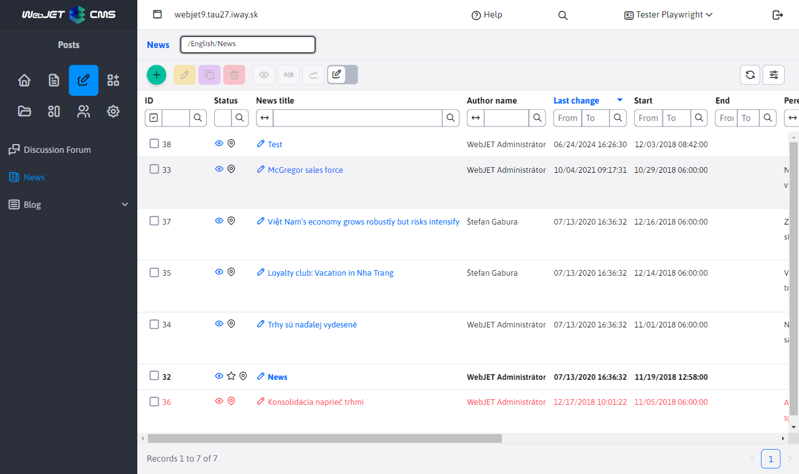

# List of websites/news

Application [News](../../redactor/apps/news/README.md), inserts a list of web pages in the specified folder into the page. It is used to insert a list of news, press releases, but also other similar listings (list of contact points, personal contacts, products and so on).

The table provides editing options similar to a list of web pages.



If the customer has specific requirements for displaying columns (e.g. for a product list) or information, you can implement a custom application that uses the code for the news list.

Below is the complete code for the news page. You can take advantage of the feature of editing standard columns using the `window.WJ.DataTable.mergeColumns`. The example modifies the column visibility attribute setting, but you can also rename the title as shown in the page title example.

If you don't need to change the folder ID value, you can of course remove the AJAX call `/admin/rest/news/news-list/convertIdsToNamePair`, which gets the list for the folder selection field in the header.

```html
<script data-th-inline="javascript">
    var webpageColumns = /*[(${layout.getDataTableColumns('sk.iway.iwcm.doc.DocDetails')})]*/ '';
</script>
<script type="text/javascript">
    var newsDataTable;
    var idsConstantName = "newsAdminGroupIds";

    window.domReady.add(function () {

        function setGroupIdFilterSelect(data) {
            //Get object, select
            let filterSelect = document.getElementById('groupIdFilterSelect');
            //Remove all options except the default one
            while(filterSelect.options.length > 1) {
                filterSelect.remove(1);
            }
            //Add new options
            for (const s of data) {
                filterSelect.add(new Option(s.label, s.value));
            }

            //set selected value
            var hash = window.location.hash;
            if (hash != "") $(filterSelect).val(hash.substr(1));

            //Refresh object
            $("#groupIdFilterSelect").selectpicker('refresh');
        }

        let urlGroupIdFilter = "/admin/rest/news/news-list/convertIdsToNamePair?ids=constant:"+idsConstantName;
        let data = {};
        var includeParameter = WJ.urlGetParam("include");
        if (includeParameter != null) {
            data.include = includeParameter
        }

        $.ajax({
            url: urlGroupIdFilter,
            data: data,
            method: "post",
            success: function (data) {

                //console.log("mam data:", data);

                let url = "/admin/rest/news/news-list";

                //rename title column
                window.WJ.DataTable.mergeColumns(webpageColumns, { name: "title", title: WJ.translate("apps.news.newsTitle.js") });
                //add column visibility
                window.WJ.DataTable.mergeColumns(webpageColumns, { name: "publishStartDate", visible: true });
                window.WJ.DataTable.mergeColumns(webpageColumns, { name: "publishEndDate", visible: true });
                window.WJ.DataTable.mergeColumns(webpageColumns, { name: "htmlData", visible: true });
                window.WJ.DataTable.mergeColumns(webpageColumns, { name: "perexImage", visible: true });

                window.importWebPagesDatatable().then(module => {

                    var order = [];
                    order.push([4, 'desc']);

                    url = WJ.urlAddParam(url, "groupIdList", data[0].value);

                    let wpdInstance = new module.WebPagesDatatable({
                        url: url,
                        columns: webpageColumns,
                        id: "newsDataTable",
                        order: order,
                        newPageTitleKey: "apps.news.newsTitle.js",
                    });
                    newsDataTable = wpdInstance.createDatatable();

                    $(".dt-buttons").prepend('<div class="btn btn-sm buttons-select" id="groupSelect_wrapper"><label>[[#{editor.div_properties.section}]]</label><select class="form-select" id="groupIdFilterSelect"></select></div>');
                    setGroupIdFilterSelect(data);

                    $("#groupIdFilterSelect").on("change", function() {
                        var value = this.value;
                        newsDataTable.setAjaxUrl(WJ.urlUpdateParam( newsDataTable.getAjaxUrl() , "groupIdList", this.value));
                        newsDataTable.ajax.reload();
                    });
                });
            }

        });

    });
</script>

<table id="newsDataTable" class="datatableInit table"></table>
```

If the user does not have direct access to the web pages, you need to add your application right to the conf. variable `webpagesFunctionsPerms`, which lists the rights to work with the website. This includes functions for inserting an image and the like.

## Backend

If you need a specific REST service for providing a list of web pages/news you can use the ready class [WebpagesDatatable](../../../../src/main/java/sk/iway/iwcm/editor/rest/WebpagesDatatable.java) which you can extend and override the methods to suit your needs.

```java
@Datatable
@RestController
@RequestMapping("/admin/rest/abtesting/list")
@PreAuthorize("@WebjetSecurityService.hasPermission('cmp_abtesting')")
public class AbTestingRestController extends WebpagesDatatable {

    @Autowired
    public AbTestingRestController(DocDetailsRepository docDetailsRepository, EditorFacade editorFacade, DocAtrDefRepository docAtrDefRepository) {
        super(docDetailsRepository, editorFacade, docAtrDefRepository);
    }

    @Override
    public Page<DocDetails> getAllItems(Pageable pageable) {
        GetAllItemsDocOptions options = getDefaultOptions(pageable, true);
        return AbTestingService.getAllItems(options);
    }

    @Override
    public void beforeSave(DocDetails entity) {
        //In abtesting version user cant edit/insert/duplicate page's
        throwError(getProp().getText("admin.editPage.error"));
    }

    @Override
    public boolean deleteItem(DocDetails entity, long id) {
        //In abtesting version user cant delete page's
        throwError(getProp().getText("admin.editPage.error"));

        return false;
    }
}
```
