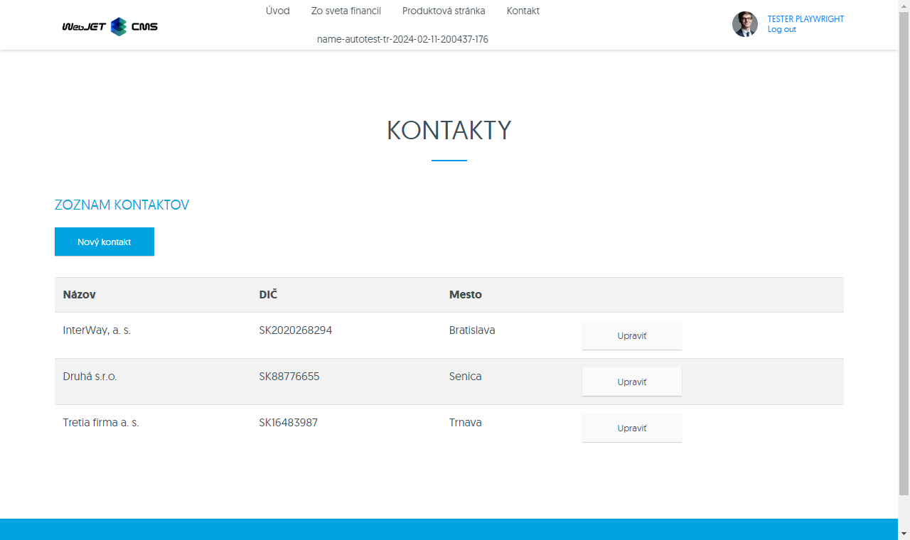
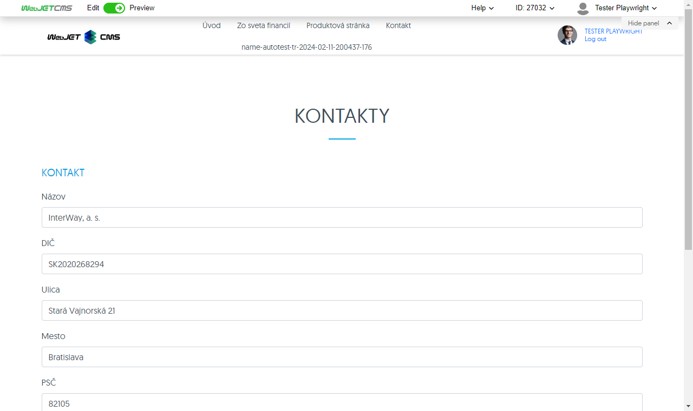
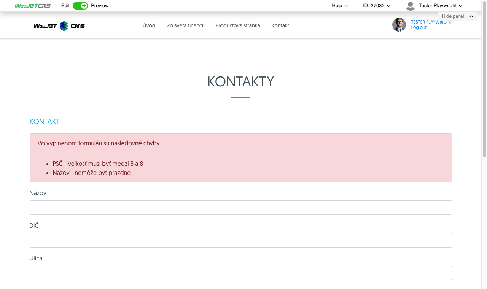

# Spring MVC application

Sample application in a public website using Spring MVC and Thymeleaf templates.



## Backend

The created class must extend the class `WebjetComponentAbstract` and at the same time include an annotation `@WebjetComponent`. This will ensure the Spring setup `@Component` annotation and execution of the application via `!INCLUDE()!` command in the web page.

Individual methods `view, edit, add, saveForm` are called based on a URL parameter match, e.g. the method `edit` is called by adding the URL parameter `?edit=true`. Using annotation `@DefaultHandler` the method to be executed if no other URL parameter match is found. The name of the method can be arbitrary, it does not have to be from the given list, the existence of a URL parameter with the same name is sufficient.

Example:

```java
package sk.iway.basecms.contact;

import javax.servlet.http.HttpServletRequest;
import javax.validation.Valid;

import com.fasterxml.jackson.annotation.JsonIgnore;

import org.springframework.beans.factory.annotation.Autowired;
import org.springframework.ui.Model;
import org.springframework.validation.BindingResult;
import org.springframework.web.bind.annotation.ModelAttribute;
import org.springframework.web.bind.annotation.RequestParam;

import lombok.Getter;
import lombok.Setter;
import sk.iway.iwcm.PathFilter;
import sk.iway.iwcm.components.WebjetComponentAbstract;
import sk.iway.iwcm.system.annotations.DefaultHandler;
import sk.iway.iwcm.system.annotations.WebjetAppStore;
import sk.iway.iwcm.system.annotations.WebjetComponent;
import sk.iway.iwcm.system.datatable.DataTableColumnType;
import sk.iway.iwcm.system.datatable.annotations.DataTableColumn;
import sk.iway.iwcm.system.datatable.annotations.DataTableColumnEditor;
import sk.iway.iwcm.system.datatable.annotations.DataTableColumnEditorAttr;

/**
 * <p>Príkladová trieda pre komponentu - http://docs.webjetcms.sk/v2022/#/custom-apps/spring-mvc/</p>
 * <p>Trieda musí byt anotovaná @WebjetComponent, pre názov v anotácii sa musí použiť celý názov triedy aj s package</p>
 * <p>Príklad include:</p>
 * <code>!INCLUDE(sk.iway.basecms.contact.ContactApp, country="sk")!</code>
 *
 * Anotacia @WebjetAppStore zabezpeci zobrazenie aplikacie v zozname aplikacii v editore (v AppStore)
 *

 * V pripade, ze nejaka metoda ma byt dostupna len pre prihlaseneho pouzivatela, admina, prip. nejaku pouzivatelsku skupinu mozeme pouzit anotacie:
 * @PreAuthorize("@WebjetSecurityService.isLogged()") - prihalseny pouzivatel
 * @PreAuthorize("@WebjetSecurityService.isAdmin()") - admin
 * @PreAuthorize("@WebjetSecurityService.isInUserGroup('nazov-skupiny')") - patri do skupiny
 * @see sk.iway.iwcm.system.spring.services.WebjetSecurityService
 */
@WebjetComponent("sk.iway.basecms.contact.ContactApp")
@Getter
@Setter
public class ContactApp extends WebjetComponentAbstract {

    //Spring DATA repozitar
    @JsonIgnore
    private ContactRepository contactRepository;

    /**
     * Privatne vlastnosti s get/set-rami slúžia na prenesenie parametrov pageParams z !INCLUDE()! do triedy
     */
    private String country;

    @Autowired
    public ContactApp(ContactRepository contactRepository) {
        this.contactRepository = contactRepository;
    }

    /**
     * metoda init sa vola po vytvoreni objektu a nastaveni parametrov,
     * je volana pred kazdym view volanim a umozni nastavit pripadne atributy
     * @param request
     * @param response
     */
    @Override
    public void init(HttpServletRequest request, HttpServletResponse response) {
        Logger.debug(ContactApp.class, "Init call, request.getHeader(User-Agent)="+request.getHeader("User-Agent"));
    }

    /**
     * Metóda anotovaná @DefaultHandler sa vykoná, ak v requeste nie je žiaden parameter, ktorý by sa zhodoval s názvom inej metódy v triede
     * Metóda môže mať ľubovolný názov
     * @param model
     * @param request
     * @return String URL adresa súboru ktorý bude v contente renderovaný namiesto !INCLUDE()!
     */
    @DefaultHandler
	public String view(Model model, HttpServletRequest request)
	{
        model.addAttribute("contants", contactRepository.findAllByCountry(country, null));
		return "/apps/contact/mvc/list";
	}

    /**
     * Metóda edit slúži na zobrazenie formuláru pre úpravu existujúceho záznamu
     * @param id
     * @param model
     * @param request
     * @return
     */
    public String edit(@RequestParam("id") long id, Model model, HttpServletRequest request) {
        ContactEntity contact = contactRepository.getById(id);
        model.addAttribute("entity", contact);

        //pridaj do modelu moznosti pre select country
        model.addAttribute("countries", ContactRestController.getCountries());

        return "/apps/contact/mvc/edit";
    }

    /**
     * Metóda edit slúži na zobrazenie formuláru pre úpravu existujúceho záznamu
     * @param model
     * @param request
     * @return
     */
    public String add(Model model) {
        ContactEntity contact = new ContactEntity();
        //tu mozete nastavit nejake default hodnoty
        contact.setCountry("sk");

        model.addAttribute("entity", contact);
        return "/apps/contact/mvc/edit";
    }

    /**
     * Metóda saveForm slúži na validáciu a uloženie úpravy existujúceho záznamu
     * @param entity
     * @param result
     * @param model
     * @param request
     * @return
     */
    public String saveForm(@Valid @ModelAttribute("entity") ContactEntity entity, BindingResult result, Model model, HttpServletRequest request) {
        if (!result.hasErrors()) {
            contactRepository.save(entity);
            return "redirect:" + PathFilter.getOrigPath(request);
        }
        model.addAttribute("error", result);
        model.addAttribute("entity", entity);
        return "/apps/contact/mvc/edit";
    }

}
```

### Validation

Using annotation `@Valid` a `@ModelAttribute` validation of entity attributes can be performed. The result is stored in the object `BindingResult result`:

```java
public String saveForm(@Valid @ModelAttribute("entity") ContactEntity entity, BindingResult result, Model model, HttpServletRequest request) {
    if (!result.hasErrors()) {
        contactRepository.save(entity);
        return "redirect:" + PathFilter.getOrigPath(request);
    }
    model.addAttribute("error", result);
    model.addAttribute("entity", entity);
    return "/apps/contact/mvc/edit";
}
```

### Embedding an application in a web page

The application is embedded in the public web page in the same way as any other standard application using the tag `!INCLUDE()!`. The name entered must match the annotation `@WebjetComponent` in the classroom. The name must be unique, so it is necessary to set the name of the class with the full path, e.g. `@WebjetComponent("sk.iway.basecms.contact.ContactApp")`.

```html
!INCLUDE(sk.iway.basecms.contact.ContactApp, country="sk")!
```

### Using application parameters

Each application can in `!INCLUDE()!` tag to contain parameters, in our example this is the parameter `country`. It is automatically transferred to the attribute `country` in the classroom `ContactApp`.

```html
!INCLUDE(sk.iway.basecms.contact.ContactApp, country="sk")!
```

```java
/**
 * Privatne vlastnosti s get/set-rami slúžia na prenesenie parametrov pageParams z !INCLUDE()! do triedy
 */
private String country;
```

The following data types are supported:

```java
String, BigDecimal, Boolean, Integer, Double, Float, boolean, int, double, float
```

To view an application in the application list and set its parameters, see [To view in the App list](../appstore/README.md)

## Frontend

The following file types can be used for display:
- `JSP` - the file has an extension `.jsp`
- `Freemarker` - the file has an extension `.ftl`
- `Thymeleaf` - the file has an extension `.html`
For new applications, we strictly recommend using [Thymeleaf](../../developer/frameworks/thymeleaf.md). Note that in `ContactApp` methods return a path without a suffix (e.g. `return "/apps/contact/mvc/edit"`), WebJET automatically searches for the file according to the list above and uses the first one it finds. You can thus easily change the technology used on the frontend without changing the backend.

For `Thymeleaf` objects are automatically inserted into the model `request a session`that can be used as e.g. `${request.getAttribute('ninja').page.urlPath}`.

### View list of companies

List of companies in the file `src/main/webapp/apps/contact/mvc/list.html` uses [iteration of the list](https://www.thymeleaf.org/doc/tutorials/3.0/usingthymeleaf.html#using-theach) companies in a standard HTML table:


```html
<h3 data-th-text="#{components.contact.page.list}">Zoznam kontaktov</h3>

<p><a class="btn btn-primary" data-th-href="${'?add=true'}" data-th-text="#{components.contact.value.name}">Create</a></p>

<div class="table-responsive"></div>
    <table class="table table-striped table-hover">
        <tr>
            <th data-th-text="#{components.contact.property.name}">Firma</th>
            <th data-th-text="#{components.contact.property.vatid}">IČ DPH</th>
            <th data-th-text="#{components.contact.property.city}">Mesto</th>
            <th></th>
        </tr>
        <!--/* https://www.thymeleaf.org/doc/tutorials/3.0/usingthymeleaf.html#using-theach */-->
        <tr data-th-each="contact : ${contants}">
            <td data-th-text="${contact.name}">InterWay</td>
            <td data-th-text="${contact.vatid}">SK123456789</td>
            <td data-th-text="${contact.city}">Blava</td>
            <td>
                <a class="btn btn-secondary" data-th-href="${'?edit=true&id='+contact.id}" data-th-text="#{components.checkform.confirm_table.button.edit}">Edit</a>
            </td>
        </tr>
    </table>
</div>
```

### Company editing

File `src/main/webapp/apps/contact/mvc/edit.html` for editing a company is also used for adding a new company. It uses the standard options for [forms in Spring](https://spring.io/guides/gs/handling-form-submission/). In the upper part it shows [listing of error messages](https://www.baeldung.com/spring-thymeleaf-error-messages) in case of a validation error (e.g. company name not entered or postal code format not matching).



```html
<h3 data-th-text="#{components.contact.dialog_title}">Kontakt</h3>

<!--/* https://spring.io/guides/gs/handling-form-submission/ */-->
<form data-th-action="${request.getAttribute('ninja').page.urlPath}" data-th-object="${entity}" method="post">
	<div data-th-if="${error!=null}" class="alert alert-danger">
		<!--/* https://www.baeldung.com/spring-thymeleaf-error-messages */-->
		<p data-th-text="#{chat.form_fill_error}"></p>
		<ul style="margin: 0px;">
			<li data-th-each="err : ${error.allErrors}"><span data-th-text="#{components.contact.property.__${err.field}__}">zložený prekladový kľúč zo statického prefixu a dynamického mena poľa</span> - <span data-th-text="${err.defaultMessage}">chybová správa</span></li>
		</ul>
	</div>

	<div class="mb-3">
		<label class="form-label" data-th-text="#{components.contact.property.name}">Firma</label>
		<input type="text" class="form-control" data-th-field="*{name}" />
	</div>
	<div class="mb-3">
		<label class="form-label" data-th-text="#{components.contact.property.vatid}">IČ DPH</label>
		<input type="text" class="form-control" data-th-field="*{vatid}" />
	</div>
	<div class="mb-3">
		<label class="form-label" data-th-text="#{components.contact.property.street}"></label>
		<input type="text" class="form-control" data-th-field="*{street}" />
	</div>
	<div class="mb-3">
		<label class="form-label" data-th-text="#{components.contact.property.city}"></label>
		<input type="text" class="form-control" data-th-field="*{city}" />
	</div>
	<div class="mb-3">
		<label class="form-label" data-th-text="#{components.contact.property.zip}"></label>
		<input type="text" class="form-control" data-th-field="*{zip}" />
	</div>
	<div class="mb-3">
		<label class="form-label" data-th-text="#{components.contact.property.country}"></label>
		<!--/* https://www.baeldung.com/thymeleaf-select-option */-->
		<select class="form-control" data-th-field="*{country}">
			<option data-th-each="country : ${countries}" data-th-value="${country.value}" data-th-text="${country.label}"></option>
		</select>
	</div>
	<div class="mb-3">
		<label class="form-label" data-th-text="#{components.contact.property.contact}"></label>
		<input type="text" class="form-control" data-th-field="*{contact}" />
	</div>
	<div class="mb-3">
		<label class="form-label" data-th-text="#{components.contact.property.phone}"></label>
		<input type="text" class="form-control" data-th-field="*{phone}" />
	</div>
	<button type="submit" class="btn btn-primary" data-th-text="#{button.submit}" name="saveForm">Submit</button>
	<input type="hidden" name="id" data-th-field="*{id}" />
</form>
```

### Display validation errors

Validation errors are conditionally displayed in the block `<div data-th-if="${error!=null}" class="alert alert-danger">`. In the example they are displayed in a simple list, but it is also possible to use the error display for [individual fields](https://www.baeldung.com/spring-thymeleaf-error-messages).



### Automatic file search

If the class extends the class `WebjetComponentAbstract`, the embedded application entry can contain the parameter `viewFolder`, which allows us to specify the subdirectory where to search for files to display.

If the method returns `/components/contact/edit` and the parameter is specified `viewFolder`, WebJET automatically inserts the link `installName` and the value in `viewFolder`:

```java
/components/{installName}/contact/{viewFolder}/edit.html

//ak neexistue tak skúsi bez installName:
/components/contact/{viewFolder}/edit.html

//Ak nie je vyplneny viewFolder, automaticky vloží len installName:
/components/{installName}/contact/edit.html

//ak neexistue tak skúsi bez installName:*
/components/contact/{viewFolder}/edit.html
```

Example:

```java
!INCLUDE(sk.iway.basecms.contact.ContactApp, viewFolder="subfolder", country="sk")!
```

- in this case the \`\`en.iway.basecms.contact.ContactApp\`\` class is used,
- method with annotation is called `@DefaultHandler`which will return `return "/apps/contact/mvc/list";`,
- WebJET searches `/components/{installName}/contact/subfolder/list.html`, or `/components/contact/subfolder/list.html`
- embeds the resulting HTML code into the page.
