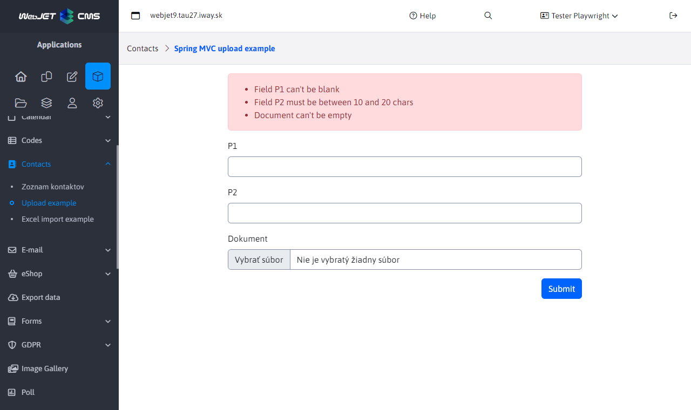

# Spring MVC - admin with file upload

Sample Spring MVC application in administration with file upload to backend.



## Backend

In the administration, the page view is realized by [AdminThymeleafController](../../developer/frameworks/README.md). The form/data for the MVC application are inserted into the model by listening [events for displaying the page in the administration](../../developer/frameworks/thymeleaf.md#inserting-custom-objects-into-the-model).

Processing the uploaded file is more complicated, if you need to use the file we recommend to extend the class [AbstractUploadListener](../../../javadoc/sk/iway/iwcm/admin/AbstractUploadListener.html) which simplifies the processing of the uploaded file.

Class `AbstractUploadListener` ensure processing `multipart requestu` in the constructor by calling `super.processForm(event);` and setting the attributes of the specified bean (form). Calling `getForm()` gets the form object and the call `getBindingResult()` get any error messages - verification of mandatory fields, etc.

```java
package sk.iway.basecms.contact.upload;

import javax.validation.Validator;

import org.slf4j.Logger;
import org.slf4j.LoggerFactory;
import org.springframework.context.event.EventListener;
import org.springframework.stereotype.Component;
import org.springframework.ui.ModelMap;
import org.springframework.validation.BindingResult;

import sk.iway.iwcm.admin.AbstractUploadListener;
import sk.iway.iwcm.admin.ThymeleafEvent;
import sk.iway.iwcm.system.spring.events.WebjetEvent;

@Component
public class UploadExampleListener extends AbstractUploadListener<Form> {

    private static final Logger LOGGER = LoggerFactory.getLogger(UploadExampleListener.class);

    protected UploadExampleListener(Validator validator) {
        super(validator);
    }

    @Override
    @EventListener(condition = "#event.clazz eq 'sk.iway.iwcm.admin.ThymeleafEvent' && event.source.page=='contact' && event.source.subpage=='upload'")
    public void processForm(final WebjetEvent<ThymeleafEvent> event) {
        // sprocesovanie dat formularu do objektu a validacia tohto objektu
        super.processForm(event);
        ModelMap model = event.getSource().getModel();
        // ziskanie objektu a vlozenie do modelu
        Form form = getForm();
        model.addAttribute("form", form);

        LOGGER.debug("Is post: {}", isPost());
        if (!isPost()) {
            // ak nie je request typu post, tak dalej nic nerobime
            return;
        }

        // ziskanie validacnych errorov
        BindingResult errors = getBindingResult();
        if (errors.hasErrors()) {
            LOGGER.debug("We have errors: {}", errors.getErrorCount());
            return;
        }

        //
        //...spravte s formularom co potrebujete
        //
        model.addAttribute("importedFileName", form.getDocument().getOriginalFilename());
    }
}
```

Class `Form` is just a simple bean, the recorded file is of type `MultipartFile`. For example, it contains the fields `p1` a `p2` with a demonstration of the validation of the mandatory field and **validation samples of 10 to 20 characters in length**.

For validation, standard annotations are supported for field validations using [javax.validation.Validator](https://www.baeldung.com/javax-validation).

```java
package sk.iway.basecms.contact.upload;

import lombok.Getter;
import lombok.Setter;
import org.springframework.stereotype.Component;
import org.springframework.web.multipart.MultipartFile;

import javax.validation.constraints.NotBlank;
import javax.validation.constraints.NotNull;
import javax.validation.constraints.Size;

@Component
@Getter
@Setter
public class Form {
    @NotNull(message = "form.document.not_null")
    private MultipartFile document;

    @NotBlank(message = "form.p1.not_blank")
    private String p1;

    @Size(min = 10, max = 20, message = "form.p2.size")
    private String p2;
}
```

The following translation keys are used:

```
form.p1.not_blank=Pole P1 nemôže byť prázdne
form.p2.size=Pole P2 musí byť medzi {min} a {max} znakmi
form.document.not_null=Dokument nemôže byť prázdny
```

## Frontend

The HTML code of the page contains standard `Spring MVC` Form.

The sample includes a display of the name of the uploaded file, which is obtained from the attribute `importedFileName`, which is set on the backend after the file has been successfully uploaded.

Error messages are retrieved from the object `fields.errors` and if any are displayed in the form.

```html
<script type="text/javascript">
window.domReady.add(function () {
    WJ.breadcrumb({
        id: "upload",
        tabs: [
            {
                url: '/apps/contact/admin/upload/',
                title: 'Spring MVC upload example',
                active: true
            }
        ]
    });
});
</script>
<section class="my-3">
    <div class="container">
        <div class="row">
            <div class="col-md-8 mx-auto">

                <p data-th-if="${importedFileName ne null}" class="alert alert-success">
                    File successfully uploaded, fileName: <span data-th-text="${importedFileName}"></span>
                </p>

                <form method="post" data-th-action="@{/apps/contact/admin/upload/}" data-th-object="${form}" enctype="multipart/form-data">
                    <div data-th-if="${#fields.hasErrors('*')}" class="alert alert-danger">
                        <ul style="margin-bottom: 0;">
                            <li data-th-each="error : ${#fields.errors('*')}" data-th-text="${error}">error</li>
                        </ul>
                    </div>

                    <div class="form-group mb-3">
                        <label for="p1" class="form-label">P1</label>
                        <input type="text" data-th-field="*{p1}" id="p1" class="form-control">
                    </div>
                    <div class="form-group mb-3">
                        <label for="p2" class="form-label">P2</label>
                        <input type="text" data-th-field="*{p2}" id="p2" class="form-control">
                    </div>
                    <div class="form-group mb-3">
                        <label for="document" class="form-label">Dokument</label>
                        <input type="file" data-th-field="*{document}" id="document" class="form-control">
                    </div>
                    <div class="form-group mb-3 text-end">
                        <button type="submit" class="btn btn-primary">[[#{button.submit}]]</button>
                    </div>
                </form>
            </div>
        </div>
    </div>
</section>
```

## Notes on implementation

The configuration for uploading the file is set in `V9SpringConfig.multipartResolver()` and served through `ThymeleafAdminController.appHandlerPost()`, which handles `consumes = { MediaType.MULTIPART_FORM_DATA_VALUE }`.
