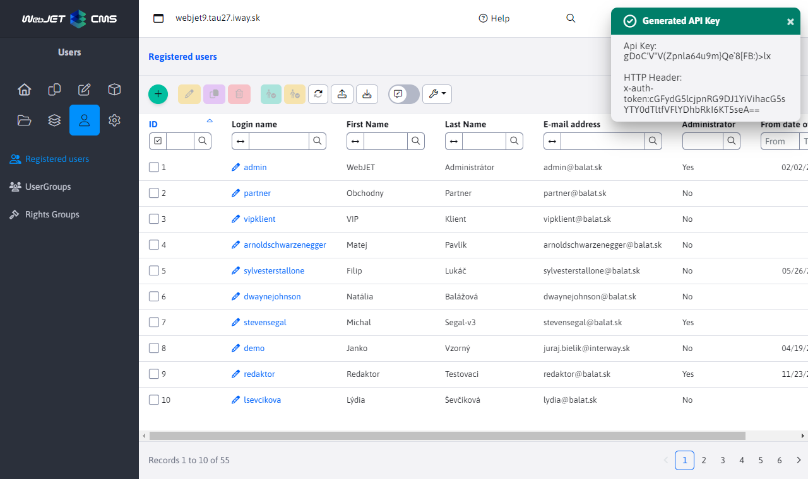
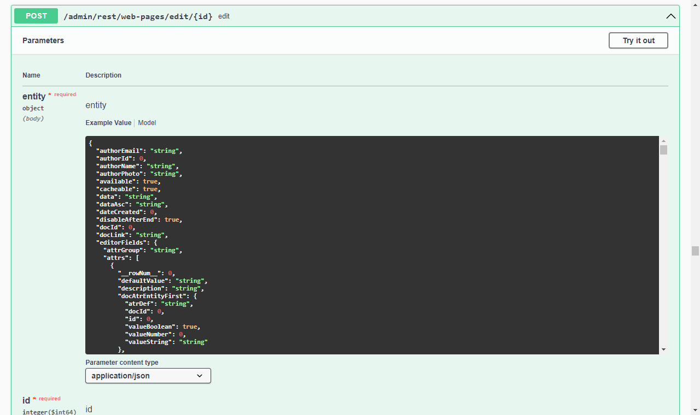

# API authorization

If you need to access REST services/API WebJET CMS from an external system you can use the API key authorization option. This is sent in the HTTP header `x-auth-token` when calling the REST service. There is no need to send a CSRF token for such authorization.

## Setting the key

The API key is associated with a real user account. In the user edit in the Personal Details tab, enter the key in the API key field. We recommend that you enter the character `*` to generate a random API key. Once generated, the key is displayed in the notification, as well as the value that is entered in the HTTP header.



## Sending the key

The specified API key is sent in the HTTP header `x-auth-token` (the header name can be changed in the conf. variable `logonTokenHeaderName`) in the format `base64(login:token)`. The exact value will be displayed when the random token is generated.

Examples:

```shell
#zoznam web stranok v priecinku 25
curl -X GET \
  'http://iwcm.interway.sk/admin/rest/web-pages/all?groupId=25' \
  --header 'x-auth-token: dGVzdGVyOkJiO3VLQFA2WlNGYnI4IS9jSmI0QGcyM2A0PkN1RjJw'

#web stranka 4
curl -X GET \
  'http://iwcm.interway.sk/admin/rest/web-pages/4' \
  --header 'x-auth-token: dGVzdGVyOkJiO3VLQFA2WlNGYnI4IS9jSmI0QGcyM2A0PkN1RjJw'
```

## List of all REST services

You can get a list of all REST services when you start WebJET locally at the URL `/admin/swagger-ui/index.html` (requires conf. variable setting `swaggerEnabled` at `true`).



## Technical information

Authorisation is provided by `SpringSecurity` filter implemented in the class `sk.iway.iwcm.system.spring.ApiTokenAuthFilter`. The filter is initialized in `sk.iway.webjet.v9.V9SpringConfig.configureSecurity`. Technically, a standard login of the specified user takes place, then after the HTTP request is executed, the `session` disabled.
