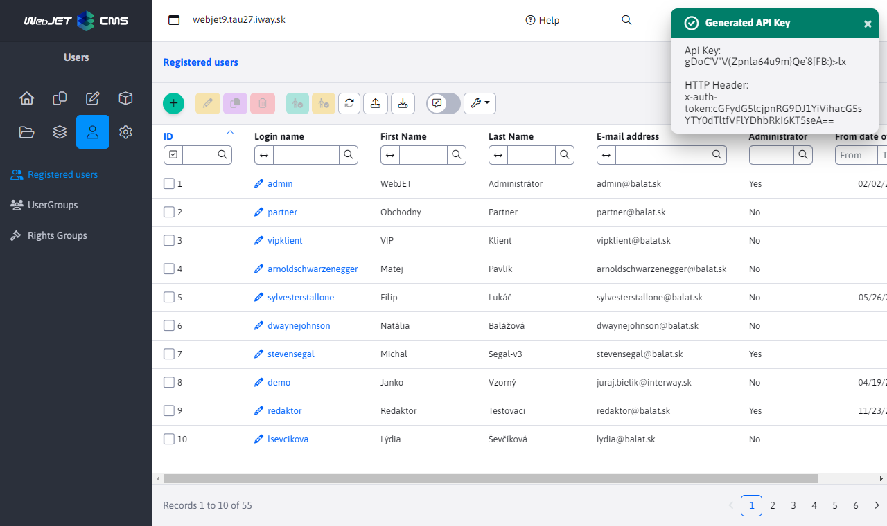
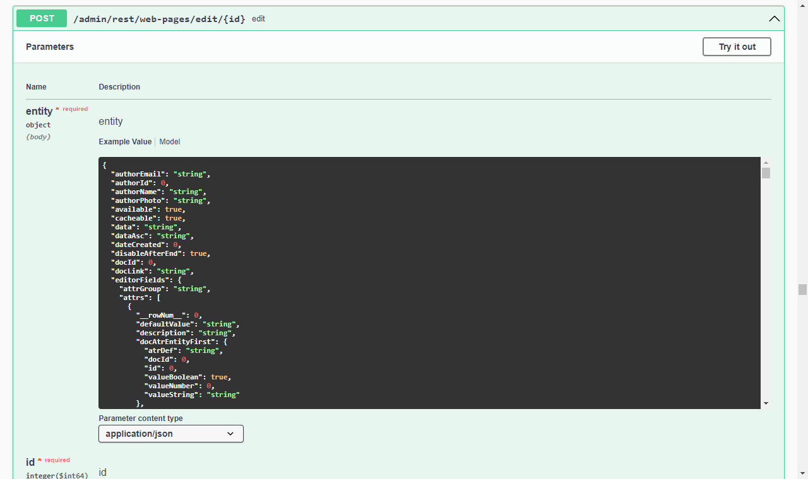

# API authorization

If you need to access REST services/`API WebJET CMS` from an external system, you can use the API key authorization option. It is sent in the HTTP header ```x-auth-token``` when calling the REST service. With such authorization, it is not necessary to send a CSRF token.

API [authorization can be disabled](../../sysadmin/pentests/README.md#configuration) in the configuration variable `springSecurityAllowedAuths` from which you remove the value `api-token`.

## Key setting

The API key is assigned to a real user account. In the user editing section, in the Personal data tab, enter the key in the API key field. We recommend entering the character ```*``` to generate a random API key. After generation, the key and the value that is entered in the HTTP header will be displayed in the notification.



## Sending the key

The specified API key is sent in the HTTP header ```x-auth-token``` (the header name can be changed in the conf. variable ```logonTokenHeaderName```) in the format ```base64(login:token)```. The exact value will be displayed in the notification when the random token is generated.

Examples:

```shell
#zoznam web stranok v priecinku 25
curl -X GET \
  'http://iwcm.interway.sk/admin/rest/web-pages/all?groupId=25' \
  --header 'x-auth-token: dGVzdGVyOkJiO3VLQFA2WlNGYnI4IS9jSmI0QGcyM2A0PkN1RjJw'

#web stranka 4
curl -X GET \
  'http://iwcm.interway.sk/admin/rest/web-pages/4' \
  --header 'x-auth-token: dGVzdGVyOkJiO3VLQFA2WlNGYnI4IS9jSmI0QGcyM2A0PkN1RjJw'
```

## List of all REST services

You can get a list of all REST services by running WebJET locally at URL address ```/admin/swagger-ui/index.html``` (requires setting config variable ```swaggerEnabled``` to ```true```).



## Technical information

Authorization is provided using the ```SpringSecurity``` filter implemented in the ```sk.iway.iwcm.system.spring.ApiTokenAuthFilter``` class. The filter is initialized in ```sk.iway.webjet.v9.V9SpringConfig.configureSecurity```. Technically, the standard login of the specified user takes place, then after the HTTP request is made, ```session``` is invalidated.
