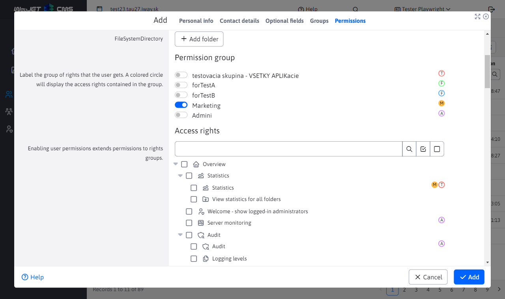

# List of users

## Backend

Backend is implemented in package `sk.iway.iwcm.components.users`, REST controller is in the class `UserDetailsController`.

### Classes for generating a list of rights

The Rights tab contains a tree structure in jstree showing the individual rights. The list of all rights is generated in `MenuService.getAllPermissions()`. The use of the MenuService class is not a happy one, but since it shares several methods for modifying rights from WebJET version 8 to version 2021, we found it easier to use it for the list of rights as well.

The first level is represented by the same sections as in the menu, the second by the individual modules and the third by the rights within the modules (values `leftSubmenuXItemKey` v `modinfo.properties`).

Specific is the generation of CSS classes `permgroup` a `permgroup-ID ` by rights group, which displays coloured circles next to each right contained in the rights group.

If the 3rd level in the tree structure is to be displayed (the module contains sub rights), the item at the 2nd level is modified - a suffix is added to its ID `-leaf` to make the item unique and at the same time it is added with the same name to the 3rd level of the menu.

The data for the tree structure of rights is inserted into the model in `UserDetailsListener` Like `model.addAttribute("jstreePerms", JsonTools.objectToJSON(MenuService.getAllPermissions()));`.

The rights that a user has assigned are transferred in `String[] UserDetailsEditorFields.enabledItems`. Here is a list of allowed user rights. Technically, however, WebJET only stores unauthorized (forbidden) rights in the database for historical reasons. In the methods `fromUserDetailsEntity` a `toUserDetailsEntity` the list of rights is inverted.

## Frontend

The user list view is in the file [user-list.pug](../../../../src/main/webapp/admin/v9/views/pages/users/user-list.pug). Includes specific JS functions to display colored circles paired with rights groups. The circles are used to display the group of rights that contains the individual right.

Events and rights group circles are initialized when the window is first opened via the `usersDatatable.EDITOR.on('opened', function (e, type, action)`. Using the variable `permGroupsColorBinded` initialization is ensured only on the first opening.

In the variable `niceColors` is a list of circle colors (to display the same colors according to the order of the rights groups), the colors from the Finder in macOS were used. If there are more rights groups than the size of the array, additional colors are generated randomly by calling the function `randomColor`.

First, the list of rights groups is scrolled through by calling `$(".DTE_Field_Name_editorFields\\.permGroups input").each(function(index)`. The group ID is obtained from the input field and the assigned `label` element of her name. The first letter of the group name is displayed in circles for better clarity. At the same time, a CSS stylesheet definition is generated according to the ID of the rights group, which is then inserted into the `head` element.

After getting the list of rights groups, circles are added to each LI element of jsTree according to CSS styles by calling `$("#DTE_Field_editorFields-enabledItems li.permgroup").each(function(index)`. CSS styles are added for each element of the tree structure on the backend in `MenuService.getAllPermissions()` where each LI element contains CSS classes `permgroup permgroup-ID`. Transitioning by CSS class `permgroup` HTML code is generated inside the LI element with colored circles of rights groups.

Clicking on the rights group selection box is handled in `$(".DTE_Field_Name_editorFields\\.permGroups").on("click", "input", function() {` and causes the CSS class to be added `permgroup-ID-checked` at `body` element. This in turn causes the circle representing the rights group to be fully coloured.
