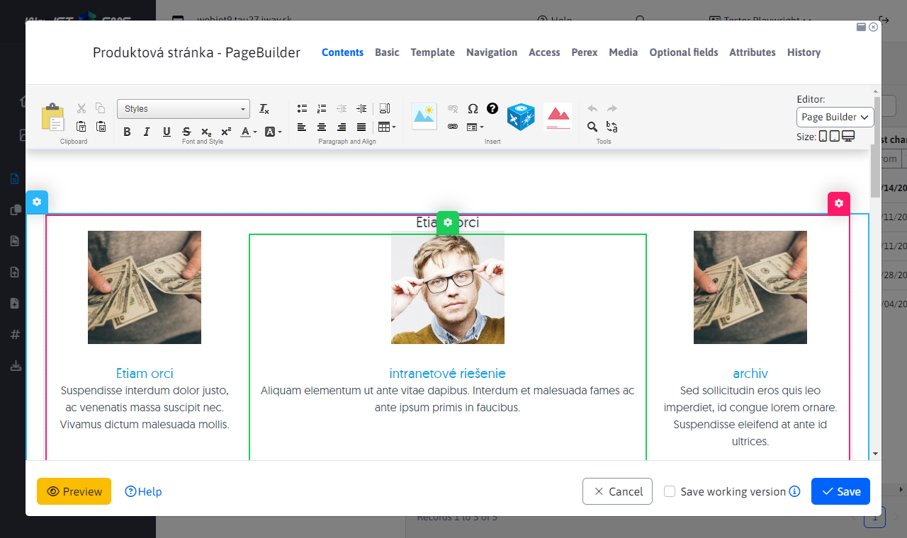

# Page Builder

Page Builder is a special page editing mode. In this mode the whole page is not edited but only selected parts of it.

See manual for [web designer](../../../frontend/page-builder/README.md), or for [of the editor](../../../redactor/webpages/pagebuilder.md).

## Implementation details

The mode is activated by setting the attribute `editingMode=pagebuilder` on the object [DocEditorFields](../../../../javadoc/sk/iway/iwcm/doc/DocEditorFields.html). In the attribute `editingModeLink` is the link that is loaded into the iframe. They are set by the method `setEditingMode`.

This link contains the URL parameter `inlineEditorAdmin=true`, according to it you can find places in the code implementing the Page Builder function. When this parameter is set, the page redirection is not performed (if the page has the attribute `externalLink`).

Technically, the Contents tab in the editor is composed of two `div` elements, one containing the standard CK Editor and one iframe for Page Builder. The code is created in `field-type-wysiwyg.js`. In addition, a selection box is displayed which provides the function of switching between editors (provided by the `switchEditingMode`).

## New page

Page Builder opens in an iframe as a displayed web page, which makes it difficult to display for a new web page. In this case, the main directory page is opened, setting empty data of course. After saving, a new web page is already correctly created and can be edited. Setting the URL for the main page is done in [DocEditorFields.setEditingMode](../../../../javadoc/sk/iway/iwcm/doc/DocEditorFields.html).

## Load speed optimization

When initializing Page Builder, the CK Editor is switched to HTML code mode to avoid unnecessarily reading images, CSS styles, etc. for an editor that is not displayed. Conversely, in standard mode, the iframe for Page Builder is set to the URL `about: blank`.

The objects inserted into the page are in `ShowDoc.fixDataForInlineEditingAdmin` set to empty values to avoid unnecessary loading of the header, footer, menu, etc. By default, Page Builder retrieves the HTML code using an AJAX call `/admin/inline/get_page.jsp`to save one call is the value for `doc_data` attribute transferred in `inline_page_toolbar.jsp` via JSON object `window.inlineEditorDocData`which, if it exists, is used instead of AJAX to retrieve data.
