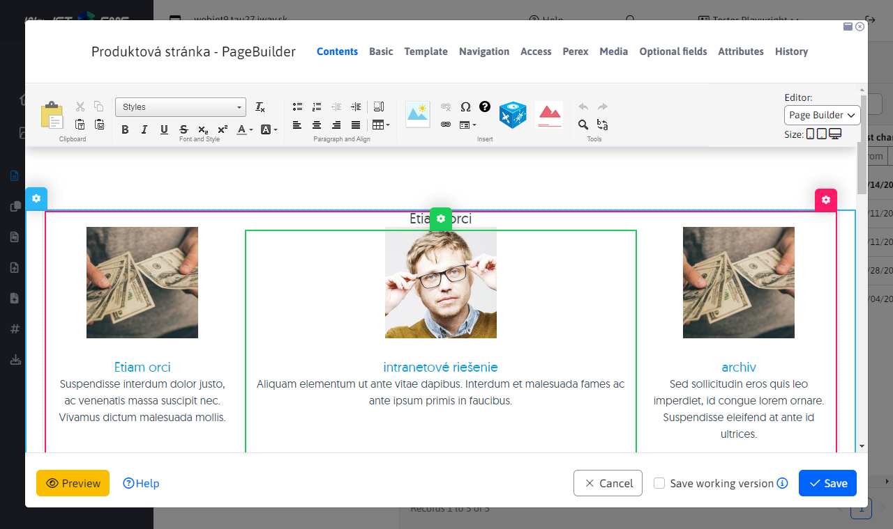

# Page Builder

Page Builder is a special page editing mode. In this mode, the entire page is not edited, but only selected parts of it.

See the manual for [web designer](../../../frontend/page-builder/README.md), or for [editor](../../../redactor/webpages/pagebuilder.md).



## Implementation details

The mode is activated by setting the ```editingMode=pagebuilder``` attribute on the [DocEditorFields](../../../../javadoc/sk/iway/iwcm/doc/DocEditorFields.html) object. The ```editingModeLink``` attribute contains a link that is loaded into the iframe. They are set by the ```setEditingMode``` method.

This link contains the URL parameter ```inlineEditorAdmin=true```, according to which you can find places in the code that implement the Page Builder function. When this parameter is specified, the page redirection will not be performed (if the page has the ```externalLink``` attribute set).

Technically, the Content tab in the editor is composed of two ```div``` elements, one containing the standard CK Editor and one iframe for the Page Builder. The code is created in ```field-type-wysiwyg.js```. In addition, a selection box is displayed that provides the functionality of switching between editors (provided by the ```switchEditingMode``` function).

## New page

Page Builder opens in an iframe as a displayed web page, which complicates the display for a new web page. In this case, the main page of the directory opens, while of course empty data is set. After saving, a new web page is created correctly, which can be edited. Setting the URL address for the main page is done in [DocEditorFields.setEditingMode](../../../../javadoc/sk/iway/iwcm/doc/DocEditorFields.html).

## Loading speed optimization

When initializing Page Builder, CK Editor is switched to HTML code mode to avoid unnecessary reading of images, CSS styles, etc. for an editor that is not displayed. Conversely, in standard mode, the iframe for Page Builder is set to the URL ```about: blank```.

Objects inserted into the page are set to empty values ​​in ```ShowDoc.fixDataForInlineEditingAdmin``` so that the header, footer, menu, etc. are not loaded unnecessarily. By default, Page Builder obtains the HTML code using an AJAX call ```/admin/inline/get_page.jsp```, to save one call, the value for the ```doc_data``` attribute is transferred in ```inline_page_toolbar.jsp``` via a JSON object ```window.inlineEditorDocData```, which, if it exists, is used instead of AJAX data retrieval.