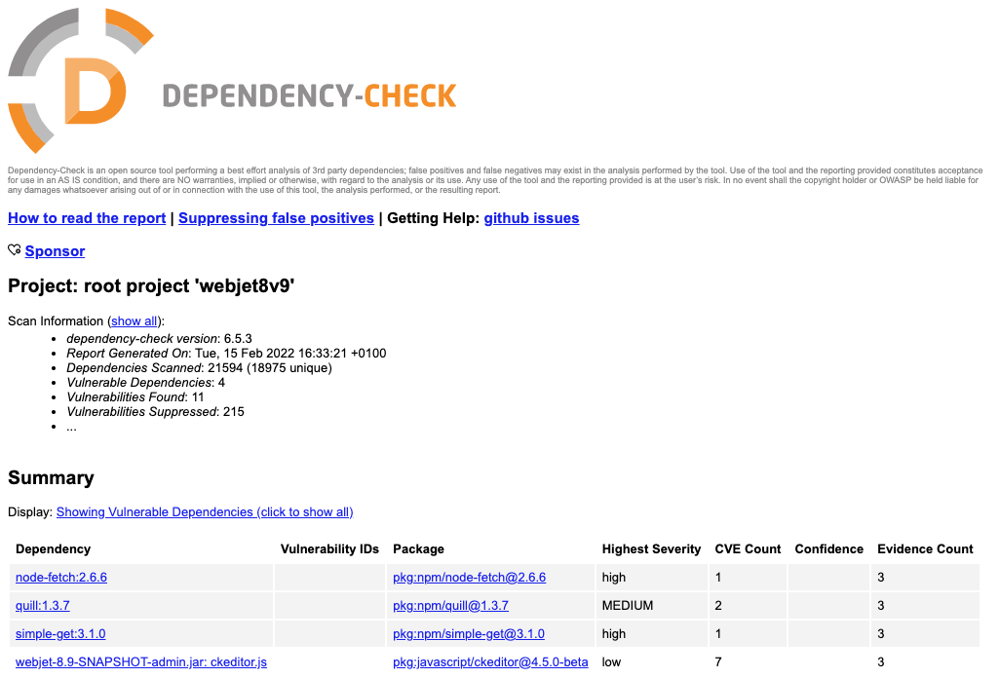

# Safety

## Checking for vulnerabilities in libraries

The project has an integrated tool [OWASP Dependency-Check](https://jeremylong.github.io/DependencyCheck/index.html), which can check for vulnerabilities in both Java and JavaScript libraries. You can run the vulnerability check with the command:

```sh
gradlew --info dependencyCheckAnalyze
```

which creates a report in HTML format to the file ```build/reports/dependency-check-report.html```. You can simply open this report in a web browser. We recommend performing the check before each ```release``` new version.



The analysis may contain false positives. There are the following files where exceptions are set:

- ```/dependency-check-suppressions.xml``` - ​​the file contains exceptions for the standard WebJET CMS, never modify the file.
- ```dependency-check-suppressions-project.xml``` - ​​you can add exceptions for your project to the file. There is a button ```suppress``` directly in the report, which when clicked will display the XML code of the exception. Simply copy it into the file inside the ```suppressions``` tag.

The check can also be performed directly on the generated ```war``` archive using [cli version](../../sysadmin/dependency-check/README.md).

## Dangerous HTML code

If you have a field on your frontend that allows HTML formatting, potentially dangerous code can be inserted into it. In a datatable, for example, it is a field of type ```DataTableColumnType.QUILL```. By default, when retrieving a JPA object from the database, HTML tags like ```<, >``` are converted to HTML entities of type ```&lt;, &gt;```. This is ensured by the ```XssAttributeConverter``` class which has the ```@Converter(autoApply = true)``` attribute set.

If you need to work with HTML code, you need to annotate the attribute:

- ```@jakarta.persistence.Convert(converter = AllowHtmlAttributeConverter.class)``` - ​​allows all HTML code, we recommend using it minimally, or only in cases where the HTML code is actually supposed to contain, for example, JavaScript or other potentially dangerous code.
- ```@jakarta.persistence.Convert(converter = AllowSafeHtmlAttributeConverter.class)``` - ​​allows only basic HTML formatting according to [OWASP](https://owasp.org/www-project-java-html-sanitizer/) recommendations. We recommend using this converter for all inputs where a simple WYSIWYG editor of the ```DataTableColumnType.QUILL``` type is used.