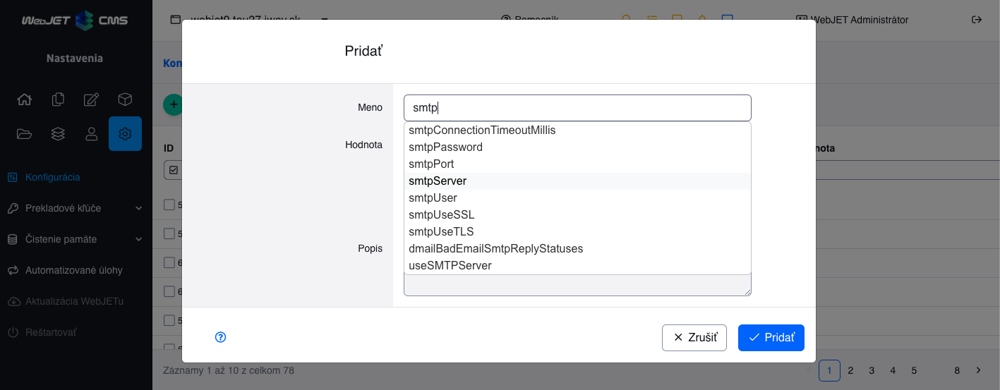

# Autocomplete

In the editor, it is easy to add a **"whisperer" to text fields** for a more user-friendly way to retrieve the typed value:



## Configuration

The autocomplete field is activated by setting the editor attributes using the ```@DataTableColumnEditorAttr``` annotation:

```java
@DataTableColumn(
    inputType = DataTableColumnType.TEXT,
    editor = {
        @DataTableColumnEditor(attr = {
            @DataTableColumnEditorAttr(key = "data-ac-url", value = "/admin/v9/settings/configuration/autocomplete")
        })
    }
)
```

The following attributes are supported, only ```data-ac-url``` is required:

- ```data-ac-url``` - ​​URL address of the REST service that returns an array/list of ```String``` values.
- ```data-ac-click``` - ​​name of the function that is called when an option in autocomplete is clicked (for setting additional fields). Setting it to the value ```fireEnter``` will trigger the keypress event ```Enter``` after the value is selected.
- ```data-ac-name``` - ​​name of the URL parameter in which the typed value is sent to the REST service (term by default).
- ```data-ac-min-length``` - ​​minimum number of characters for a REST service call (default 1).
- ```data-ac-max-rows``` - ​​maximum number of displayed lines (default 30).
- `data-ac-params` - ​​list of field selectors whose values ​​will be added to the URL of the REST service call, e.g. `#DTE_Field_templateInstallName,#DTE_Field_templatesGroupId`.
- ```data-ac-select``` - ​​when set to ```true```, autocomplete behaves similarly to a selection field - after clicking the mouse into the input field, all options are loaded and displayed.
- ```data-ac-collision``` - ​​location of loaded options relative to the input field. By default ```flipfit``` for automatic placement, for option ```select``` it is preset to ```none``` for strict placement below the input field.
- ```data-ac-render-item-fn``` - ​​name of the function that specifically generates a data list element

An example of a REST service returning data is in [ConfigurationController.getAutocomplete](../../../../src/main/java/sk/iway/iwcm/components/configuration/ConfigurationController.java), the implementation is simple - based on the specified ```term``` parameter, it returns a list of ```List<String>``` matching records:

```java
@GetMapping("/autocomplete")
public List<String> getAutocomplete(@RequestParam String term) {
    List<String> ac = new ArrayList<>();
    //na zaklade termu prehladaj zaznamy a do listu dopln len vyhovujuce
    if (...contains(term)) ac.add(...);
    return ac;
}
```

Since LIKE search is typically used on the backend, it is possible to enter the character ```%``` into the search to display all results. However, this is not typical for users, so when entering a space or the character ```*``` into the search, the value is replaced with the character ```%``` to display all records.

## Use outside of a data table

```Autocompleter``` je možné využiť aj mimo datatabuľky jednoducho jednoduchým nastavením ```data-ac``` atribútov a CSS triedy ```autocomplete```. Inicializácia je automaticky aktivovaná v [app-init.js](../../../../src/main/webapp/admin/v9/src/js/app-init.js) na všetky ```input``` elementy s CSS triedou ```autocomplete```. Príklad:

```html
<div id="docIdInputWrapper" class="col-auto col-pk-input">
    <label for="tree-doc-id">Doc ID: </label>
    <input type="text" autocomplete="off" class="js-tree-doc-id__input autocomplete" id="tree-doc-id" data-ac-name="docid" data-ac-url="/admin/skins/webjet6/_doc_autocomplete.jsp" data-ac-click="fireEnter"/>
</div>
```

## Implementation notes

Autocomplete uses the [jQuery-ui-autocomplete](https://api.jqueryui.com/autocomplete/) functions. Internally, it is encapsulated in the JavaScript class [AutoCompleter](../../../../src/main/webapp/admin/v9/src/js/autocompleter.js). This is modified from the original version in WebJET 8, and should be backward compatible (you can also use the URL addresses of the original autocomplete services in WebJET 8).

The ```autobind()``` function has been added, which takes the setting from the data attributes of the specified input element. The autocomplete initialization is implemented in index.js in the code:

```javascript
//nastav autocomplete
$('#'+DATA.id+'_modal input.form-control[data-ac-url]').each(function() {
    var autocompleter = new AutoCompleter('#'+$(this).attr("id")).autobind();
    $(this).closest("div.DTE_Field").addClass("dt-autocomplete");
});
```

and as can be seen, the ```div.DTE_Field``` element also has the CSS class ```dt-autocomplete``` set for future styling of the element.

The function set via the ```click``` parameter is called with a delay of 100ms to first set the value in the array, which can then be retrieved and used.

## Special generation of list elements

Using the ```data-ac-render-item-fn``` parameter, you can set the name of a function that will specifically generate an element into the data list. For this to work, the following must be met:
- the generated element must be a ```li``` element (what is in it is up to you)
- this generated element must be inserted into the ```ul``` sheet
- the function specified in ```data-ac-render-item-fn``` must be defined using ```window``` and must have input parameters ```ul``` and ```item```

Custom function example

```java
    @DataTableColumnEditorAttr(key = "data-ac-render-item-fn", value = "disableDeletedEnum")
```

example of implementing such a function

```js
//Don't forget to add fn into windows AND use correct input params
window.disableDeletedEnum = function(ul, item) {
    var deletedPrefix = WJ.translate("enum_type.deleted_type_mark.js");
    if(deletedPrefix !== undefined && deletedPrefix !== null && deletedPrefix !== "" && item.label.startsWith(deletedPrefix)) {
        //Special element generation - with added "disabled" class
        return $("<li>")
            .append($("<div>").append(item.label))
            .appendTo(ul).addClass("disabled");
    }

    //Classic element generation
    return $("<li>")
        .append($("<div>").append(item.label))
        .appendTo(ul);
}
```

In this example, we added the class ```disabled``` to the element when the condition was met. We set the autocomplete so that data (elements) marked with the class ```disabled``` are highlighted in color and cannot be selected.