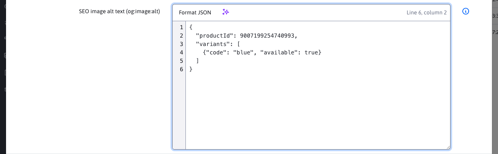

# Optional fields

Optional fields allow you to set optional attributes (values, texts) for the website and directory according to the customer's needs. The values ​​can then be transferred and used in the page template, see [Frontend programmer documentation](../../frontend/webpages/customfields/README.md).

## Backend

The settings of optional fields depend on the template, template group or domain used (as they are controlled by the translation key settings). Therefore, the options need to be sent from the backend for each edited web page separately. The transfer of settings is generically implemented [BaseEditorFields.getFields](../../../../src/main/java/sk/iway/iwcm/system/datatable/BaseEditorFields.java):

```java
@JsonIgnore
/**
 * Vygeneruje definiciu volnych poli, presunute sem z EditorForm.getFields() pre moznost pouzitia aj v inych DT ako webpages
 * @param bean - java bean, musi obsahovat metody getFieldX
 * @param keyPrefix - prefix textovych klucov, napr. edior, alebo groupedit, nasledne sa hladaju kluce keyPrefix.field_X a keyPrefix.field_X.type
 * @param lastAlphabet - koncove pismeno (urcuje pocet volnych poli), nap. T aleb D
 * @return
 */
public List<Field> getFields(Object bean, String keyPrefix, char lastAlphabet) {

}
```

The call ```getFields``` as you can see has the annotation ```@JsonIgnore```. You must implicitly call the method to prepare the array of objects. Basic usage example:

```java
//vytvorte triedu, ktora extenduje BaseEditorFields, nemusi obsahovat nic dalsie (ak nepotrebujete v editore dodatocne polia)
//technicky by ste triedu ani nemuseli vytvarat a pouzit priamo BaseEditorFields vo vasej QuestionsAnswersEntity
public class QuestionsAnswersEditorFields extends BaseEditorFields {

}

//vo vasej entite pridajte pole s nazvom editorFields
@Entity
@Table(name = "questions_answers")
@Getter
@Setter
@EntityListeners(sk.iway.iwcm.system.adminlog.AuditEntityListener.class)
@EntityListenersType(sk.iway.iwcm.Adminlog.TYPE_QA_UPDATE)
public class QuestionsAnswersEntity implements Serializable {

    ...

	@Transient
    @DataTableColumnNested
	private QuestionsAnswersEditorFields editorFields = null;
}

//v REST controlleri implementujte metodu processFromEntity v ktorej doplnite do editorFields definiciu poli
@RestController
@RequestMapping("/admin/rest/qa")
@PreAuthorize("@WebjetSecurityService.hasPermission('menuQa')")
@Datatable
public class QuestionsAnswersRestController extends DatatableRestControllerV2<QuestionsAnswersEntity, Long> {

    ...

    @Override
    public QuestionsAnswersEntity processFromEntity(QuestionsAnswersEntity entity, ProcessItemAction action) {

        QuestionsAnswersEditorFields ef = new QuestionsAnswersEditorFields();
        //definovanie volnych poli A-D s prefixom textoveho kluca components.qa
        ef.setFieldsDefinition(ef.getFields(entity, "components.qa", 'D'));
        entity.setEditorFields(ef);

        return entity;
    }
}
```

Example in [DocEditorFields](../../../../src/main/java/sk/iway/iwcm/doc/DocEditorFields.java) where there are multiple operations and therefore the method ```fromDocDetails``` is implemented separately in the ```editorFields``` object and called from ```DocRestController.processFromEntity```.

```java

//zoznam volnych poli
public List<Field> fieldsDefinition;

/**
 * Nastavi hodnoty atributov z DocDetails objektu
 * @param doc
 */
public void fromDocDetails(DocDetails doc, boolean loadSubQueries) {

    if (loadSubQueries) {
        //nastav prefix prekladovych klucov podla sablony a skupiny sablon
        if (doc.getTempId() > 0)
        {
            //nastavenie prefixu klucov podla skupiny sablon
            TemplateDetails temp = TemplatesDB.getInstance().getTemplate(doc.getTempId());
            if (temp != null && temp.getTemplatesGroupId()!=null && temp.getTemplatesGroupId().longValue() > 0) {
                TemplatesGroupBean tgb = TemplatesGroupDB.getInstance().getById(temp.getTemplatesGroupId());
                if (tgb != null && Tools.isNotEmpty(tgb.getKeyPrefix())) {
                    RequestBean.addTextKeyPrefix(tgb.getKeyPrefix(), false);
                }
            }

            RequestBean.addTextKeyPrefix("temp-"+doc.getTempId(), false);
        }

        //ziskaj zoznam volitelnych poli
        fieldsDefinition = getFields(doc, "editor", 'T');
    }

}
```

In the ```fromDocDetails``` method, the translation key prefixes are first set for searching by template group and template ID, and then the list ```fieldsDefinition``` is obtained (the frontend implicitly searches for this list in the ```editorFields.fieldsDefinition``` object).

For functionality, it is necessary that the given bean contains attributes named ```fieldX```, which can then bring optional fields to any bean with a call to ```getFields```.

## Configuration resource priority

The configuration of optional fields consists of two sources:

1. translation keys (`editor.field_x`, `editor.field_x.type`, ...),
2. records from table `custom_fields`.

When generating `fieldsDefinition` in `BaseEditorFields.getFields`, the priority is applied:

1. translation key
2. global class setting (without `entityId`),
3. specific setting for a particular entity (`entityId`),
4. bonus context (`bonusClassName` + `bonusEntityId`, e.g. `TemplateDetails` for `DocDetails`).

A higher level always overrides a lower one for the same field letter (`alphabet`).

## Serialization of settings in `custom_fields.value`

Field type-specific settings are stored in the `custom_fields.value` column.

Formats used:

- `text` / `text-120` / `text-120, warningLength-80`
- `jsoneditor` (direct editing of JSON object)
- `label1:value1|label2:value2` (`select`)
- `multiple:label1:value1|label2:value2` (`multiselect`)
- `autocomplete:Možnosť 1|Možnosť 2`
- `docsIn_67` or `docsIn_67_null`
- `enumeration_2_string1_string2` or `enumeration_2_string1_string2_null`
- `json_group` /`json_doc` with optional suffix `_null`

The transformation between the field editor and the internal value is provided by the `CustomFieldsService.toEntity` and `CustomFieldsService.fromEntity` methods.

## JSON Editor

The `jsoneditor` type allows you to directly enter a JSON object. In the [custom field settings](../../frontend/webpages/customfields/custom-fields-settings.md) select the **JSON Editor** type, or use translation keys:

```properties
editor.field_a=JSON data
editor.field_a.type=jsoneditor
```



For another entity, use its translation key prefix. On the server, the type is represented by the value `FieldType.JSONEDITOR`, in `editorFields.fieldsDefinition`, `type: "jsoneditor"` is sent. The types `JSON`, `json_doc` and `json_group`, which are used to select existing records, continue to have their original meaning.

### Input and formatting

The editor uses a text area with line numbers, a fixed-width font, and a horizontal scroll bar. The numbering moves with the text. The `Tab` and `Shift+Tab` keys maintain normal movement between form elements.

Above the text area is a panel with a frameless **Format JSON** button and an available AI assistant on the left and the current cursor position on the right, for example **Row 10, column 12**. The position is only displayed while the text area has focus and is hidden when it is lost. It updates as you type, click, and move with the keyboard; when you select text, it shows the active end of the selection. Both rows and columns are counted from 1.

The **Format JSON** button first validates the input and then indents it with two spaces. It only changes whitespace outside of strings and comments; it preserves quotes/apostrophes, numeric notation, property order, and escape sequences. Comments after a value remain on the same line; separate comments remain on their own line. It does not use reverse serialization of parsed values, which could round large numeric identifiers. Opening the editor does not automatically format the text.

Example of a valid value:

```json
{
  "productId": 9007199254740993,
  "variants": [
    {"code": "blue", "available": true}
  ]
}
```

### Validation and storage

- In addition to standard JSON, extended notation is supported: single quotes (apostrophes), unquoted property names, and `//` and `/* … */` comments. An unquoted name starts with a letter, `_` or `- In addition to standard JSON, extended notation is supported: single quotes (apostrophes), unquoted property names, and ` //` and `/* … */` comments. An unquoted name starts with a letter, `_` or , and can also contain digits and hyphens, for example `data-toggle`. The unquoted hyphen is an extension of this editor, not standard JavaScript syntax.
- Only one JSON object in curly brackets `{}` is allowed. Nested objects and arrays are allowed; single array `[]`, string, number, `true`, `false` and `null` at the root are rejected.
- The entire input is checked. A trailing comma, missing parentheses, or a second object after the first are invalid. Functions, JavaScript calls, `undefined`, `NaN`, and `Infinity` are not allowed. The parser never executes the code.
- The comment `//` continues to the end of the line. Therefore, the closing parentheses of the object must be on the next line; in a single-line notation, use the comment `/* … */`.
- Empty input, including spaces alone, is allowed if **Required field** is disabled. When mandatory is enabled, an object must be entered; an empty object `{}` is a valid value.
- In the browser, input is checked when leaving a field and before saving. An error is displayed next to the field and its tab is opened when you try to save. If the parser provides the location of the syntax error, the message includes the line and column.
- The server performs the same check independently of JavaScript in `DatatableRestControllerV2.validateEditorForCustomFields()` when saving via DataTables Editor and when importing. It loads the type and obligation configuration from the server according to the entity and context of the optional fields; the field definition sent by the client cannot disable validation. For partial imports, it only checks the imported JSON fields.
- After successful validation, the characters `<` and `>` are written as JSON Unicode escape sequences `\u003C` and `\u003E` before being saved. To return the original value, you can use the call `JsonEditorValidator.unescape(String value)` on the frontend, but be careful with `XSS injection`.

Validation checks syntax and the root object. It does not verify the presence or meaning of specific attributes according to JSON Schema.

Example of supported extended notation:

```text
{
  title: 'test',
  data-toggle: 'tooltip',
  'event': 'action.questionDropdown.FAQ',
  'action': {
    'questionDropdown': {
      'content': '{Sú volania v Go paušáloch naozaj neobmedzené?}' // text otázky
    }
  }
}
```

The extended notation is stored in its original form, including apostrophes and comments, except for the canonicalization of `<` and `>` characters. It is not automatically converted to strict JSON for `JSON.parse` ; the application processing the value must support the syntax used.

For custom REST services derived from `DatatableRestControllerV2`, the translation keys for validation are derived from `@DataTableColumn.title` on attributes `fieldA` to `fieldZ`. The configuration context in table `custom_fields`, such as binding to a parent entity, is determined by an existing hook `getCustomFieldsSearchDto(T entity)`. The hook is based on server data and is evaluated for a specific record being stored.

### Database capacity

The value remains as text in the corresponding database column `field_a` to `field_t`. The type `jsoneditor` does not change the database type or automatically extend the columns.

The basic schema for optional web page fields uses a length of 255 characters. Before deploying for JSON with a size of several KB, verify the actual capacity of a particular column and possibly extend it **in both `documents` and `documents_history`** tables. SQL examples for supported databases are in the [Database Capacity](../../frontend/webpages/customfields/README.md#database-capacity) section. This is a separate customization of the customer installation. Syntactically valid JSON must also meet the length restrictions of the stored data; each canonicalized `<` or `>` will take up six characters instead of one.

## Frontend

Integration into the datatable editor is implemented in the file [custom-fields.js](../../../../src/main/webapp/admin/v9/npm_packages/webjetdatatables/custom-fields.js). For each field, the settings are retrieved from the JSON object ```editorFields.fieldsDefinition``` and the form fields are recreated in the DOM tree.

The key is to connect the form field to the existing editor, this is done by calling:

```javascript
EDITOR.field("field"+keyUpper).s.opts._input = inputBox.find('input, select, textarea');
```

which gets the form field from the new ```inputBox``` object and sets it to the editor. An internal API call ```.s.opts._input``` is used, which is dangerous from the point of view of changes in the API in the datatables editor, but we have not found another solution.

The function call is made in [index.js](../../../../src/main/webapp/admin/v9/npm_packages/webjetdatatables/index.js) when the window is opened.

```javascript
import * as CustomFields from './custom-fields';

EDITOR.on('open', function (e, mode, action) {
    ...
    CustomFields.update(EDITOR);
});
```

In case of using ```multiple select``` this stores the field value as ```Array```. Conversion to String separated by ```|``` before submitting the form is provided by the method ```prepareCustomFieldsDataBeforeSend```, which is called in [index.js](../../../../src/main/webapp/admin/v9/npm_packages/webjetdatatables/index.js)

```javascript
EDITOR.on('preSubmit', function (e, data, action) {
    ...
    prepareCustomFieldsDataBeforeSend(data)
    ...
});
```

For type `autocomplete`, the request is sent to `/admin/FCKeditor/_editor_autocomplete.jsp` with parameters `className` and `objectId`. Therefore, the endpoint can prefer the configuration from `custom_fields` over the generic translation key.

For types `select` and `multiselect`, the format `label:value` is supported. If the value does not contain exactly one colon, the same text is used for both `label` and `value`.

## Renaming columns

If you also need to rename the displayed columns in the table according to the optional fields, just set the ```customFieldsUpdateColumns: true``` option when initializing the datatable. The optional field settings are obtained from the first record ```content[0].editorFields.fieldsDefinition``` after each data load.

Columns with ```null``` in ```label``` are hidden in the table and are also hidden in the column display settings (as if they did not exist).

```javascript
translationKeysTable = WJ.DataTable({
    url: "/admin/v9/settings/translation-keys",
    columns: columns,
    serverSide: true,
    customFieldsUpdateColumns: true
});
```

Setting `customFieldsUpdateColumnsPreserveVisibility` to the value `true` will preserve the column display setting for the `customFieldsUpdateColumns` mode for the user. It can only be used if the columns for the data table are not changed during display. For example, in the Translation keys section, the data does not change, it can be set to `true` and the user will preserve the column display setting. In the Codebooks section, the columns change when the codebook is changed (data is loaded), this option is not applicable there.

### Implementation details

The processing is in ```index.js``` in the function ```updateOptionsFromJson```. If the option ```DATA.customFieldsUpdateColumns===true``` is enabled and the JSON object contains ```editorFields?.fieldsDefinition``` in the first record, the column names in the header and also in the ```DATA``` object will be changed. Columns with the name ```null``` are hidden (this is ensured by the configuration of ```colVis``` in the function ```columns``` where columns with the name ```null``` are omitted). Subsequently, ```$("#"+DATA.id).trigger("column-reorder.dt");``` is called to update the column names in the column display settings (```colvis```).

In the definition ```buttons.colvis```, the reading ```columnText``` is modified so that it always takes the current value from the ```DATA``` definition and the ```columns``` function that defines which columns are displayed in the setting returns ```true/false``` depending on whether the column has the name ```null```. This way, the current column names are always displayed in the column display setting and those that do not have a defined name (not used) are hidden.
