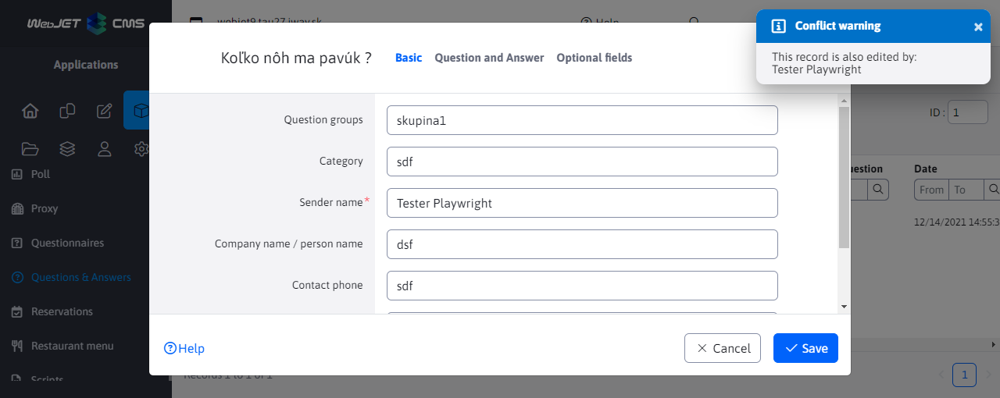

# Conflict warning

Conflict notification provides functionality that notifies a user while editing a record if another user is editing the same record in the same table.



## Backend

The implementation of the backend logic is located in the file [EditorLockingRestController.java](../../../src/main/java/sk/iway/iwcm/system/datatable/editorlocking/EditorLockingRestController.java). The REST url of this service is ```/admin/rest/editorlocking```. This controller takes care of adding and deleting ```editoLocking``` records from the cache. In the cache, these records are stored as a list of ```EditorLockingBean``` entities for each table separately (a separate cache record), where each entity represents the editing of one record by a specific user.

```java
@RestController
@RequestMapping("/admin/rest/editorlocking")
@ResponseBody
public class EditorLockingRestController {
```

### Adding a record

After calling the REST url ```/admin/rest/editorlocking/open/{entityId}/{tableUniqueId}```, an object containing a list of all ```EditorLockingBean``` entities according to ```tableUniqueId``` is retrieved from the cache memory (if it does not exist in memory, a new list is created) by calling ```getCacheList(tableUniqueId);```. It is checked whether it already contains an entity according to ```entityId``` and ```userId```. If not, a new ```EditorLockingBean``` entity is created and added to the list. Expired ```editorLocking``` records are removed from the field before being saved. The method returns a list of other users who are editing the same record (or an empty field).

```java
@GetMapping({ "/open/{entityId}/{tableUniqueId}" })
public List<UserDto> addEdit(
    @PathVariable("entityId") int entityId,
    @PathVariable("tableUniqueId") String tableUniqueId,
    HttpServletRequest request) {
```
### Deleting a record

After calling the REST url ```/admin/rest/editorlocking/close/{entityId}/{tableUniqueId}```, an object containing a list of all ```EditorLockingBean``` entities is retrieved from the cache by calling ```getCacheList(tableUniqueId);```. According to the parameters, the given ```EditorLockingBean``` is searched for in the list and removed.

```java
@GetMapping({ "/close/{entityId}/{tableUniqueId}" })
public void removeEdit(
    @PathVariable("entityId") int entityId,
    @PathVariable("tableUniqueId") String tableUniqueId,
    HttpServletRequest request) {
```

The record is remembered in the saved list for 2 minutes (defined in the constant ```CACHE_EXPIRE_MINUTES```). From the user interface, the service ```addEdit``` is called every minute, so if the user simply closes the window without closing the editor dialog, the record expires after 2 minutes.

### Caching

The list of users editing the same table is stored in the ```Cache``` object with the key ```"editor.locking-"+tableUniqueId```. The logic is in the ```private List<EditorLockingBean> getCacheList(String tableUniqueId)``` method. If the list for the given ```tableUniqueId``` does not exist in the cache, it is created, if it exists, its validity is extended by 7 minutes. If no call is made to the ```tableUniqueId``` table for 7 minutes, the record completely expires from the cache

## Frontend

The main implementation of the frontend logic is located in the file [datatables-wjfunctions.js](../../../src/main/webapp/admin/v9/npm_packages/webjetdatatables/datatables-wjfunctions.js).

The ```bindEditorNotify``` function contains 2 events that are invoked and called when the editor is opened and closed. The input parameter of this function is EDITOR, from which other necessary information is obtained, such as the unique table name or the id of the edited record. The function call itself is performed in the file [index.js](../../../src/main/webapp/admin/v9/npm_packages/webjetdatatables/index.js). The event called when the editor is opened further calls the ```callAddEditorLocking``` function (plus sets a 60 second interval, which is interrupted only when the editor is closed) and the event called when the editor is closed calls the ```callRemoveEditorLocking``` function.

The unique table name is generated in the ```getUniqueTableId(TABLE)``` function and is created from the REST interface URL (the / character is replaced with the - character, the ```/admin/rest/``` prefix is ​​removed).

The REST service is called when the editor dialog box is opened and then every 60 seconds.

### Adding a record

The function ```callAddEditorLocking``` is called by the event after the editor is opened. If the value ```entityId``` obtained from the EDITOR is different from ```null``` or -1 (which represents a new record), an ajax call is made to the REST url to add a new ```editorLocking```. The return value from the Backend is an array of other users who are currently editing the same record in the same table. If the array is not empty, the user will be repeatedly notified by ```WJ.notifyInfo``` which other users are editing the same record.

### Deleting a record

The ```callRemoveEditorLocking``` function is called by the event after the editor is closed. If the value ```entityId``` obtained from the EDITOR is different from ```null``` or -1 (which represents a new record), an ajax call is made to the REST url to delete the existing ```editorLocking``` record.