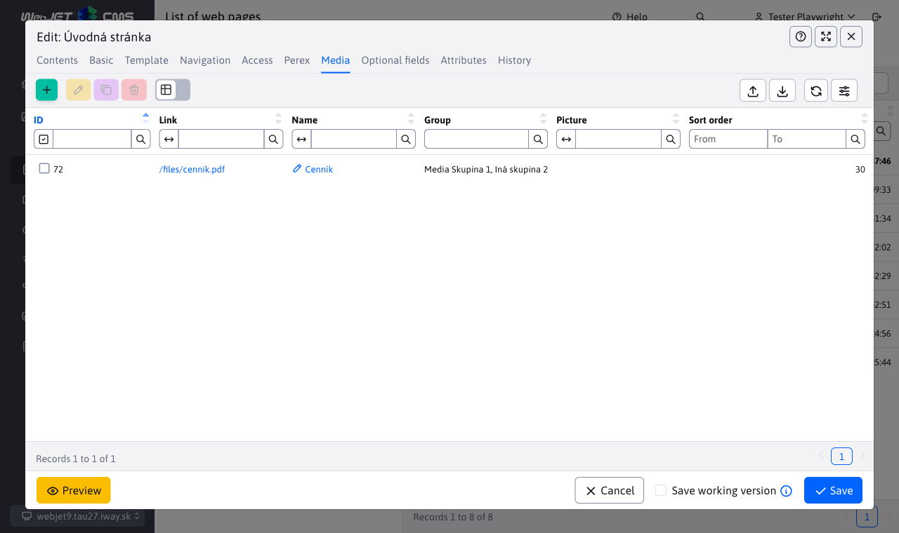

# Field Type - datatable

The datatable field allows you to display a nested datatable in the page editor (e.g. the Media list in the page editor). It is important to note that the datatable is initialized with its own URL. There is no need to send or receive data in the parent table object itself, the data changes automatically when the REST service of the nested datatable is called. Technically, it would be possible to work directly with JSON data from the parent table, but this option is not yet implemented.



Since the currently inserted data table works with separate REST services, the returned data is an empty field ```[]```.

## Using annotation

The annotation is used as ```DataTableColumnType.DATATABLE```, and the following editor attributes need to be set:

- ```data-dt-field-dt-url``` - ​​REST service URL, may contain macros for inserting values ​​from the parent editor, e.g.: ```/admin/rest/audit/notify?docid={docId}&groupId={groupId}```
- ```data-dt-field-dt-columns``` - ​​name of the class (including packages) from which the [datatable column definition](datatable-columns.md) will be used, e.g. ```sk.iway.iwcm.system.audit.AuditNotifyEntity```
- `data-dt-field-dt-columns-customize` - ​​name of a JavaScript function that can be used to modify the `columns` object, e.g. `removeEditorFields`. The function must be accessible directly in the `windows` object, receives the `columns` object as a parameter and is expected to return it modified. Example `function removeEditorFields(columns) { return columsn; }`.
- `data-dt-field-dt-tabs` - ​​list of tabs for the editor in JSON format. All names and values ​​of the JSON object need to be wrapped in `'`, translations are replaced automatically. Example: `@DataTableColumnEditorAttr(key = "data-dt-field-dt-tabs", value = "[{ 'id': 'basic', 'title': '[[#{datatable.tab.basic}]]', 'selected': true },{ 'id': 'fields', 'title': '[[#{editor.tab.fields}]]' }]")`. If not specified, it is automatically obtained according to the `@DataTableTabs` annotation of the specified class.
- `data-dt-field-dt-localJson` - ​​activates the mode that works with a local JSON object. It is used primarily for applications in a web page for recording application items (e.g. slide show items), which are additionally automatically encoded into a string suitable for the `PageParams` object and are encoded in `Base64`. If the `window.datatableLocalJsonUpdate = function(val, conf)` function exists, it is called for optional data editing.
- `data-dt-field-dt-autoload` - ​​if you have a table in the first tab, set it to `true` to automatically load it when the window is opened, otherwise the table will only be initialized when you click on the tab in which it is located.

Complete example of annotation:

```java
@DataTableColumn(inputType = DataTableColumnType.DATATABLE, title = "&nbsp;",
    tab = "media",
    editor = { @DataTableColumnEditor(
        attr = {
            @DataTableColumnEditorAttr(key = "data-dt-field-dt-url", value = "/admin/rest/audit/notify"),
            @DataTableColumnEditorAttr(key = "data-dt-field-dt-columns", value = "sk.iway.iwcm.system.audit.AuditNotifyEntity")
        }
    )
})
private List<Media> media;
```

Using data attributes, you can also set other configuration options for the data table. The data is sent as a string. The values ​​```true``` and ```false``` are converted to a ```boolean``` object. Setting the ```order``` attribute allows you to set the arrangement for only one column. The other options are transmitted as a string.

Add the prefix ```data-dt-field-dt-``` to the menu of the option you want to set, so to set the option ```serverSide``` use the key ```data-dt-field-dt-serverSide```. Example of additional annotations:

```java
    @DataTableColumnEditorAttr(key = "data-dt-field-dt-serverSide", value = "false"), //vypnutie serveroveho strankovania/vyhladavania
    @DataTableColumnEditorAttr(key = "data-dt-field-dt-order", value = "2,desc"), //nastavenie usporiadania podla 2. stlpca
    @DataTableColumnEditorAttr(key = "data-dt-field-dt-hideButtons", value = "create,edit,remove,import,celledit") //vypnutie zobrazenia uvedenych tlacidiel
    @DataTableColumnEditorAttr(key = "data-dt-field-dt-forceVisibleColumns", value = "groupId,fullPath"), //vynuti zobrazenie len uvedenych stlpcov
    @DataTableColumnEditorAttr(key = "data-dt-field-dt-updateColumnsFunction", value = "updateColumnsGroupDetails"), //JS funkcia ktora sa zavola pre upravu zoznamu stlpcov
    @DataTableColumnEditorAttr(key = "data-dt-field-full-headline", value = "user.group.groups_title") //nadpis nad datatabulkou na celu sirku okna
```

**API and Events**

The created data table will be made available as:

- ```conf.datatable``` on the original ```conf``` datatable column object
- ```window``` object named ```datatableInnerTable_fieldName``` - the object can be used for automated testing or other JavaScript operations.

After creating a nested data table, the ```WJ.DTE.innerTableInitialized``` event is triggered, where the configuration is transferred to the ```event.detail.conf``` object.

## Local JSON data

Activates the mode of working with local JSON data. The data is obtained directly from the field value, which can be of type `String`, on which the call to `JSON.parse` is made.

For application parameters in the web page, the result is encoded into `Base64` to prevent damage to the JSON object. At the same time, the [Row Reorder](https://datatables.net/extensions/rowreorder/) extension is activated to allow the list to be reordered using the `Drag&Drop` function.

In the application it will be possible to edit the list of items, change their order, etc. without using and defining a REST service. The result is saved back to a JSON object and encoded via `Base64`. During initialization, the columns `ID` and `rowOrder` are added. The attribute `DATA.src` of the object `datatables` is used to directly set the data for the table.

The function for changing the order of rows using the `Drag&Drop` function is also automatically activated. Due to conflicts when moving rows and their different arrangement, the option to sort the list by any column is disabled, the list is automatically arranged according to the order of arrangement. For JSON editor mode, this column is automatically added - note that the `ImpressSlideshowItem` class in the example below does not contain either the `ID` or `rowOrder` columns, since they are technically not needed to display the data. They are added automatically. If you need to display the column manually, use the `DataTableColumnType.ROW_REORDER` annotation.

Example of use:

```java
public class ImpressSlideshowApp extends WebjetComponentAbstract{
    ...
    @DataTableColumn(inputType = DataTableColumnType.DATATABLE, tab = "tabLink2", title="&nbsp;", className = "dt-json-editor",editor = { @DataTableColumnEditor(
            attr = {
                @DataTableColumnEditorAttr(key = "data-dt-field-dt-columns", value = "sk.iway.iwcm.components.appimpressslideshow.ImpressSlideshowItem"),
                @DataTableColumnEditorAttr(key = "data-dt-field-dt-localJson", value = "true")
            }
        )})
    private String editorData = null;
}

public class ImpressSlideshowItem {
    @DataTableColumn(
        inputType = DataTableColumnType.ELFINDER,
        className = "image",
        title = "editor.perex.image",
        renderFormat = "dt-format-image-notext"
    )
    private String image;

    @DataTableColumn(inputType = DataTableColumnType.QUILL, className="dt-row-edit", title = "components.app-cookiebar.cookiebar_title")
    private String title;

    @DataTableColumn(inputType = DataTableColumnType.QUILL, title = "editor.subtitle")
    private String subtitle;

    ...
}
```

## Implementation notes

The implementation is in the file [field-type-datatable.js](../../../../src/main/webapp/admin/v9/npm_packages/webjetdatatables/field-type-datatable.js) and in [index.js](../../../../src/main/webapp/admin/v9/npm_packages/webjetdatatables/index.js) set as ```$.fn.dataTable.Editor.fieldTypes.datatable = fieldTypeDatatable.typeDatatable();```.

The function ```resizeDatatable``` is used to calculate the size of the datatable (so that only rows are scrolled), the calculation is called when the field is initialized, every 20 seconds (for safety), when the window is resized and when a tab is clicked in the editor. The calculation is performed only when the field is visible.

When clicking on a tab in the editor, the tab name is tested against the tab where the data table is inserted and if it matches, the column width is set by calling ```conf.datatable.columns.adjust();```. The data table can be reused for different data and this ensures that the column width in the header is set correctly according to the table content.

The ```getUrlWithParams``` function can replace fields from a JSON object in a URL. If the datatable URL contains ```?docid={docId}&groupId={groupId}```, the values ​​```{docId}``` and ```{groupId}``` are replaced with values ​​from the JSON object ```EDITOR.currentJson```.
