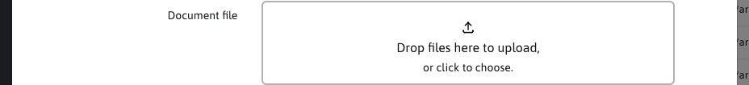
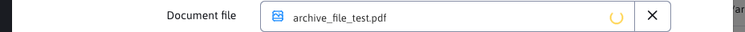
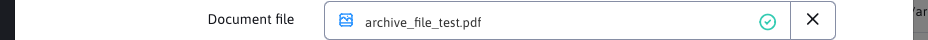

# UPLOAD field

The field allows you to upload a file.



## Using annotation

The annotation is used as ```DataTableColumnType.UPLOAD```.

Complete example of annotation:

```java
@DataTableColumn(
    inputType = DataTableColumnType.UPLOAD,
    tab = "basic",
    title = "fbrowse.file"
)
private String file = "";
```

## Frontend

To upload a new file, you can insert the file directly using `Drag&Drop`, or by clicking on the field to bring up the system file selector.

By default, you can only insert one file at a time. The number of files can be adjusted by configuring the field, see [Configuring the number of files](#configuring-the-number-of-files).

After inserting a file, the file upload animation starts and an event `WJ.AdminUpload.addedfile` is raised that you can listen to.



When the file is successfully uploaded, an upload confirmation will appear in the field and the `WJ.AdminUpload.success` event will be raised. If there is an upload error, the `WJ.AdminUpload.error` event will be raised.



This file is uploaded as a temporary file and the key value is stored in an array, e.g. `QUfQEadIJ8B0V8t`. We can then work with this value in BE using the `AdminUploadServlet` class.

If you want to upload another file, you can delete the already uploaded file or interrupt the upload process using the `X` button.

## Configuring the number of files

The `UPLOAD` field defaults to one file. The maximum number of files is determined in this order:

- `data-dt-field-upload-max-files` - ​​numeric limit, has the highest priority.
- `data-dt-field-upload-mode` - ​​value `single` or `multiple`.
- `className` - ​​backward compatibility via CSS classes `wjupload-single` or `wjupload-multiple`.

Example of a field with multiple file support:

```java
@DataTableColumn(
    inputType = DataTableColumnType.UPLOAD,
    tab = "basic",
    title = "fbrowse.file",
    className = "wjupload-multiple"
)
private String file = "";
```

Example with an explicit limit of 3 files:

```java
@DataTableColumn(
    inputType = DataTableColumnType.UPLOAD,
    tab = "basic",
    title = "fbrowse.file",
    attr = {
        @DataTableColumnEditorAttr(key = "data-dt-field-upload-mode", value = "multiple"),
        @DataTableColumnEditorAttr(key = "data-dt-field-upload-max-files", value = "3")
    }
)
private String file = "";
```

!>**Warning:** the editor field value is still a single string with the temporary file key. For multiple files, the field stores the key of the last successfully uploaded file. If you need to process all uploaded files, listen to the `WJ.AdminUpload.success` event and store the `e.detail.key` values.

## Instance isolation and events

Each `UPLOAD` field has its own instance `Dropzone`, its own notification container and its own template for displaying the upload. When the editor is reopened, the previous instance is canceled, the assigned event listeners are removed and the temporary state of the field is cleared. This allows multiple upload fields or separate upload zones to be on one page without conflicting over shared HTML `id`.

The events `WJ.AdminUpload.addedfile`, `WJ.AdminUpload.success` and `WJ.AdminUpload.error` contain a reference to a specific upload instance in `detail.uploader`. When listening to events, always verify that the event belongs to your instance:

```javascript
let myUpload = window.AdminUpload({
    element: "#my-upload",
    destinationFolder: "/files/protected/upload/",
    writeDirectlyToDestination: false
});

window.addEventListener("WJ.AdminUpload.success", function(e) {
    if (e.detail == null || e.detail.uploader !== myUpload) return;

    console.log("Dočasný kľúč súboru", e.detail.key);
});
```

The `detail` object contains, according to the type of event, mainly:

- `uploader` - ​​the `AdminUpload` /`Dropzone` instance that triggered the event.
- `file` - ​​file object from `Dropzone`.
- `key` - ​​key of the temporarily uploaded file, available upon successful upload.
- `response` - ​​JSON server response upon successful upload.
- `errorMessage` - ​​error message for event `WJ.AdminUpload.error`.

## Standalone use of AdminUpload

`window.AdminUpload` can also be used outside the DataTable Editor field, for example for full-page `drag&drop` uploading. It supports multiple independent upload zones on a single page. The HTML elements of the upload interface are searched relative to the element specified in `options.element`, first among siblings and then inside the parent element. Therefore, each upload zone can have its own:

- `.upload-wrapper` or `#upload-wrapper`,
- `.toast-container-upload` or `#toast-container-upload`,
- `.upload-toastr-template` or `#upload-toastr-template`.

Example:

```html
<div id="my-upload" class="drop-zone-box dropzone"></div>
<div class="upload-wrapper" style="display: none;">
    <div class="toast-container-progress"></div>
    <div id="my-upload-toasts" class="toast-container-upload"></div>
</div>
<div class="upload-toastr-template" style="display: none">
    <i class="ti ti-file"></i>
    <span>{FILE_NAME}</span>
</div>
```

```javascript
let myUpload = window.AdminUpload({
    element: "#my-upload",
    maxFiles: null,
    acceptedFiles: ".pdf,.docx",
    uploadType: "fileArchive",
    destinationFolder: "/files/archiv/",
    writeDirectlyToDestination: true,
    overwriteMode: ""
});
```

Supported important options:

- `element` - ​​CSS selector or DOM element for `Dropzone`.
- `maxFiles` - ​​maximum number of files, `null` means no limit.
- `acceptedFiles` - ​​allowed extensions or MIME types.
- `uploadType` - ​​recording type, for example `fileArchive`.
- `destinationFolder` - ​​destination folder.
- `writeDirectlyToDestination` - ​​if `true`, the file is written directly to the destination folder.
- `overwriteMode` - ​​default action for file conflicts, such as `skip`, `overwrite` or `keepboth`.

For the hidden `input[type=file]` generated by the `Dropzone` library, a deterministic CSS class in the form `dz-hidden-input-<id_elementu>` is automatically added. This allows tests and custom code to target a specific upload zone even when there are multiple uploads on the page at once.

## Backend

Example of use on BE

```java
String tempKey = "QUfQEadIJ8B0V8t";

//Get path to temp file
String filePath = AdminUploadServlet.getTempFilePath( tempKey );

//Get name of uploaded file
String fileName = AdminUploadServlet.getOriginalFileName( tempKey );

//Remove temp file
boolean wasRemoved = AdminUploadServlet.deleteTempFile( fileKey );
```
