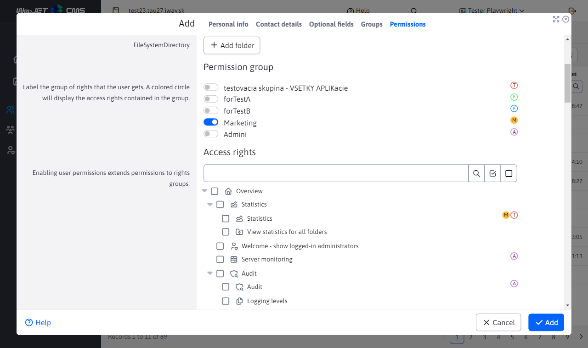

# jsTree array - tree structure

The jsTree data field integrates a tree structure display in the editor. The tree structure allows you to select individual leaves of the tree structure using the ```checkbox``` selection field.

The display is visible in users in the Rights tab:



## Using annotation

The annotation is used as ```DataTableColumnType.JSTREE```, and the following attributes can be set:

- ```data-dt-field-jstree-name``` - ​​name of the object with a tree structure, the object must be saved as ```window.name```

Complete example of annotation:

```java
@DataTableColumn(inputType = DataTableColumnType.JSTREE, title = "components.user.righrs.user_group_rights", tab = "rightsTab", visible = false, editor = {
    @DataTableColumnEditor(attr = {
            @DataTableColumnEditorAttr(key = "data-dt-field-jstree-name", value = "jstreePerms") }) })
private String[] enabledItems;
```

The object needs to be prepared in the model and then set to the ```window``` object:

```java
package sk.iway.iwcm.components.users;

import com.fasterxml.jackson.core.JsonProcessingException;

import org.springframework.context.event.EventListener;
import org.springframework.stereotype.Component;
import org.springframework.ui.ModelMap;

import sk.iway.iwcm.JsonTools;
import sk.iway.iwcm.admin.ThymeleafEvent;
import sk.iway.iwcm.admin.layout.MenuService;
import sk.iway.iwcm.system.spring.events.WebjetEvent;

/**
 * Vygeneruje data do modelu pre zobrazenie zoznamu pouzivatelov
 */
@Component
public class UserDetailsListener {

    @EventListener(condition = "#event.clazz eq 'sk.iway.iwcm.admin.ThymeleafEvent' && event.source.page=='users' && event.source.subpage=='user-list'")
    private void setInitalData(final WebjetEvent<ThymeleafEvent> event) {
        try {
            setInitialDataImpl(event.getSource().getModel());
        } catch (Exception ex) {
            Logger.error(UserDetailsListener.class, ex);
        }
    }

    private static void setInitialDataImpl(ModelMap model) throws JsonProcessingException {
        model.addAttribute("jstreePerms", JsonTools.objectToJSON(MenuService.getAllPermissions()));
    }
}
```

and the setting in the pug file:

```javascript
window.jstreePerms = [(${jstreePerms})];
```

## Implementation notes

The field is implemented in the file [field-type-jstree.js](../../../src/main/webapp/admin/v9/npm_packages/webjetdatatables/field-type-jstree.js).

Generates HTML code containing a search field with the option to uncheck/uncheck all selection fields. When a search is active, an icon for canceling the search is also displayed in the toolbar next to the search field. The search is activated either by clicking the magnifying glass icon or by pressing the ```Enter``` key.

Here we had a problem where pressing ```Enter``` was being captured by the vue component ```webjet-dte-jstree.vue```, we solved it by changing the annotation from ```<button @click="toggleModals"``` to ```<button @mouseup="toggleModals"```.

The name of the JSON object with a tree structure is obtained from the data attribute ```data-dt-field-jstree-name``` and then the JSON object itself is obtained by calling ```let jstreeJsonData = window[objName];```.

The settings of the selected selection fields ```checkbox``` are performed in the function ```set(conf, val)```. First, the search is canceled (so that the settings are not left between closing and opening the window), all selection fields are unchecked and the tree is completely opened by calling ```conf._tree.jstree('open_all');```.

The selected values ​​are expected in the field that is ```iteruje``` and calling ```conf._tree.jstree('select_node', v)``` will check the assigned selection field by name. The values ​​need to be unique to avoid duplication in the page (they are the IDs of the elements of the tree structure), so we recommend using a unique prefix for the names. In the Java object they are transferred as an array, e.g. ```private String[] enabledItems;```.

Retrieving the selected values ​​when sending is done in the ```get(conf)``` function where the ```conf._tree.jstree('get_selected')``` API call is used to retrieve the selected values ​​field.

The field is inserted and initialized in ```index.js``` with the following code:

```javascript
...
import * as fieldTypeJsTree from './field-type-jstree';
...
$.fn.dataTable.Editor.fieldTypes.jsTree = fieldTypeJsTree.typeJsTree();
```

The ```_modal.css``` file contains CSS styles that modify the default CSS styles for the jsTree library by forcing the use of ```Font Awesome``` icons.