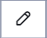
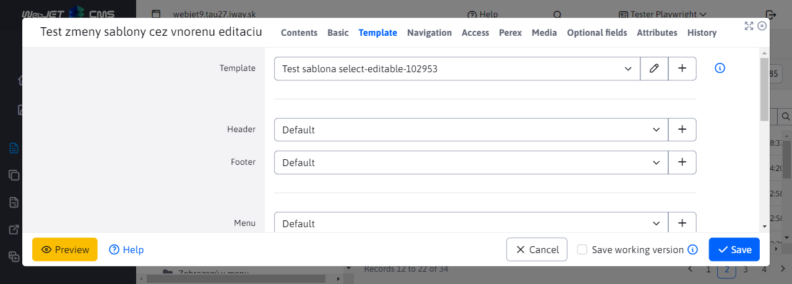
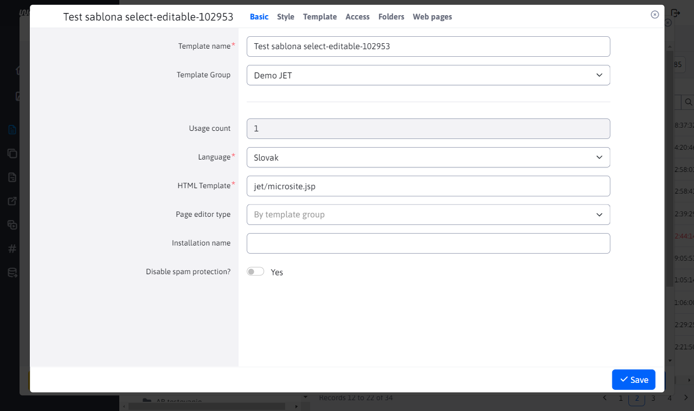

# Editable selection field

For number fields, it is possible to add an icon for editing or adding a new record. The field is displayed as a standard selection field, but contains an icon  for editing the selected record, or an icon  for adding a new record.

The example is from editing web pages, where it is possible to select a template in the **Web page template** selection field.



Sometimes, however, it is necessary to check/edit something in the template, so the option to load the selected template directly from the web page into the editor is convenient. The result is loading a nested dialog box with editing, for example, the template:



## Using annotation

The field is activated by setting the editor attributes using the ```@DataTableColumnEditorAttr``` annotation:

```java
@Column(name = "temp_id")
@DataTableColumn(
        inputType = DataTableColumnType.SELECT,
        editor = {
                @DataTableColumnEditor(attr = {
                        @DataTableColumnEditorAttr(key = "data-dt-edit-url", value = "/admin/v9/templates/temps-list/?tempId={id}"),
                        @DataTableColumnEditorAttr(key = "data-dt-edit-perms", value = "menuTemplates")
                })
        }
)
private Integer tempId;
```

The following attributes are supported, only ```data-dt-edit-url``` is mandatory, but we always recommend setting the ```data-dt-edit-perms``` field as well:

- ```data-dt-edit-url``` - ​​URL address of the web page for editing the record, the currently selected value in the selection field will be transferred to the value ```{id}```.
- ```data-dt-edit-perms``` - ​​name of the right, if the user does not have this right, the option to edit the record will not be displayed (the field will be displayed as a standard selection field).
- ```data-dt-edit-title``` - ​​(optional) translation key for the window title, if not specified, the field name from the editor will be used.

When calling a web page, it is possible to enter special tags for the URL to open the System or Trash tab:

```java
@DataTableColumnEditorAttr(key = "data-dt-edit-url", value = "/admin/v9/webpages/web-pages-list/?groupid=SYSTEM&docid={id}")
...
@DataTableColumnEditorAttr(key = "data-dt-edit-url", value = "/admin/v9/webpages/web-pages-list/?groupid=TRASH&docid={id}")
...
```

## Implementation notes

The implementation is in the file ```/admin/v9/npm_packages/webjetdatatables/field-type-select-editable.js``` and through the call ```$.fn.dataTable.Editor.fieldTypes.select.create``` it modifies the original field of type ```select``` from the Datatables Editor. The modification consists in adding buttons for editing and adding a record. Clicking on one of these buttons calls the function ```openIframeModal``` to open an iframe dialog.

In the ```onload``` event, an event listener is added to open and close the editor window in the nested dialog. In the ```WJ.DTE.close``` event (i.e. closing the editor window), the iframe dialog is closed and a refresh of the data table data is triggered. This also causes the values ​​in the selection fields to be refreshed.

At the ```WJ.DTE.open``` event, the window title of the nested editor is set according to the specified attribute ```data-dt-edit-title```, or according to the name of the field in the editor.

Opening the relevant record for editing is provided by [datatable-opener.js](../libraries/datatable-opener.md), which triggers a click on the add record button for a record with ```?id=-1```.

After saving, the data table data is refreshed by calling ```EDITOR.TABLE.wjUpdateOptions();```. This calls the REST interface ```/all``` to retrieve the ```json.options``` selection field data.

### Display method

In the nested dialog, we don't want to display the data table or navigation options, but only the editor itself. This is achieved using CSS styles:

- in ```app-init.js```, for the case of a window in an iframe, the CSS class ```in-iframe``` is set on the ```html``` tag. It is set according to the URL parameter ```showOnlyEditor=true``` which is automatically added to the URL when the dialog is opened. For other cases, the dialog sets the CSS class ```in-iframe-show-table```, which also keeps the data table displayed. The parameter ```showEditorFooterPrimary=true``` allows you to display a footer with an active primary button (if the Save is not performed in a nested manner).
- after initialization, the ```WJ.iframeLoaded``` event is triggered, which subsequently runs the code of the ```onload``` function, [dialog iframe](../frameworks/webjetjs.md?id=iframe-dialog).

In the file ```src/main/webapp/admin/v9/src/scss/3-base/_modal.scss```, the display is set to ```html.in-iframe``` mode, which hides the entire ```.ly-page-wrapper``` containing the data table and the entire GUI.

However, since loading may take a while, the ```#modalIframeLoader``` element (which is hidden by default) is displayed and hidden after the ```onload``` event is executed. This way the user knows that something is still loading (the editor is initializing).