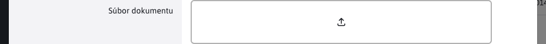

# Field types for the editor

All standard form fields can be used in the editor.

## ID

Represents a column with a primary key, example:

```java
public class CalendarEventsEntity {

    @Id
    @Column(name = "calendar_id")
    @GeneratedValue(strategy = GenerationType.IDENTITY, generator = "S_calendar")
    @DataTableColumn(inputType = DataTableColumnType.ID)
    private Long id;

}
```

## OPEN\_EDITOR

A text type field that displays a link to open the record editor, example:

```java
    @Column(name = "title")
    @DataTableColumn(
        inputType = DataTableColumnType.OPEN_EDITOR,
        title="calendar.name",
        tab = "basic"
    )
    @NotBlank
    private String title;
```

## TEXT

Standard text field, example:

```java
    @DataTableColumn(inputType = DataTableColumnType.TEXT, title="components.contact.property.street")
    private String street;
```


## NUMBER / TEXT\_NUMBER

Text field `type="number"`, the browser typically also displays arrows in the field to zoom in/out the entered value. Example:

```java
    @Column(name = "priority")
	@NotNull
    @DataTableColumn(
        inputType = DataTableColumnType.NUMBER,
        title="components.banner.priority",
		tab = "main"
    )
	private Integer priority;
```

The difference between `NUMBER` a `TEXT_NUMBER` is in the datatable view. `TEXT_NUMBER` displays the rounded number, for a higher number it prints in text form, e.g. `10 tis.` instead of `10000`. In the editor, the behaviour is the same (the exact value is displayed).

## PASSWORD

Text field `type="password"` to enter the password.

```java
    @DataTableColumn(
        inputType = DataTableColumnType.PASSWORD,
        title = "components.user.password",
        tab = "personalInfo",
        className = "required"
    )
    @Transient //toto nechceme citat z DB
    private String password;
```

## TEXTAREA

Multi-line text box. Long text is not wrapped, if you want to wrap long text into multiple lines set `className = "wrap"`:

```java
    @Column(name = "gallery_perex")
    @DataTableColumn(
        inputType = DataTableColumnType.TEXTAREA,
        title = "editor.tab.perex",
        tab = "basic"
    )
    private String perex = "";

    @DataTableColumn(
        inputType = DataTableColumnType.TEXTAREA,
        tab = "basic",
        title="components.app-cookiebar.text",
        className = "wrap",
        editor = {
        @DataTableColumnEditor(
            attr = {
                @DataTableColumnEditorAttr(
                    key = "placeholder",
                    value = "components.app-cookiebar.cookie_text")
            }
        )
    })
    private String cookie_text;
```

## DATE

Selecting a date, when you click in the field, the date selection window appears.

Note the setting `@Temporal(TemporalType.TIMESTAMP)` for correct field to database column conversion (required by JPA).

```java
    @Column(name = "date_from")
	@Temporal(TemporalType.TIMESTAMP)
	@DataTableColumn(
        inputType = DataTableColumnType.DATE,
        title="calendar.begin",
        tab = "basic"
    )
	private Date dateFrom;
```

## DATETIME

Similar field as `DATE` but in addition, it also allows you to select the time.

```java
    @Column(name = "date_to")
	@Temporal(TemporalType.TIMESTAMP)
	@DataTableColumn(
        inputType = DataTableColumnType.DATETIME,
        title="components.banner.dateTo",
		visible = false,
		tab = "restrictions"
    )
	private Date dateTo;
```

## TIME\_HM and TIME\_HMS

Fields similar to `DATETIME` but they ONLY allow time selection. Version `TIME_HM` is the time selection using hours and minutes. Version `TIME_HMS` allows you to select the time using hours, minutes and seconds.

Note the setting `@Convert(converter = DefaultTimeValueConverter.class)` which sets the same date for each selected time, namely `01.01.2000` while the time selection remains unchanged. This same date setting is not visible, but is important in terms of how it works when filtering records using these time fields.

It should be remembered that the class `DefaultTimeValueConverter` implemented by `AttributeConverter`, which inherently means that this converter only works when it is a column in an entity that represents a database column. If the column you select does not satisfy this, you must set its value using one of the static functions contained in the class `DefaultTimeValueConverter`.

```java
    @Column(name = "reservation_time_to")
    @DataTableColumn(
        inputType = DataTableColumnType.TIME_HM,
        title="components.reservation.reservation_objects.date_to",
        visible = false,
        tab = "basic"
    )
    @Convert(converter = DefaultTimeValueConverter.class)
    private Date reservationTimeTo;
```

## SELECT

Selection field, set by type `DataTableColumnType.SELECT`.


It is important to define the options of the selection field:

### By transferring data from the REST service

When reading the datatable, it is possible to transfer not only the records, but also the so-called. `option` Attributes. These are then also set as options for the specified fields. The options can be set by overriding the method `getOptions`.

```java
public class ContactRestController extends DatatableRestControllerV2<ContactEntity, Long> {

    @Override
    public void getOptions(DatatablePageImpl<ContactEntity> page) {

        //pridaj zoznam pre pole country
        page.addOptions("country", getCountries(), "label", "value", false);
    }

    /**
     * Vrati zoznam vyberoveho pola pre krajinu
     * @return
     */
    public static List<LabelValue> getCountries() {
        //vytvor zoznam krajin, toto by sa idealne malo citat z nejakeho ciselnika
        List<LabelValue> countries = new ArrayList<>();
        countries.add(new LabelValue("Slovenská republika", "sk"));
        countries.add(new LabelValue("Česká republika", "cz"));
        countries.add(new LabelValue("Rakúsko", "at"));

        return countries;
    }
}


public class ContactEntity {

    @DataTableColumn(inputType = DataTableColumnType.SELECT, title="components.contact.property.country")
    private String country;

}
```

Warning: if you overwrote the method as well `getAll(Pageable pageable)` a call is needed `getOptions` make in your code methods `getAll`.

### By linking to the dial

User-editable lists of data can be easily created in the dials application. These can be used as selection field options. This is set by the value `enumeration:MENO-CISELNIKA`:

```java
public class ContactEntity {

    @DataTableColumn(inputType = DataTableColumnType.SELECT, tab = "basic", editor = {
        @DataTableColumnEditor(
            options = {
                //ukazka napojenia na ciselnik, mozne je zadat meno alebo ID ciselnika, vo value su mena property pre text a hodnotu option pola
                @DataTableColumnEditorAttr(key = "enumeration:Okresne Mestá", value = "string1:string2")
            }
        )
    })
    private String country;

}
```

### Linking to Java class

If the data is retrieved in a special way you can get a list of options by calling a Java class that returns a list of data. This is set by the value `method:PACKAGE.TRIEDA.METODA` whereby the `value` it is possible to specify attribute names to retrieve text and values in the format `LABEL-PROPERTY:VALUE-PROPERTY`.

```java
public class ContactRestController extends DatatableRestControllerV2<ContactEntity, Long> {
    /**
     * Vrati zoznam vyberoveho pola pre krajinu
     * @return
     */
    public static List<LabelValue> getCountries() {
        //vytvor zoznam krajin, toto by sa idealne malo citat z nejakeho ciselnika
        List<LabelValue> countries = new ArrayList<>();
        countries.add(new LabelValue("Slovenská republika", "sk"));
        countries.add(new LabelValue("Česká republika", "cz"));
        countries.add(new LabelValue("Rakúsko", "at"));

        return countries;
    }
}

public class ContactEntity {

    @DataTableColumn(inputType = DataTableColumnType.SELECT, tab = "basic", editor = {
        @DataTableColumnEditor(
            options = {
                //ukazka ziskania zoznamu krajin volanim statickej metody, vo value su mena property pre text a hodnotu option pola
                @DataTableColumnEditorAttr(key = "method:sk.iway.basecms.contact.ContactRestController.getCountries", value = "label:value")
            }
        )
    })
    private String country;

}
```

### By listing the options directly in the entity

You can directly list individual options using the list `@DataTableColumnEditorAttr`, as displayed text (attribute `key`), you can use the translation key:

```java
	@Column(name = "banner_type")
    @DataTableColumn(
        inputType = DataTableColumnType.SELECT,
        title="[[#{components.banner.banner_type}]]",
		tab = "main",
		editor = {
			@DataTableColumnEditor(
				options = {
					@DataTableColumnEditorAttr(key = "components.banner.picture", value = "1"),
					@DataTableColumnEditorAttr(key = "components.banner.html", value = "3"),
					@DataTableColumnEditorAttr(key = "components.banner.content_banner", value = "4")
				}
			)
		}
    )
	private Integer bannerType;
```

Note that even if you enter the values in value as a string they are correctly converted to a number (technically in the HTML code everything is a string, but Spring converts it correctly when sending and displaying).

## MULTISELECT

Multiple choice selection box, type `DataTableColumnType.MULTISELECT`. Allows to work with an array of objects, or with a comma-separated list (after setting the attribute `separator` in which you specify the separator character).


Examples of use:

```java
public class ContactEntity {

    @DataTableColumn(inputType = DataTableColumnType.MULTISELECT, title="multiple", filter = true, editor = {
        @DataTableColumnEditor(
            options = {
                @DataTableColumnEditorAttr(key = "method:sk.iway.basecms.contact.ContactRestController.getCountries", value = "label:value")
            }
        )
    })
    private String[] multiple;

    @DataTableColumn(inputType = DataTableColumnType.MULTISELECT, title="multipleInt", filter = true, editor = {
        @DataTableColumnEditor(
            options = {
                    @DataTableColumnEditorAttr(key = "1-Jedna", value = "1"),
                    @DataTableColumnEditorAttr(key = "2-Dva", value = "2"),
                    @DataTableColumnEditorAttr(key = "3-Tri", value = "3"),
                    @DataTableColumnEditorAttr(key = "4-Styri", value = "4"),
                    @DataTableColumnEditorAttr(key = "5-Pat", value = "5"),
            }
        )
    })
    private Integer[] multipleInt;


    @DataTableColumn(inputType = DataTableColumnType.MULTISELECT, title="multipleOddeleneCiarkou", filter = true, editor = {
        @DataTableColumnEditor(
            options = {
                    @DataTableColumnEditorAttr(key = "1-Jedna", value = "Jedna"),
                    @DataTableColumnEditorAttr(key = "2-Dva", value = "Dva"),
                    @DataTableColumnEditorAttr(key = "3-Tri", value = "Tri"),
                    @DataTableColumnEditorAttr(key = "4-Styri", value = "Styri"),
                    @DataTableColumnEditorAttr(key = "5-Pat", value = "Pat"),
            },
            separator = ","
        )
    })
    private String multipleOddeleneCiarkou;

}
```

For the attribute `multipleOddeleneCiarkou` the values are separated by the character defined in the attribute `separator`. So the value after sending will look like e.g. `"Tri,Pat"`.

Values separated by a comma should be used for `MULTISELECT` fields used for application setup (using annotation `@WebjetAppStore`):

```java
@WebjetComponent("sk.iway.basecms.contact.ContactApp")
@WebjetAppStore(nameKey = "Kontakty", descKey = "Ukazkova aplikacia so zoznamom kontaktov", imagePath = "ti ti-id", galleryImages = "/components/map/screenshot-1.jpg,/components/gdpr/screenshot-2.png,/components/gallery/screenshot-3.jpg")
@Getter
@Setter
public class ContactApp extends WebjetComponentAbstract {

    /**
     * Privatne vlastnosti s get/set-rami slúžia na prenesenie parametrov pageParams z !INCLUDE()! do triedy
     * Pomocou anotacie @DataTableColumn vytvarame pole pre nastavenie aplikacie
     */
    @DataTableColumn(inputType = DataTableColumnType.MULTISELECT, tab = "basic", editor = {
        @DataTableColumnEditor(
            options = {
                @DataTableColumnEditorAttr(key = "method:sk.iway.basecms.contact.ContactRestController.getCountries", value = "label:value")
            },
            separator = ","
        )
    })
    private String countries;
}
```

## CHECKBOX

Standard checkbox, allows to work with an array of objects (multiple options selected). Using the attribute `unselectedValue` is set if the field is unchecked.

You can also use the option to set the attribute `data-dt-field-headline` for a separate heading above the list of fields.

```java
    @DataTableColumn(
        inputType = DataTableColumnType.CHECKBOX,
        title = "editor.perex.group",
        sortAfter = "publishType",
        tab="filter",
        editor = {
            @DataTableColumnEditor(
                attr = {
                    @DataTableColumnEditorAttr(key = "unselectedValue", value = "")
                }
            )
        }
    )
	private String[] perexGroupsIds;


    @DataTableColumn(inputType = DataTableColumnType.CHECKBOX, title = "user.permissions.label", tab = "groupsTab", visible = false, editor = {
        @DataTableColumnEditor(attr = {
            @DataTableColumnEditorAttr(key = "data-dt-field-headline", value = "user.admin.editUserGroups"),
            @DataTableColumnEditorAttr(key = "unselectedValue", value = "") }) })
    private Integer[] permisions;
```

## RADIO

Standard field for selecting one of the options.

```java
    @Column(name = "sex_male")
    @DataTableColumn(
        inputType = DataTableColumnType.RADIO,
        title = "components.user.newuser.sexMale",
        tab = "personalInfo",
        editor = {
            @DataTableColumnEditor(
                options = {
                    @DataTableColumnEditorAttr(key = "reguser.male", value = "true"),
                    @DataTableColumnEditorAttr(key = "reguser.female", value = "false")
                }
            )
        }
    )
    private Boolean sexMale;
```

## BOOLEAN

Represents a simplified notation of an array type `CHECKBOX` for binary yes/no option.

```java
    @Column(name = "require_approve")
    @DataTableColumn(
        inputType = DataTableColumnType.BOOLEAN,
        title = "groupedit.require_approve",
        tab = "basic"
    )
    private Boolean requireApprove;
```

## BOOLEAN\_TEXT

It represents the type `BOOLEAN` for a binary yes/no option with a caption on the right instead of the left and a Yes option next to the checkbox.

```java
    @DataTableColumn(inputType = DataTableColumnType.BOOLEAN_TEXT, tab = "basic", title="components.news.paging")
    private boolean pagination = true;
```

## HIDDEN

Hidden field, will not be displayed in the editor.

```java
	@Column(name = "domain_id")
	@DataTableColumn(
        inputType = DataTableColumnType.HIDDEN,
		tab="basic"
    )
	private Integer domainId;
```

## DISABLED

Displays a text field whose value cannot be changed. In the example, note that the field types can be combined. Setting `DISABLED` sets the HTML attribute `disabled="disabled"`.

```java
    @Size(max = 255)
    @Column(name = "image_name")
    @DataTableColumn(inputType = {DataTableColumnType.OPEN_EDITOR, DataTableColumnType.DISABLED}, tab = "metadata", title="components.gallery.fileName")
    private String imageName;
```

## QUILL

Displays a simple HTML editor that allows basic text formatting such as bold/italic/underline, headings, lists, and link.

Note the use of the converter `@javax.persistence.Convert(converter = AllowSafeHtmlAttributeConverter.class)` which will only allow you to send [secure HTML code](../backend/security.md) (without embedded JavaScript elements and so on).

```java
    @Column(name = "l_description_sk")
    @DataTableColumn(
            inputType = DataTableColumnType.QUILL,
            title = "[[#{gallery.l_description}]] <span class='lang-shortcut'>sk</span>",
            tab = "description"
    )
    @javax.persistence.Convert(converter = AllowSafeHtmlAttributeConverter.class)
    private String descriptionLongSk;
```


## WYSIWYG

Displays the full-featured HTML editor as used for editing web pages.

```java
    @Column(name = "description")
    @DataTableColumn(
        inputType = DataTableColumnType.WYSIWYG,
        title = "calendar_edit.description",
        tab = "description",
        hidden = true
    )
    private String description;
```

field must be used in a separate tab that has the attribute set `content: ''`:

```javascript
    var tabs = [
        { id: 'basic', title: /*[[#{calendar_events.tab.basic}]]*/ 'basic', selected: true},
        { id: 'description', title: /*[[#{calendar_events.tab.description}]]*/ 'desc', content: '' },
        { id: 'advanced', title: /*[[#{calendar_events.tab.advanced}]]*/ 'adv' },
        { id: 'notification', title: /*[[#{calendar_events.tab.notification}]]*/ 'notify' }
    ];
```

## JSON

Field [adding directories and web pages](field-json.md).

```java
    @DataTableColumn(inputType = DataTableColumnType.JSON, title="admin.temp.edit.showForDir", className = "dt-tree-group-array")
    private List<GroupDetails> availableGroups;
```


## DATATABLE

Field [nested datatable in the editor](field-datatable.md).

```java
    @Transient
    @DataTableColumn(inputType = DataTableColumnType.DATATABLE, title = "&nbsp;",
        tab = "folders",
        editor = { @DataTableColumnEditor(
            attr = {
                @DataTableColumnEditorAttr(key = "data-dt-field-dt-url", value = "/admin/rest/groups?userGroupId={id}"),
                @DataTableColumnEditorAttr(key = "data-dt-field-dt-columns", value = "sk.iway.iwcm.doc.GroupDetails"),
                @DataTableColumnEditorAttr(key = "data-dt-field-dt-forceVisibleColumns", value = "groupId,groupName,fullPath"),
                @DataTableColumnEditorAttr(key = "data-dt-field-dt-updateColumnsFunction", value = "updateColumnsGroupDetails"),
                @DataTableColumnEditorAttr(key = "data-dt-field-dt-hideButtons", value = "create,edit,duplicate,remove,import,celledit"),
                @DataTableColumnEditorAttr(key = "data-dt-field-full-headline", value = "user.group.groups_title"),
                @DataTableColumnEditorAttr(key = "data-dt-field-dt-serverSide", value = "false")
            }
        )
    })
    private List<GroupDetails> groupDetailsList;
```

## ELFINDER

Field for [file selection](field-elfinder.md) (link to file).

```java
    @Column(name = "watermark")
    @DataTableColumn(
        inputType = DataTableColumnType.ELFINDER,
        title = "components.gallery.watermark",
        tab = "watermark"
    )
    private String watermark;
```


## JSTREE

Field for selection [tree structures](field-jstree.md).

```java
    @DataTableColumn(inputType = DataTableColumnType.JSTREE, title = "components.user.righrs.user_group_rights", tab = "rightsTab", hidden = true,
    editor = {
        @DataTableColumnEditor(attr = {
                @DataTableColumnEditorAttr(key = "data-dt-field-headline", value = "components.user.permissions"),
                @DataTableColumnEditorAttr(key = "data-dt-field-jstree-name", value = "jstreePerms") }) })
    private String[] enabledItems;

    @DataTableColumn(inputType = DataTableColumnType.JSTREE, title = "user.permgroups.permissions.title", tab = "perms", hidden = true, editor = {
        @DataTableColumnEditor(attr = {
                @DataTableColumnEditorAttr(key = "data-dt-field-jstree-name", value = "jstreePerms") }) })
    private String[] permissions;
```


## COLOR

Field for selecting the colour in `HEX` format including transparency, e.g. `#FF0000FF`:

```java
    @DataTableColumn(inputType = DataTableColumnType.COLOR, tab = "basic", title="components.app-cookiebar.textColor")
    private String color_text;
```

## IFRAME

Field for inserting another page into `iframe` element, it is used in applications in the editor for inserting e.g. photo galleries:

```java
@WebjetComponent("sk.iway.iwcm.components.gallery.GalleryApp")
@WebjetAppStore(nameKey = "components.gallery.title", descKey = "components.gallery.desc", itemKey="menuGallery", imagePath = "/components/gallery/editoricon.png", galleryImages = "/components/gallery/", componentPath = "/components/gallery/gallery.jsp")
@DataTableTabs(tabs = {
    @DataTableTab(id = "basic", title = "components.universalComponentDialog.title", selected = true),
    @DataTableTab(id = "componentIframe", title = "components.gallery.images")
})
@Getter
@Setter
public class GalleryApp extends WebjetComponentAbstract {

    @DataTableColumn(inputType = DataTableColumnType.IFRAME, tab = "componentIframe", title="&nbsp;")
    private String iframe  = "/admin/v9/apps/gallery/?dir={dir}";

}
```

### BASE64

An array that encodes and decodes a value using an algorithm `base64`, shown as `textarea`. It is primarily used as a field for application in the editor to preserve special characters of the inserted value. If you need to use `base64` you can also set to another field type `className = "dt-style-base64"`.

!>**Warning:** JavaScript function `btoa` only supports `ASCII` Characters.

```java
    @DataTableColumn(
        inputType = DataTableColumnType.BASE64,
        tab = "basic",
        title="components.app-docsembed.editor_components.url",
    )
    private String url;

    @DataTableColumn(
        inputType = DataTableColumnType.ELFINDER,
        tab = "basic",
        title="components.app-docsembed.editor_components.url",
        className = "dt-style-base64"
    )
    private String url;
```

### STATIC\_TEXT

Display static text at the position of the normal input field, i.e. on the right. Markdown syntax is supported in the translation key.

```java
    @DataTableColumn(
        inputType = DataTableColumnType.STATIC_TEXT,
        tab = "basic",
        title="components.app-vyhladavanie_info"
    )
    private String explain;
```

### IMAGE\_RADIO

Display a selection of one of the options based on the image. Used, for example, in the Poll app. Images are retrieved as a list from the file system, they need to be populated into an object `options` REST service responses. The image reference is entered into the object `OptionDto.original`.

By setting up `className = "image-radio-horizontal"` it is possible to switch the display of options to horizontal in the row. By adding a CSS class `image-radio-fullwidth` the display of the label and selection is switched to row instead of column, in this case we recommend not to have any other fields in the tab and to set the value in the tab definition `content = ""` that the card does not have a grey bar in the background underlining the labels.

The implementation is in the file [field-type-imageradio.js](../../../../src/main/webapp/admin/v9/npm_packages/webjetdatatables/field-type-imageradio.js).

```java
@WebjetComponent("sk.iway.iwcm.components.inquiry.InquiryApp")
@WebjetAppStore(
    nameKey = "components.inquiry.title",
    descKey = "components.inquiry.desc",
    itemKey= "cmp_inquiry",
    imagePath = "/components/inquiry/editoricon.png",
    galleryImages = "/components/inquiry/",
    componentPath = "/components/inquiry/inquiry.jsp"
)
@DataTableTabs(tabs = {
    @DataTableTab(id = "basic", title = "components.universalComponentDialog.title", selected = true),
    @DataTableTab(id = "styleSelectArea", title = "components.roots.new.style", content = ""),
    @DataTableTab(id = "componentIframeWindowTabList", title = "menu.inquiry", content = ""),
})
@Getter
@Setter
public class InquiryApp extends WebjetComponentAbstract {

    @DataTableColumn(
        inputType = DataTableColumnType.IMAGE_RADIO,
        title = "components.roots.new.style",
        tab = "styleSelectArea",
        className = "image-radio-horizontal image-radio-fullwidth"
    )
    private String style = "01";

    @DataTableColumn(
        inputType = DataTableColumnType.IMAGE_RADIO,
        title = "components.catalog.color",
        tab = "styleSelectArea",
        className = "image-radio-horizontal image-radio-fullwidth"
    )
    private String color = "01";

    @Override
    public Map<String, List<OptionDto>> getAppOptions(ComponentRequest componentRequest, HttpServletRequest request) {
        Map<String, List<OptionDto>> options = new HashMap<>();

        //style & color options
        options.put("style", DatatableTools.getImageRadioOptions("/components/inquiry/admin-styles/"));
        options.put("color", DatatableTools.getImageRadioOptions("/components/inquiry/admin-colors/"));

        return options;
    }

}
```

## UPLOAD

Field type allowing [file upload](field-file-upload.md).



```java
  @DataTableColumn(
        inputType = DataTableColumnType.UPLOAD,
        tab = "basic",
        title = "fbrowse.file"
    )
    private String file = "";
```
