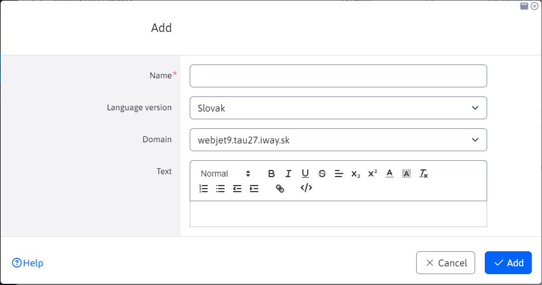
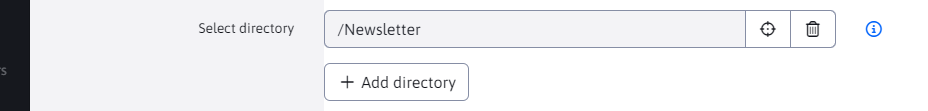

# Field types for the editor

All standard form fields can be used in the editor.

## ID

Represents a primary key column, example:

```java
public class CalendarEventsEntity {

    @Id
    @Column(name = "calendar_id")
    @GeneratedValue(strategy = GenerationType.IDENTITY, generator = "S_calendar")
    @DataTableColumn(inputType = DataTableColumnType.ID)
    private Long id;

}
```

## OPEN_EDITOR

A text field type that displays a link to open the record editor, example:

```java
    @Column(name = "title")
    @DataTableColumn(
        inputType = DataTableColumnType.OPEN_EDITOR,
        title="calendar.name",
        tab = "basic"
    )
    @NotBlank
    private String title;
```

## TEXT

Standard text field, example:

```java
    @DataTableColumn(inputType = DataTableColumnType.TEXT, title="components.contact.property.street")
    private String street;
```


## NUMBER / TEXT_NUMBER

Text field ```type="number"```, the browser typically displays arrows in the field to increase/decrease the entered value. Example:

```java
    @Column(name = "priority")
	@NotNull
    @DataTableColumn(
        inputType = DataTableColumnType.NUMBER,
        title="components.banner.priority",
		tab = "main"
    )
	private Integer priority;
```

The difference between ```NUMBER``` and ```TEXT_NUMBER``` is in the display in the data table. ```TEXT_NUMBER``` displays a rounded number, for a higher number it is displayed in text form, e.g. ```10 tis.``` instead of ```10000```. In the editor the behavior is the same (the exact value is displayed).

## PASSWORD

Text field ```type="password"``` for entering the password.

```java
    @DataTableColumn(
        inputType = DataTableColumnType.PASSWORD,
        title = "components.user.password",
        tab = "personalInfo",
        className = "required"
    )
    @Transient //toto nechceme citat z DB
    private String password;
```

## TEXTAREA

Multi-line text field. Long text does not wrap, if you want to wrap long text into multiple lines, set `className = "wrap"`:

```java
    @Column(name = "gallery_perex")
    @DataTableColumn(
        inputType = DataTableColumnType.TEXTAREA,
        title = "editor.tab.perex",
        tab = "basic"
    )
    private String perex = "";

    @DataTableColumn(
        inputType = DataTableColumnType.TEXTAREA,
        tab = "basic",
        title="components.app-cookiebar.text",
        className = "wrap",
        editor = {
        @DataTableColumnEditor(
            attr = {
                @DataTableColumnEditorAttr(
                    key = "placeholder",
                    value = "components.app-cookiebar.cookie_text")
            }
        )
    })
    private String cookie_text;
```

## DATE

Date selection, clicking in the field will display a date selection window.

```java
    @Column(name = "date_from")
	@DataTableColumn(
        inputType = DataTableColumnType.DATE,
        title="calendar.begin",
        tab = "basic"
    )
	private Date dateFrom;
```

## DATETIME

Similar field to ```DATE``` but also allows time selection.

```java
    @Column(name = "date_to")
	@DataTableColumn(
        inputType = DataTableColumnType.DATETIME,
        title="components.banner.dateTo",
		visible = false,
		tab = "restrictions"
    )
	private Date dateTo;
```

## TIME_HM and TIME_HMS

Similar fields to ```DATETIME``` but ONLY allow time selection. Version ```TIME_HM``` is time selection using hours and minutes. Version ```TIME_HMS``` allows time selection using hours, minutes and seconds.

Note the setting ```@Convert(converter = DefaultTimeValueConverter.class)``` which sets the same date for each selected time, ```01.01.2000```, while the time selection remains unchanged. This same date setting is not visible, but is important for the functionality of filtering records using these time fields.

Note that the ```DefaultTimeValueConverter``` class implements ```AttributeConverter```, which means that this converter only works if it is a column in an entity that represents a database column. If the column you have chosen does not meet this requirement, you must set its value using one of the static functions contained in the ```DefaultTimeValueConverter``` class.

```java
    @Column(name = "reservation_time_to")
    @DataTableColumn(
        inputType = DataTableColumnType.TIME_HM,
        title="components.reservation.reservation_objects.date_to",
        visible = false,
        tab = "basic"
    )
    @Convert(converter = DefaultTimeValueConverter.class)
    private Date reservationTimeTo;
```

## SELECT

Selection field, set with type ```DataTableColumnType.SELECT```.


It is important to define the options of the selection field:

### By transferring data from a REST service

When reading a data table, in addition to records, it is possible to transfer so-called ```option``` attributes. These are subsequently set as options for the specified fields. The options can be set by overriding the ```getOptions``` method.

```java
public class ContactRestController extends DatatableRestControllerV2<ContactEntity, Long> {

    @Override
    public void getOptions(DatatablePageImpl<ContactEntity> page) {

        //pridaj zoznam pre pole country
        page.addOptions("country", getCountries(), "label", "value", false);
    }

    /**
     * Vrati zoznam vyberoveho pola pre krajinu
     * @return
     */
    public static List<LabelValue> getCountries() {
        //vytvor zoznam krajin, toto by sa idealne malo citat z nejakeho ciselnika
        List<LabelValue> countries = new ArrayList<>();
        countries.add(new LabelValue("Slovenská republika", "sk"));
        countries.add(new LabelValue("Česká republika", "cz"));
        countries.add(new LabelValue("Rakúsko", "at"));

        return countries;
    }
}


public class ContactEntity {

    @DataTableColumn(inputType = DataTableColumnType.SELECT, title="components.contact.property.country")
    private String country;

}
```

Warning: if you also overwrite method ```getAll(Pageable pageable)```, the call to ```getOptions``` must be made in your code of method ```getAll```.

### By linking to the dialer

In the code list application, it is easy to create user-editable lists of data. These can be used as selection field options. This is set with the value ```enumeration:MENO-CISELNIKA```:

```java
public class ContactEntity {

    @DataTableColumn(inputType = DataTableColumnType.SELECT, tab = "basic", editor = {
        @DataTableColumnEditor(
            options = {
                //ukazka napojenia na ciselnik, mozne je zadat meno alebo ID ciselnika, vo value su mena property pre text a hodnotu option pola
                @DataTableColumnEditorAttr(key = "enumeration:Okresne Mestá", value = "string1:string2")
            }
        )
    })
    private String country;

}
```

### By linking to a Java class

If the data is retrieved in a special way, you can get a list of options by calling a Java class that returns a list of data. This is set to the value ```method:PACKAGE.TRIEDA.METODA```, while in ```value``` you can enter attribute names to retrieve text and values ​​in the format ```LABEL-PROPERTY:VALUE-PROPERTY```.

```java
public class ContactRestController extends DatatableRestControllerV2<ContactEntity, Long> {
    /**
     * Vrati zoznam vyberoveho pola pre krajinu
     * @return
     */
    public static List<LabelValue> getCountries() {
        //vytvor zoznam krajin, toto by sa idealne malo citat z nejakeho ciselnika
        List<LabelValue> countries = new ArrayList<>();
        countries.add(new LabelValue("Slovenská republika", "sk"));
        countries.add(new LabelValue("Česká republika", "cz"));
        countries.add(new LabelValue("Rakúsko", "at"));

        return countries;
    }
}

public class ContactEntity {

    @DataTableColumn(inputType = DataTableColumnType.SELECT, tab = "basic", editor = {
        @DataTableColumnEditor(
            options = {
                //ukazka ziskania zoznamu krajin volanim statickej metody, vo value su mena property pre text a hodnotu option pola
                @DataTableColumnEditorAttr(key = "method:sk.iway.basecms.contact.ContactRestController.getCountries", value = "label:value")
            }
        )
    })
    private String country;

}
```

### By listing options directly in the entity

You can list the individual options directly using the ```@DataTableColumnEditorAttr``` list, and use the translation key as the displayed text (attribute ```key```):

```java
	@Column(name = "banner_type")
    @DataTableColumn(
        inputType = DataTableColumnType.SELECT,
        title="[[#{components.banner.banner_type}]]",
		tab = "main",
		editor = {
			@DataTableColumnEditor(
				options = {
					@DataTableColumnEditorAttr(key = "components.banner.picture", value = "1"),
					@DataTableColumnEditorAttr(key = "components.banner.html", value = "3"),
					@DataTableColumnEditorAttr(key = "components.banner.content_banner", value = "4")
				}
			)
		}
    )
	private Integer bannerType;
```

Note that even if you enter values ​​into value as strings, they are correctly converted to numbers (technically, everything in the HTML code is a string, but Spring converts it correctly when sending and displaying).

## MULTISELECT

Multiple-choice selection field, type ```DataTableColumnType.MULTISELECT```. Allows you to work with an array of objects or a comma-separated list (after setting the ```separator``` attribute, in which you specify a separator character).


Usage examples:

```java
public class ContactEntity {

    @DataTableColumn(inputType = DataTableColumnType.MULTISELECT, title="multiple", filter = true, editor = {
        @DataTableColumnEditor(
            options = {
                @DataTableColumnEditorAttr(key = "method:sk.iway.basecms.contact.ContactRestController.getCountries", value = "label:value")
            }
        )
    })
    private String[] multiple;

    @DataTableColumn(inputType = DataTableColumnType.MULTISELECT, title="multipleInt", filter = true, editor = {
        @DataTableColumnEditor(
            options = {
                    @DataTableColumnEditorAttr(key = "1-Jedna", value = "1"),
                    @DataTableColumnEditorAttr(key = "2-Dva", value = "2"),
                    @DataTableColumnEditorAttr(key = "3-Tri", value = "3"),
                    @DataTableColumnEditorAttr(key = "4-Styri", value = "4"),
                    @DataTableColumnEditorAttr(key = "5-Pat", value = "5"),
            }
        )
    })
    private Integer[] multipleInt;


    @DataTableColumn(inputType = DataTableColumnType.MULTISELECT, title="multipleOddeleneCiarkou", filter = true, editor = {
        @DataTableColumnEditor(
            options = {
                    @DataTableColumnEditorAttr(key = "1-Jedna", value = "Jedna"),
                    @DataTableColumnEditorAttr(key = "2-Dva", value = "Dva"),
                    @DataTableColumnEditorAttr(key = "3-Tri", value = "Tri"),
                    @DataTableColumnEditorAttr(key = "4-Styri", value = "Styri"),
                    @DataTableColumnEditorAttr(key = "5-Pat", value = "Pat"),
            },
            separator = ","
        )
    })
    private String multipleOddeleneCiarkou;

}
```

For the ```multipleOddeleneCiarkou``` attribute, the values ​​are separated using the character defined in the ```separator``` attribute. So the value after sending will look like, for example, ```"Tri,Pat"```.

Comma separated values ​​should be used for ```MULTISELECT``` fields used for application settings (using ```@WebjetAppStore``` annotation):

```java
@WebjetComponent("sk.iway.basecms.contact.ContactApp")
@WebjetAppStore(nameKey = "Kontakty", descKey = "Ukazkova aplikacia so zoznamom kontaktov", imagePath = "ti ti-id", galleryImages = "/components/map/screenshot-1.jpg,/components/gdpr/screenshot-2.png,/components/gallery/screenshot-3.jpg")
@Getter
@Setter
public class ContactApp extends WebjetComponentAbstract {

    /**
     * Privatne vlastnosti s get/set-rami slúžia na prenesenie parametrov pageParams z !INCLUDE()! do triedy
     * Pomocou anotacie @DataTableColumn vytvarame pole pre nastavenie aplikacie
     */
    @DataTableColumn(inputType = DataTableColumnType.MULTISELECT, tab = "basic", editor = {
        @DataTableColumnEditor(
            options = {
                @DataTableColumnEditorAttr(key = "method:sk.iway.basecms.contact.ContactRestController.getCountries", value = "label:value")
            },
            separator = ","
        )
    })
    private String countries;
}
```

## CHECKBOX

Standard checkbox, allows you to work with object fields (multiple options selected). The ```unselectedValue``` attribute is used to set the value if the field is not checked.

You can also use the option to set the ```data-dt-field-headline``` attribute for a separate heading above the field list.

```java
    @DataTableColumn(
        inputType = DataTableColumnType.CHECKBOX,
        title = "editor.perex.group",
        sortAfter = "publishType",
        tab="filter",
        editor = {
            @DataTableColumnEditor(
                attr = {
                    @DataTableColumnEditorAttr(key = "unselectedValue", value = "")
                }
            )
        }
    )
	private String[] perexGroupsIds;


    @DataTableColumn(inputType = DataTableColumnType.CHECKBOX, title = "user.permissions.label", tab = "groupsTab", visible = false, editor = {
        @DataTableColumnEditor(attr = {
            @DataTableColumnEditorAttr(key = "data-dt-field-headline", value = "user.admin.editUserGroups"),
            @DataTableColumnEditorAttr(key = "unselectedValue", value = "") }) })
    private Integer[] permisions;
```

## RADIO

Standard field for selecting one of the options.

```java
    @Column(name = "sex_male")
    @DataTableColumn(
        inputType = DataTableColumnType.RADIO,
        title = "components.user.newuser.sexMale",
        tab = "personalInfo",
        editor = {
            @DataTableColumnEditor(
                options = {
                    @DataTableColumnEditorAttr(key = "reguser.male", value = "true"),
                    @DataTableColumnEditorAttr(key = "reguser.female", value = "false")
                }
            )
        }
    )
    private Boolean sexMale;
```

## BOOLEAN

Represents a simplified notation of a field of type ```CHECKBOX``` for a binary yes/no choice.

```java
    @Column(name = "require_approve")
    @DataTableColumn(
        inputType = DataTableColumnType.BOOLEAN,
        title = "groupedit.require_approve",
        tab = "basic"
    )
    private Boolean requireApprove;
```

## BOOLEAN_TEXT

Represents the type ```BOOLEAN``` for a binary yes/no option with a caption on the right instead of the left and a Yes option for a checkbox.

```java
    @DataTableColumn(inputType = DataTableColumnType.BOOLEAN_TEXT, tab = "basic", title="components.news.paging")
    private boolean pagination = true;
```

## HIDDEN

Hidden field, will not be displayed in the editor.

```java
	@Column(name = "domain_id")
	@DataTableColumn(
        inputType = DataTableColumnType.HIDDEN,
		tab="basic"
    )
	private Integer domainId;
```

## DISABLED

Displays a text field whose value cannot be changed. Note in the example that field types can be mixed. Setting ```DISABLED``` sets the HTML attribute ```disabled="disabled"```.

```java
    @Size(max = 255)
    @Column(name = "image_name")
    @DataTableColumn(inputType = {DataTableColumnType.OPEN_EDITOR, DataTableColumnType.DISABLED}, tab = "metadata", title="components.gallery.fileName")
    private String imageName;
```

## QUILL

Displays a simple HTML editor that allows basic text formatting such as bold/italic/underline, headings, lists, and links.

Note the use of the ```@jakarta.persistence.Convert(converter = AllowSafeHtmlAttributeConverter.class)``` converter, which will allow only [secure HTML code](../backend/security.md) to be sent (without embedded JavaScript elements and the like).

```java
    @Column(name = "l_description_sk")
    @DataTableColumn(
            inputType = DataTableColumnType.QUILL,
            title = "[[#{gallery.l_description}]] <span class='lang-shortcut'>sk</span>",
            tab = "description"
    )
    @jakarta.persistence.Convert(converter = AllowSafeHtmlAttributeConverter.class)
    private String descriptionLongSk;
```



If you set the CSS class ```quill-oneline```, a simplified editor will appear without the ability to create paragraphs:

```java
    @Column(name = "tooltip")
    @DataTableColumn(inputType = DataTableColumnType.QUILL, title = "components.formsimple.tooltip", className="quill-oneline", hidden = true, tab = "advanced")
    @jakarta.persistence.Convert(converter = AllowSafeHtmlAttributeConverter.class)
    private String tooltip;
```

## WYSIWYG

Displays a full-featured HTML editor as used for editing web pages.

```java
    @Column(name = "description")
    @DataTableColumn(
        inputType = DataTableColumnType.WYSIWYG,
        title = "calendar_edit.description",
        tab = "description",
        hidden = true
    )
    private String description;
```

the field must be used in a separate card that has the ```content: ''``` attribute set:

```javascript
    var tabs = [
        { id: 'basic', title: /*[[#{calendar_events.tab.basic}]]*/ 'basic', selected: true},
        { id: 'description', title: /*[[#{calendar_events.tab.description}]]*/ 'desc', content: '' },
        { id: 'advanced', title: /*[[#{calendar_events.tab.advanced}]]*/ 'adv' },
        { id: 'notification', title: /*[[#{calendar_events.tab.notification}]]*/ 'notify' }
    ];
```

## JSON

Field [adding directories and websites](field-json.md).

```java
    @DataTableColumn(inputType = DataTableColumnType.JSON, title="admin.temp.edit.showForDir", className = "dt-tree-group-array")
    private List<GroupDetails> availableGroups;
```



## DATA TABLE

Field [nested datatable in editor](field-datatable.md).

```java
    @Transient
    @DataTableColumn(inputType = DataTableColumnType.DATATABLE, title = "&nbsp;",
        tab = "folders",
        editor = { @DataTableColumnEditor(
            attr = {
                @DataTableColumnEditorAttr(key = "data-dt-field-dt-url", value = "/admin/rest/groups?userGroupId={id}"),
                @DataTableColumnEditorAttr(key = "data-dt-field-dt-columns", value = "sk.iway.iwcm.doc.GroupDetails"),
                @DataTableColumnEditorAttr(key = "data-dt-field-dt-forceVisibleColumns", value = "groupId,groupName,fullPath"),
                @DataTableColumnEditorAttr(key = "data-dt-field-dt-updateColumnsFunction", value = "updateColumnsGroupDetails"),
                @DataTableColumnEditorAttr(key = "data-dt-field-dt-hideButtons", value = "create,edit,duplicate,remove,import,celledit"),
                @DataTableColumnEditorAttr(key = "data-dt-field-full-headline", value = "user.group.groups_title"),
                @DataTableColumnEditorAttr(key = "data-dt-field-dt-serverSide", value = "false")
            }
        )
    })
    private List<GroupDetails> groupDetailsList;
```

## ELFINDER

Field for [file selection](field-elfinder.md) (file links).

```java
    @Column(name = "watermark")
    @DataTableColumn(
        inputType = DataTableColumnType.ELFINDER,
        title = "components.gallery.watermark",
        tab = "watermark"
    )
    private String watermark;
```


## JSTREE

Field for selecting [tree structure](field-jstree.md).

```java
    @DataTableColumn(inputType = DataTableColumnType.JSTREE, title = "components.user.righrs.user_group_rights", tab = "rightsTab", hidden = true,
    editor = {
        @DataTableColumnEditor(attr = {
                @DataTableColumnEditorAttr(key = "data-dt-field-headline", value = "components.user.permissions"),
                @DataTableColumnEditorAttr(key = "data-dt-field-jstree-name", value = "jstreePerms") }) })
    private String[] enabledItems;

    @DataTableColumn(inputType = DataTableColumnType.JSTREE, title = "user.permgroups.permissions.title", tab = "perms", hidden = true, editor = {
        @DataTableColumnEditor(attr = {
                @DataTableColumnEditorAttr(key = "data-dt-field-jstree-name", value = "jstreePerms") }) })
    private String[] permissions;
```


## COLOR

Color selection field in `HEX` format including transparency, e.g. `#FF0000FF`:

```java
    @DataTableColumn(inputType = DataTableColumnType.COLOR, tab = "basic", title="components.app-cookiebar.textColor")
    private String color_text;
```

## ICON

Field for entering an icon from the [Tabler Icons](https://tabler.io/icons/) set.

```java
    @Column(name = "icon")
    @DataTableColumn(inputType = DataTableColumnType.ICON, title = "components.ai_assistants.icon", tab = "basic")
    private String icon;
```

## IFRAME

Field for inserting another page into the `iframe` element, used in applications in the editor to insert, for example, a photo gallery:

```java
@WebjetComponent("sk.iway.iwcm.components.gallery.GalleryApp")
@WebjetAppStore(nameKey = "components.gallery.title", descKey = "components.gallery.desc", itemKey="menuGallery", imagePath = "/components/gallery/editoricon.png", galleryImages = "/components/gallery/", componentPath = "/components/gallery/gallery.jsp")
@DataTableTabs(tabs = {
    @DataTableTab(id = "basic", title = "components.universalComponentDialog.title", selected = true),
    @DataTableTab(id = "componentIframe", title = "components.gallery.images")
})
@Getter
@Setter
public class GalleryApp extends WebjetComponentAbstract {

    @DataTableColumn(inputType = DataTableColumnType.IFRAME, tab = "componentIframe", title="&nbsp;")
    private String iframe  = "/admin/v9/apps/gallery/?dir={dir}";

}
```

## BASE64

A field that encodes and decodes a value using the `base64` algorithm, displayed as `textarea`. It is primarily used as a field for the application in the editor to preserve special characters of the entered value. If you need to use `base64` for another type of field, you can set `className = "dt-style-base64"`.

!>**Warning:** The JavaScript function `btoa` only supports `ASCII` characters.

```java
    @DataTableColumn(
        inputType = DataTableColumnType.BASE64,
        tab = "basic",
        title="components.app-docsembed.editor_components.url",
    )
    private String url;

    @DataTableColumn(
        inputType = DataTableColumnType.ELFINDER,
        tab = "basic",
        title="components.app-docsembed.editor_components.url",
        className = "dt-style-base64"
    )
    private String url;
```

## STATIC_TEXT

Display of static text in the position of a regular input field, i.e. in the right part. Markdown syntax is supported in the translation key.

```java
    @DataTableColumn(
        inputType = DataTableColumnType.STATIC_TEXT,
        tab = "basic",
        title="components.app-vyhladavanie_info"
    )
    private String explain;
```

## IMAGE_RADIO

Displaying the selection of one of the options based on an image. Used, for example, in the Survey application. Images are obtained as a list from the file system, they need to be filled into the `options` object of the REST service response. The link to the image is entered into the `OptionDto.original` object.

By setting `className = "image-radio-horizontal"` it is possible to switch the display of options to horizontal in a row. By adding the CSS class `image-radio-fullwidth` it is possible to switch the display of the label and selection in a row instead of in a column, in which case we recommend not to have other fields in the card and to set the value `content = ""` in the card definition so that the card does not have a gray bar in the background that shades the labels.

The implementation is in the file [field-type-imageradio.js](../../../../src/main/webapp/admin/v9/npm_packages/webjetdatatables/field-type-imageradio.js).

```java
@WebjetComponent("sk.iway.iwcm.components.inquiry.InquiryApp")
@WebjetAppStore(
    nameKey = "components.inquiry.title",
    descKey = "components.inquiry.desc",
    itemKey= "cmp_inquiry",
    imagePath = "/components/inquiry/editoricon.png",
    galleryImages = "/components/inquiry/",
    componentPath = "/components/inquiry/inquiry.jsp"
)
@DataTableTabs(tabs = {
    @DataTableTab(id = "basic", title = "components.universalComponentDialog.title", selected = true),
    @DataTableTab(id = "styleSelectArea", title = "components.roots.new.style", content = ""),
    @DataTableTab(id = "componentIframeWindowTabList", title = "menu.inquiry", content = ""),
})
@Getter
@Setter
public class InquiryApp extends WebjetComponentAbstract {

    @DataTableColumn(
        inputType = DataTableColumnType.IMAGE_RADIO,
        title = "components.roots.new.style",
        tab = "styleSelectArea",
        className = "image-radio-horizontal image-radio-fullwidth"
    )
    private String style = "01";

    @DataTableColumn(
        inputType = DataTableColumnType.IMAGE_RADIO,
        title = "components.catalog.color",
        tab = "styleSelectArea",
        className = "image-radio-horizontal image-radio-fullwidth"
    )
    private String color = "01";

    @Override
    public Map<String, List<OptionDto>> getAppOptions(ComponentRequest componentRequest, HttpServletRequest request) {
        Map<String, List<OptionDto>> options = new HashMap<>();

        //style & color options
        options.put("style", DatatableTools.getImageRadioOptions("/components/inquiry/admin-styles/"));
        options.put("color", DatatableTools.getImageRadioOptions("/components/inquiry/admin-colors/"));

        return options;
    }

}
```

## UPLOAD

Field type allowing [file upload](field-file-upload.md).


```java
  @DataTableColumn(
        inputType = DataTableColumnType.UPLOAD,
        tab = "basic",
        title = "fbrowse.file"
    )
    private String file = "";
```

## OPTIONS

Field type for a dynamic list of values. In the editor, it appears as a list of input lines, where each line contains two text fields (e.g. key and value). Lines can be added, removed, and reordered using `drag & drop`.

The resulting value is stored as a string, where individual lines are separated by the `|` character and values ​​within a line are separated by the `:` character. For example: `key1:value1|key2:value2|key3:value3`.

The field does not support the AI ​​button (`btn-ai`).

```java
    @DataTableColumn(
        inputType = DataTableColumnType.OPTIONS,
        title = "components.myapp.options",
        tab = "basic"
    )
    private String options = "";
```


## ENUMERATION

Field type intended for connection to the codebook application. The editor displays one line with three inputs:

- number (ID or name of the codebook type),
- column for the text (`label`) of the item,
- column for the value (`value`) of the item.

Technically, the value is stored in the format:

`enumeration-options|ID_CISELNIKA|MENO_STLPCA_TEXTU|MENO_STLPCA_HODNOTY`

Example of the resulting value: `enumeration-options|4|string1|string2`

Supported column names are `string1` to `string12`, `decimal1` to `decimal4`, `boolean1` to `boolean4`, `date1` to `date4`.

Example of use in an entity:

```java
    @Transient
    @DataTableColumn(
        inputType = DataTableColumnType.ENUMERATION,
        title = "multistep_form.value_as_enumeration",
        tab = "advanced"
    )
    private String valueAsEnumeration;
```

This type is used mainly in forms where it is necessary to dynamically generate `<option>` values ​​from the selected code list.

