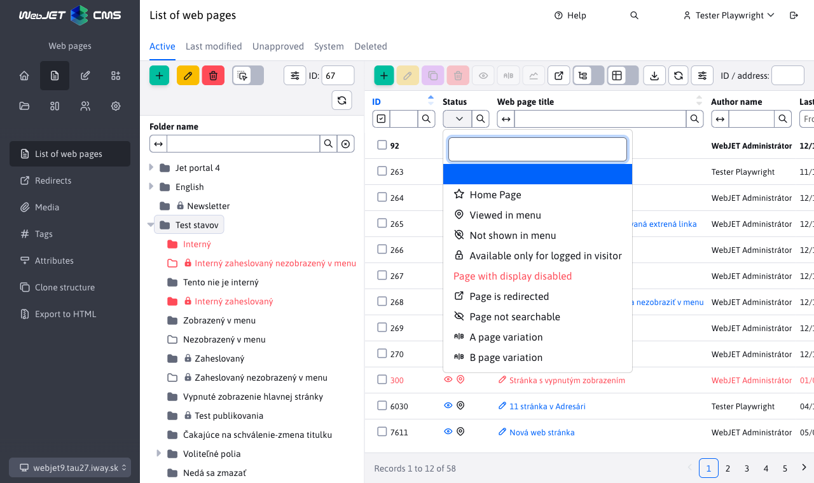

# Datatables

The [datatables.net](http://datatables.net) library is an advanced table with connections to REST services.

## Basic initialization in collaboration with Spring REST

The WebJET implementation of datatables is configured using the JSON object columns. This object contains the definition of columns for both the datatable and the datatables editor. The table is then initialized using the WJ.DataTable constructor.

However, we recommend always generating the columns object from [Java entity annotations](../datatables-editor/datatable-columns.md).

Basic example:

```javascript
script.
    let galleryTable = null;
    window.domReady.add(function () {

        //URL adresa REST sluzby
        let url = "/admin/rest/components/gallery";

        //definicia stlpcov
        let columns = [
            {
                data: "id",
                name: "id",
                title: "ID",
                defaultContent: '',
                className: 'dt-select-td',
                renderFormat: "dt-format-selector"
            },
            {
                data: "imageName",
                name: "",
                title: "",
                render: function ( data, type, row ) {
                    //specialna render funkcia pre zobrazenie obrazka galerie
                    return '<div class="img" style="background-image:url(' + row.imagePath + '/' + data +');"></div>';
                },
                className: "dt-image",
                renderFormat: "dt-format-none"
            },
            {
                data: "imageName",
                name: "imageName",
                title: "Nazov suboru",
                renderFormat: "dt-format-text",
                renderFormatLinkTemplate: "javascript:;",
                renderFormatPrefix: '<i class="ti ti-pencil"></i> ',
                className: "dt-row-edit",

                editor: {
                    type:  "text"
                }
            },
            {
                data: "imagePath",
                name: "imagePath",
                title: "Adresar",
                renderFormat: "dt-format-text",

                editor: {
                    type:  "text",
                    attr: {
                        "data-dt-field-hr": "after"
                    }
                }
            }
        ];

        /*
        options pre DataTabulku
        {
            src: zdrojove data (objekt)
            url: URL adresa rest sevisu
            serverSide: ak je nastavene na true bude sa vyhladavanie/sortovanie/strankovanie posielat na server
            columns: definicia stlpcov
            tabs: definicia zaloziek pre Editor
            hideTable: boolean po nastaveni na true sa datatabulka nezobrazi
            noAll: boolean, po nastaveni na true sa nebude k url pridavat /all pre ziskanie vsetkych zaznamov
        }
        */

        galleryTable = WJ.DataTable( {
            url: url,
            serverSide: true,
            columns: columns,
        });

    });


<table class="datatableInit table cardView cardViewS"></table>
```

## Configuration options

```javascript
    WJ.DataTable( {
        options
    });
```

Configuration options (```options```):

Minimum configuration:

- ```url {string}``` URL address of the REST service endpoint for retrieving data. To this URL, datatable adds ```/all``` to retrieve all data (if the noAll option is not set), ```findByColumns``` for searching, or ```/editor``` for storing data.
- ```columns {json}``` column definition, ideally from [Java annotations](../datatables-editor/datatable-columns.md).

**Other options:**

- ```serverSide {boolean}``` with a value of ```true``` expects to use paging and ordering on the server by calling REST services, with a value of ```false``` it performs paging and ordering locally on the initially obtained data.
- ```tabs {json}``` definition of [editor tabs](../datatables-editor/README.md#editor-tabs).
- ```id {string}``` unique identifier of the data table, if not specified the value ```datatableInit``` will be used. Especially necessary if you have multiple data tables in one web page.
- ```editorId {string}``` unique editor identifier, if not specified, the value ```id``` will be used. Especially necessary if you have multiple data tables in one web page.
- ```onXhr {function}``` JavaScript function that is called after [data loading](https://datatables.net/reference/event/xhr) in the form of ```function ( TABLE, e, settings, json, xhr ) {}```.
- ```onPreXhr(TABLE, e, settings, data) {function}``` JavaScript function, which is called [before loading data](https://datatables.net/reference/event/preXhr), allows you to add parameters to the sent data. These are specified with the prefix ```fixed_``` to distinguish them from the standard datatable parameters. Example: ```onPreXhr: function(TABLE, e, settings, data) { data.fixed_searchFilterBotsOut = $('#botFilterOut').is(':checked'); }```.
- ```onEdit(TABLE, row, dataAfterFetch, dataBeforeFetch) {function}```: JavaScript function that is called after clicking on the record edit link. It receives as parameters: ```TABLE``` - datatable instance, ```row``` - jQuery object of the row that was clicked, ```dataAfterFetch``` - when the function is enabled ```fetchOnEdit``` json data obtained after its renewal, ```dataBeforeFetch``` original JSON data of the row before calling its renewal. You can then open the standard editor by calling ```TABLE.wjEdit(row);```. An example of its use is in [web-pages-list.pug](../../../../src/main/webapp/admin/v9/views/pages/webpages/web-pages-list.pug).
- ```fetchOnCreate {boolean}``` when set to true, a REST call with value -1 will be made to get the new object data before creating a new record. The values ​​are set by calling ```EDITOR.setJson(json)``` implemented in ```$.fn.dataTable.Editor.prototype.setJson``` in the ```initCreate``` event.
- ```fetchOnEdit {boolean}``` after setting to true, a REST call will be made before editing the record to obtain the current data of the edited record. When using a datatable, e.g. for a web page, the given record is updated from the server before opening the editor and the latest version is always opened in the editor. Implemented via JS function ```refreshRow``` and customer button ```$.fn.dataTable.ext.buttons.editRefresh``` which replaces the standard button ```edit```.
- ```idAutoOpener {boolean}``` allows you to disable [automatic editor opening](../libraries/datatable-opener.md) by setting it to ```false``` and insert a field for entering the ID into the table header.
- ```hideTable {boolean}``` after setting to ```true``` the data table will not be displayed on the page (it will be hidden).
- ```jsonField {function}``` definition for a [json type] field(../datatables-editor/field-json.md#using-specific-json-objects).
- ```order {array}``` default [arrangement method](#arrangement) of the table.
- ```paging {boolean}``` false disables datatable paging (all data returned from the server will be displayed, the option to set the page size will not be displayed).
- ```nestedModal {boolean}``` if set to true, this is a datatable inserted as a field in the editor - [nested datatable](../datatables-editor/field-datatable.md), the nested table has the CSS class ```DTE_nested_modal``` added.
- ```noAll {boolean}``` by default adds ```/all``` to the set URL to retrieve all data, by setting ```noAll``` to ```false```, ```/all``` will not be added, but the search will not be functional either.
- ```initialData {variable}``` data for initial display (without needing to call the REST service), see documentation for [optimization of display speed](../apps/webpages/README.md) of the web page list. Technically, if this object is set, the REST service is not called on the first display, but the specified data is used.
- ```initialData.forceData {boolean}``` after setting to ```true``` the initial data will be used regardless of its size, it is typically used when the initial data is an empty object, because it will be subsequently obtained in a different way. To obtain empty data you can use the ```initialData:  dtWJ.getEmptyData(true)``` function.
- ```hideButtons {string}``` comma-separated list of button names that should be automatically hidden (not displayed) in the data table, e.g. ```create,edit,duplicate,remove,import,celledit```.
- ```removeColumns {string}``` comma-separated list of columns that should not be displayed, even if they are in the definition (e.g. if you display the datatable in multiple places and do not need all columns). E.g. ```whenToPublish,datePublished```.
- ```forceVisibleColumns``` comma-separated list of columns to display (override user-defined columns), typically used in a nested datatable where only some columns need to be displayed.
- ```updateColumnsFunction``` name of the JavaScript function that will be used to modify the list of columns. Typically used in a nested data table where it is necessary to add/modify the displayed columns (see example below).
- ```perms``` sets [rights to display buttons](#buttons-by-rights) to add, edit, duplicate and delete data
- ```lastExportColumnName``` if specified, displays the option to export not yet exported data in the export dialog (used in forms). The value represents the name of the column that is added as a ```NULL``` condition to the data selection (needs to be implemented correctly in the REST service).
- ```byIdExportColumnName``` if specified in the export dialog will enable export by selected rows. The value is the name of a column in the database with an ID value (typically id, used in forms). Filtering needs to be implemented as ```predicates.add(root.get("id").in(idsList));``` in the REST service.
- ```editorButtons``` array of buttons that will be displayed in the editor. Example ```editorButtons: [ {title: "Uložiť", action: function() { this.submit(); } }, { title: ...} ]```. Uses the Datatables Editor API.
- ```createButtons``` button field for adding a new record, format same as for ```editorButtons```.
- ```keyboardSave {boolean}``` - ​​setting it to the value ```false``` disables the ability to save a record in the editor using the keyboard shortcut ```CTRL+S/CMS+S```.
- ```stateSave {boolean}``` - ​​setting it to the value ```false``` disables the ability to remember column order and table layout in the browser.
- ```customFieldsUpdateColumns {boolean}``` - ​​by setting it to the value ```true```, when retrieving [optional fields](../datatables-editor/customfields.md), the column names in the table and in the displayed column settings are also updated (by default, with the value ```false```, the names of optional fields are updated only in the editor).
- `customFieldsUpdateColumnsPreserveVisibility {boolean}` - ​​setting to the value `true` will preserve the column display setting for the `customFieldsUpdateColumns` mode for the user. It can only be used if the columns for the data table are not changed during display. For example, in the Translation keys section, the data does not change, it can be set to `true`, but in the Code lists section, the columns also change when the code list is changed, this option is not applicable there.
- ```autoHeight {boolean}``` - ​​by default the table calculates its height to make maximum use of the window space. By setting it to ```false``` the table will have a height based on the content (number of rows).
- ```editorLocking {boolean}``` - ​​by default the table calls the notification service when the same record is edited by multiple users, if this is undesirable, set it to the value `false`.
- ```updateEditorAfterSave {boolean}``` - ​​setting to ```true``` updates the editor contents after saving the data (if the editor remains open).
- `onClose(TABLE, EDITOR, e)` - ​​function called when clicking the Cancel button or closing the editor. Parameters: `TABLE` - datatable instance, `EDITOR` - editor instance, `e` - event object. If it returns `false` the window will not close. It is used, for example, in `web-pages-datatable.js` to check changes in the editor before closing.
- `toggleSelector` – CSS selector that determines which element triggers row selection in a table. The default value is `td.dt-select-td`, which means that row selection will only be performed by clicking on a cell with this class (typically a column with an ID). You can override this setting (e.g. to `tr`) to select a row by clicking anywhere on the row.
- `toggleStyle` – row selection mode. The default value is `multi` (multiple rows can be selected at once). Setting it to `single` limits the selection to just one row (suitable if only one row should be editable at a time).

```javascript
let columns = [
    {
        data: "audit",
        name: "audit",
        title: "Auditované",

        renderFormat:   "dt-format-checkbox"
                        "dt-format-selector"
                        "dt-format-text"
                        "dt-format-text-wrap"
                        "dt-format-none"
                        "dt-format-date-time"
                        "dt-format-select" //moznosti bere z editor: { options: }

        renderFormatLinkTemplate:   "javascript:;",
                                     "/temps-list.html"
        renderFormatPrefix: '<i class="ti ti-pencil"></i> ',
        renderHideValue: false, //TODO ???
        render: function ( data, type, row ) {
            //console.log("data", data, "type", type, "row", row);
            return '<div class="img" style="background-image:url(' + row.imagePath + '/' + data +');"></div>';
        },

        className: "dt-image",

        defaultContent: '',

        perms: "multiDomain" //stĺpec sa zobrazí len ak používateľ má právo multiDomain

    }
];

//Ukazka pouzitia updateColumnsFunction
//@DataTableColumnEditorAttr(key = "data-dt-field-dt-updateColumnsFunction", value = "updateColumnsGroupDetails"),
    function updateColumnsGroupDetails(columns) {
        //doplnenie kliknutia na stlpec fullPath
        WJ.DataTable.mergeColumns(columns, {
            name: "fullPath",
            renderFormatLinkTemplate: "javascript:openGroupDetails({{groupId}})"
        });
    }
    function openGroupDetails(groupId) {
        window.open("/admin/v9/webpages/web-pages-list/?groupid="+groupId);
    }
```

**Initializing search:**

There may be cases when you need to immediately initialize a (remembered) search when displaying a table. This is used in the Statistics application, which remembers the range of dates set from-to. The search criteria are applied already at the first call to the REST service. The option is set by a JSON object in ```options.defaultSearch```. It contains a list of selectors with a value that are applied to the filter before the first call to the REST service, e.g.:

```json
{
    ".dt-filter-from-dayDate": "06.06.2022",
    ".dt-filter-to-dayDate": "22.08.2022"
}
```

Example of use with browser memory:

```javascript
//inicializacia datatabulky
errorDataTable = WJ.DataTable({
    url: url,
    serverSide: false, //false lebo sa nevyužíva repositár
    columns: columns,
    id: "errorDataTable",
    idAutoOpener: false,
    defaultSearch: ChartTools.getSearchCriteria(),
    onPreXhr: function(TABLE, e, settings, data) {
        //console.log('onPreXhr, url=', $('#searchUrl').val());
        data.fixed_searchurl = $('#searchUrl').val();
    }
});
//Onchange events - update table
$("#errorDataTable_extfilter").on("click", "button.filtrujem", function() {
    //reload table values
    ChartTools.saveSearchCriteria(errorDataTable.DATA);
    errorDataTable.ajax.reload();
});

//appModule
/**
 * Save last search criteria to session storage, so all stats page will have same criteria when loaded
 * @param {*} DATA
 */
export function saveSearchCriteria(DATA) {
    var inputs = [".dt-filter-from-dayDate", ".dt-filter-to-dayDate", "#rootDir", "#botFilterOut", "#searchUrl", ".dt-filter-lastLogon"];
    var defaultSearch = {};

    for (const name of inputs) {
        var value = $("#"+DATA.id+"_extfilter "+name).val();
        if ("true"===value) {
            //it's checkbox
            value = $("#"+DATA.id+"_extfilter "+name).is(":checked");
        }
        if (value != "" && value != "-1" && value != "false") defaultSearch[name] = value;
    }
    var json = JSON.stringify(defaultSearch);
    if (json != "{}") window.sessionStorage.setItem("webjet.apps.stat.filter", json);
    else window.sessionStorage.removeItem("webjet.apps.stat.filter");
}

/**
 * Gets saved search criteria from session storage
 * @returns
 */
export function getSearchCriteria() {
    var defaultSearch = window.sessionStorage.getItem("webjet.apps.stat.filter");
    if ("{}"==defaultSearch) defaultSearch = null;
    if (defaultSearch != null) {
        defaultSearch = JSON.parse(defaultSearch);
        for (const property in defaultSearch) {
            var value = defaultSearch[property];
            if (property == "#rootDir") {
                var $property = $(property)
                $property.val(value);
                $property.selectpicker("val", value);
            }
            if (property == "#botFilterOut") {
                $("#botFilterOut").prop("checked", value);
            }
            if (property == "#searchUrl") {
                $("#searchUrl").val(value);
            }
        }
    }
    return defaultSearch;
}
```

### Column settings

```renderFormat```:

- ```dt-format-selector``` - zaškrtávacie pole na označenie riadku, malo by byt ako prvý stĺpec
- ```dt-format-none``` - stĺpec nebude mať žiadne možnosti v hlavičke
- ```dt-format-text, dt-format-text-wrap``` - štandardný text, ```escapuje``` HTML kód
- ```dt-format-select``` - výberové pole
- ```dt-format-checkbox``` - HTML typ ```checkbox```
- ```dt-format-boolean-true, dt-format-boolean-yes, dt-format-boolean-one``` - ```true/false``` možnosti
- ```dt-format-number, dt-format-percentage``` - zobrazenie čísla
- ```dt-format-number--decimal, dt-format-percentage--decimal```
- ```dt-format-number--text``` - zobrazí zaokrúhlené číslo, pri vyššom čísle vypíše v textovej podobe, napr. ```10 tis.``` namiesto ```10000```
- ```dt-format-filesize``` - formátovanie veľkosti súboru ako `10,24 kB`
- ```dt-format-date, dt-format-date-time, dt-format-date--text, dt-format-date-time--text``` - dátum/čas, filter zobrazí od-do
- ```dt-format-link``` - zobrazí text ako odkaz, možnosť použiť ```renderFormatLinkTemplate```
- ```dt-format-image``` - zobrazí malý náhľad obrázku a odkaz na jeho plné zobrazenie, pod obrázkom je text linky na obrázok.
- ```dt-format-image-notext``` - zobrazí malý náhľad obrázku a odkaz na jeho plné zobrazenie bez textu linky.
- ```dt-format-mail``` - zobrazí text ako email odkaz
- ```dt-row-edit``` - umožní editáciu riadku

Ak potrebujete aby stĺpec mal špecifickú (maximálnu) šírku je potrebné túto nastaviť pomocou CSS na oba riadky v hlavičke pomocou CSS štýlu ```max-width```. Príklad:

```css
.datatableInit {
    thead tr {
        th.dt-th-editorFields-statusIcons {
            width: 75px;
            max-width: 75px;
        }
    }
}
```

Setting ```max-width``` will ensure the column width is set. Datatable will calculate the remaining widths. Be careful, if the text exceeds the specified width, it will stretch other columns in the table itself, then the width of the header and table will not fit, it is necessary to set the ```overflow``` property on the given cell. You can add the necessary CSS style to the cell by setting the ```className``` attribute in the annotation.

### View HTML code

Datatable defaults to ```escapuje``` HTML characters into entities to prevent unwanted HTML code execution. If you need to display HTML code in a cell, you can set the ```className``` CSS style ```allow-html``` in the annotation attribute, which will allow HTML code execution in the cell. However, be careful with this usage to avoid XSS errors.

```java
    @DataTableColumn(
        inputType = DataTableColumnType.TEXTAREA,
        title="[[#{admin.conf_editor.value}]]",
        className = "allow-html"
    )
    private String value;
```

## Adding/removing buttons

It is possible to remove/add buttons in ```toolbare``` via the API:

```javascript
//odstranenie tlacitka (kazde tlacitko ma atribut dt-dtbtn podla ktoreho viete zistit jeho meno)
galleryTable.hideButton("create");
galleryTable.hideButton("import");
galleryTable.hideButton("export");

//pridanie tlacitka na 5 poziciu
let buttonCounter = 5;
galleryTable.button().add(buttonCounter++, {
    text: 'S',
    action: function (e, dt, node) {
        switchGallerySize(e, dt, node, 'S');
    },
    className: 'btn btn-outline-secondary btn-gallery-size active',
    attr: {
        'title': 'Size S'
    }
});

galleryTable.button().add(buttonCounter++, {
    text: '<i class="ti ti-list-details"></i>',
    action: function (e, dt, node) {
        console.log("btn, e=",e,"dt=",dt,"node=",node);
        //ziskaj data selectnuteho riadku
        let selectedRows = dt.rows({ selected: true }).data();
    },
    init: function ( dt, node, config ) {
        //zobraz tlacidlo aktivne iba ked je oznaceny aspon jeden riadok
        $.fn.dataTable.Buttons.showIfRowSelected(this, dt);
        //ALEBO ked je oznaceny PRESNE jeden riadok
        //$.fn.dataTable.Buttons.showIfOneRowSelected(this, dt);
    },
    className: 'btn btn-outline-secondary btn-gallery-size',
    attr: {
        //zobrazi tooltip po prechode mysou
        title: 'Table view',
        'data-toggle': 'tooltip'
    }
});

//wrapnutie 4 tlacitok do grupy (v galerii prepinanie velkosti SMLT)
$('.btn-gallery-size').wrapAll('<div class="btn-group-wrapper buttons-divider-both" data-toggle="tooltip" data-original-title="Veľkosť obrázkov"><div class="btn-group btn-group-toggle gallery-buttons-size" /></div>');

//znova zobrazenie tlacidla
galleryTable.showButton("export");
```

The following calls can be used in the `init` function:

- `$.fn.dataTable.Buttons.showIfRowSelected(this, dt);` - ​​button is active only if at least one row is selected
- `$.fn.dataTable.Buttons.showIfRowUnselected(this, dt);` - ​​button is active only if no row is selected
- `$.fn.dataTable.Buttons.showIfOneRowSelected(this, dt);` - ​​button is active only if exactly one row is selected

## Button for performing a server action

The data table offers the option to add a button to perform a server action (e.g. rotate an image, delete all records).

The JS function ```nejakaTable.executeAction(action, doNotCheckEmptySelection, confirmText, noteText, customData = null, forceIds = null)``` has parameters:

- ```action``` (String) - the name of the action that will be sent to the server for execution.
- ```doNotCheckEmptySelection``` (true) - setting to ```true``` will not check if any rows are selected and the value -1 will be sent to the REST service as the selected row ID. This is suitable for buttons that do not need to have rows selected, e.g. Refresh all records and the like.
- ```confirmText``` (String) - if specified, a confirmation will be displayed before performing the action (e.g. Are you sure you want to ...?).
- ```noteText``` (String) - additional text displayed above the buttons to confirm the execution of the action (e.g. The operation may take several minutes).
- `customData` - ​​object added to the REST service call as parameter `customData` (e.g. additional data required for correct execution of the action).
- `forceIds` - ​​a number or array of numbers with the value ID of the record for which the action should be performed. Used if you need to invoke an action by clicking on the status icon (without needing to mark the row).

On the server, the REST service executes the call ```/action/rotate``` implemented in the [DatatableRestControllerV2.processAction](../../../../src/main/java/sk/iway/iwcm/system/datatable/DatatableRestControllerV2.java) method. The REST service is sent a list of selected rows (their IDs), which is processed in the DatatablesRestControllerV2.action method.

**Example of use** - added button to ```toolbaru``` above the data table with an action call:

```javascript
cacheObjectsTable.button().add(3, {
    extends: 'remove',
    editor: cacheObjectsTable.EDITOR,
    text: '<i class="ti ti-camera"></i>',
    action: function (e, dt, node) {
        cacheObjectsTable.executeAction("deletePictureCache", true, "[[\#{components.data.deleting.imgcache.areYouSure}]]", "[[\#{components.data.deleting.imgcache.areYouSureNote}]]");
    },
    className: 'btn btn-danger',
    attr: {
        'title': '[[\#{components.memory_cleanup.deleteImageCache}]]',
        'data-toggle': 'tooltip'
    }
});
```

Button also with a check that a row is selected (in init option):

```javascript
galleryTable.button().add(buttonCounter++, {
    extends: 'remove',
    editor: galleryTable.EDITOR,
    text: '<i class="ti ti-repeat"></i>',
    action: function (e, dt, node) {
        //console.log("Rotate, e=",e," dt=",dt," node=",node);
        galleryTable.executeAction("rotate");
    },
    init: function ( dt, node, config ) {
        $.fn.dataTable.Buttons.showIfRowSelected(this, dt);
    },
    className: 'btn btn-outline-secondary',
    attr: {
        'title': 'Otočiť',
        'data-toggle': 'tooltip'
    }
});
```

The action triggers the following events:

- `WJ.DT.executeAction` - ​​after successful execution of the action.
- `WJ.DT.executeActionCancel` - ​​after an unsuccessful action, or after clicking the Cancel button when confirming the action.

## Buttons by rights

If you need to display buttons based on rights (e.g. Add button only if the user has a certain right), you can add the ```perms``` attribute to the datatable configuration:

```javascript
webpagesDatatable = WJ.DataTable({
    url: webpagesInitialUrl,
    ...
    perms: {
        create: 'addPage',
        edit: 'pageSave',
        duplicate: 'pageSaveAs',
        remove: 'deletePage'
    }
});
```

The definition in the ```perms``` object defines a specific right name for the individual operations of creating (```create```), editing (```edit```), duplicating (```duplicate```) and deleting (```remove```) a record.

Setting permissions will stop showing the buttons in the toolbar and will also not show the save/add/delete record button in the editor dialog box (the buttons will be hidden when the editor window is displayed).

The table provides an API for verifying rights as ```TABLE.hasPermission(action)```:

```javascript
if (webpagesDatatable.hasPermission("create")) {
    ...
}
```

!>**Warning:** do not rely only on checking permissions on the frontend, permissions need to be checked in the REST service or service class as well. You can use the [beforeSave or beforeDelete](restcontroller.md#prevent-deletion--editing-of-record) methods.

## Row styling

Sometimes it is necessary to set the CSS style of the entire row (e.g. bold font for the main page, or red for unavailable). To transfer this additional data, we use the transfer of nested attributes via the [EditorFields](../datatables-editor/datatable-columns.md#nested-attributes) object. We created the [BaseEditorFields](../../../../src/main/java/sk/iway/iwcm/system/datatable/BaseEditorFields.java) class, which has a method ```addRowClass(String addClass)``` for adding a CSS class to the row.

An example of usage is in [DocEditorFields](../../../../src/main/java/sk/iway/iwcm/doc/DocEditorFields.java):

```java
...
public class DocEditorFields extends BaseEditorFields {
    public void fromDocDetails(DocDetails doc) {
        ...
        //hlavna stranka adresara
        if (groupDetails != null && doc.getDocId()>0 && groupDetails.getDefaultDocId()==doc.getDocId()) {
            addRowClass("is-default-page");
        }

        //vypnute zobrazovanie
        if (doc.isAvailable()==false) addRowClass("is-not-public");
    }
}
```

The following CSS row styles are available:

- ```is-disabled``` - ​​represents an inactive item, displayed in red font.
- ```is-disapproved``` - ​​represents an unapproved item, displayed in red font.
- ```is-default-page``` - ​​represents the main web page of the directory, displayed in bold.
- ```is-not-public``` - ​​represents a non-public item, displayed in red font.

Setting the CSS style of a row is implemented in [index.js](../../../../src/main/webapp/admin/v9/npm_packages/webjetdatatables/index.js) using the ```rowCallback``` option of the datatable constructor. It checks for the existence of the ```data.editorFields.rowClass``` property and if it exists, applies the value to the row.

You can also set the row style in JavaScript code (e.g. based on attributes) using the ```onRowCallback``` option. You can easily mark rows as inactive with the ```is-not-public``` CSS style.

```javascript
domainRedirectTable = WJ.DataTable({
    url: '/admin/rest/settings/domain-redirect',
    columns: columns,
    serverSide: false,
    editorId: "redirectId",
    onRowCallback: function(TABLE, row, data) {
        if (data.active === false) $(row).addClass("is-not-public");
    }
});
```

## Status icons

Sometimes it is necessary to display record status icons (e.g., icons Not displayed in menu, Redirected page, etc. in web pages). To transfer this additional data, we use the transfer of nested attributes via the [EditorFields](../datatables-editor/datatable-columns.md#nested-attributes) object. We created the [BaseEditorFields](../../../../src/main/java/sk/iway/iwcm/system/datatable/BaseEditorFields.java) class, which has the method ```addStatusIcon(String className)```. The icons are from the FontAwesome set.



An example of its use is in [DocEditorFields](../../../../src/main/java/sk/iway/iwcm/doc/DocEditorFields.java). It is necessary to define the attribute ```statusIcons``` with the ```@DataTableColumn``` annotation to display the column. It is displayed as a selection field, we recommend defining an icon and descriptive text in the ```options``` attribute. Search conditions are transmitted as ```value``` (see below):

```java
...
public class DocEditorFields extends BaseEditorFields {

    @DataTableColumn(inputType = DataTableColumnType.SELECT, title = "webpages.icons.title",
        hiddenEditor = true, hidden = false, visible = true, sortAfter = "id", className = "allow-html", orderable = false,
        editor = { @DataTableColumnEditor(
            options = {
                @DataTableColumnEditorAttr(key = "<i class=\"ti ti-map-pin\"></i> [[#{webpages.icons.showInMenu}]]", value = "showInMenu:true"),
                @DataTableColumnEditorAttr(key = "<i class=\"ti ti-map-pin-off\"></i> [[#{webpages.icons.notShowInMenu}]]", value = "showInMenu:false"),
                @DataTableColumnEditorAttr(key = "<i class=\"ti ti-lock-filled\"></i> [[#{webpages.icons.onlyForLogged}]]", value = "passwordProtected:notEmpty"),
                @DataTableColumnEditorAttr(key = "<span style=\"color: #E00028\">[[#{webpages.icons.disabled}]]</span>", value = "available:false"),
                @DataTableColumnEditorAttr(key = "<i class=\"ti ti-external-link\"></i> [[#{webpages.icons.externalLink}]]", value = "externalLink:notEmpty"),
                @DataTableColumnEditorAttr(key = "<i class=\"ti ti-eye\"></i> [[#{webpages.icons.notSearchable}]]", value = "searchable:false")
            }
        )}
    )
    private String statusIcons;

    public void fromDocDetails(DocBasic doc, boolean loadSubQueries) {
        //ikony
        if (doc.isShowInMenu()) addStatusIcon("ti ti-map-pin");
        else addStatusIcon("ti ti-map-pin-off");
        if (Tools.isNotEmpty(doc.getExternalLink())) addStatusIcon("ti ti-external-link");
        if (doc.isSearchable()==false) addStatusIcon("ti ti-eye-off");
        if (Tools.isNotEmpty(doc.getPasswordProtected())) addStatusIcon("ti ti-lock-filled");
    }

    public getStatusIcons() {
        return getStatusIconsHtml();
    }
}
```

If you need to add something to the status icons programmatically (in the case of web pages, this is a link to view the page), you can edit the status icons directly in the code (in that case, do not implement the ```getStatusIcons``` method):

```java
    public void fromDocDetails(DocDetails doc) {
        ...
        StringBuilder iconsHtml = new StringBuilder();

        //pridaj odkaz na zobrazenie stranky
        Prop prop = Prop.getInstance();
        String link = "/showdoc.do?docid="+doc.getDocId();
        if (doc instanceof DocHistory) {
            //v history je otocene docid a historyid
            link = "/showdoc.do?docid="+doc.getId()+"&historyId="+doc.getDocId();
        }
        iconsHtml.append("<a href=\""+link+"\" target=\"_blank\" title=\""+ResponseUtils.filter(prop.getText("history.showPage"))+"\"><i class=\"ti ti-eye\"></i></a> ");

        iconsHtml.append(getStatusIconsHtml());
        statusIcons = iconsHtml.toString();
        ...
    }
```

The search after selecting a filter option is implemented in ```DatatableRestControllerV2.addSpecSearchStatusIcons``` and is called automatically when calling ```addSpecSearch``` (if you extend this method, you must call it implicitly), the repository must extend ```JpaSpecificationExecutor```. The following search options are currently supported:

- ```property:true``` - ​​the value of attribute ```property``` is ```true```
- ```property:false``` - ​​the value of attribute ```property``` is ```false```
- ```property:notEmpty``` - ​​the value of the attribute ```property``` is not empty
- ```property:empty``` - ​​the value of the attribute ```property``` is empty (null or '')
- ```property:%text%``` - ​​the value of the attribute ```property``` contains the specified text (```like``` search)
- ```property:!%text%``` - ​​attribute value ```property``` does not contain the specified text (```not like``` search)

## View data based on rights

In the columns definition, you can set the required permission for displaying a given column in the datatable or in the editor using the ```perms``` attribute. Example in the file [redirect.pug](../../../../src/main/webapp/admin/v9/views/pages/settings/redirect.pug):

```javascript
{
    data: "domainName",
    name: "domainName",
    title: "[[\#{groupedit.domain}]]",
    editor: {
        type: "text"
    },
    renderFormat: "dt-format-text",
    renderFormatLinkTemplate: "javascript:;",
    renderFormatPrefix: '<i class="ti ti-pencil"></i> ',
    className: "dt-row-edit",
    perms: "multiDomain" //stĺpec sa zobrazí len ak používateľ má právo multiDomain
},
```

When displaying a page, WebJET generates a JS field ```nopermsJavascript``` in the HTML code, which contains a list of modules that the user does not have rights to. It also generates a CSS style with classes ```.noperms-menomodulu``` and ```display: none``` set.

## Arrangement

Datatable supports setting the order with the [order:](https://datatables.net/reference/option/order) attribute. This can be passed as ```option``` when initializing the table. However, due to pugjs/thymeleaf parsing, it is not possible to write the expression ```[[0, 'asc']]``` directly, as Thymeleaf will execute it. You need to prepare the order field by looping through a variable and pushing:

```javascript
var order = [];
order.push([5, 'desc']);

configurationDatatable = WJ.DataTable({
    url: "/admin/v9/settings/configuration",
    columns: columns,
    order: order
});
```

This trickes the Thymeleaf parser and the array for ordering is defined correctly.

## Searches

**HTML tag filtering**

The data table in **local search** (does not apply to server search) filters HTML tags by default and searches only in the text (ignores the content of HTML tags). This is an undesirable state for fields of type ```textarea``` where HTML code is entered (e.g. script code in the Scripts application). Consequently, the search will not find the term in the HTML code.

The html-input search type has been added to index.js, which does not filter HTML tags ```$.fn.dataTableExt.ofnSearch['html-input'] = function(value)...```. In ```columnDefs``` it is automatically set for columns with CSS style ```dt-format-text-wrap``` (set automatically by annotation ```DataTableColumnType.TEXTAREA```) or ```html-input```.

## External filter

In addition to displaying filters in the header of each table column, it is possible to add a separate filter field anywhere in the HTML code of the page. An example is [Delete database records](../../../../src/main/webapp/admin/v9/views/pages/settings/database-delete.pug) where the filter is moved directly to the page header next to the title.

In the pug file, it is necessary to prepare the basic HTML structure by creating a div container with ID ```TABLEID_extfilter```. In it, div elements with CSS class ```dt-extfilter-title-FIELD``` are searched, in which the column name is inserted, and ```dt-extfilter-FIELD``` is inserted, in which the search field is inserted.

```pug
div#dateDependentEntriesTable_extfilter
    div.row.datatableInit
        div.col-auto.dt-extfilter-title-from
        div.col-auto.dt-extfilter.dt-extfilter-from
```

!>**Warning:** The search field element has both CSS classes ```.dt-extfilter``` and ```.dt-extfilter-FIELD```, both must be used. According to CSS class ```.dt-extfilter```, the element is searched for after clicking on the magnifying glass, the data attribute ```data-column-index``` stores the column number.

If you want to move the filter to the page header, you can simply move it using jQuery as in [database-delete.pug](../../../../src/main/webapp/admin/v9/views/pages/settings/database-delete.pug).

**Implementation Notes:**

Internally, by clicking on the magnifying glass icon, the entered filter text is transferred to the datatable filter and is also stored in the ```TABLE.DATA.columns[inputIndex].searchVal``` object. This is available for AJAX calls. In the ```datatable2SpringData``` function, the ```.searchVal``` values ​​for the external filter are then searched and, if set, added to the search parameters for the AJAX request.

This solution was chosen because it allows for reuse of existing code for calculating the search value (mainly for dates), while columns using an external filter can have the ```filter=false``` attribute set in ```@DatatableColumn anotácii```.

## Export/import

Implemented system for importing and exporting data between datatables. For each datatable after it is created and set up, verify the functionality of import and export. Also verify all import options, including column-based matching. If you do not want to use export/import, disable the buttons with the code (datatableInstance is the name of the datatable instance):

```javascript
datatableInstance.hideButton("import");
datatableInstance.hideButton("export");
```

If you need to omit a column from the export, just set/add the value ```not-export``` to the ```columns``` attribute ```className```:

```java
@DataTableColumn(
    inputType = DataTableColumnType.TEXT,
    title="[[#{components.banner.fieldName}]]",
    className = "not-export"
)
private String fieldName;
```

More information can be found in the [developer](export-import.md) or [editor](../../redactor/datatables/export-import.md) documentation.

## API calls

```javascript
//zoznam selectnutych riadkov
galleryTable.rows( { selected: true }).data();
//zmena URL adresy
galleryTable.setAjaxUrl("/admin/rest/nova-url");
//refresh dat
galleryTable.ajax.reload();
//nastavenie filtra a reload dat
galleryTable.columns(3).search("^"+virtualPath+"$").draw();

//nastavenie JSON dat do aktualneho editora
EDITOR.setJson(json);
//aktualne editovane data (json objekt)
EDITOR.currentJson

//options z odpovede REST služby pre rendering (potrebujeme pre export číselníkových dáta)
TABLE.DATA.jsonOptions
//kompletná URL adresa posledného REST volania
TABLE.DATA.urlLatest
//všetky parametre posledného REST volania (aktuálna stránka, veľkosť stránky, filtre)
TABLE.DATA.urlLatestParams

//schovanie/zobrazenie tlacidla - name je hodnota atributu data-dtbtn button elementu
TABLE.hideButton(name);
TABLE.hideButtons(['name1', 'name2']);
TABLE.showButton(name);

//deaktivuje rezim editacie bunky (ak je zapnuty) - ak cez karty prepinate obsah datatabulky vzdy deaktivujte rezim editacie bunky
TABLE.cellEditOff()

/**

- Vypocita/prepocita velkost stranky (zobrazeny pocet zaznamov)
- @param {*} updateLengthSelect - ak je true aj sa reloadnu udaje (napr. pri zmene velkosti obrazka v galerii)
 */
TABLE.calculateAutoPageLength(updateLengthSelect)
```

## Code samples

### Listening for a table refresh event

Clicking the ```reload``` button will trigger the ```WJ.DTE.forceReload``` event, which you can listen to and, for example, update the tree structure:

```javascript
window.addEventListener('WJ.DTE.forceReload', (e) => {
    //console.log("FORCE RELOAD listener, e=", e);
    $('#SomStromcek').jstree(true).refresh();
}, false);
```

### Changing the values ​​of a selection field

If you need to dynamically change the options of the `select` selection field, in addition to changing the `option` objects, you also need to set the `_editor_val` attribute, which will be used as the selected value. An example is for a nested data table, where it was necessary to load the options into the selection field based on the value.

```javascript
var documentItemsEventsBinded = false;
window.addEventListener("WJ.DTE.opened", function(e) {
    if ("datatableFieldDTE_Field_documentItems"===e.detail.id) {
        let select = document.getElementById("DTE_Field_adressId");
        //reset options
        select.options.length=0
        $.ajax({
            url: "/admin/rest/apps/appname/list/" + $("#DTE_Field_customerId").val(),
            success: function(data) {
                if (data) {
                    $.each(data, function (i, item) {
                        let option = new Option(item.label, item.value);
                        //this value is important, DT use this value instead of option.value
                        option._editor_val = item.value;
                        select.add(option);
                    });
                    //refresh selectpicker
                    $(select).selectpicker('refresh');
                }
            }
        });
    }
});
```

## Footer for sum of values

The table offers the option to set automatic addition of values ​​of selected numeric columns and their display as a table footer `footer`.

You can set `footer` by adding the `summary` object as an option when defining the table.

```javacript
    let datatable = WJ.DataTable({
        url: "/admin/rest/...",
        summary: {
            mode: "all",
            columns: ["visits", "sessions", "uniqueUsers"],
            title: "[[#{components.summary.total_title}]]"
        }
    });
```

Individual parameters:

- `mode`, a mandatory parameter, determines how the column data will be summed. Possible values:
  - `all`, all column values ​​(from all pages) are added, so changing the page in the table will not change the value
  - `visible`, ONLY the values ​​of the current (displayed) page are counted
  - `datatable`, values ​​are returned directly via `DatatablePageImpl.summary` in calls of type `/all` or `/findByColumns`, see [ErrorRestController](../../../../src/main/java/sk/iway/iwcm/stat/rest/ErrorRestController.java)
- `columns`, mandatory parameter, field containing column identifiers whose values ​​we want to calculate
- `title`, optional parameter, the value is set under the `ID` column if it is displayed and is used for informational text purposes.

### Data acquisition

If the table is set as `serverSide: false`, meaning the data is not paging, no `request` is performed on the database when calculating values, as the table already has all the necessary data in it.

If the table is set to `serverSide: true`, meaning the data is being paged, the action changes according to the selected mode:

- `visible`, only the data of the current page is counted. Since the table already has this data, there is no need to do `request` on the database
- `all`, since we need to count all the data, but the table only has data for the current page, `request` endpoint `/sumAll` is executed

The logic for handling the `/sumAll` endpoint is in the [DatatableRestControllerV2](../../../../src/main/java/sk/iway/iwcm/system/datatable/DatatableRestControllerV2.java) class.

### Footer and filtering

Since `footer` uses table data (except in one case), the resulting column value depends on the filtered data. This way you can easily find out the total value of the columns for specific parameters.

!>**Note:** If the table is set to `serverSide: true` and the footer mode is `all`, the calculated values ​​**do not change** depending on the filtering in the table.

### Row arrangement order

The row sort order feature allows the user to change the order of records in a table using drag & drop. The functionality is implemented using the `RowReorder` extension of DataTables.

**Usage:**

To activate it, you need to set the `inputType` attribute to the value `DataTableColumnType.ROW_REORDER` in the `@DataTableColumn` annotation. For example:

```java
@Column(name = "sort_priority")
@DataTableColumn(inputType = DataTableColumnType.ROW_REORDER, title = "", className = "icon-only", filter = false)
private Integer sortPriority;
```

When changing the row order, the backend endpoint `/row-reorder` from the [DatatableRestControllerV2](../../../../src/main/java/sk/iway/iwcm/system/datatable/DatatableRestControllerV2.java) class is automatically called, which updates the values ​​for the given column marked as `ROW_REORDER` and saves the changes to the database. If the save was successful, the table is refreshed and displays the new row order, plus a notification about the successful saving of the changes is displayed. In case of an error, an error notification is displayed.