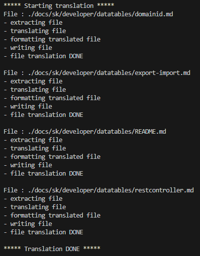

# Translation of documentation

In this section, we will discuss how to provide a translation of existing documentation.

## Deepmark

For automated file translation `markdown` we use **own version** a free tool available [deepmark](https://github.com/izznatsir/deepmark) which uses [DeepL](https://www.deepl.com/cs/translator) Translator.

This own modified version of the original `Deepmark` you will find published as [@webjetcms/deepmark](https://www.npmjs.com/package/@webjetcms/deepmark).

### Installation

Same `deepmark` install in the location where the documentation is located, which in our case is the folder `docs`.

To install it, use the command `npm i @webjetcms/deepmark`, which will install the current version.

**OR**

If you want to use a specific version you can add it as `dependencie` to the file `package.json` in the documentation folder as

```json
"dependencies": {
  "@webjetcms/deepmark": "^0.1.4"
}
```

and then install it with the command `npm install`.

### Environment variable

Since `deepmark` uses a translator to translate `DeepL`, you need to set the environment variable `DEEPL_AUTH_KEY ` with the authorisation key to ` DeepL`.

### Configuration file `deepmark`

In the configuration file we set the location from where we will `markdown` translate, as well as the location where these translated files will be stored. We also define from which and into which language the translation should be done.

!>**Warning:** this configuration file **must be** called as `deepmark.config.mjs` and must be in the same location where we installed `deepmark`. In our case, this is the folder `docs`.

```javascript
/** @type {import("deepmark").UserConfig} */
export default {
    sourceLanguage: 'sk',
    outputLanguages: ['en-US'],
    directories: [
        ['sk', 'en']
    ]
};
```

!>**Warning:** if the target translation location is not created, it is created automatically. If the target location already contains files with the same name they will be overwritten. Otherwise new files will be created.

## Starting the translation

Before we start, we have to say that the translation itself can work in three modes `hybrid, offline, online`. We strongly recommend using the mode `hybrid` where the already translated phrases are stored in a local database, saving both tea and the number of characters used.

!>**Warning:** note that the number of translations is limited and it is therefore recommended to use this mode to save the number of translations.

You do the translation via the console, where in the location `docs` to start the process, use the command `npm run translate`. You should see information in the console about how each file is being translated. It also lists **Start** a **End** the whole process of translation.



## Differences between `deepmark` a `@webjetcms/deepmark`

There are several important differences between our modified version and the original version, which we will discuss in the individual sub-sections.

Almost all of our own logic is in a file we created at `docs\node_modules\@webjetcms\deepmark\dist\webjet-logic.js`.

### Copying images

One of the features of the translation, is to copy all non-translatable files from the source folder to the destination folder. These files include `.png, .jpg, .jpge, .ico, .css` and others. Actually all files that are not of type `markdown`. This behaviour can be convenient as you do not have to manually copy all dependent files.

!>**Warning:** the disadvantage is that if you add specific modified images for the English version to the EN documentation, they are overwritten with the original images from the Slovak version every time they are translated. For this reason, this logic has been modified so that when translating **they never copied the pictures**.

The modification was applied in the file `docs/node_modules/deepmark/dist/config.js`, around line 240. A new condition has been added to skip a file with an extension for images e.g. `.png, .jpg, .jpge`. This way, files with the given extensions will not be copied during translation.

```javascript
if (path.endsWith(".md") || path.endsWith(".mdx")) {
  paths.md.push(filePaths);
  continue;
}
if (path.endsWith(".json")) {
  paths.json.push(filePaths);
  continue;
}
if (path.endsWith(".yaml") || path.endsWith(".yml")) {
  paths.yaml.push(filePaths);
  continue;
}
//Exclude pictures
if (path.endsWith(".png") || path.endsWith(".jpg") || path.endsWith(".jpeg")) {
  continue;
}
```

### Skip translation of part of the file

If you mate in `markdown` some parts of the file that are not to be translated such as the codes, the `markdown` offers the option to skip translating parts of the file if the text is wrapped in **\`text\`** or code wrapped as **\`\`Code\`\`**. The problem arises when the code in the file is not for illustrative purposes, but to perform some logic.

!>**Warning:**, in case you don't wrap it as **\`\`Code\`\`**, the code may be partially translated, rendering it inoperable. If you wrap the code as **\`\`Code\`\`**, but it does not translate **nor shall it be performed**.

**Solution** was the creation of own brands `<!-- deepmark-ignore-start -->` a `<!-- deepmark-ignore-end -->` which ensure that the codes (or even the text) enclosed in these marks are not translated **But** the code itself is executed. The logic behind these markers extracts the marked code from the file before the actual translation and only after the translation puts them back into the file, namely **unchanged**.

```javascript
<!-- deepmark-ignore-start -->
YOUR CODE HERE PLEASE
<!-- deepmark-ignore-end -->
```

**Listing of skipped parts**

If you skip listing a part of a file using the above mentioned tags, the skipped part is automatically listed in the console. If this function is undesirable, it is necessary to `docs\node_modules\@webjetcms\deepmark\dist\cli.js` remove function call `logIgnoredContentInfo(ignoredContent);`, which ensures the listing of skipped parts.

### File formatting

Original `deepmark` has a problem with the correct formatting of the translated files. It adds unnecessary spaces/lines, doesn't translate some symbols correctly or destroys the structure of lists or tables by bad indentation. This problem is in our version `@webjetcms/deepmark` solved by several steps to avoid these errors in the translated files. We will not discuss all the modifications but we will mention that the most important is the method `customizeTranslatedMarkdown` which edits/formats already translated files in a few steps.

### Dependency versions

Since `deepmark` uses dependencies whose versions are already obsolete, we have updated most of the dependencies to newer versions. We did not use the most up-to-date versions everywhere, as not all of them were compatible either with other dependencies or with the actual format used in `deepmark`.

List **Original** addictions:

```json
"dependencies": {
		"acorn": "^8.8.2",
		"acorn-jsx": "^5.3.2",
		"astring": "^1.8.4",
		"better-sqlite3": "^8.0.1",
		"commander": "^10.0.0",
		"deepl-node": "^1.8.0",
		"fs-extra": "^11.1.0",
		"mdast-util-from-markdown": "^1.3.0",
		"mdast-util-frontmatter": "^1.0.1",
		"mdast-util-html-comment": "^0.0.4",
		"mdast-util-mdx": "^2.0.1",
		"mdast-util-to-markdown": "^1.5.0",
		"micromark-extension-frontmatter": "^1.0.0",
		"micromark-extension-html-comment": "^0.0.1",
		"micromark-extension-mdxjs": "^1.0.0",
		"prettier": "^2.8.3",
		"yaml": "^2.2.1"
	},
```

List **Updated** addictions:

```json
"dependencies": {
	"acorn": "^8.12.1",
	"acorn-jsx": "^5.3.2",
	"astring": "^1.8.6",
	"better-sqlite3": "^8.7.0",
	"commander": "^11.1.0",
	"deepl-node": "^1.13.1",
	"fs-extra": "^11.2.0",
	"mdast-util-from-markdown": "^2.0.1",
	"mdast-util-frontmatter": "^2.0.1",
	"mdast-util-html-comment": "^0.0.4",
	"mdast-util-mdx": "^3.0.0",
	"mdast-util-to-markdown": "^2.1.0",
	"micromark-extension-frontmatter": "^2.0.0",
	"micromark-extension-html-comment": "^0.0.1",
	"micromark-extension-mdxjs": "^3.0.0",
	"prettier": "^3.3.3",
	"yaml": "^2.5.0"
},
```

## Problematic source file format

When translating, you may encounter that the resulting translation has broken the file structure. This problem can occur if your `markdown` files contain syntax that `deepmark` can't process. In the next section, we will show some problem syntaxes.

!>**Warning:**, many problems have been solved in the version `@webjetcms/deepmark`, but there are still situations where a certain file format will cause problems in translation and subsequent formatting.

### Combining list types

For example, if you combine a numeric list with a classic bulleted list, the text is translated, but the list structure is **can** fall apart. Therefore, we do not make use of their combination.

```javascript
1. aaaa
2. bbbb
   - cccc
   - dddd
```

We recommend using uncombined list types.

### Special characters

Your files may contain many special characters that have in the files `markdown` special role. Such special characters may subsequently corrupt the format. We recommend such characters **always** Quote.

E.g. if you are talking about a numeric value do not use the characters `<` a `>`. Rather use the word version smaller/larger. Or quote the characters \``<`\` a \``>`\`.

### Consecutive quotations

If you work with `markdown` files you know that by making use of the tags **\`\`** the text between them becomes a quotation, and such quotations are not translated. The problem arises when 2 or more quotations follow each other in the text and are not separated by any symbol.

For example. **\`Quote\_1\` \`Quote\_2\`**. Such a notation can lead to translation failures, so we recommend adding a character between the quotations, e.g. **\`Quote\_1\`**, **\`Quote\_2\`**, or quotations to link **\`Quote\_1 Quote\_2\`**, possibly **\`Quote\_1, Quote\_2\`**. The same problem occurs with other combinations such as citations and links.

Problem combinations to avoid (order doesn't matter):

```
- `Quote_1` `Quote_2\`
- `Quote_1` [Text here](Link here)
- **Bold** `Quote_1`
- [Text here](Link here) **Bold**
- [Text here](Link here) _[Text here\]_
- **Bold** _Text here_
```

### Unmarked code

A big problem occurs if the source files contain unlabeled programming source code. Such code can break the translation, or completely mess up the resulting file format. **Each code must be properly cited** and add the name of the programming language in which it was created.

***

\`\`javascript

YOUR CODE HERE

\`\`\`

***

\`\`\`html

YOUR CODE HERE

\`\`\`

***

\`\`\`java

YOUR CODE HERE

\`\`\`

***

### Ignorance `markdown` format

The most common error will probably be an incorrect format due to ignorance of the file format `markdown`. You can read about the basic syntax at [Basic Syntax](https://www.markdownguide.org/basic-syntax/).
