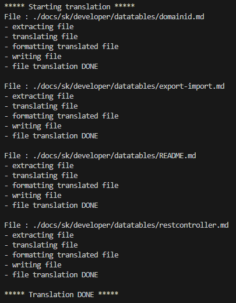

# Documentation translation

In this section, we will discuss how to ensure the translation of existing documentation.

## Deepmark

For automated translation of `markdown` files, we will use **our own version** of the available free tool [deepmark](https://github.com/izznatsir/deepmark), which uses the [DeepL](https://www.deepl.com/cs/translator) translator.

You can find this custom modified version of the original `Deepmark` published as [@webjetcms/deepmark](https://www.npmjs.com/package/@webjetcms/deepmark).

### Installation

You install `deepmark` itself in the location where the documentation is located, which in our case is the `docs` folder.

You install it with the command `npm i @webjetcms/deepmark`, which will install the current version.

**OR**

If you want to use a specific version you can add it as `dependencie` to the file `package.json` in the documentation folder as

```json
"dependencies": {
  "@webjetcms/deepmark": "^0.1.4"
}
```

and then install it with the command `npm install`.

### Environment variables

Since `deepmark` uses the `DeepL` compiler for translation, you must set the environment variable `DEEPL_AUTH_KEY ` with the authorization key for ` DeepL`.

### Configuration file `deepmark`

In the configuration file, we set the location from which we will translate `markdown`, as well as the location where these translated files will be saved. We also define the language from which and to which the translation should be performed.

!>**Warning:** this configuration file **must** be named as `deepmark.config.mjs` and must be in the same location where we installed `deepmark`. In our case it is the folder `docs`.

```javascript
/** @type {import("deepmark").UserConfig} */
export default {
    sourceLanguage: 'sk',
    outputLanguages: ['en-US'],
    directories: [
        ['sk', 'en']
    ]
};
```
!>**Warning:** If the target translation location is not created, it will be created automatically. If the target location already contains files with the same name, they will be overwritten. Otherwise, new files will be created.

## Starting translation

Before starting, we must say that the translation itself can work in three modes `hybrid, offline, online`. We strongly recommend using the `hybrid` mode, where already translated phrases are saved in the local database, which saves time as well as the number of characters used.

!>**Warning:** Please note that the number of translations is limited and it is therefore recommended to use this mode to save the number of translations.

You will perform the translation via the console, where in the location `docs` you will start the process with the command `npm run translate`. In the console you should see information about how the individual files are translated. The **beginning** and **end** of the entire translation process are also listed.



## Differences between `deepmark` and `@webjetcms/deepmark`

There are several important differences between our modified and original versions, which we will discuss in individual sub-chapters.

Almost all of our custom logic is in a file we created at `docs\node_modules\@webjetcms\deepmark\dist\webjet-logic.js`.

### Copying images

One of the features of translation is to copy all non-translatable files from the source folder to the target folder. These files include `.png, .jpg, .jpge, .ico, .css` and others. In fact, all files that are not of type `markdown`. This behavior can be advantageous, as you do not have to manually copy all dependent files.

!>**Warning:** The disadvantage is that if you add specifically modified images for the English version to the EN documentation, they will be overwritten with the original images from the Slovak version every time you translate. For this reason, this logic has been modified so that **images are never copied** during translation.

The change was applied in the file `docs/node_modules/deepmark/dist/config.js`, around line 240. A new condition was added to skip files with image extensions, e.g. `.png, .jpg, .jpge`. This way, files with the given extensions will not be copied during translation.

```javascript
if (path.endsWith(".md") || path.endsWith(".mdx")) {
  paths.md.push(filePaths);
  continue;
}
if (path.endsWith(".json")) {
  paths.json.push(filePaths);
  continue;
}
if (path.endsWith(".yaml") || path.endsWith(".yml")) {
  paths.yaml.push(filePaths);
  continue;
}
//Exclude pictures
if (path.endsWith(".png") || path.endsWith(".jpg") || path.endsWith(".jpeg")) {
  continue;
}
```

### Skipping translation of part of a file

If you have some parts in your `markdown` file that should not be translated, such as codes, `markdown` itself offers the option to skip translating part of the file if the text is wrapped in **\`text\`** or the code is wrapped as **\`\`\`kód\`\`\`**. The problem arises when the code in the file is not for illustrative purposes, but is supposed to perform some logic.

!>**Warning:**, if you do not wrap it as **\`\`\`kód\`\`\`**, this code may be partially compiled, making it non-functional. If you wrap the code as **\`\`\`kód\`\`\`**, it will not be compiled, but **nor executed**.

**The solution** was to create custom tags `<!-- deepmark-ignore-start -->` a `<!-- deepmark-ignore-end -->`, which ensure that the codes (or even text) wrapped in these tags are not translated **but** the code itself is executed. The logic behind these tags extracts the marked parts of the code from the file before the translation itself and only after the translation does it insert them back into the file **without changes**.

```javascript
<!-- deepmark-ignore-start -->
YOUR CODE HERE PLEASE
<!-- deepmark-ignore-end -->
```

**List of skipped parts**

If the output of a part of the file is skipped using the mentioned tags, the skipped part will be automatically output to the console. If this function is undesirable, it is necessary to remove the call to the function `docs\node_modules\@webjetcms\deepmark\dist\cli.js` in the file `logIgnoredContentInfo(ignoredContent);`, which provides the output of the skipped parts.

### File formatting

The original `deepmark` has a problem with formatting translated files correctly. It adds extra spaces/lines, does not translate some symbols correctly, or destroys the structure of lists or tables with bad indentation. This problem is solved in our version `@webjetcms/deepmark` by several steps to prevent these errors in translated files. We will not discuss all the modifications, but we will recall that the most important is the method `customizeTranslatedMarkdown`, which edits/formats already translated files in several steps.

### Choosing a translation service

In the configuration file **`deepmark.config.mjs`** we can set up the translation service using the variable **`translationEngine`**. This variable can take one of two values:

- [`deepl`](https://www.deepl.com/docs-api) – **DeepL** default service if variable is not set
- [`google`](https://cloud.google.com/translate) – **Google Translate API** alternative translation service

If the variable **`translationEngine`** is not defined, the system will automatically use **DeepL**.

#### Environment variables

To use the **Google Translate API**, you must set the environment variable `GOOGLE_AUTH_KEY` with the authorization key for the **Google Translate API**.

#### Configuration example

Below is a sample configuration using **Google Translate**:

```javascript
/** @type {import("deepmark").UserConfig} */
export default {
    sourceLanguage: 'sk',
    outputLanguages: ['en-US'],
    directories: [
        ['sk', '$langcode$'],
    ],
    translationEngine: "google"    // Voľba prekladovej služby
};
```

### Dependency versions

Since `deepmark` uses dependencies whose versions are already outdated, we have updated most of the dependencies to newer versions. We have not used the most current versions everywhere, as not all of them were compatible either with other dependencies or with the format used in `deepmark`.

List of **original** dependencies:

```json
"dependencies": {
		"acorn": "^8.8.2",
		"acorn-jsx": "^5.3.2",
		"astring": "^1.8.4",
		"better-sqlite3": "^8.0.1",
		"commander": "^10.0.0",
		"deepl-node": "^1.8.0",
		"fs-extra": "^11.1.0",
		"mdast-util-from-markdown": "^1.3.0",
		"mdast-util-frontmatter": "^1.0.1",
		"mdast-util-html-comment": "^0.0.4",
		"mdast-util-mdx": "^2.0.1",
		"mdast-util-to-markdown": "^1.5.0",
		"micromark-extension-frontmatter": "^1.0.0",
		"micromark-extension-html-comment": "^0.0.1",
		"micromark-extension-mdxjs": "^1.0.0",
		"prettier": "^2.8.3",
		"yaml": "^2.2.1"
	},
```

List of **updated** dependencies:

```json
"dependencies": {
	"acorn": "^8.12.1",
	"acorn-jsx": "^5.3.2",
	"astring": "^1.8.6",
	"better-sqlite3": "^8.7.0",
	"commander": "^11.1.0",
	"deepl-node": "^1.13.1",
	"fs-extra": "^11.2.0",
	"mdast-util-from-markdown": "^2.0.1",
	"mdast-util-frontmatter": "^2.0.1",
	"mdast-util-html-comment": "^0.0.4",
	"mdast-util-mdx": "^3.0.0",
	"mdast-util-to-markdown": "^2.1.0",
	"micromark-extension-frontmatter": "^2.0.0",
	"micromark-extension-html-comment": "^0.0.1",
	"micromark-extension-mdxjs": "^3.0.0",
	"prettier": "^3.3.3",
	"yaml": "^2.5.0",
	"@google-cloud/translate": "^8.5.1"
},
```

## Problematic source file format

When translating, you may encounter a situation where the resulting translation breaks the file structure. This problem can occur if your `markdown` files contain syntax that `deepmark` cannot process. In the following section, we will show you some problematic syntaxes.

!>**Warning:**, many issues have been resolved in version `@webjetcms/deepmark`, however, there are still situations where a certain file format will cause problems during translation and subsequent formatting.

### Combining list types

For example, if you combine a numbered list with a classic bulleted list, the text will be translated, but the structure of the list **may** fall apart. Therefore, we do not recommend using a combination of them.

```javascript
1. aaaa
2. bbbb
   - cccc
   - dddd
```

We recommend using non-combined list types.

### Special characters

Your files may contain many special characters that have a special role in `markdown` files. Such special characters can subsequently corrupt the format. We recommend that you **always** quote such characters.

For example, if you are talking about a numeric value, do not use the characters `<` and `>`. Instead, use the word version smaller/greater. Or quote the characters \``<`\` a \``>`\`.

### Consecutive quotes

If you work with `markdown` files, you know that using **\`\`** tags makes the text between them a quote and such quotes are not translated. The problem occurs if there are 2 or more quotes in the text that are not separated by any symbol.

For example **\`Quote_1\` \`Quote_2\`**. Such a notation can lead to translation failure, so we recommend adding a character between the quotes, e.g. **\`Quote_1\`**, **\`Quote_2\`**, or combining the quotes **\`Quote_1 Quote_2\`**, or **\`Quote_1, Quote_2\`**. The same problem occurs with other combinations, such as quotes and links.

Problematic combinations that you must avoid (order does not matter):


```
- `Quote_1` `Quote_2\`
- `Quote_1` [Text here](Link here)
- **Bold** `Quote_1`
- [Text here](Link here) **Bold**
- [Text here](Link here) _[Text here\]_
- **Bold** _Text here_
```

### Unmarked code

A big problem occurs when source files contain unlabeled programming source code. Such code can break the translation, or completely corrupt the resulting file format. **All code must be properly cited** and we will also add the name of the programming language in which it was created.

---

\`\`\`javascript

YOUR CODE HERE

\`\`\`

---

\`\`\`html

YOUR CODE HERE

\`\`\`

---

\`\`\`java

YOUR CODE HERE

\`\`\`

---

### Ignorance of `markdown` format

The most common error will probably be incorrect formatting due to ignorance of the `markdown` file format. You can read about the basic syntax on the [Basic Syntax](https://www.markdownguide.org/basic-syntax/) page.