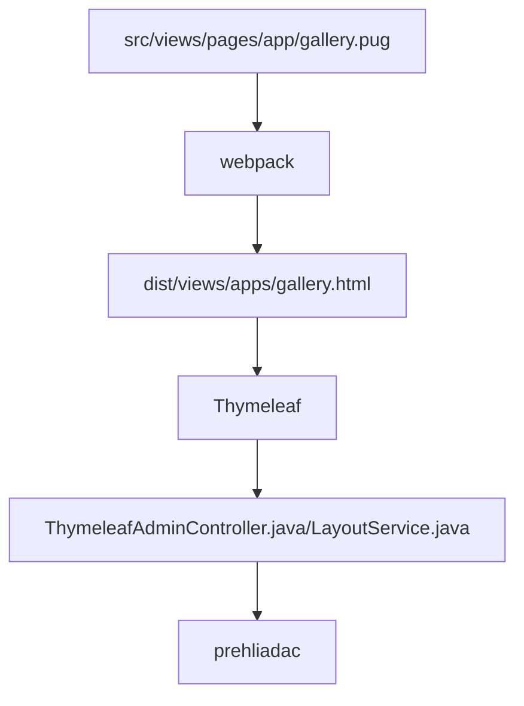

# Basic description of the frameworks used

Technologies used:
- [Spring REST + Spring DATA](spring.md)
- [thymeleaf.org](thymeleaf.md) - templating system connected to Java backend
- `webpack+node` for compiling html/PUG/JS files
- datatables.net + [editor](https://editor.datatables.net) - basic work and editing of tabular data, connected to Spring via DatatablesRestControllerV2 - example in [GalleryRestController.java](../../../src/main/java/sk/iway/iwcm/components/gallery/GalleryRestController.java) a [gallery.pug](../../../src/main/webapp/admin/v9/views/pages/apps/gallery.pug)
- [pugjs.org](pugjs.md) - `preprocessor` for generating HTML code for pages
- [Vue.js](vue.md) - available as `window.Vue`, a short demonstration in [photo gallery](../../../src/main/webapp/admin/v9/views/pages/apps/gallery.pug)

The whole procedure of generating a web page in `/admin/v9/` is as follows:



so it is necessary to think about what is happening in which step.

## npm

For build JS/CSS files is used `node`, basic commands:
- `npm install` - installs all necessary modules
- `npm outdated` - lists obsolete modules
- `npm update MODUL` - updates the specified module, beware it only updates `minor` version, if you don't specify a module name, it updates all modules
- `npm i MODUL@VERZIA` - installs/updates the module to the specified version
- `npm audit` - lists the modules containing the vulnerability
- `npm audit fix` - updates modules containing the vulnerability
- `npm list --depth=0` - lists the installed modules, the depth parameter can be used to specify the nesting depth
- `npm view MODUL version` - prints the current latest version of the module

If you also need to update dependencies, you can proceed using the module [npm-check-updates](https://flaviocopes.com/update-npm-dependencies/):

```shell
//instalacia modulu
npm install -g npm-check-updates
//vypis verzii na aktualizaciu
ncu
//aktualizacia verzii v zavislostiach
ncu -u
//aktualizacia
npm install
```

## Events

**ATTENTION:** it is not possible to use event in JavaScript code `$(document).ready`, because the translation key store must be initialized first. We have implemented a custom function `window.domReady.add` in the library [ready](../libraries/ready-extender.md), which is executed only after the translation key store has been initialized.
```javascript
window.domReady.add(function () {
	//vas kod
});

//nastavenie poradia na 10, cize typicky na koniec
window.domReady.add(function () {
	//vas kod
}, 10);
```

## Webpack

Folding and compilation `pug/js/css` is done by [webpack](https://webpack.js.org/).

JS and CSS files are stored after compilation in `dist` folder. From there, the PUG is loaded using the list from `htmlWebpackPlugin.files`. At the same time, only scripts that do not start with a prefix are inserted by default `pages_`. A file with this prefix will only be inserted if its name matches the name of the pug file.

```javascript
// Outpul all script files
-
    let filename = htmlWebpackPlugin.options.filename;
    var slash = filename.lastIndexOf("/");
    var dot = filename.indexOf(".", slash);
    if (slash > 0 && dot > slash) filename = filename.substring(slash+1, dot);

each js in WPF.js
    - if (js.indexOf("pages_")==-1 || js.indexOf("pages_"+filename+".")!=-1)
        script(type='text/javascript', src=js)
```

So if you need to insert a special JavaScript file for a page in the administration, create it in the folder `src/main/webapp/admin/v9/src/js/pages/`If you expect to use several separate JS files combined into one, create a subfolder. An example is `src/main/webapp/admin/v9/src/js/pages/web-pages-list/web-pages-list.js` which is in the subfolder `web-pages-list` and in the script `web-pages-list.js` the class is imported from `preview.js`.

This script is inserted only when the web page is called `web-pages-list.pug`, that is, at the URL address `/admin/v9/webpages/web-pages-list/`.

The above procedure can only be used for PUG files, since the script is inserted into the generated HTML during compilation. For applications from `/apps` folders that use directly `.html` files is ready to insert JavaScript [file as a module](../../custom-apps/admin-menu-item/README.md#priloženie-javascript-súboru) while the HTML page is displayed.
