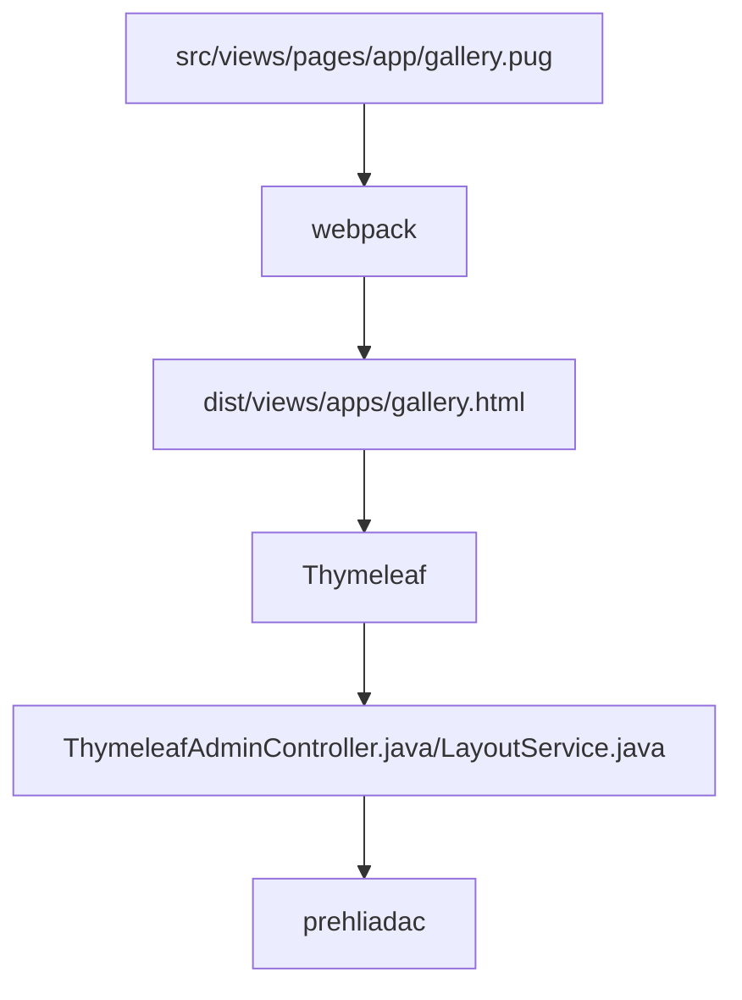

# Basic description of the frameworks used

Technologies used:

- [Spring REST + Spring DATA] (spring.md)
- [thymeleaf.org](thymeleaf.md) - templating system connected to a Java backend
- ```webpack+node``` for compiling html/PUG/JS files
- datatables.net + [editor](https://editor.datatables.net) - basic work and editing of tabular data, connected to Spring via DatatablesRestControllerV2 - example in [GalleryRestController.java](../../../src/main/java/sk/iway/iwcm/components/gallery/GalleryRestController.java) and [gallery.pug](../../../src/main/webapp/admin/v9/views/pages/apps/gallery.pug)
- [pugjs.org](pugjs.md) - ```preprocessor``` for generating HTML code for pages
- [Vue.js](vue.md) - available as ```window.Vue```, short demo in [photo gallery](../../../src/main/webapp/admin/v9/views/pages/apps/gallery.pug)

The entire process of generating a web page in ```/admin/v9/``` is as follows:


```mermaid
graph TD;
    src/views/pages/app/gallery.pug-->webpack
    webpack-->dist/views/apps/gallery.html
    dist/views/apps/gallery.html-->Thymeleaf
    Thymeleaf-->ThymeleafAdminController.java/LayoutService.java
    ThymeleafAdminController.java/LayoutService.java-->prehliadac
```

So it is necessary to think about what happens in each step.

## npm

To build JS/CSS files, ```node``` is used, basic commands:

- ```npm install``` - ​​installs all necessary modules
- ```npm outdated``` - ​​lists obsolete modules
- ```npm update MODUL``` - ​​updates the specified module, be careful, it only updates the ```minor``` version, if you do not specify a module name, it updates all modules
- ```npm i MODUL@VERZIA``` - ​​installs/updates the module to the specified version
- ```npm audit``` - ​​lists modules containing the vulnerability
- ```npm audit fix``` - ​​updates modules containing the vulnerability
- ```npm list --depth=0``` - ​​lists the list of installed modules, the depth parameter can be used to specify the nesting depth
- ```npm view MODUL version``` - ​​lists the current latest version of the given module

If you also need to update dependencies, you can do so using the [npm-check-updates](https://flaviocopes.com/update-npm-dependencies/) module:

```shell
//instalacia modulu
npm install -g npm-check-updates
//vypis verzii na aktualizaciu
ncu
//aktualizacia verzii v zavislostiach
ncu -u
//aktualizacia
npm install
```

## Events

!>**Warning:** It is not possible to use the ```$(document).ready``` event in JavaScript code, because the translation key store must be initialized first. We have implemented our own function ```window.domReady.add``` in the [ready](../libraries/ready-extender.md) library, which is executed only after the translation key store is initialized.

```javascript
window.domReady.add(function () {
    //vas kod
});

//nastavenie poradia na 10, cize typicky na koniec
window.domReady.add(function () {
    //vas kod
}, 10);
```

## Webpack

The assembly and compilation of ```pug/js/css``` is done using [webpack](https://webpack.js.org/).

JS and CSS files are saved after compilation in the ```dist``` folder. From there they are inserted into PUG using the list from ```htmlWebpackPlugin.files```. At the same time, by default only scripts that do not start with the prefix ```pages_``` are inserted. A file with this prefix is ​​inserted only if its name matches the name of the pug file.

```javascript
// Outpul all script files
-
    let filename = htmlWebpackPlugin.options.filename;
    var slash = filename.lastIndexOf("/");
    var dot = filename.indexOf(".", slash);
    if (slash > 0 && dot > slash) filename = filename.substring(slash+1, dot);

each js in WPF.js
    - if (js.indexOf("pages_")==-1 || js.indexOf("pages_"+filename+".")!=-1)
        script(type='text/javascript', src=js)
```

So, if you need to insert a special JavaScript file for a page in the administration, create it in the ```src/main/webapp/admin/v9/src/js/pages/``` folder, if you expect to use several separate JS files combined into one whole, create a subfolder as well. An example is ```src/main/webapp/admin/v9/src/js/pages/web-pages-list/web-pages-list.js``` which is in the ```web-pages-list``` subfolder, and in the ```web-pages-list.js``` script, the class from ```preview.js``` is imported.

This script is only inserted when calling the web page ```web-pages-list.pug```, i.e. at the URL address ```/admin/v9/webpages/web-pages-list/```.

The above procedure can only be used for PUG files, as the script is inserted into the generated HTML during compilation. For applications from the ```/apps``` folder that directly use ```.html``` files, there is a provision to insert a JavaScript [file as a module](../../custom-apps/admin-menu-item/README.md#insert-javascript-file) during the display of the HTML page.