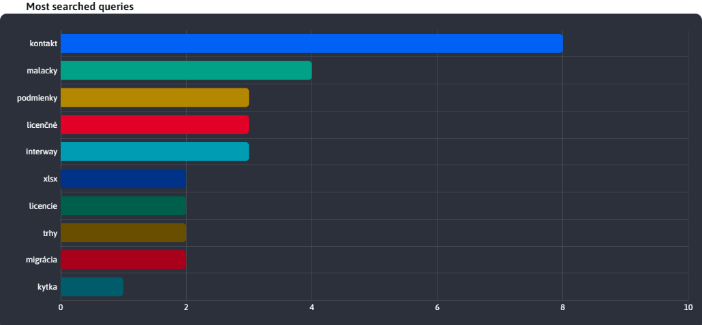
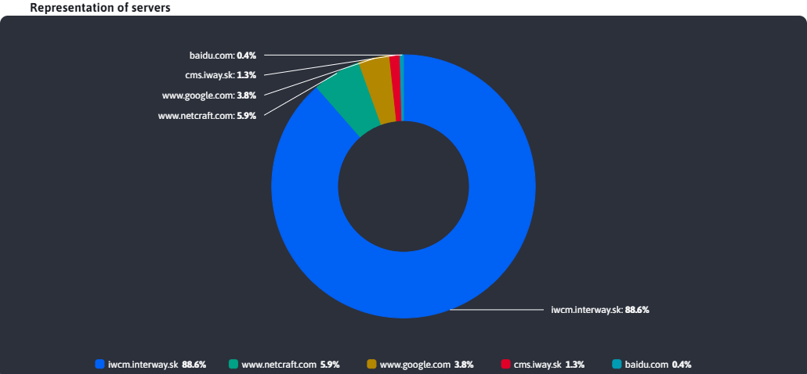
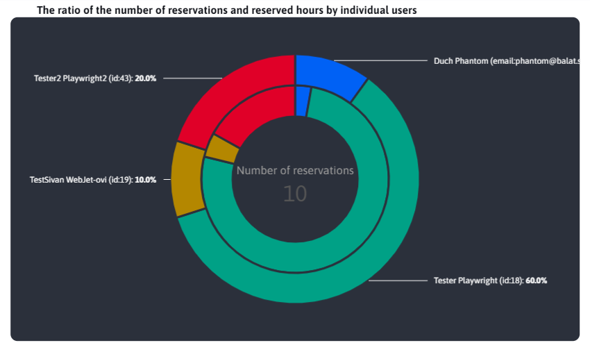
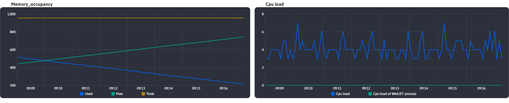

# Common JS functions

This section takes the common functions for working with graphs offered by the [chart-tools.js](../../../../../../src/main/webapp/admin/v9/src/js/libs/chart/chart-tools.js), which is available as `window.ChartTools` object.

## BAR chart

Graph type **BAR** is created by an instance of the class `BarChartForm`, which is available as `ChartTools.BarChartForm`.

```javascript
export class BarChartForm {
    constructor(yAxeName, xAxeName, chartTitle, chartDivId, chartData) {
        this.yAxeName = yAxeName;
        this.xAxeName = xAxeName;
        this.chartTitle = chartTitle;
        this.chartDivId = chartDivId;
        this.chartData = chartData;
        this.chart = undefined;
    }
}
```

The individual class parameters are used to :
- `yAxeName`, a text value representing the name of a variable in the object that stores the Y-axis text value (representing a category).
- `xAxeName`, a text value representing the name of a variable in the object that stores the numeric value of the X-axis (representing the category value).
- `chartTitle`, a text value representing the title that appears as a header above the chart.
- `chartDivId`, a text value representing the div ID of the element to display the generated graph.
- `chartData`, an array of objects that represent the graph data. Each object must contain a category variable (yAxeName) and a category value variable(xAxeName).
- `chart`, the chart represents our chart, which will be automatically stored in this class parameter when it is created.

**Attention**, parameter `chart` cannot be set through the constructor and serves as a background auxiliary variable.

### Example of use

Example of use **BAR** graph from the file [search-engine.html](../../../../../../src/main/webapp/apps/stat/admin/search-engines.html)

```javascript
    $.ajax({url: getUrl(ChartTools.ChartType.Bar), success: function(result) {

        barChartQueries = new ChartTools.BarChartForm("queryName", "queryCount", '[[#{stat.graph.searchQueriesBars}]]', "searchEngines-barQueries", result['content']);

        ChartTools.createAmchart(barChartQueries);
    }});
```

Resulting generated graph with title



## PIE chart

Graph type **PIE** is created by an instance of the class `PieChartForm`, which is available as `ChartTools.PieChartForm`.

```javascript
export class PieChartForm {
    constructor(yAxeName, xAxeName, chartTitle, chartDivId, chartData, labelKey) {
        this.yAxeName = yAxeName;
        this.xAxeName = xAxeName;
        this.chartTitle = chartTitle;
        this.chartDivId = chartDivId;
        this.chartData = chartData;
        this.labelKey = labelKey;
        this.chart = undefined;
        this.chartLegend = undefined;
    }
}
```

The individual class parameters are used to :
- `yAxeName`, a text value representing the name of a variable in the object that stores the numeric value of the category.
- `xAxeName`, a text value representing the name of a variable in the object that stores a text value representing a category.
- `chartTitle`, a text value representing the title that appears as a header above the chart.
- `chartDivId`, a text value representing the div ID of the element to display the generated graph.
- `chartData`, an array of objects that represent the graph data. Each object must contain a category variable (xAxeName) and a category value variable(yAxeName).
- `labelKey`, **optional** a text value representing a translation handle with a caption to the summary
- `chart`, represents our chart, which will be automatically saved to this class parameter when created.
- `chartLegend`, represents the set graph legend. It is not set by the user, it is set automatically and is needed in the background when updating the chart.

**Attention**, parameters `chart` a `chartLegend` cannot be set through the constructor and serve as auxiliary variables in the background.

### Example of use

Example of use **PIE** graph from the file [referer.html](../../../../../../src/main/webapp/apps/stat/admin/referer.html)

```javascript
    $.ajax({url: getGraphUrl(), success: function(result) {

        pieChartVisits = new ChartTools.PieChartForm("visits", "serverName", '[[#{stat.referer.pieChart}]]', "referer-pieReferer", result['content']);

        ChartTools.createAmchart(pieChartVisits);
    }});
```

Resulting generated graph with title



### Parameter `labelKey`

Parameter `labelKey` is special in that it is not mandatory when creating a class instance `PieChartForm`. You can see it in the previous usage demonstration as it is missing there. However, if you were to enter it, it would be used as a translation handle to retrieve the text. This text will automatically be set to the center of the chart as the title, and the calculated value representing the total sum of the values in the chart series will be displayed below it.

This allows you to clearly graph the total value of the data series. The font size is automatically adjusted to fit the text inside the chart. When the chart data is changed, the value is automatically recalculated.

**Attention**, we do not recommend long text otherwise the text font will be very small.

Graph type **PIE** with such a setting we don't currently have, but you can look at the section with the chart type **DOUBLE\_PIE** where such text is visible.

## Graph type DOUBLE\_PIE

Graph type **DOUBLE\_PIE** is created by an instance of the class `DoublePieChartForm`, which is available as `ChartTools.DoublePieChartForm`. This is a variation of the graph type **PIE**, which, however, contains two nested parts.

```javascript
export class DoublePieChartForm {
    constructor(yAxeName_inner, yAxeName_outer, xAxeName, chartTitle, chartDivId, chartData, labelSeries, labelKey) {
        this.yAxeName_inner = yAxeName_inner;
        this.yAxeName_outer = yAxeName_outer;
        this.xAxeName = xAxeName;
        this.chartTitle = chartTitle;
        this.chartDivId = chartDivId;
        this.chartData = chartData;
        this.labelSeries = labelSeries;
        this.labelKey = labelKey;
        this.chart = undefined;
        this.chartLegend = undefined;
    }
}
```

The individual class parameters are used to :
- `yAxeName_inner`, a text value representing the name of a variable in the object that stores the numeric value of the category. This is an inner ring.
- `yAxeName_outer`, a text value representing the name of a variable in the object that stores the numeric value of the category. This is the outer ring.
- `xAxeName`, a text value representing the name of a variable in the object that stores a text value representing a category.
- `chartTitle`, a text value representing the title that appears as a header above the chart.
- `chartDivId`, a text value representing the div ID of the element to display the generated graph.
- `chartData`, an array of objects that represent the graph data. Each object must contain a category variable (xAxeName) and a category value variable(yAxeName).
- `labelSeries`, **optional** text value to indicate a series to sum with allowed values `inner` a `outer`
- `labelKey`, **optional** text value on the translation handle with the text that will serve as a heading for the sum of the values
- `chart`, represents our chart, which will be automatically saved to this class parameter when created.
- `chartLegend`, represents the set graph legend. It is not set by the user, it is set automatically and is needed in the background when updating the chart.

**Attention**, parameters `chart` a `chartLegend` cannot be set through the constructor and serve as auxiliary variables in the background.

### Example of use

Example of use **DOUBLE\_PIE** graph from the file [reservation-stat.html](../../../../../../src/main/webapp/apps/reservation/admin/reservation-stat.html)

```javascript
    $.ajax({url: getGraphUrl("pie", "users"), success: function(result) {

        doublePieChartTimeUsers = new ChartTools.DoublePieChartForm("valueB", "valueA", "category", '[[#{reservation.reservation_stat.hours_user_chart.title}]]', "reservationStat-doublePieTimeUsers", result, "outer", "reservation.reservation_stat.hours_user_chart.label.js");

        ChartTools.createAmchart(doublePieChartTimeUsers);
    }});
```

The resulting generated graph, with a caption above the graph that also includes an optional label in the middle of the graph with a numerical summary of the values



### Parameters `labelKey` a `labelSeries`

Parameters `labelKey` a `labelSeries` are special in that they are not mandatory when creating an instance of a class `DoublePieChartForm`. However, if they are entered, they are used to set the information about the sum of the values in the middle of the graph.

Parameters `labelKey` is used as a translation key to retrieve the text. This text is automatically set to the center of the chart as the title for the calculated value.

Parameter `labelSeries` is used to set which series of data we want to have counted. can take the value :
- `inner`, the values of the inner graph (`yAxeName_inner`)
- `outer`, the values of the outer graph (`yAxeName_outer`)

This allows you to clearly graph the total value of the data series. The font size is automatically adjusted to fit the text inside the chart. When the chart data is changed, the value is automatically recalculated.

**Attention**, we do not recommend long text otherwise the text font will be very small.

## LINE chart

Graph type **LINE** is created by an instance of the class `LineChartForm`, which is available as `ChartTools.LineChartForm`. Compared to charts like **BAR** or **PIE** is unique in its ability to display multiple different values for multiple datasets. It is this ability of a chart type **LINE** also requires special input and configuration values, which are described in the following subsections.

```javascript
export class LineChartForm {
    constructor(yAxeNames, xAxeName, chartTitle, chartDivId, chartData, dateType) {
        this.yAxeNames = yAxeNames;
        this.xAxeName = xAxeName;
        this.chartTitle = chartTitle;
        this.chartDivId = chartDivId;
        this.chartData = chartData;
        this.dateType = dateType;
        this.chart = undefined;
    }
}
```

The individual class parameters are used to :
- `yAxeName`, (discussed in more detail in a separate sub-chapter)
- `xAxeName`, a text value representing the name of a variable in the object that stores the numeric value of the Y-axis (the recorded value).
- `chartTitle`, a text value representing the title that appears as a header above the chart.
- `chartDivId`, a text value representing the div ID of the element to display the generated graph.
- `chartData`, (discussed in more detail in a separate sub-chapter)
- `dateType`, (discussed in more detail in a separate sub-chapter)
- `chart`, the chart represents our chart, which will be automatically stored in this class parameter when it is created.

**Attention**, parameter `chart` cannot be set through the constructor and serves as a background auxiliary variable.

### Example of use

Example of use **LINE** Chart

```javascript
    let yAxeNames =
        ChartTools.getLineChartYAxeNameObjs(
            ["visits", "sessions", "uniqueUsers"],
            ["stat.visits.js", "stat.sessions.js", "stat.unique_users.js"]
        );

    await $.ajax({url: getGraphUrl(), success: function(result) {

        lineChartVisits = new ChartTools.LineChartForm(yAxeNames, "dayDate", '[[#{stat.top.lineChart}]]', "stat-lineVisits", convertData(result['content']), ChartTools.DateType.Days);

        ChartTools.createAmchart(lineChartVisits);
    }});
```

Resulting generated graph with title


### Parameter yAxeName

As we could see from the usage example, the parameter **yAxeName** has a significantly different shape than the PIE and BAR charts, where it is a text-only value. The difference is in the ability of the LINE chart to display multiple numeric parameters from the dataset as separate lines. To generate the correct shape **yAxeName** we use the ready function `getLineChartYAxeNameObjs()` from the file [chart-tools.js](../../../../../../src/main/webapp/admin/v9/src/js/libs/chart/chart-tools.js). How this function works is irrelevant. We are only interested in the fact that the input parameters consist of 2 fields with text values.

The first field contains the name of the data object parameters for the chart, representing some numeric values that we want to display as separate lines on the chart. The second field contains translation keys that map to the parameter names in the same order and represent a given line of the graph in the graph legend.

We saw an example of this use in the previous chapter. We can see that we want to display 3 numeric parameters, namely `visits`, `sessions` a `uniqueUsers`. In the attached figure we can see 3 generated lines representing these parameters and in the legend of the graph we can see, for example, instead of the parameter name `visits` text value **Videnia** which was obtained from the translation key `stat.visits.js` (the crank was mapped to the parameter because they were in the same positions in the fields).

```javascript
    let yAxeNames =
        ChartTools.getLineChartYAxeNameObjs(
            ["visits", "sessions", "uniqueUsers"],
            ["stat.visits.js", "stat.sessions.js", "stat.unique_users.js"]
        );
```

Of course, translation keys (some or all of them) are not mandatory and can be replaced by the value `undefined`. !! However, the same number of parameters must be kept in both fields, even if it is only `undefined` Values.

Example of use `getLineChartYAxeNameObjs` with an empty translation key value.

```javascript
    let yAxeNames = ChartTools.getLineChartYAxeNameObjs(["visits"], [undefined]);
```

### Parameter chartData

For a LINE graph, the data has a specific format as a map containing object sheets, where each element in the map (object sheet) represents a different dataset. From these objects in the sheet, we can display 1 or more numeric values as separate lines in the graph. There are 3 different situations that can occur when displaying this data using a LINE graph.

```java
Map<List<T>>
```

**1 dataset and 1 parameter**

1  dataset means that the map contains only one element represented by a sheet of objects. Parameter **yAxeName** contains only 1 element, which means that the resulting LINE graph will display only 1 line, whose identifying name in the graph legend will be represented by the translation key from the parameter **yAxeName**.

**1 dataset of N parameters**

1  dataset means that the map contains only one element represented by a sheet of objects. Parameter **yAxeName** contains N elements, which means that the resulting LINE graph will display N lines whose identifying name in the graph legend will be represented by the translation keys from the parameter **yAxeName**. So it is multiple numerical parameters from the same data series.

We saw this type of graph in the sample graph, earlier in this chapter.

**M datasets of 1 parameters**

M datasets means that the map contains M elements represented as lists of objects. Parameter **yAxeName** contains only 1 element, which means that the resulting LINE graph will display M lines whose identifying name in the legend of the graph will be represented by a key from the map. This key denoted the individual datasets. In the result, the graph will display the same numerical parameter (e.g. `visits`) but for several different series of data.

**M datasets N parameters**

This case is a combination of the previous ones. As a result, the graph will contain M \* N lines whose identifying name in the graph legend will be represented as a combination of the map key (dataset identifier) via a dash ("-") concatenated with the value of the translation key from the parameter **yAxeName**. As a result, the graph will display several numeric values for several different data sheets (datasets).

### Parameter dateType

The last special parameter of the LINE graph is **dateType**. Since the X axis of the graph is a date axis, there is a need for proper granularity of this axis. That is, if the X axis of the graph shows an interval of 1 year and the date values are 1 week apart, we want the granularity to be set to weeks with a step of 1. In another case, if the X axis of the chart shows an interval of a few days and the date values are 5 minutes apart, we scheme the X axis of the chart to set the granularity to minutes with a step of 5.

To set the granularity we use the provided enumeration `DateType` from the file [chart-tools.js](../../../../../src/main/webapp/admin/v9/src/js/libs/chart/chart-tools.js).

Value **DateType.Auto** is set if we want to leave the granularity setting to the preset logic (which is in the chart-tools.js file). The latter, in addition to selecting the correct granularity value, will also set the best step to fit the chart data.

Value **DateType.Day\_1** is a special value that is used when it is necessary to set the range to exactly 1 day. In this case, the parameter marked as **xAxeName** (representing the date value) and the parameter `hour` which must be contained in the data for the chart in numeric format in the range 0-23 (representing whole hours of the day).

There may still be a situation as in the case of the page **Traffic** from the statistics section, where the data for the LINE graph is specifically granularized on the BackEnd according to the specified clustering. This means that the automatic granulation set by **DateType.Auto** will not work, because even if the interval is set to 3 years, the data will still be granular by days. For this case the enumeration `DateType` also offers the possibility of manual adjustment of granulation to values :
- `DateType.Seconds`
- `DateType.Minutes`
- `DateType.Hours`
- `DateType.Days`
- `DateType.Weeks`
- `DateType.Months`

In the case of manual granulation setting, the logic around the graph calculates only the step but keeps the set granulation, even if it is set incorrectly. Care should be taken when setting the granulation manually, as setting a larger value than necessary will start to distort the graph and setting a smaller value than necessary will damage the operation `Tooltip` logic.

## Special (LIVE) charts

We will also mention the special charts that are used in the sections `Monitorovanie servera - Aktuálne hodnoty`. These are special LINE type charts that can update automatically. These charts and the logic that operates them is fixed for this page and cannot be reused on other pages. The implemented usage is in the file [vue-amchart-monitoring-server.vue](../../../../../src/main/webapp/admin/v9/src/vue/components/webjet-server-monitoring/components/vue-amchart-monitoring-server.vue).

The logic provided by the file is again used to create the graphs [chart-tools.js](../../../../../src/main/webapp/admin/v9/src/js/libs/chart/chart-tools.js) and it is a function of `createServerMonitoringChart()`. Its input parameters are only the id of the div element in which the graph will be displayed and the text value of the graph type. The supported type is `memoryAmchart` a `cpuAmchart`.

### Example of use

Example of creating monitoring graphs

```javascript
    if(this.type == "memoryAmchart") {
        ChartTools.createServerMonitoringChart("serverMonitoring-lineChartMemory", this.type).then((chart) => {
            this.chart = chart;
        });
    } else if(this.type == "cpuAmchart") {
        ChartTools.createServerMonitoringChart("serverMonitoring-lineChartCpu", this.type).then((chart) => {
            this.chart = chart;
        });
    }
```

Updating the values of these graphs is done using the function `addData()` from the file `chart-tools.js`, whose input parameters are :
- `allSeries`, all graph series (lines) can be obtained from the graph instance
- `xAxis`, the X axis of the graph, can be obtained from the instance of the graph
- `data`, new data to be added to existing data
- `type`, the text data type that was mentioned when creating the chart

Example of monitoring chart update

```javascript
    ChartTools.addData(this.chart.series.values, this.chart.xAxes.values[0],  this.chartData, this.type);
```

In this case, what matters is how we got the graph instance from the `allSeries` a `xAxis`.

Preview of both LIVE charts for the app `Monitorovanie servera - Aktuálne hodnoty` also with generated headings


