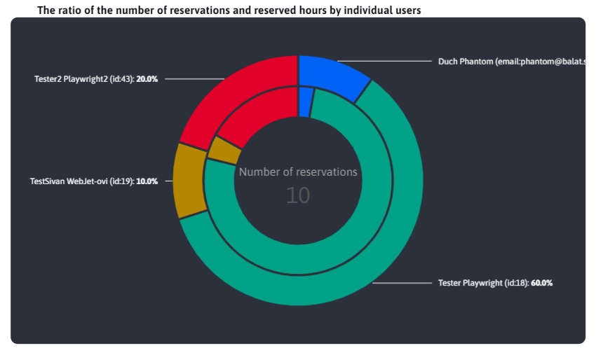
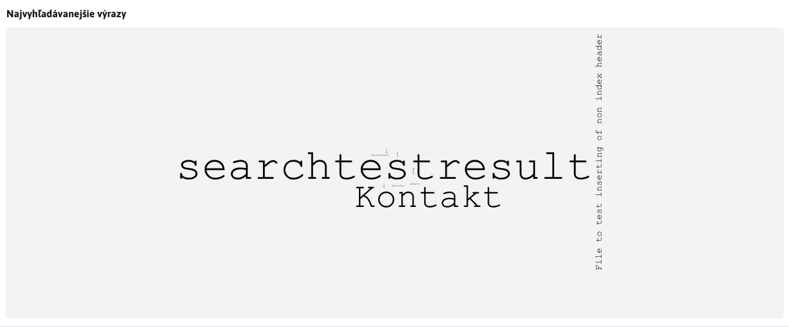
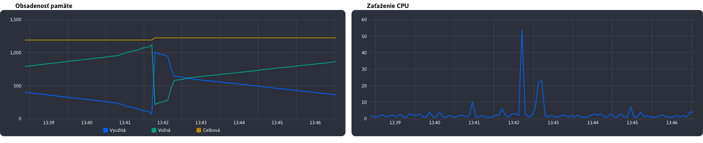

# Common JS functions

This section describes common charting functions provided by the [chart-tools.js](../../../../../src/main/webapp/admin/v9/src/js/libs/chart/chart-tools.js) file. The functions are accessible through the `window.ChartTools` object.

!>**Note:** Historically, the no-configuration-object notation was used, where parameters were passed directly into the class constructor. This method is still supported, but we do not recommend using it.

## Overview of chart classes and types

| Class | Available as | Chart type |
| -------- | -------------- | ----------- |
| `LineChartForm` | `ChartTools.LineChartForm` | Line chart with date axis |
| `BarChartForm` | `ChartTools.BarChartForm` | Bar chart (horizontal/vertical) |
| `PieChartForm` | `ChartTools.PieChartForm` | Pie chart (classic or donut) |
| `DoublePieChartForm` | `ChartTools.DoublePieChartForm` | Two-layer pie chart |
| `WordCloudChartForm` | `ChartTools.WordCloudChartForm` | Word cloud |
| `TableChartForm` | `ChartTools.TableChartForm` | Simple table in chart design |

## Enumeration `ChartType`

The constant object `ChartType` is used to identify the data type in AJAX calls to the backend. It is available as `ChartTools.ChartType`.

| Value | Chain | Description |
| --------- | --------- | ------- |
| `ChartType.Line` | `"line"` | Line chart |
| `ChartType.Bar_Vertical` | `"bar_vertical"` | Vertical bar chart |
| `ChartType.Bar_Horizontal` | `"bar_horizontal"` | Horizontal bar chart |
| `ChartType.Pie_Classic` | `"pie_classic"` | Classic pie chart |
| `ChartType.Pie_Donut` | `"pie_donut"` | Donut pie chart |
| `ChartType.Double_Pie` | `"double_pie"` | Two-layer pie chart |
| `ChartType.Word_Cloud` | `"word_cloud"` | Word cloud |
| `ChartType.Table` | `"table"` | Table component |
| `ChartType.Not_Chart` | `"not_chart"` | Special case without graph |

```javascript
// Príklad použitia pri zostavení URL pre AJAX volanie
$.ajax({ url: getUrl(ChartTools.ChartType.Bar_Horizontal), success: function(result) { ... }});
```

## Graph type `BAR`

A graph of type **`BAR`** is created using an instance of class `BarChartForm`, which is available as `ChartTools.BarChartForm`.

```javascript
export class BarChartForm {

    constructor(yAxeName_or_config, xAxeName, chartTitle, chartDivId, chartData, horizontal = true) {
        if(typeof yAxeName_or_config === "object") {
            this.initFromConfig(yAxeName_or_config);
        } else {
            console.warn("Deprecated constructor signature. Use config object instead.");
            this.initFromConfig({
                yAxeName: yAxeName_or_config,
                xAxeName: xAxeName,
                chartTitle: chartTitle,
                chartDivId: chartDivId,
                chartData: chartData,
                horizontal: horizontal
            });
        }
    }

    initFromConfig(config) {
        if (!config.yAxeName) throwConstructorError("BarChartForm", "yAxeName");
        if (!config.xAxeName) throwConstructorError("BarChartForm", "xAxeName");
        if (!config.chartDivId) throwConstructorError("BarChartForm", "chartDivId");
        if (config.chartData == null || config.chartData === undefined) throwConstructorError("BarChartForm", "chartData");

        Object.assign(this, {
            yAxeName: config.yAxeName,
            xAxeName: config.xAxeName,
            chartTitle: config.chartTitle,
            chartDivId: config.chartDivId,
            chartData: config.chartData,
            horizontal: config.horizontal == null ? true : config.horizontal,
            colorScheme: config.colorScheme
        });
    }
}
```

The individual class parameters serve to:

- `yAxeName` is a text value representing the name of the variable in the object that stores the text value of the Y axis (category).
- `xAxeName` is a text value representing the name of the variable in the object that stores the numeric value of the X-axis (category value).
- `chartTitle` is a text value representing the title that will be displayed as a header above the chart.
- `chartDivId` is a text value representing the ID of the element `div` in which the chart will be drawn.
- `chartData` is an array of objects representing the chart data. Each object must contain both a category variable (`yAxeName`) and a category value variable (`xAxeName`).
- `horizontal` is a logical value that determines whether the graph will be horizontal or vertical.
- `colorScheme` is a text value specifying the color scheme of the chart (allowed values ​​are described in the [Color schemes](#color-schemes) section).

!>**Note:** Required parameters are `yAxeName`, `xAxeName`, `chartDivId` and `chartData`.

### Example of use

Example of using **`BAR`** graph from file [search-engine.html](../../../../../../src/main/webapp/apps/stat/admin/search-engines.html)

```javascript
    $.ajax({url: getUrl(ChartTools.ChartType.Bar), success: function(result) {

        const barConfig = {
            yAxeName: "queryName",
            xAxeName: "queryCount",
            chartTitle: '[[#{stat.graph.searchQueriesBars}]]',
            chartDivId: "searchEngines-barQueries",
            chartData: result['content']
        }

        barChartQueries = new ChartTools.BarChartForm(barConfig);

        ChartTools.createAmchart(barChartQueries);
    }});
```

The resulting generated graph of type `BAR_HORIZONTAL` also with a title:


If the parameter `horizontal` is set to `false`, the result is a graph of type `BAR_VERTICAL`. In the example below, the color scheme is also adjusted via the parameter `colorScheme`.


## Graph type `PIE`

A graph of type **`PIE`** is created using an instance of class `PieChartForm`, which is available as `ChartTools.PieChartForm`.

```javascript
export class PieChartForm {

    constructor(yAxeName_or_config, xAxeName, chartTitle, chartDivId, chartData, labelKey, labelTransformationFn = null, innerRadius = 50, leftLegendPosition = false) {
        if(typeof yAxeName_or_config === "object") {
            this.initFromConfig(yAxeName_or_config);
        } else {
            console.warn("Deprecated constructor signature. Use config object instead.");
            this.initFromConfig({
                yAxeName: yAxeName_or_config,
                xAxeName: xAxeName,
                chartTitle: chartTitle,
                chartDivId: chartDivId,
                chartData: chartData,
                labelKey: labelKey,
                labelTransformationFn: labelTransformationFn,
                innerRadius: innerRadius,
                leftLegendPosition: leftLegendPosition
            });
        }
    }

    initFromConfig(config) {
        if (!config.yAxeName) throwConstructorError("PieChartForm", "yAxeName");
        if (!config.xAxeName) throwConstructorError("PieChartForm", "xAxeName");
        if (!config.chartDivId) throwConstructorError("PieChartForm", "chartDivId");
        if (config.chartData == null || config.chartData === undefined) throwConstructorError("PieChartForm", "chartData");

        Object.assign(this, {
            yAxeName: config.yAxeName,
            xAxeName: config.xAxeName,
            chartTitle: config.chartTitle,
            chartDivId: config.chartDivId,
            chartData: config.chartData,
            labelKey: config.labelKey,
            labelTransformationFn: config.labelTransformationFn,
            innerRadius: config.innerRadius == null ? 50 : config.innerRadius,
            leftLegendPosition: config.leftLegendPosition == null ? false : config.leftLegendPosition,
            legendValueText: config.legendValueText,

            colorScheme: config.colorScheme
        });
    }
}
```

The individual class parameters serve to:

- `yAxeName` is a text value representing the name of the variable in the object that stores the numeric value of the category.
- `xAxeName` is a text value representing the name of the variable in the object that stores the text value of the category.
- `chartTitle` is a text value representing the title that will be displayed as a header above the chart.
- `chartDivId` is a text value representing the ID of the element `div` in which the chart will be drawn.
- `chartData` is an array of objects representing the chart data. Each object must contain both a category variable (`xAxeName`) and a category value variable (`yAxeName`).
- `labelKey` is a text value representing the translation key for the summary title.
- `labelTransformationFn` is a function to transform text in category labels. The format remains the same, only the text changes. The function must have one input parameter (the original text) and must return the transformed text.
- `innerRadius` is the numerical value of the inner radius of the graph in the range 0 - 100. A value of 0 means a classic pie chart, a value greater than 0 means a donut.
- `leftLegendPosition` is a logical value determining whether the legend is displayed on the left side of the chart.
- `legendValueText` is a text value defining the text format of the legend.
- `colorScheme` is a text value specifying the color scheme of the chart (allowed values ​​are described in the [Color schemes](#color-schemes) section).

!>**Note:** Required parameters are `yAxeName`, `xAxeName`, `chartDivId` and `chartData`.

### Example of use

Example of using **`PIE`** graph from file [referer.html](../../../../../../src/main/webapp/apps/stat/admin/referer.html)

```javascript
    $.ajax({url: getGraphUrl(), success: function(result) {

        const pieConfig = {
            yAxeName: "visits",
            xAxeName: "serverName",
            chartTitle: '[[#{stat.referer.pieChart}]]',
            chartDivId: "referer-pieReferer",
            chartData: result['content']
        }

        pieChartVisits = new ChartTools.PieChartForm(pieConfig);
        ChartTools.createAmchart(pieChartVisits);
    }});
```

The resulting generated graph of type `PIE_DONUT` also with a title:


If the parameter `innerRadius` is set to 0, the result is a classic pie chart of the `PIE_CLASSIC` type. With the parameter `leftLegendPosition` set to `true`, the legend is moved to the left part of the chart.


### `labelKey` parameter

The `labelKey` parameter is special in that it is not required when creating an instance of `PieChartForm`. Therefore, it is not shown in the previous example. However, if you specify it, it will be used as a translation key to retrieve the text. This text will automatically appear in the center of the chart as a title, and below it, a calculated value representing the grand total of the series will appear.

This gives you an instant overview of the total value of the data in the chart. The font size is automatically adjusted to fit the text inside the chart. The value is automatically recalculated when the data changes.

!>**Warning:** We do not recommend using text that is too long, otherwise the font in the center of the chart will be very small.

You can also find similar behavior with a chart of type **`DOUBLE_PIE`**.

## Graph type `DOUBLE_PIE`

A graph of type **`DOUBLE_PIE`** is created using an instance of class `DoublePieChartForm`, which is available as `ChartTools.DoublePieChartForm`. It is a variant of a graph of type **`PIE`** with two nested parts.

```javascript
export class DoublePieChartForm {

    constructor(yAxeName_inner_or_config, yAxeName_outer, xAxeName, chartTitle, chartDivId, chartData, labelSeries = null, labelKey = null) {
        if(typeof yAxeName_inner_or_config === "object") {
            this.initFromConfig(yAxeName_inner_or_config);
        } else {
            console.warn("Deprecated constructor signature. Use config object instead.");
            this.initFromConfig({
                yAxeName_inner: yAxeName_inner_or_config,
                yAxeName_outer: yAxeName_outer,
                xAxeName: xAxeName,
                chartTitle: chartTitle,
                chartDivId: chartDivId,
                chartData: chartData,
                labelSeries: labelSeries,
                labelKey: labelKey
            });
        }
    }

    initFromConfig(config) {
        if (!config.yAxeName_inner) throwConstructorError("DoublePieChartForm", "yAxeName_inner");
        if (!config.yAxeName_outer) throwConstructorError("DoublePieChartForm", "yAxeName_outer");
        if (!config.xAxeName) throwConstructorError("DoublePieChartForm", "xAxeName");
        if (!config.chartDivId) throwConstructorError("DoublePieChartForm", "chartDivId");
        if (config.chartData == null || config.chartData === undefined) throwConstructorError("DoublePieChartForm", "chartData");

        Object.assign(this, {
            yAxeName_inner: config.yAxeName_inner,
            yAxeName_outer: config.yAxeName_outer,
            xAxeName: config.xAxeName,
            chartTitle: config.chartTitle,
            chartDivId: config.chartDivId,
            chartData: config.chartData,
            labelSeries: config.labelSeries,
            labelKey: config.labelKey,
            colorScheme: config.colorScheme
        });
    }
}
```

The individual class parameters serve to:

- `yAxeName_inner` is a text value representing the name of a variable in the object that stores the numeric value of the inner part of the chart.
- `yAxeName_outer` is a text value representing the name of a variable in the object that stores the numeric value of the outer part of the graph.
- `xAxeName` is a text value representing the name of the variable in the object that stores the text value of the category.
- `chartTitle` is a text value representing the title that will be displayed as a header above the chart.
- `chartDivId` is a text value representing the ID of the element `div` in which the chart will be drawn.
- `chartData` is an array of objects representing the chart data. Each object must contain a category variable (`xAxeName`) and value variables (`yAxeName_inner`, `yAxeName_outer`).
- `labelSeries` is a text value specifying the series for the sum; allowed values ​​are `inner` and `outer`.
- `labelKey` is a text value representing the translation key for the summary title.
- `colorScheme` is a text value specifying the color scheme of the chart (allowed values ​​are described in the [Color schemes](#color-schemes) section).

!>**Note:** Required parameters are `yAxeName_inner`, `yAxeName_outer`, `xAxeName`, `chartDivId` and `chartData`.

### Example of use

Example of using **`DOUBLE_PIE`** graph from file [reservation-stat.html](../../../../../../src/main/webapp/apps/reservation/admin/reservation-stat.html)

```javascript
    $.ajax({url: getGraphUrl("pie", "users"), success: function(result) {

        const doublePIeConfig = {
            yAxeName_inner: "valueB",
            yAxeName_outer: "valueA",
            xAxeName: "category",
            chartTitle: '[[#{reservation.reservation_stat.hours_user_chart.title}]]',
            chartDivId: "reservationStat-doublePieTimeUsers",
            chartData: result,
            labelSeries: "outer",
            labelKey: "reservation.reservation_stat.hours_user_chart.label.js"
        };

        doublePieChartTimeUsers = new ChartTools.DoublePieChartForm(doublePIeConfig);

        ChartTools.createAmchart(doublePieChartTimeUsers);
    }});
```

The resulting generated chart with a title also includes an optional description in the center of the chart with a numerical sum of the values:



### Parameters `labelKey` and `labelSeries`

The `labelKey` and `labelSeries` parameters are special in that they are not required when creating an instance of `DoublePieChartForm`. If you specify them, they are used to display a summary of the values ​​in the center of the graph.

The parameter `labelKey` is used as a translation key to obtain the text. This text is automatically set to the center of the chart as the title of the calculated value.

The parameter `labelSeries` determines which series should be counted. It can take the following values:

- `inner` for the sum of the values ​​of the inner graph (`yAxeName_inner`)
- `outer` for the sum of the values ​​of the outer graph (`yAxeName_outer`)

This gives you a clear overview of the total value of the selected series. The font size is automatically adjusted to fit the text inside the chart. The value is automatically recalculated after the data changes.

!>**Warning:** We do not recommend using text that is too long, otherwise the font in the center of the chart will be very small.

## Graph type `WORD_CLOUD`

A graph of type **`WORD_CLOUD`** is created using an instance of class `WordCloudChartForm`, which is available as `ChartTools.WordCloudChartForm`.

```javascript
export class WordCloudChartForm {
    constructor(config) {
        this.initFromConfig(config);
    }

    initFromConfig(config) {
        if (!config.chartDivId) throwConstructorError("WordCloudChartForm", "chartDivId");
        if (config.chartData == null || config.chartData === undefined) throwConstructorError("WordCloudChartForm", "chartData");

        Object.assign(this, {
            chartDivId: config.chartDivId,
            chartData: config.chartData,
            chartTitle: config.chartTitle,
            xAxeName: config.xAxeName,
            yAxeName: config.yAxeName,
            mode: config.mode == null ? "word" : config.mode,
        });
    }
}
```

The individual class parameters serve to:

- `chartDivId` is a text value representing the ID of the element `div` in which the chart will be drawn.
- `chartData` is an array of objects representing the chart data. Each object must contain a category variable (`xAxeName`) and a category value variable (`yAxeName`).
- `chartTitle` is a text value representing the title that will be displayed as a header above the chart.
- `yAxeName` is a text value representing the name of a variable with a numeric category value.
- `xAxeName` is a text value representing the name of a variable with a text value of category.
- `mode` determines in which mode the chart will operate. Allowed values ​​are:
  - `"word"` (default value) - input `chartData` is a string (long text) from which words and their frequencies are automatically extracted. Parameters `xAxeName` and `yAxeName` are not required in this mode.
  - `"line"` - ​​input `chartData` is an array of objects, where each object contains a text (`xAxeName`) and a numeric (`yAxeName`) value. In this mode, `xAxeName` and `yAxeName` are mandatory.

!>**Note:** Required parameters are `chartDivId`, `chartData` and under certain conditions also `yAxeName` / `xAxeName`.

### Example of use

Example of using **`WORD_CLOUD`** graph from file [search-engine.html](../../../../../../src/main/webapp/apps/stat/admin/search-engines.html)

```javascript
    $.ajax({url: getUrl(ChartTools.ChartType.Bar), success: function(result) {

        const wordCloudConfig = {
             chartTitle: '[[#{stat.graph.searchQueriesBars}]]',
             chartDivId: "searchEngines-wordCloudQueries",
             chartData: result['content'],
             yAxeName: "queryCount",
             xAxeName: "queryName",
             mode: "line"
         }

         wordCloudChartQueries = new ChartTools.WordCloudChartForm(wordCloudConfig);
         ChartTools.createAmchart(wordCloudChartQueries);
    }});
```

The resulting generated graph with the title:



## Graph type `LINE`

A chart of type **`LINE`** is created using an instance of the class `LineChartForm`, which is available as `ChartTools.LineChartForm`. Compared to charts **`BAR`** or **`PIE`**, it is specific in that it can display multiple values ​​for multiple datasets. Therefore, it also requires specific input and configuration parameters, which are described in the following subsections.

```javascript
export class LineChartForm {

    constructor(yAxeName_or_config, xAxeName, chartTitle, chartDivId, chartData, dateType, legendTransformationFn = null, hideEmpty = true) {

        //console.log(typeof yAxeName_or_config === "object", yAxeName_or_config.yAxeName));

        if(typeof yAxeName_or_config === "object" && Array.isArray(yAxeName_or_config) === false) {
            this.initFromConfig(yAxeName_or_config);
        } else {
            console.warn("Deprecated constructor signature. Use config object instead.");
            this.initFromConfig({
                yAxeNames: yAxeName_or_config,
                xAxeName: xAxeName,
                chartTitle: chartTitle,
                chartDivId: chartDivId,
                chartData: chartData,
                dateType: dateType,
                legendTransformationFn: legendTransformationFn,
                hideEmpty: hideEmpty
            });
        }
    }

    initFromConfig(config) {
        if (config.yAxeNames == null || config.yAxeNames === undefined) throwConstructorError("LineChartForm", "yAxeName");
        if (!config.xAxeName) throwConstructorError("LineChartForm", "xAxeName");
        if (!config.chartDivId) throwConstructorError("LineChartForm", "chartDivId");
        if (config.chartData == null || config.chartData === undefined) throwConstructorError("LineChartForm", "chartData");

         Object.assign(this, {
            yAxeNames: config.yAxeNames,
            xAxeName: config.xAxeName,
            chartTitle: config.chartTitle,
            chartDivId: config.chartDivId,
            chartData: config.chartData,
            dateType: config.dateType == null ? DateType.Auto : config.dateType,
            legendTransformationFn: config.legendTransformationFn,
            hideEmpty: config.hideEmpty == null ? true : config.hideEmpty,

            colorScheme: config.colorScheme
        });
    }
}
```

The individual class parameters serve to:

- `yAxeNames` is a special configuration of the Y axes (more details in a separate subsection).
- `xAxeName` is a text value representing the name of the variable in the object that stores the X-axis value (usually a date).
- `chartTitle` is a text value representing the title that will be displayed as a header above the chart.
- `chartDivId` is a text value representing the ID of the element `div` in which the chart will be drawn.
- `chartData` is the data structure for the graph (more details in a separate subsection).
- `dateType` determines the granularity of the date axis (more details in a separate subsection).
- `legendTransformationFn` is a function that transforms the text in the chart legend. The function must have one input parameter (the original text) and must return the transformed text.
- `hideEmpty` is a logical value that determines whether tooltips should be displayed in the chart for empty values ​​(`null` or `0`). The default value is `true`, so empty values ​​will not be displayed. It only applies if the chart displays more than 8 lines.
- `colorScheme` is a text value specifying the color scheme of the chart (allowed values ​​are described in the [Color schemes](#color-schemes) section).

!>**Note:** Required parameters are `yAxeNames`, `xAxeName`, `chartDivId` and `chartData`.

### Example of use

Example of using **LINE** chart from file [index.html](../../../../../../src/main/webapp/apps/stat/admin/index.html)

```javascript
    let yAxeNames =
        ChartTools.getLineChartYAxeNameObjs(
            ["visits", "sessions", "uniqueUsers"],
            ["stat.visits.js", "stat.sessions.js", "stat.unique_users.js"]
        );

    $.ajax({url: getGraphUrl(), success: function(result) {

        const lineConfig = {
            yAxeNames: yAxeNames,
            xAxeName: "dayDate",
            chartTitle: '[[#{stat.top.lineChart}]]',
            chartDivId: "stat-lineVisits",
            chartData: convertData(result['content']),
            dateType: ChartTools.DateType.Days
        }

        lineChartVisits = new ChartTools.LineChartForm(lineConfig);

        ChartTools.createAmchart(lineChartVisits);

        WJ.hideLoader();
    }});
```

The resulting generated graph with the title:


### `yAxeNames` parameter

As you can see from the example, the parameter **`yAxeNames`** has a different shape than the graphs **`PIE`** and **`BAR`**, where it is a single text value. The reason is that the graph **`LINE`** can display multiple numeric parameters of the dataset as separate lines.

To create the correct form of the parameter **`yAxeNames`**, the helper function `getLineChartYAxeNameObjs()` from the file [chart-tools.js](../../../../../src/main/webapp/admin/v9/src/js/libs/chart/chart-tools.js) is used. It is especially important for the user that the input consists of two fields of text values.

The first field contains the names of the object parameters in the data (the numeric values ​​to be plotted as separate lines). The second field contains translation keys that map to these names in the same order and determine the text in the legend.

In the example above, three parameters are displayed: `visits`, `sessions`, and `uniqueUsers`. The legend then displays localized texts obtained from translation keys instead of technical names, for example the value for `stat.visits.js`.

```javascript
    let yAxeNames =
        ChartTools.getLineChartYAxeNameObjs(
            ["visits", "sessions", "uniqueUsers"],
            ["stat.visits.js", "stat.sessions.js", "stat.unique_users.js"]
        );
```

Translation keys are not required. You can replace some or all of the values ​​with `undefined`. However, the number of entries in both fields must remain the same.

Example of using `getLineChartYAxeNameObjs()` without a translation key:

```javascript
    let yAxeNames = ChartTools.getLineChartYAxeNameObjs(["visits"], [undefined]);
```

### `chartData` parameter

In the **LINE** graph, the data has a specific format: it is a map containing lists of objects, where each map element (list of objects) represents a separate dataset.

```java
Map<List<T>>
```

When visualizing this data, four basic scenarios can occur:

1. **1 dataset, 1 parameter**
The map contains one dataset (one list of objects). The parameter **`yAxeNames`** contains one item, so the resulting graph displays one line.

2. **1 dataset, N parameters**
The map contains one dataset and the parameter **`yAxeNames`** contains multiple items. The resulting graph displays multiple lines for the same dataset.

This type of chart is also used in the example above.

3. **M datasets, 1 parameter**
The map contains M datasets and the parameter **`yAxeNames`** contains one item. The resulting graph displays M lines, each for a different dataset, but always for the same numeric parameter (e.g. `visits`).

4. **M datasets, N parameters**
This is a combination of the previous cases. The resulting graph contains M × N lines. The item name in the legend is created by combining the dataset key from the map and the translated parameter name from **`yAxeNames`**.

### `dateType` parameter

The last specific parameter of the chart **`LINE`** is **`dateType`**. Since the X axis is a date axis, its granularity needs to be set correctly.

Example: If the X-axis shows an interval of 1 year and the values ​​are separated by a week, the appropriate granularity is weeks with a step of 1. If the X-axis shows several days and the values ​​are separated by 5 minutes, the granularity should be minutes with a step of 5.

To set the granularity, the enumeration `DateType` from the [chart-tools.js](../../../../../../src/main/webapp/admin/v9/src/js/libs/chart/chart-tools.js) file is used.

The value **`DateType.Auto`** is used when you want to leave the granularity selection to the default logic in the `chart-tools.js` file. This logic will determine the appropriate granularity and the optimal step based on the data.

The value **`DateType.Day_1`** is special for when you need a range of exactly 1 day. In that case, the parameter **`xAxeName`** (date value) is ignored and the parameter `hour` is used, which must be present in the data as an integer in the range 0 - 23.

There may also be a situation like on the **Visit** page in the statistics section, where the data granularity is determined on the backend according to the selected grouping. In such a case, the automatic granularity via **`DateType.Auto`** may not be suitable (for example, with an interval of 3 years, the data may still be in days).

For such cases, `DateType` also offers manual settings:

- `DateType.Seconds`
- `DateType.Minutes`
- `DateType.Hours`
- `DateType.Days`
- `DateType.Weeks`
- `DateType.Months`

When set manually, the graph will only calculate the step, but will keep the selected granularity. Therefore, it is necessary to select it correctly:

- too much granularity can distort the graph
- too small granularity can impair the functioning of the logic `Tooltip`

## Special (LIVE) charts

The `Monitorovanie servera - Aktuálne hodnoty` section uses special charts of type **`LINE`**, which can update automatically. Their logic is prepared specifically for this page and is not intended for repeated use on other pages. The implementation is in the file [vue-amchart-monitoring-server.vue](../../../../../../src/main/webapp/admin/v9/src/vue/components/webjet-server-monitoring/components/vue-amchart-monitoring-server.vue).

To create charts, the logic from the [chart-tools.js](../../../../../../src/main/webapp/admin/v9/src/js/libs/chart/chart-tools.js) file is used again, specifically the `createServerMonitoringChart()` function. Its input parameters are only the ID of the `div` element in which the chart will be displayed, and the text value of the chart type. Supported types are `memoryAmchart` and `cpuAmchart`.

### Example of use

Example of creating monitoring graphs:

```javascript
    if(this.type == "memoryAmchart") {
        ChartTools.createServerMonitoringChart("serverMonitoring-lineChartMemory", this.type).then((chart) => {
            this.chart = chart;
        });
    } else if(this.type == "cpuAmchart") {
        ChartTools.createServerMonitoringChart("serverMonitoring-lineChartCpu", this.type).then((chart) => {
            this.chart = chart;
        });
    }
```

Updating the values ​​of these graphs is done by the function `addData()` from the file `chart-tools.js`. The input parameters are:

- `allSeries` are all the chart series (lines) that you get from the chart instance
- `xAxis` is the X axis that you get from the graph instance
- `data` is new data that will be added to existing values
- `type` is the text data type used when creating a chart

Example of updating a monitoring chart:

```javascript
    ChartTools.addData(this.chart.series.values, this.chart.xAxes.values[0],  this.chartData, this.type);
```

In this case, the key is how the values ​​`allSeries` and `xAxis` are obtained from the graph instance.

Sample of both LIVE charts from the `Monitorovanie servera - Aktuálne hodnoty` section with generated titles:



## Special TABLE chart

A **TABLE** type graph is created using an instance of the `TableChartForm` class, which is available as `ChartTools.TableChartForm`.

This is a special case because it is not a `amCharts` type chart. The component represents a simple table without advanced features such as sorting, filtering, or interactive controls. Its main advantage is a unified design shared with other charts, which makes it visually fit in with other graphical elements in the interface. The solution is especially suitable in situations where you need to display multiple parameters at once in one row of the table while maintaining a consistent appearance for the entire section.

```javascript
export class TableChartForm {
    constructor(config) {
        this.initFromConfig(config);
    }

    initFromConfig(config) {
        if (config.paramsNames == null || config.paramsNames === undefined || Array.isArray(config.paramsNames) == false) throwConstructorError("TableChartForm", "paramsNames");
        if (!config.chartDivId) throwConstructorError("TableChartForm", "chartDivId");
        if (config.chartData == null || config.chartData === undefined) throwConstructorError("TableChartForm", "chartData");

        Object.assign(this, {
            paramsNames: config.paramsNames,
            chartDivId: config.chartDivId,
            chartTitle: config.chartTitle,
            chartData: config.chartData,
            colorScheme: config.colorScheme,

            // PERMANENT
            isCustomChart: true
        });
    }
}
```

The individual class parameters serve to:

- `paramsNames` is an array of parameter names to be displayed in the table.
- `chartDivId` is a text value representing the ID of the `div` element in which the table will be rendered.
- `chartTitle` is a text value representing the title that will be displayed as a header above the table.
- `chartData` is an array of objects representing the table data. Each object must contain the parameters listed in `paramsNames`.
- `colorScheme` is a text value specifying the component's color scheme (allowed values ​​are described in the [Color schemes](#color-schemes) section).

!>**Note:** Required parameters are `paramsNames`, `chartDivId` and `chartData`.

### Example of use

```javascript
    $.ajax({url: getUrl(), success: function(result) {

        const tableChartConfig = {
            paramsNames: ["name", "count"],
            chartDivId: "some_div_id",
            chartTitle: '[[#{some_translation_key}]]',
            chartData: result
        }

        tableChart = new ChartTools.TableChartForm(tableChartConfig);

        ChartTools.createAmchart(tableChart);
    }});
```

An example of what such a table chart might look like:


## Chart management

### Chart update - `updateChart()`

After changing the data in instance `ChartForm`, it is necessary to call function `updateChart()`, which will redraw the graph with the new values.

```javascript
// Zmena dát v chartForm objekte
barChartQueries.chartData = newData;
// Aktualizácia grafu
ChartTools.updateChart(barChartQueries);
```

The function works for all chart types (`BarChartForm`, `PieChartForm`, `LineChartForm`, `DoublePieChartForm`, `WordCloudChartForm`). The data must be assigned to the corresponding `chartForm` object before calling `updateChart()`.

!>**Warning:** With a chart type **`LINE`** it is not possible to update only the data - the entire chart will be destroyed and recreated. Other chart types update only the data series.

### Destruction of the graph - `destroyChart()`

To remove the chart from the DOM and free amCharts memory, use the `destroyChart()` function:

```javascript
ChartTools.destroyChart(barChartQueries);
```

The function works for all chart types. For `TableChartForm` it deletes the content of the `div` element.

## Color schemes

The `colorScheme` parameter is optional for all chart types. If not specified, the default color scheme (combination of `set1 + set3 + set5`) is used.

| Value | Description |
| --------- | ------- |
| *(not specified)* | Default scheme - combination `set1 + set3 + set5` |
| `"set1"` | Light shades - blue, green, yellow, red, ocean |
| `"set2"` | Medium shades - blue, green, yellow, red, ocean |
| `"set3"` | Deeper shades - blue, green, yellow, red, ocean |
| `"set4"` | Dark shades - blue, green, yellow, red, ocean |
| `"set5"` | Very dark shades - blue, green, yellow, red, ocean |
| `"set_blue"` | Five shades of blue (from light to dark) |
| `"set_green"` | Five shades of green (from light to dark) |
| `"set_red"` | Five shades of red (from light to dark) |
| `"set_yellow"` | Five shades of yellow (from light to dark) |

```javascript
const barConfig = {
    yAxeName: "queryName",
    xAxeName: "queryCount",
    chartDivId: "some-bar-div",
    chartData: result['content'],
    colorScheme: "set_blue"   // použijú sa odtiene modrej
}
```

## Auxiliary functions

In addition to the classes for creating graphs, `chart-tools.js` also exports several helper functions.

### `setVisibility(selectedOption)`

Toggles the visibility of `div` elements `#tableDiv`, `#tableDiv_2`, `#graphsDiv`, `#graphsDiv_2` according to the selected value. Used on pages where both a table and graphs are displayed and the user can switch between views.

| The value of `selectedOption` | Behavior |
| -------------------------- | ----------- |
| `"graph"` | Show only graphs, hide tables |
| `"table"` | Show only tables, hide graphs |
| `"tableGraph"` | Displays both tables and graphs |

```javascript
ChartTools.setVisibility("graph");
```

### `getDateRange(defaultRangeDaysValue)`

Returns a string with a time range in the format `daterange:timestamp_od-timestamp_do` based on the values ​​of the filters in the top bar of the page (`.dt-filter-from-dayDate`, `.dt-filter-to-dayDate`). If the filters are not filled, a default range of `defaultRangeDaysValue` days from the current date is used.

```javascript
let dateRange = ChartTools.getDateRange(30); // posledných 30 dní ako predvolený rozsah
```

### `convertDataForLineChart(dataToConvert)`

Converts data from `Map<String, List<T>>` format (as returned by the backend) to `Map` format suitable for `LineChartForm`. Automatically sorts each dataset by field `dayDate`.

```javascript
let convertedData = ChartTools.convertDataForLineChart(result['content']);
```

### `getLineChartYAxeNameObjs(yAxeNames, nameToShowKey)`

Creates an array of configuration objects for parameter `yAxeNames` of graph **`LINE`**. The function is described in more detail in the [Parameter yAxeNames](#parameter-yaxenames) section.

### `filterColumns(wantedColumns, allColumns)` / `filterColumnsOut(unWanted, allColumns)`

Helper functions for filtering DataTable columns by name. `filterColumns` returns only columns with the specified names, `filterColumnsOut` returns all columns except the specified ones.

```javascript
let columns = ChartTools.filterColumns(["name", "count"], DATA.columns);
let columns = ChartTools.filterColumnsOut(["id", "createdDate"], DATA.columns);
```

### `setSearchEnginesSelect(dataUrl, valueToSelect)` / `setWebPagesSelect(dataUrl, valueToSelect)` / `setSelect(dataUrl, valueToSelect, elementId)`

They asynchronously load a list of options for `<select>` elements from the specified URL and automatically select the item according to `valueToSelect`. The `setSearchEnginesSelect` and `setWebPagesSelect` functions work with specific element IDs (`#searchEngineSelect`, `#webPageSelect`), the `setSelect` function works with any ID specified via `elementId`.

```javascript
await ChartTools.setSelect("/admin/rest/stat/pages", selectedPageId, "webPageSelect");
```

### `saveSearchCriteria(DATA)` / `getSearchCriteria()`

They are used to store and load search criteria to/from `sessionStorage` under the key `webjet.apps.stat.filter`. This allows all statistics pages to remember the last used filter even after switching between pages.

```javascript
// Uložíme kritériá po ich zmene
ChartTools.saveSearchCriteria(DATA);

// Načítame kritériá pri inicializácii stránky
let defaultSearch = ChartTools.getSearchCriteria();
```