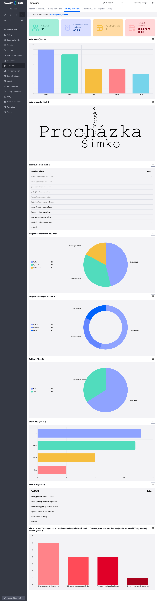

# Statistics using graphs

The `StatsByCharts` class in the [stats-by-charts.js](../../../../../../src/main/webapp/apps/_common/charts/stats-by-charts.js) file is a wrapper over [chart-tools.js](../../../../../../src/main/webapp/admin/v9/src/js/libs/chart/chart-tools.js). Its goal is to simplify the creation of multiple charts at once from structured data coming from the backend (REST API).

## Data structure

The data must be in the format of an array containing objects – one object for each chart.

Each object **must contain**:

- `id` – unique chart identifier
- `type` – enumeration value [ChartType](../backend/README.md#chart-type), which specifies what type of chart we are interested in
- `values` – value array for the chart

Objects **may additionally contain**:

- `title` – title to be used for the generated chart
- `chart_colorScheme` – the [color-scheme](../backend/README.md#chart-color-scheme) value to use for **this specific chart**
- `xAxeName` – name of the field in the `values` object, which represents the X axis of the chart
- `yAxeName` – name of the field in the `values` object, which represents the Y axis of the chart

The default values ​​`xAxeName` / `yAxeName` vary depending on the chart type:

| Chart type | `xAxeName` | `yAxeName` |
| --- | --- | --- |
| `PIE_CLASSIC` / `PIE_DONUT` | `"name"` | `"count"` |
| `BAR_VERTICAL` / `BAR_HORIZONTAL` | `"count"` | `"name"` |
| `WORD_CLOUD` | `"name"` | `"count"` |

The `DOUBLE_PIE` and `TABLE` graphs use specific properties instead of `yAxeName`:

- for type `DOUBLE_PIE`: `yAxeName_inner` (default `"count"`) and `yAxeName_outer` (default `"count"`); X axis remains `xAxeName` (default `"name"`)
- for type `TABLE`: `paramsNames` – array of field names displayed in the table (by default `["name", "count"]`)

## What the class does

- Loads the amcharts library (`window.initAmcharts()`) automatically when creating charts for the first time.
- Dynamically creates DOM elements (container, `<div>` for each graph, settings button).
- Based on the value of `type` in the data, it decides what type of graph to draw. It recognizes the differences between the individual variants (e.g. `pie_donut` vs. `pie_classic`) and adjusts the settings accordingly without further intervention. Supports types:
  - `pie_donut` / `pie_classic` -> pie chart (`PieChartForm`)
  - `bar_vertical` / `bar_horizontal` -> bar chart (`BarChartForm`)
  - `table` -> table (`TableChartForm`)
  - `word_cloud` -> word cloud (`WordCloudChartForm`)
- Maintains a map of graph instances (`chartsInstances`) for later update.
- Allows updating an individual graph without refreshing the entire page - the old instance is destroyed and a new one is created in the same place.
- Automatically adds a settings button with an optional callback function to each chart.

!> **Warning:** Graphs of type `LINE` with class `StatsByCharts` are **not** supported, as they require specific settings from the programmer on the frontend side.

## Advantages over direct use `chart-tools.js`

| | `chart-tools.js` directly | `StatsByCharts` |
| --- | --- | --- |
| Initializing amcharts | manually `window.initAmcharts().then(...)` | automatically |
| Creating DOM elements | manually (`<div id="..."> `) | automatically |
| Multiple charts | each one separately | iterate over an array of data |
| Determining the chart type | manually (you choose the correct class) | by `type` in data |
| Chart update | manually cancel + recreate | `updateChart()` |
| Settings button | manually | automatically, with callback support |

`chart-tools.js` remains a suitable choice if you need full control over an individual graph (e.g. one graph with its own logic, type `LINE`). `StatsByCharts` is suitable where the backend returns an array of graphs with their configuration.

## APIs

### Constructor

```javascript
new StatsByCharts(options)
```

| Parameters | Type | Description |
| --- | --- | --- |
| `options.targetSelector` | `string` | CSS selector of the element into which the charts will be inserted (required) |
| `options.id` | `string` | Prefix for unique chart IDs (default `"stats-by-charts"`) |
| `options.chartSettingBtnFn` | `function` | Callback called after clicking the chart settings button; receives a `chartDef` object as an argument |

### Methods

#### `createCharts(chartsDefinitions)`

Creates all graphs at once. Call after loading data from REST API.

- `chartsDefinitions` – array of objects with graph definitions (structure described below).

#### `updateChart(newChartsDefinitions)`

Updates one or more existing charts.

- Destroys the old graph instance, removes the header, and draws a new graph with the updated data.

## Usage – example

The following example comes from the form statistics page [form-stats.html](../../../../../src/main/webapp/apps/form/admin/form-stats.html).

### 1. Importing a class

```javascript
import { StatsByCharts } from '/apps/_common/charts/stats-by-charts.js';
```

### 2. Creating an instance and graphs

```javascript
fetch("/rest/multistep-form-stat/get-stat-data?form-name=" + urlFormName)
    .then(response => response.json())
    .then(data => {
        let instance = new StatsByCharts({
            targetSelector: "#chartContainer",
            id: "form-stats",
            chartSettingBtnFn: (chartDef) => {
                // Otvorenie modálneho okna pre nastavenie grafu
                WJ.openIframeModalDatatable({
                    url: "/apps/form/admin/form-stats-table/?id=-1&formName=" + urlFormName + "&itemFormId=" + chartDef.id + "&showOnlyEditor=true",
                    width: 850,
                    height: 500,
                    buttonTitleKey: "button.save"
                });
            }
        });

        // Vykreslenie všetkých grafov naraz
        instance.createCharts(data.chartData);
    });
```

### 3. HTML container

```html
<div id="chartContainer"></div>
```

The class itself will create the internal structure:

```html
<div id="chartContainer">
    <div id="form-stats">
        <div id="form-stats_{chartId}_container" class="stat-chart-wrapper">
            <button class="btn btn-sm btn-outline-secondary chart-more-btn">...</button>
            <div id="form-stats_{chartId}" class="amcharts"></div>
        </div>
        <!-- ďalší graf... -->
    </div>
</div>
```

### 4. Updating the graph after changing settings

The graph can be updated without refreshing the entire page by calling the method `updateChart(data)`, where `data` is an array of one or more graph objects in the same structure as [created](#data-structure). The class according to `id` automatically finds the existing instance, destroys it, and redraws it with the new data.

Example of updating a chart/charts:

```javascript
fetch("/get_new_chart_data")
    .then(response => response.json())
    .then(data => {
        instance.updateChart(data);
    })
    .catch(error => {
        console.error("Error fetching chart new data:", error);
    });
```

Sample of generated statistics from the example above:

