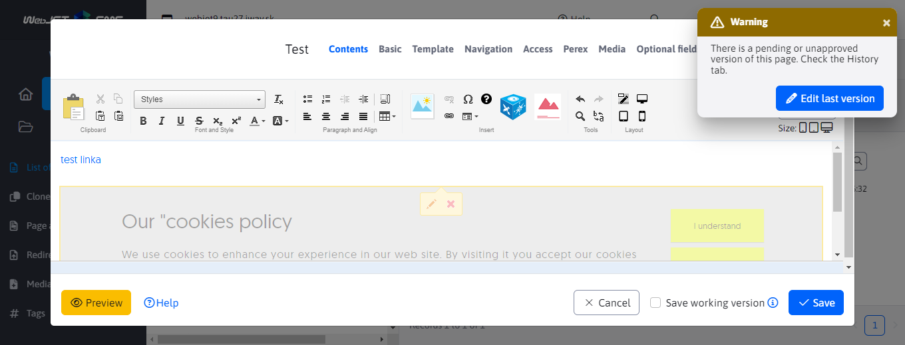
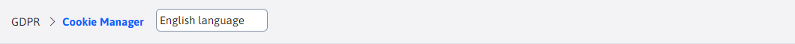
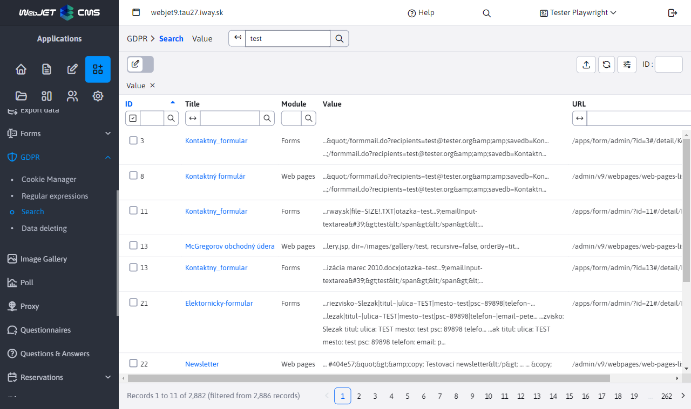

# WebJET JavaScript functions

WebJET encapsulates the APIs of the libraries used in the webjet.js file. The goal is not to use API calls from the libraries directly, but to encapsulate the calls through our functions. This will allow us to possibly replace the library used without changing the API.

## Notifications

For notifications we use the library [toastr](https://github.com/CodeSeven/toastr), the following JS functions are ready:

`WJ.notify(type, title, text, timeOut = 0, buttons = null, appendToExisting = false, containerId = null)` - displays a toast notification (equivalent to `window.alert`), parameters:
- `type` (String) - type of displayed notification, options: `success, info, warning, error`
- `title` (String) - title of the displayed notification
- `text` (String) - text of the displayed notification, optional
- `timeout` (int) - time after which the notification will be hidden, optional, value 0 means that the notification will be displayed until the user closes it
- `buttons` (json) - array of buttons displayed below the notification text
- `appendToExisting` (boolean) - after setting to `true` is text added to an existing notification of the same type. If it does not exist yet, a new notification is created.
- `containerId` (String) - CSS ID of the container where the notification will be inserted.

Shortened versions are also available, we recommend using those:
- `WJ.notifySuccess(title, text, timeOut=0, buttons=null)`
- `WJ.notifyInfo(title, text, timeOut=0, buttons=null)`
- `WJ.notifyWarning(title, text, timeOut=0, buttons=null)`
- `WJ.notifyError(title, text, timeOut=0, buttons=null)`

Required is the parameter `title`, the others are optional.



Examples:

```javascript
//zobrazenie chybovej spravy
WJ.notifyError("Zvoľte si riadky na vykonanie akcie");

//zobrazenie chybovej spravy, ktora sa po 5 sekundach schova
WJ.notifyError("Vyberte adresár", null, 5000);

//zobrazenie chybovej spravy s doplnkovym textom a HTML kódom
WJ.notifyError('Nepodarilo sa to', 'Skúste to <strong>neskôr</strong>');
```

In the date table you can send [server notifications](../datatables-editor/notify.md).

If you need to display a button you specify it as a JSON array:

```javascript
[
    {
        title: "Editovať poslednú verziu", //button title
        cssClass: "btn btn-primary", //button CSS class
        icon: "ti ti-pencil", //optional: Tabler icon
        click: "editFromHistory(38, 33464)", //onclick function
        closeOnClick: true //close toastr on button click, default true
    }
]
```

The value in `click` is set directly to `onclick` attribute of the button, it should not contain the " character, we recommend only calling the appropriate JS function.

## Confirmation of action

To confirm an action (equivalent to `window.confirm` where by clicking OK/Confirm I can execute the selected action) is ready JS function `WJ.confirm(options)`. V `options` object can have the following parameters:
- `title` (String) - title of the displayed question
- `message` (String) - text of the displayed question
- `btnCancelText` (String) - text displayed on the cancel button (default Cancel)
- `btnOkText` (String) - text displayed on the button to confirm the action (by default Confirm)
- `success` (function) - the function that is executed after the confirmation of the action
- `cancel` (function) - a function that is executed after the action is cancelled

Examples of use:

```javascript
WJ.confirm({
    title: "Skutočne chcete zmazať údaje?",
    success: function() {
        console.log("deleting data...");
    }
});
```

## Getting value

To obtain the value (equivalent `window.prompt` where it is necessary to enter a value into the dialog) is ready function `WJ.propmpt(options)`. V `options` object it is possible to enter the same values as for [confirmation of action](#confirmation-of-action).

Example of use:

```javascript
WJ.confirm({
    title: "Zadajte hodnotu",
    success: function(value) {
        console.log("Zadana hodnota: ", value);
    }
});
```

## Date and time formatting

The following functions are available for unified date and time formatting:
- `WJ.formatDate(timestamp)` - formats the specified `timestamp` as the date
- `WJ.formatDateTime(timestamp)` - formats the specified `timestamp` as date and time (hours:minutes)
- `WJ.formatDateTimeSeconds(timestamp)` - formats the specified `timestamp` as date and time including seconds
- `WJ.formatTime(timestamp)` - formats the specified `timestamp` as time (hours:minutes)
- `WJ.formatTimeSeconds(timestamp)` - formats the specified `timestamp` as time including seconds

## Number formatting

The following functions are available for unified number formatting:
- `WJ.formatPrice(price)` - formats the specified number as a menu rounded to 2 decimal places, example: `WJ.formatPrice(1089) - 1 089,00`.

## Iframe dialogue

Using the call `WJ.openIframeModal(options)` it is possible to open a dialog with an iframe of the specified URL. It does not open `popup` window, but a dialog box directly in the page. V `options` object can have the following parameters:
- `url` = URL address of the embedded iframe
- `width` = window width
- `height` = height of the inserted iframe (the modal will be one header and footer higher)
- `title` = window caption
- `buttonTitleKey` = translation key of the text on the primary save button (by default the key `button.submit` - Confirm)
- `closeButtonPosition` = position of the button to close the window
  - `prázdna hodnota` - X icon in the window header
  - `close-button-over` - X icon in the header but above the content of the window (does not create a separate line)
  - by adding `nopadding`, e.g. `closeButtonPosition: "close-button-over nopadding"` the top indent in the header is also removed
- `okclick` = callback after click on the confirm button, does not contain any parameters, the value from the iframe has to be pulled in the callback implementation
- `onload` = callback after loading the window, receives as parameter `event.detail` containing an object `window` with a link to the window in the iframe

The dialog box has its own close button, if necessary it is possible to use the API call `WJ.closeIframeModal()` to close the window.

For windows containing a datatable there is a function `openIframeModalDatatable(options)` which sets the functions `okclick` a `onload` for calling save and correct closing of the window after saving the record in the data table. The set height is automatically reduced according to the size of the window.

**Notes on implementation**

The HTML code of the dialog is statically embedded in the file [iframe.pug](../../../../src/main/webapp/admin/v9/views/modals/iframe.pug) and linked to the page in [layout.pug](../../../../src/main/webapp/admin/v9/views/partials/layout.pug). The iframe is thus reused for different dialogues. In the variable `modalIframe` is a reference to a dialogue instance.

Problematic was the use of dialogue in the datatables editor, which itself is dialogue. The modal-backdrop did not have the appropriate z-index set and was behind the editor window, so it was positioned incorrectly (did not overlap the editor). Therefore, when the iframe of the dialog is opened, we set the `.modal-backdrop` CSS class `modalIframeShown` which correctly sets the `z-index` on the backdrop elements.

## Dialogue for selecting a file/link

To easily use the file/image/page link selection dialog box view (open `elfinder` dialog box) functions can be used:
- `WJ.openElFinder(options)` - opens a dialog with the settings as used for the Iframe dialog (except for the url, which is automatically set).
- `WJ.openElFinderButton(button)` - opens a dialog box when the button is clicked `button`. In the parental element `div.input-group` automatically searches for a form input field and uses this to get the current value and set it after selection. According to the element `label.col-form-label` sets the window caption.

Example of use `WJ.openElFinder`:

```javascript
WJ.openElFinder({
    link: conf._input.val(),
    title: conf.label,
    volumes: "images", //or link
    okclick: function(link) {
        //console.log("OK click");
        setValue(conf, link);
    }
});
```

Example HTML code for use `onclick="WJ.openElFinderButton(this);"`:

```html
<div class="input-group">
  <div class="input-group-prepend">
    <span class="input-group-text has-image" style="background-image: url(/images/investicny-vklad/business-3175110_960_720.jpg);">
      <i class="ti ti-photo"></i>
    </span>
  </div>
  <input id="DTE_Field_fieldE" maxlength="255" data-warninglength="" data-warningmessage="" value="/images/investicny-vklad/business-3175110_960_720.jpg" class="form-control" type="text">
  <div class="input-group-append">
    <button class="btn btn-outline-secondary" type="button" onclick="WJ.openElFinderButton(this);">
      <i class="ti ti-pencil"></i>
    </button>
  </div>
</div>
```

## Maintaining a connection to the server (refresher)

To avoid user login expiration (e.g. when editing a web page for a long time), the REST service is called at minute intervals `/admin/rest/refresher`. It maintains the session and also checks for new messages for the administrator. If there are new messages a popup window will appear.

The following functions are available:
- `keepSession()` - initialization function that starts the REST service call timer.
- `keepSessionShowLogoffMessage()` - displays an error message when the connection to the server is interrupted, ensuring that the message is not displayed multiple times. After 5 minutes it redirects to the login.
- `keepSessionShowTokenMessage(errorMessage)` - displays an error message for an incorrect CSRF token, ensuring that the message is not displayed multiple times.

**Notes on implementation**

Error messages are displayed via the toastr library in a separate container `toast-container-logoff` at the top of the screen. They use `window` objects to protect against multiple reporting.

The initialization of the timer is triggered from [app-init.js](../../../../src/main/webapp/admin/v9/src/js/app-init.js) by calling the function `WJ.keepSession();`.

Protection for CSRF tokens and the connection to the server is set in addition to the timer in [head.pug](../../../../src/main/webapp/admin/v9/views/partials/head.pug) in ajax call setup using the function `$.ajaxSetup`. For an HTTP error with status 401, the function is called `WJ.keepSessionShowLogoffMessage()`, for error 403 function `WJ.keepSessionShowTokenMessage(errorMessage)`.

## Navigation bar

You can generate a navigation bar, typically with a filter or a return, by calling a JS function `JS.breadcrumb`, which receives as a parameter a JSON configuration object in the format:

```javascript
{
    id: "regexp",
    tabs: [
        {
            url: '/apps/gdpr/admin/',
            title: '[[#{components.gdpr.menu}]]',
            active: false
        },
        {
            url: '/apps/gdpr/admin/regexps/',
            title: '[[#{components.gdpr.regexp.title}]]'
        }
    ],
    backlink: {
        url: "#/",
        title: WJ.translate('forms.formsList.js'),
    },
    showInIframe: false
}
```

Where:
- `id` - unique identifier
- `tabs` - array of displayed navigation bar items
  - `url` - the address of the page when you click on the item
  - `title` - name of the item
  - `active` - (optional) if false will be displayed as inactive option - used for sub-pages of the application where the first item refers to the home/main page of the application
- `backlink` - (optional) link to previous page (used in `master-detail` view, e.g. in the form details link to the list of forms)
- `showInIframe` - (optional) if set to `true`, or there is an attribute in the cards with the value `title: '{filter}'` the header is also displayed in `iframe` element - typically in the application properties in the page editor

At the same time, the caption of the item that first does not have the attribute `active: false` is set as the title of the web page (attribute `title` html code of the page).

**Display language selection**

In some cases, it is necessary to display the data in the datatable according to the selected language (not according to the language of the currently logged-in administrator). An example is the GDPR->Cookie Manager application, where individual `cookies` can set descriptions for different languages.



The navigation bar allows you to insert the language selection directly into it using a macro `{LANGUAGE-SELECT}`:

```javascript
WJ.breadcrumb({
    id: "regexp",
    tabs: [
        {
            url: '/apps/gdpr/admin/',
            title: '[[#{components.gdpr.menu}]]',
            active: false
        },
        {
            url: '/apps/gdpr/admin/',
            title: '[[#{components.cookies.cookie_manager}]]'
        },
        {
            url: '#translation-keys-language',
            title: '{LANGUAGE-SELECT}',
            active: false
        }
    ]
})
```

a selection box with a list of languages is dynamically inserted into the navigation bar with `id=breadcrumbLanguageSelect`. You can then respond to the language change by setting URLs for REST services:

```javascript
$("#breadcrumbLanguageSelect").change(function() {
    let lng = $(this).val();
    //console.log("Select changed, language=", lng);
    url = "/admin/rest/cookies?breadcrumbLanguage="+lng;
    cookiesDataTable.setAjaxUrl(url);
    cookiesDataTable.EDITOR.s.ajax.url = WJ.urlAddPath(url, '/editor');
    cookiesDataTable.ajax.reload();
});
```

You can also insert the language selection directly into the table toolbar, example inserting it as the first item before the add record button:

```javascript
let select = $("div.breadcrumb-language-select").first();
$("#cookiesDataTable_wrapper .dt-header-row .row .col-auto .dt-buttons").prepend(select);
select.show();

$("#cookiesDataTable_wrapper .dt-header-row .row .col-auto .dt-buttons div.breadcrumb-language-select select").change(function() {
    let lng = $(this).val();
    //console.log("Select changed, language=", lng);
    url = "/admin/rest/cookies?breadcrumbLanguage="+lng;
    cookiesDataTable.setAjaxUrl(url);
    cookiesDataTable.EDITOR.s.ajax.url = WJ.urlAddPath(url, '/editor');
    cookiesDataTable.ajax.reload();
});
```

In the REST interface, you get the language by getting the URL parameter `breadcrumbLanguage`:

```java
@Override
public CookieManagerBean getOneItem(long id) {

    CookieManagerDB cookieMangerDB = new CookieManagerDB();

    String language = getRequest().getParameter("breadcrumbLanguage");
    Prop prop = Prop.getInstance(language);

    CookieManagerBean entity;

    if(id != -1) {
        entity = cookieMangerDB.getById((int) id);
        setTranslationKeysIntoEntity(entity, prop);
    } else {
        entity = new CookieManagerBean();
    }

    return entity;
}
```

**Insert marker for external filter**

If you need to have an external filter in the navigation bar, you can use the tag as a caption `{TEXT}`. If the caption starts with the character `{` text wrapped in a DIV container is inserted. This can then be used to move [external filter](../datatables/README.md#external-filter) such as in the GDPR/Search application.



```html
<script>
    var searchDataTable;

    window.domReady.add(function () {

        WJ.breadcrumb({
            id: "regexpsearch",
            tabs: [
                {
                    url: '/apps/gdpr/admin/',
                    title: '[[#{components.gdpr.menu}]]',
                    active: false
                },
                {
                    url: '/apps/gdpr/admin/search/',
                    title: '[[#{components.gdpr.list}]]'
                },
                {
                    url: '#value',
                    title: '{filter}',
                    active: false
                }
            ]
        });

        ...

        $("#searchDataTable_extfilter").on("click", "button.filtrujem", function() {
            //umele vyvolanie reloadu, kedze je zapnute klientske strankovanie/filtrovanie
            searchDataTable.ajax.reload();
        });
    });
</script>

<div id="searchDataTable_extfilter">
    <div class="row datatableInit">
        <div class="col-auto dt-extfilter-title-value"></div>
        <div class="col-auto dt-extfilter dt-extfilter-value"></div>
    </div>
</div>
```

For [menu item highlighting](../../custom-apps/admin-menu-item/README.md#frontend) v `master-detail` pages can use the function `WJ.selectMenuItem(href)`.

## Cards in the header

By default, navigation tabs are displayed in the header as second-level navigation items. However, in some cases (e.g. in the web pages section) they are used to filter the list of web pages (Active, Unapproved, System...). You can use the `WJ.headerTabs(config)` to generate them:

```JavaScript
WJ.headerTabs({
    id: 'pages',
    tabs: [
        { url: '#pages', title: '[[\#{webpages.tab.pages}]]', active: true },
        { url: '#changes', title: '[[\#{webpages.tab.changes}]]' },
        { url: '#waiting', title: '[[\#{webpages.tab.waiting}]]' },
        { url: '#system', title: '[[\#{webpages.tab.system}]]' },
        { url: '#trash', title: '[[\#{webpages.tab.trash}]]' },
        { url: '#folders-dt', title: '[[\#{webpages.tab.folders}]]' }
    ]
});
```

If you initialize the cards later (after initializing WebJET), you still need to call the function `window.initSubmenuTabsClick();` for setting events. Example:

```javascript
WJ.headerTabs({
    id: 'tabsFilter',
    tabs: [
        { url: "javascript:elfinderTabClick('file')", id: "files", title: '[[\#{fbrowse.file}]]', active: true },
        { url: "javascript:elfinderTabClick('tools')", id: "tools", title: '[[\#{editor_dir.tools}]]', active: false },
        { url: "javascript:WJ.openPopupDialog('/components/sync/export_setup.jsp', 650, 500);", id: "export", title: 'Export - Import', active: false }
    ]
});
window.initSubmenuTabsClick();
```

You can respond to a card change event as:

```javascript
$('#pills-linkcheck a[data-wj-toggle="tab"]').on('click', function (e) {
    let selectedTab = e.target.id;

    if(selectedTab === "pills-brokenLinks-tab") {
        linkCheckDataTable.setAjaxUrl(WJ.urlUpdateParam(linkCheckUrl, "tableType", "brokenLinks"));
        linkCheckDataTable.ajax.reload();
    } else if(selectedTab === "pills-hiddenPages-tab") {
        linkCheckDataTable.setAjaxUrl(WJ.urlUpdateParam(linkCheckUrl, "tableType", "hiddenPages"));
        linkCheckDataTable.ajax.reload();
    } else if(selectedTab === "pills-emptyPages-tab") {
        linkCheckDataTable.setAjaxUrl(WJ.urlUpdateParam(linkCheckUrl, "tableType", "emptyPages"));
        linkCheckDataTable.ajax.reload();
    }
});
```

## Control of rights

When the web page is displayed, an object is generated `window.nopermsJavascript` with a list of rights that the user is not allowed. Never use this field directly, use the API call to check the rights:
- `WJ.hasPermission(permission)` - returns `true` if the currently logged in user is allowed the right `permission`. Otherwise it will return false.

## Markdown parser

Feature `parseMarkdown(markdownText, options)` allows you to convert basic Markdown format to HTML code. The following tags are supported:
- `#, ##, ###` - headings 1-3 (`h1-h3`)
- `> text` - brand `blockquote`
- `**text**` - bold font
- `*text*` - italics
- ` ` - image with alternative text
- `[stranka.html](nazov) ` - link to another page (requires setting ` options { link: true }`)
- `- odrazka` - non-numbered list
- `` \`text\` `` - block of code in text, wrapped in `<span class="code-inline">`
- `` \`\`\`text\`\`\` `` - block of code on multiple lines, wrapped in `<div class="code">`
- ` ` - picture

The function contains the parameters:
- `markdownText` - text in Markdown format
- `options` - optional settings
  - `link` - by default, links are not inserted into the generated HTML code, by setting it to `true` link insertion is switched on
  - `badge` - by setting it to `true` the first word before the hyphen character in the unnumbered list will be wrapped in `<span class="badge bg-secondary">`
  - `imgSrcPrefix` - URL address of the prefix for the image (domain name) if the image is read from another domain, the same prefix is used for links

Example of use:

```javascript
let tooltipText = WJ.parseMarkdown("Meno priečinka v URL adrese web stránok.\nZadajte **prázdnu hodnotu** pre automatické nastavenie podľa **názvu priečinku**.");
```

## Persistent user settings

If you need to store some user settings, you can use `window.localStorage` object. However, it will only be stored in the browser. If you need the settings for the user to be the same in all browsers, or to be available on the server as well, you need to use the `UserDetails.adminSettings`, which are stored in the database table `user_settings_admin`. They are stored in key/value format, where the value is often a JSON object.

APIs for both JavaScript and server-side processing are available for use.

!>**Notice**: do not store large objects in the settings, the settings are embedded in the HTML code of the administration and large objects would disproportionately increase the amount of data transferred.

### Use on the frontend

An API is available for the work:
- `WJ.getAdminSetting(key)` - returns the user's settings string with the specified key.
- `WJ.setAdminSetting(key, value)` - saves the specified value with the specified key in the user settings.

Example of use:

```javascript
export class JstreeSettings {
    STORAGE_KEY = "jstreeSettings_web-pages-list";

    //ziska objekt nastaveni a vrati ho ako JSON
    getSettings() {
        let storeItem = window.WJ.getAdminSetting(this.STORAGE_KEY);
        if (typeof storeItem != "undefined") {
            return JSON.parse(storeItem);
        }
        return {}
    }

    //overi, ci JSON hodnota .showId je true
    isIdShow() {
        let show = (true === this.getSettings().showId);
        //console.log("isIdShow=", show);
        return show;
    }

    //ulozi nastavenia
    saveSettings() {
        //ziskaj zakladny objekt, ak neexistuje, je to prazdny objekt
        let settings = self.getSettings();
        //nastav hdonoty podla checkboxov
        settings.showId = $("#jstree-settings-showid").is(":checked");
        settings.showPriority = $("#jstree-settings-showorder").is(":checked");
        settings.showPages = $("#jstree-settings-showpages").is(":checked");

        //console.log("settings: ", settings);

        window.WJ.setAdminSetting(this.STORAGE_KEY, JSON.stringify(settings));
    }
}
```

### Use on the backend

The class can be used on the backend `AdminSettingsService` to obtain the data:

```java
AdminSettingsService ass = new AdminSettingsService(user);
boolean showPages = ass.getJsonBooleanValue("jstreeSettings_web-pages-list", "showPages");
```

Data storage is provided by the REST service `/admin/rest/admin-settings/`:

```java
@RestController
@PreAuthorize("@WebjetSecurityService.isAdmin()")
public class AdminSettingsRestController {

   @PostMapping("/admin/rest/admin-settings/")
   public boolean save(@RequestBody LabelValue settings, final HttpServletRequest request) {
      Identity user = UsersDB.getCurrentUser(request);
      AdminSettingsService ass = new AdminSettingsService(user);
      boolean saveok = ass.saveSettings(settings.getLabel(), settings.getValue());
      return saveok;
   }

}
```

## Loading animation

If the page takes longer to load (e.g. to load graphs in statistics) it is possible to display a loading animation. It is possible to use functions in JavaScript code to show and hide the animation:

```javascript
//show loader
WJ.showLoader();
WJ.showLoader("text");
WJ.showLoader(null, "#pills-dt-datatableInit-index > div.panel-body");

//hide loader
WJ.hideLoader();
```

If you need to hide a block during upload, you can set its CSS class `hide-while-loading`. The element will be automatically hidden if the recording animation is displayed and then displayed when it is hidden.

```html
<div id="graphsDiv" class="hide-while-loading">
    <div id="visits" class="amcharts"></div>
</div>
```

## Other features

- `WJ.showHelpWindow(link)` - Calling causes the help window to be displayed. The value of the opened link is obtained from the parameter `link` or from `window.helpLink`.
- `WJ.changeDomain(select)` - Invokes the change action for the selected domain. Used in the window header in a multidomain installation with external files. In this mode, both files and application data (e.g. banners, scripts) are bound to the selected domain.
- `WJ.translate(key, ...params)` - Function on [translation of the key to text](jstranslate.md).
- `WJ.openPopupDialog(url, width, height)` - Opens a popup window with the specified URL and the specified window size, but we recommend using [WJ.openIframeModal](#iframe-dialog) if possible
- `WJ.urlAddPath(url, pathAppend)` - Adds a path to the (rest) URL, checks if there is no path in the URL `?param` - e.g. `WJ.urlAddPath('/admin/rest/tree?click=groups', '/list')` will be created `/admin/rest/tree/list?click=groups`.
- `WJ.urlAddParam(url, paramName, paramValue)` - Adds a parameter to the URL. Checks if there is already a parameter in the URL and adds ? or &, value `paramValue` encodes using `encodeURIComponent`.
- `WJ.urlUpdateParam(url, paramName, paramValue)` - Updates the specified parameter in the URL.
- `urlGetParam(name, queryString=null)` - gets the value of the parameter in the URL. If no value is specified `queryString` is obtained from `window.location.search`.
- `WJ.setJsonProperty(obj, path, value)` - Sets (JSON) the value in the object according to the specified name, also accepts nested objects of the type `editorFields.groupCopyDetails` (if `editorFields` does not exist yet, it will create it).
- `WJ.getJsonProperty(obj, path)` - Gets (JSON) the value in the object according to the specified name, also accepts nested objects of the type `editorFields.groupCopyDetails`.
- `WJ.dispatchEvent(name, detail)` - Raises an event on `window` object specified with the name `name`. JSON object `detail` adds as `e.detail` object to the triggered event. The event must be listened to by a call of type `window.addEventListener("WJ.DTE.close", function() { console.log("HAHA, yes"); });`
- `WJ.htmlToText(htmlCode)` - Converts the specified HTML code to plain text. Creates a hidden `DIV` element to which it sets the HTML code and then gets the plain text from it.
- `WJ.initTooltip($element)` - Initializes on the specified jQuery element (or collection) `tooltip` with MarkDown support.
- `WJ.escapeHtml(string)` - Replaces unsafe characters in the HTML code with entities to safely output them.
- `WJ.base64encode(text)` - encoded by the algorithm `base64` the specified text with character support in `utf-8`.
- `WJ.base64decode(encodedText)` - decoded by algorithm `base64` the specified text with character support in `utf-8`.
- `WJ.debugTimer(message)` - prints a report with the time since the first message. The reports must be turned on by calling `WJ.debugTimer(true)`, otherwise they will not appear. There is no need to comment out all the messages in the code.
