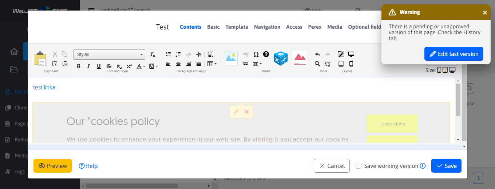
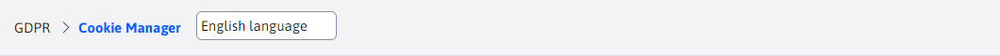
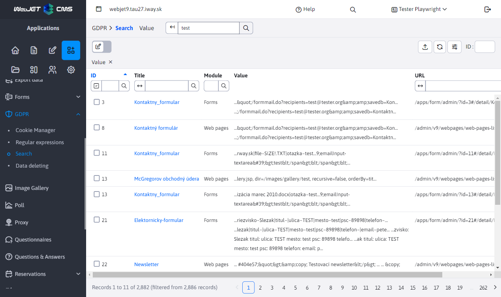

# WebJET JavaScript functions

WebJET encapsulates the API of the libraries used in the webjet.js file. The goal is to not use API calls from libraries directly, but encapsulate calls through our functions. This will allow us to replace the library used without changing the API.

## Notifications

For notifications we use the [toastr](https://github.com/CodeSeven/toastr) library, the following JS functions are provided:

`WJ.notify(type, title, text, timeOut = 0, buttons = null, appendToExisting = false, containerId = null)` - ​​displays a toast notification (equivalent to ```window.alert```), parameters:

- ```type``` (String) - type of displayed notification, options: ```success, info, warning, error```
- ```title``` (String) - title of the displayed notification
- ```text``` (String) - text of the displayed notification, optional
- ```timeout``` (int) - time after which the notification will hide, optional, value 0 means that the notification will be displayed until the user closes it
- ```buttons``` (json) - array of buttons displayed below the notification text
- ```appendToExisting``` (boolean) - when set to ```true```, the text is added to an existing notification of the same type. If it does not already exist, a new notification is created.
- ```containerId``` (String) - CSS ID of the container into which the notification will be inserted.

Shortened versions are also available, we recommend using these:

- ```WJ.notifySuccess(title, text, timeOut=0, buttons=null)```
- ```WJ.notifyInfo(title, text, timeOut=0, buttons=null)```
- ```WJ.notifyWarning(title, text, timeOut=0, buttons=null)```
- ```WJ.notifyError(title, text, timeOut=0, buttons=null)```

The parameter ```title``` is mandatory, the others are optional.



Examples:

```javascript
//zobrazenie chybovej spravy
WJ.notifyError("Zvoľte si riadky na vykonanie akcie");

//zobrazenie chybovej spravy, ktora sa po 5 sekundach schova
WJ.notifyError("Vyberte adresár", null, 5000);

//zobrazenie chybovej spravy s doplnkovym textom a HTML kódom
WJ.notifyError('Nepodarilo sa to', 'Skúste to <strong>neskôr</strong>');
```

In a datatable, you can send [server notifications](../datatables-editor/notify.md).

If you need to display a button, enter it as a JSON field:

```javascript
[
    {
        title: "Editovať poslednú verziu", //button title
        cssClass: "btn btn-primary", //button CSS class
        icon: "ti ti-pencil", //optional: Tabler icon
        click: "editFromHistory(38, 33464)", //onclick function
        closeOnClick: true //close toastr on button click, default true
    }
]
```

The value in `click` is set directly on the `onclick` button attribute, it cannot contain the " character, we recommend just calling the appropriate JS function.

## Action confirmation

To confirm an action (equivalent to ```window.confirm``` where by clicking OK/Confirm I can perform the selected action) a JS function ```WJ.confirm(options)``` is prepared. The ```options``` object can contain the following parameters:

- ```title``` (String) - title of the displayed question
- ```message``` (String) - text of the displayed question
- ```btnCancelText``` (String) - text displayed on the cancel button (default Cancel)
- ```btnOkText``` (String) - text displayed on the action confirmation button (default Confirm)
- ```success``` (function) - function that will be executed after confirming the action
- ```cancel``` (function) - function that will be executed after the action is canceled

Usage examples:

```javascript
WJ.confirm({
    title: "Skutočne chcete zmazať údaje?",
    success: function() {
        console.log("deleting data...");
    }
});
```

## Getting value

To get the value (equivalent to ```window.prompt``` where a value needs to be entered into the dialog), the function ```WJ.propmpt(options)``` is prepared. In the ```options``` object, the same values ​​can be entered as for [action confirmation](#action-confirmation).

Example of use:

```javascript
WJ.confirm({
    title: "Zadajte hodnotu",
    success: function(value) {
        console.log("Zadana hodnota: ", value);
    }
});
```

## Date and time formatting

The following functions are available for unified date and time formatting:

- ```WJ.formatDate(timestamp)``` - ​​formats the specified ```timestamp``` as a date
- ```WJ.formatDateTime(timestamp)``` - ​​formats the specified ```timestamp``` as date and time (hours:minutes)
- ```WJ.formatDateTimeSeconds(timestamp)``` - ​​formats the specified ```timestamp``` as a date and time including seconds
- ```WJ.formatTime(timestamp)``` - ​​formats the specified ```timestamp``` as time (hours:minutes)
- ```WJ.formatTimeSeconds(timestamp)``` - ​​formats the specified ```timestamp``` as a time including seconds

## Number formatting

The following functions are available for unified number formatting:

- `WJ.formatPrice(price)` - ​​formats the entered number as a currency rounded to 2 decimal places, example: `WJ.formatPrice(1089) - 1 089,00`.

## Iframe dialog

By calling ```WJ.openIframeModal(options)``` it is possible to open a dialog box with an iframe of the specified URL. This does not open a ```popup``` window, but a dialog box directly in the page. The ```options``` object can contain the following parameters:

- ```url``` = URL address of the embedded iframe
- ```width``` = window width
- ```height``` = height of the embedded iframe (the modal will be taller by the header and footer)
- ```title``` = window title
- ```buttonTitleKey``` = text translation key on the primary save button (default key ```button.submit``` - Confirm)
- ```closeButtonPosition``` = position of the button to close the window
  - ```prázdna hodnota``` - ​​small X icon in the window header
  - ```close-button-over``` - ​​X icon in the header but above the window content (does not create a separate line)
  - adding ```nopadding```, i.e. ```closeButtonPosition: "close-button-over nopadding"``` will also remove the top indent in the header
- ```okclick``` = callback after clicking the confirm button, does not contain any parameters, the value from the iframe needs to be pulled in the callback implementation
- ```onload``` = callback after loading the window, receives ```event.detail``` as a parameter containing the object ```window``` with a reference to the window in the iframe
- ```buttons``` = array of custom buttons in the footer of the dialog, each button is an object with properties:
  - ```title``` (String) - button text
  - ```cssClass``` (String) - CSS class of the button (e.g. `btn-primary`, `btn-outline-secondary`)
  - ```onClick``` (function) - callback called after clicking the button

  If the `buttons` parameter is not specified, the default Confirm button is displayed (the behavior is unchanged). Example:

  ```javascript
  WJ.openIframeModal({
      url: '/admin/v9/...',
      width: 800,
      height: 500,
      title: 'Dialóg',
      buttons: [
          {
              title: 'Uložiť',
              cssClass: 'btn-primary',
              onClick: function() { console.log('Uložiť kliknuté'); }
          },
          {
              title: 'Zrušiť',
              cssClass: 'btn-outline-secondary',
              onClick: function() { WJ.closeIframeModal(); }
          }
      ]
  });
  ```

The dialog box has its own close button, if necessary, you can use the API call ```WJ.closeIframeModal()``` to close the window.

The dialog supports **moving the window** by grabbing the header (drag & drop) — the cursor changes to `grab`. On devices with a small screen height (below 760px) or in `iframe` mode, the window appears maximized and moving is not available.

In the window header, there are buttons for **maximize and minimize** (switch to full screen mode). On devices with a small screen height (below 760px), these buttons are hidden and the window will appear automatically maximized.

For windows containing a data table, there is a function `openIframeModalDatatable(options)` which sets the functions `okclick` and `onload` to call save and correctly close the window after saving the record in the data table. The set height is automatically reduced according to the size of the window.

**Implementation Notes**

The HTML code of the dialog is statically embedded in the file [iframe.pug](../../../../src/main/webapp/admin/v9/views/modals/iframe.pug) and linked to the page in [layout.pug](../../../../src/main/webapp/admin/v9/views/partials/layout.pug). The iframe is therefore used repeatedly for different dialogs. The variable ```modalIframe``` contains a reference to the dialog instance.

The problem was using the dialog in the datatables editor, which itself is a dialog. The modal-backdrop did not have the appropriate z-index set and was behind the editor window, so it was incorrectly positioned (it did not cover the editor). Therefore, when opening the iframe dialog, we set the CSS class ```.modal-backdrop``` on the element ```modalIframeShown```, which correctly sets ```z-index``` on the backdrop element.

## File/Link Selection Dialog

For easy use of displaying the file/image/page link selection dialog (opening the ```elfinder``` dialog), the following functions can be used:

- ```WJ.openElFinder(options)``` - ​​opens a dialog box with the specified settings as used for the Iframe dialog (except for the url, which is automatically set).
- ```WJ.openElFinderButton(button)``` - ​​opens a dialog box after clicking the ```button``` button. In the parent element ```div.input-group```, it automatically searches for a form input field and uses it to get the current value and set it after selection. According to the element ```label.col-form-label```, it sets the window title.

Example of using ```WJ.openElFinder```:

```javascript
WJ.openElFinder({
    link: conf._input.val(),
    title: conf.label,
    volumes: "images", //or link
    okclick: function(link) {
        //console.log("OK click");
        setValue(conf, link);
    }
});
```

Example HTML code for using ```onclick="WJ.openElFinderButton(this);"```:

```html
<div class="input-group">
  <div class="input-group-prepend">
    <span class="input-group-text has-image" style="background-image: url(/images/investicny-vklad/business-3175110_960_720.jpg);">
      <i class="ti ti-photo"></i>
    </span>
  </div>
  <input id="DTE_Field_fieldE" maxlength="255" data-warninglength="" data-warningmessage="" value="/images/investicny-vklad/business-3175110_960_720.jpg" class="form-control" type="text">
  <div class="input-group-append">
    <button class="btn btn-outline-secondary" type="button" onclick="WJ.openElFinderButton(this);">
      <i class="ti ti-pencil"></i>
    </button>
  </div>
</div>
```

## Modal window with current context

To open a modal window with the current page context (CSS styles, JavaScript files and objects) you can use the `WJ.openModal` call. The retrieved URL will not be inserted into the `iframe` element but will be executed within the currently loaded web page. Example of use:

```pugjs
a.dropdown-item.passkey(onclick="WJ.openModal({url: '/admin/v9/users/passkey/', title: this.textContent.trim()})")
```

The loaded HTML file itself must not contain the embedded `hlavičku/menu` to avoid duplication of JavaScript/HTML/CSS objects. An example of a file is [passkey.pug](../../../../src/main/webapp/admin/v9/views/pages/users/passkey.pug).

## Maintaining connection to the server (refresher)

To prevent the user's login from expiring (e.g. during long editing of a web page), the REST service ```/admin/rest/refresher``` is called every minute. It maintains the session and also checks for new messages for the administrator. If there are new messages, it displays a pop-up window.

The following functions are available:

- ```keepSession()``` - ​​initialization function that starts the REST service call timer.
- ```keepSessionShowLogoffMessage()``` - ​​displays an error message when the connection to the server is interrupted, ensures that the message is not displayed multiple times. Redirects to login after 5 minutes.
- ```keepSessionShowTokenMessage(errorMessage)``` - ​​displays an error message for an incorrect CSRF token, ensuring that the message is not displayed multiple times.

**Implementation Notes**

Error messages are displayed via the toastr library in a separate container ```toast-container-logoff``` at the top of the screen. They use ```window``` objects to prevent multiple messages from being displayed.

Timer initialization is triggered from [app-init.js](../../../../src/main/webapp/admin/v9/src/js/app-init.js) by calling the ```WJ.keepSession();``` function.

In addition to the timer, protection for CSRF tokens and server connection is also set in [head.pug](../../../../src/main/webapp/admin/v9/views/partials/head.pug) in the ajax call settings using the ```$.ajaxSetup``` function. For an HTTP error with status 401, the ```WJ.keepSessionShowLogoffMessage()``` function is called, for an error 403, the ```WJ.keepSessionShowTokenMessage(errorMessage)``` function.

## Navigation bar

You generate a navigation bar, typically with a filter or backspace, by calling the JS function ```JS.breadcrumb```, which receives a configuration JSON object in the format:

```javascript
{
    id: "regexp",
    tabs: [
        {
            url: '/apps/gdpr/admin/',
            title: '[[#{components.gdpr.menu}]]',
            active: false
        },
        {
            url: '/apps/gdpr/admin/regexps/',
            title: '[[#{components.gdpr.regexp.title}]]'
        }
    ],
    backlink: {
        url: "#/",
        title: WJ.translate('forms.formsList.js'),
    },
    showInIframe: false
}
```

where:

- ```id``` - ​​unique identifier
- ```tabs``` - ​​array of displayed navigation bar items
  - ```url``` - ​​page address after clicking on the item
  - ```title``` - ​​item name
  - ```active``` - ​​(optional) if false it will be displayed as an inactive option - used for application sub-pages where the first item refers to the application's home/main page
- ```backlink``` - ​​(optional) link to the previous page (used in ```master-detail``` views, e.g. in form details link to the list of forms)
- `showInIframe` - ​​(optional) if set to `true`, or there is an attribute with the value `title: '{filter}'` in the tabs, the header will also be displayed in the `iframe` element - typically in the application properties in the page editor

At the same time, the title of the first item that does not have the ```active: false``` attribute is set as the title of the web page (attribute ```title``` of the html code of the page).

**Language selection display**

In some cases, it is necessary to display data in the data table according to the selected language (not according to the language of the currently logged in administrator). An example is the GDPR->Cookie Manager application, where individual ```cookies``` descriptions for different languages ​​can be set.



The navigation bar allows you to insert language selection directly into it using the macro ```{LANGUAGE-SELECT}```:

```javascript
WJ.breadcrumb({
    id: "regexp",
    tabs: [
        {
            url: '/apps/gdpr/admin/',
            title: '[[#{components.gdpr.menu}]]',
            active: false
        },
        {
            url: '/apps/gdpr/admin/',
            title: '[[#{components.cookies.cookie_manager}]]'
        },
        {
            url: '#translation-keys-language',
            title: '{LANGUAGE-SELECT}',
            active: false
        }
    ]
})
```

This dynamically inserts a language list selection field with ```id=breadcrumbLanguageSelect``` into the navigation bar. You can then respond to language changes by setting the URL addresses for REST services:

```javascript
$("#breadcrumbLanguageSelect").change(function() {
    let lng = $(this).val();
    //console.log("Select changed, language=", lng);
    url = "/admin/rest/cookies?breadcrumbLanguage="+lng;
    cookiesDataTable.setAjaxUrl(url);
    cookiesDataTable.EDITOR.s.ajax.url = WJ.urlAddPath(url, '/editor');
    cookiesDataTable.ajax.reload();
});
```

You can also insert the language selection directly into the table toolbar, an example of inserting it as the first item before the add record button:

```javascript
let select = $("div.breadcrumb-language-select").first();
$("#cookiesDataTable_wrapper .dt-header-row .row .col-auto .dt-buttons").prepend(select);
select.show();

$("#cookiesDataTable_wrapper .dt-header-row .row .col-auto .dt-buttons div.breadcrumb-language-select select").change(function() {
    let lng = $(this).val();
    //console.log("Select changed, language=", lng);
    url = "/admin/rest/cookies?breadcrumbLanguage="+lng;
    cookiesDataTable.setAjaxUrl(url);
    cookiesDataTable.EDITOR.s.ajax.url = WJ.urlAddPath(url, '/editor');
    cookiesDataTable.ajax.reload();
});
```

In the REST interface, you get the language by getting the URL parameter ```breadcrumbLanguage```:

```java
@Override
public CookieManagerBean getOneItem(long id) {

    CookieManagerDB cookieMangerDB = new CookieManagerDB();

    String language = getRequest().getParameter("breadcrumbLanguage");
    Prop prop = Prop.getInstance(language);

    CookieManagerBean entity;

    if(id != -1) {
        entity = cookieMangerDB.getById((int) id);
        setTranslationKeysIntoEntity(entity, prop);
    } else {
        entity = new CookieManagerBean();
    }

    return entity;
}
```

**Insert tag for external filter**

If you need to have an external filter in the navigation bar, you can use the ```{TEXT}``` tag as the title. If the title starts with the ```{``` character, the text is wrapped in a DIV container. This can then be used to move the [external filter](../datatables/README.md#external-filter) as in the GDPR/Search application.



```html
<script>
    var searchDataTable;

    window.domReady.add(function () {

        WJ.breadcrumb({
            id: "regexpsearch",
            tabs: [
                {
                    url: '/apps/gdpr/admin/',
                    title: '[[#{components.gdpr.menu}]]',
                    active: false
                },
                {
                    url: '/apps/gdpr/admin/search/',
                    title: '[[#{components.gdpr.list}]]'
                },
                {
                    url: '#value',
                    title: '{filter}',
                    active: false
                }
            ]
        });

        ...

        $("#searchDataTable_extfilter").on("click", "button.filtrujem", function() {
            //umele vyvolanie reloadu, kedze je zapnute klientske strankovanie/filtrovanie
            searchDataTable.ajax.reload();
        });
    });
</script>

<div id="searchDataTable_extfilter">
    <div class="row datatableInit">
        <div class="col-auto dt-extfilter-title-value"></div>
        <div class="col-auto dt-extfilter dt-extfilter-value"></div>
    </div>
</div>
```

To [highlight menu items](../../custom-apps/admin-menu-item/README.md#frontend) in ```master-detail``` pages, the ```WJ.selectMenuItem(href)``` function can be used.

## Header cards

By default, navigation tabs are displayed in the header as second-level navigation items. However, in some cases (e.g. in the website section) they are used to filter the list of websites (Active, Disapproved, System...). You can use the `WJ.headerTabs(config)` function to generate them:

```JavaScript
WJ.headerTabs({
    id: 'pages',
    tabs: [
        { url: '#pages', title: '[[\#{webpages.tab.pages}]]', active: true },
        { url: '#changes', title: '[[\#{webpages.tab.changes}]]' },
        { url: '#waiting', title: '[[\#{webpages.tab.waiting}]]' },
        { url: '#system', title: '[[\#{webpages.tab.system}]]' },
        { url: '#trash', title: '[[\#{webpages.tab.trash}]]' },
        { url: '#folders-dt', title: '[[\#{webpages.tab.folders}]]' }
    ]
});
```

If you initialize the cards later (after WebJET initialization), you still need to call the `window.initSubmenuTabsClick();` function to set the events. Example:

```javascript
WJ.headerTabs({
    id: 'tabsFilter',
    tabs: [
        { url: "javascript:elfinderTabClick('file')", id: "files", title: '[[\#{fbrowse.file}]]', active: true },
        { url: "javascript:elfinderTabClick('tools')", id: "tools", title: '[[\#{editor_dir.tools}]]', active: false },
        { url: "javascript:WJ.openPopupDialog('/components/sync/export_setup.jsp', 650, 500);", id: "export", title: 'Export - Import', active: false }
    ]
});
window.initSubmenuTabsClick();
```

You can respond to a card change event as follows:

```javascript
$('#pills-linkcheck a[data-wj-toggle="tab"]').on('click', function (e) {
    let selectedTab = e.target.id;

    if(selectedTab === "pills-brokenLinks-tab") {
        linkCheckDataTable.setAjaxUrl(WJ.urlUpdateParam(linkCheckUrl, "tableType", "brokenLinks"));
        linkCheckDataTable.ajax.reload();
    } else if(selectedTab === "pills-hiddenPages-tab") {
        linkCheckDataTable.setAjaxUrl(WJ.urlUpdateParam(linkCheckUrl, "tableType", "hiddenPages"));
        linkCheckDataTable.ajax.reload();
    } else if(selectedTab === "pills-emptyPages-tab") {
        linkCheckDataTable.setAjaxUrl(WJ.urlUpdateParam(linkCheckUrl, "tableType", "emptyPages"));
        linkCheckDataTable.ajax.reload();
    }
});
```

## Rights check

When a web page is displayed, an object ```window.nopermsJavascript``` is generated with a list of rights that the user does not have. Never use this field directly, use the API call to check rights:

- ```WJ.hasPermission(permission)``` - ​​returns ```true``` if the currently logged in user has the ```permission``` right enabled. Otherwise, returns false.

## Markdown parser

The ```parseMarkdown(markdownText, options)``` function allows you to convert basic Markdown format to HTML code. The following tags are supported:

- ```#, ##, ###``` - ​​heading 1-3 (```h1-h3```)
- ```> text``` - ​​brand ```blockquote```
- ```**text**``` - ​​bold font
- ```*text*``` - ​​italic
- ``` ``` - ​​image with alternative text
- ```[stranka.html](nazov) ``` - ​​link to another page (requires setting ```options { link: true }```)
- ```- odrazka``` - ​​unnumbered list
- ``` \`text\` ``` - ​​block of code in text, wrapped in `<span class="code-inline">`
- ``` \`\`\`text\`\`\` ``` - ​​multi-line code block, wrapped in `<div class="code">`
- ``` ``` - ​​image

The function contains parameters:

- ```markdownText``` - ​​text in Markdown format
- ```options``` - ​​optional settings
  - ```link``` - ​​by default, links are not inserted into the generated HTML code, setting it to ```true``` will enable the insertion of links
  - `badge` - ​​setting to `true` will wrap the first word before the hyphen in an unnumbered list into `<span class="badge bg-secondary">`
  - `imgSrcPrefix` - ​​URL prefix for the image (domain name) if the image is read from another domain, the same prefix will be used for links
  - `removeLastBr` - ​​after setting to `true` the last tag `<br>` at the end of the text is removed

Example of use:

```javascript
let tooltipText = WJ.parseMarkdown("Meno priečinka v URL adrese web stránok.\nZadajte **prázdnu hodnotu** pre automatické nastavenie podľa **názvu priečinku**.");
```

## Persistent user settings

If you need to store some user settings, you can use the ```window.localStorage``` object. However, it will only be stored in the browser. If you need to have the same user settings in all browsers, or have them available on the server, you need to use the ```UserDetails.adminSettings``` options, which are stored in the database table ```user_settings_admin```. They are stored in key/value format, where the value is often a JSON object.

An API for both JavaScript and server-side processing is available for use.

!>**Warning**: do not store large objects in the settings, the settings are inserted into the HTML code of the administration and large objects would disproportionately increase the volume of transmitted data.

### Frontend usage

An API is available for work:

- ```WJ.getAdminSetting(key)``` - ​​returns the user settings string with the specified key.
- ```WJ.setAdminSetting(key, value)``` - ​​saves the specified value with the specified key to the user settings.

Example of use:

```javascript
export class JstreeSettings {
    STORAGE_KEY = "jstreeSettings_web-pages-list";

    //ziska objekt nastaveni a vrati ho ako JSON
    getSettings() {
        let storeItem = window.WJ.getAdminSetting(this.STORAGE_KEY);
        if (typeof storeItem != "undefined") {
            return JSON.parse(storeItem);
        }
        return {}
    }

    //overi, ci JSON hodnota .showId je true
    isIdShow() {
        let show = (true === this.getSettings().showId);
        //console.log("isIdShow=", show);
        return show;
    }

    //ulozi nastavenia
    saveSettings() {
        //ziskaj zakladny objekt, ak neexistuje, je to prazdny objekt
        let settings = self.getSettings();
        //nastav hdonoty podla checkboxov
        settings.showId = $("#jstree-settings-showid").is(":checked");
        settings.showPriority = $("#jstree-settings-showorder").is(":checked");
        settings.showPages = $("#jstree-settings-showpages").is(":checked");

        //console.log("settings: ", settings);

        window.WJ.setAdminSetting(this.STORAGE_KEY, JSON.stringify(settings));
    }
}
```

### Backend usage

On the backend, you can use the ```AdminSettingsService``` class to retrieve data:

```java
AdminSettingsService ass = new AdminSettingsService(user);
boolean showPages = ass.getJsonBooleanValue("jstreeSettings_web-pages-list", "showPages");
```

Data storage is provided by the REST service ```/admin/rest/admin-settings/```:

```java
@RestController
@PreAuthorize("@WebjetSecurityService.isAdmin()")
public class AdminSettingsRestController {

   @PostMapping("/admin/rest/admin-settings/")
   public boolean save(@RequestBody LabelValue settings, final HttpServletRequest request) {
      Identity user = UsersDB.getCurrentUser(request);
      AdminSettingsService ass = new AdminSettingsService(user);
      boolean saveok = ass.saveSettings(settings.getLabel(), settings.getValue());
      return saveok;
   }

}
```

## Loading animation

If the page takes longer to display (e.g. loading graphs in statistics), it is possible to display a loading animation. In the JavaScript code, it is possible to use functions to show and hide the animation:

```javascript
//show loader
WJ.showLoader();
WJ.showLoader("text");
WJ.showLoader(null, "#pills-dt-datatableInit-index > div.panel-body");

//hide loader
WJ.hideLoader();
```

If you need to hide a specific block during recording, you can set it to the CSS class ```hide-while-loading```. The element will automatically hide when the recording animation is shown and then show it after it is hidden.

```html
<div id="graphsDiv" class="hide-while-loading">
    <div id="visits" class="amcharts"></div>
</div>
```

## Other features

- ```WJ.showHelpWindow(link)``` - ​​Call causes a help window to be displayed. The value of the open link is obtained from the `link` or `window.helpLink` parameter.
- ```WJ.changeDomain(select)``` - ​​Invokes the action of changing the selected domain. It is used in the window header during multidomain installation with external files. In this mode, files and also application data (e.g. banners, scripts) are bound to the selected domain.
- ```WJ.translate(key, ...params)``` - ​​Function to [translate key to text](jstranslate.md).
- ```WJ.openPopupDialog(url, width, height)``` - ​​Opens a popup window with the specified URL and the specified window size, but we recommend using `WJ.openIframeModal` if possible
- ```WJ.urlAddPath(url, pathAppend)``` - ​​Adds a path to the (rest) URL, checks if the URL contains ```?param``` - e.g. ```WJ.urlAddPath('/admin/rest/tree?click=groups', '/list')``` becomes ```/admin/rest/tree/list?click=groups```.
- ```WJ.urlAddParam(url, paramName, paramValue)``` - ​​Adds a parameter to the URL. Checks if there is already a parameter in the URL and adds ? or & accordingly, encodes the value ```paramValue``` with ```encodeURIComponent```.
- ```WJ.urlUpdateParam(url, paramName, paramValue)``` - ​​Updates the specified parameter in the URL address.
- ```urlGetParam(name, queryString=null)``` - ​​gets the value of the parameter in the URL address. If the value `queryString` is not specified, it is obtained from `window.location.search`.
- ```WJ.setJsonProperty(obj, path, value)``` - ​​Sets (JSON) value in object according to specified name, also accepts nested objects of type ```editorFields.groupCopyDetails``` (if ```editorFields``` does not yet exist, it will create it).
- ```WJ.getJsonProperty(obj, path)``` - ​​Gets (JSON) value in an object by specified name, also accepts nested objects of type ```editorFields.groupCopyDetails```.
- ```WJ.dispatchEvent(name, detail)``` - ​​Raises an event on the ```window``` object specified with the name ```name```. The JSON object ```detail``` is added as a ```e.detail``` object to the raised event. The event must be listened to by calling the type ```window.addEventListener("WJ.DTE.close", function() { console.log("HAHA, yes"); });```
- ```WJ.htmlToText(htmlCode)``` - ​​Converts the specified HTML code to plain text. Internally, it creates a hidden ```DIV``` element, sets the HTML code to it, and then retrieves the plain text from it.
- ```WJ.initTooltip($element)``` - ​​Initializes the specified jQuery element (or collection) ```tooltip``` with MarkDown support.
- ```WJ.escapeHtml(string)``` - ​​Replaces unsafe characters in HTML code with entities for safe display.
- ```WJ.base64encode(text)``` - ​​encodes the specified text with the `base64` algorithm with support for characters in ```utf-8```.
- ```WJ.base64decode(encodedText)``` - ​​decodes the entered text with the `base64` algorithm with support for characters in ```utf-8```.
- `WJ.debugTimer(message)` - ​​prints a message with the timestamp from the first message. Messages must be enabled by calling `WJ.debugTimer(true)`, otherwise they will not be displayed. It is not necessary to comment out all messages in the code there.