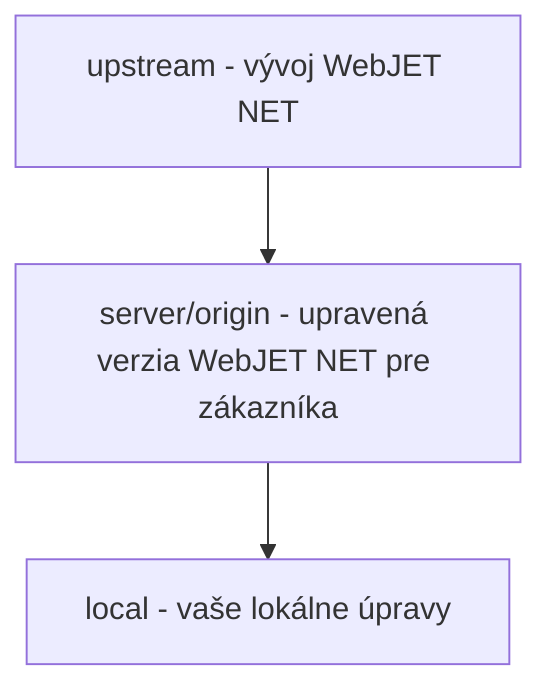

# Working with Git/Gitlab

<!-- @import "[TOC]" {cmd="toc" depthFrom=1 depthTo=6 orderedList=false} -->

<!-- code_chunk_output -->

- [Working with Git/Gitlab](#práca-s-gitgitlab)
	- [Installation and setup](#inštalácia-a-nastavenie)
	- [Cloning the repository from the server to your computer](#naklonovanie-repozitára-zo-servera-na-váš-počítač)
	- [Work in VS Code](#práca-vo-vs-code)
	- [Branching](#branching)
		- [Implementation of a new requirement](#implementácia-novej-požiadavky)
		- [Release to product](#release-do-produkcie)
		- [Correction of a bug in production](#oprava-chyby-v-produkcii)
		- [Merge branch](#spojenie-merge-branch)
	- [Accepting changes (Merge Request)](#akceptovanie-zmien-merge-request)
		- [How and when to create a Merge Request](#ako-a-kedy-vytvoriť-merge-request)
		- [Transition from Work In Progress](#prechod-z-work-in-progress)
		- [Verification of merge conflicts](#overenie-merge-konfliktov)
		- [Code quality control](#kontrola-kvality-kódu)
		- [Merge](#merge)
<!-- /code_chunk_output -->

> **tl;dr** Explanation of the use of GIT: basic concepts, work philosophy, workflow. Functioning of Merge Requests in Gitlab, code quality control.

Gitlab is available at https://gitlab.web.iway.local. If you have only worked with SVN so far, you need to understand the main difference between SVN and GIT - **git is distributed** versioning software, everyone has a copy of the repository on their computer and can work with it locally. Only when you have finished the work do you "push" it to the remote repository (on the server).

Basic concepts:
- git **clone** - will be transferred (**clones**) repository from the server **to your computer**
- git **commit** - sends (**save**) changes made **to your** Local **Repository**. It's similar to SVN, but the changes are not sent to the server yet. So you can also commit work in progress as needed.
- git **branch** - creates **a new branch in the code**, more in section [Branching](#branching)
- git **push** - **sent by** your shifts (commity) **to the server**
- git **pull** - **Update** your local git repository **from the server**
- git **merge** - **will combine the changes** between branches of code

In this guide we try to explain terms in "layman's" terms, so please excuse the non-technical terms. We're talking about a server, even though git is virtually distributed and may even have multiple servers and other dependencies. Typically, we will use the following terms:
- **local** - your local git repository - the repository on your machine
- **server** (also referred to as **origin**) - the primary git repository from which you made the git clone to your machine
- **upstream** - the git repository from which the project is forked on the server

To understand the difference between server and upstream consider the following situation:

You have the development of a "generic" WebJET NET product (upstream) and a copy of it for the customer (server), including your local copy on the computer (local).



**The customer has a modified version** WebJET NET which is stored in the git repository on the server. This version **fork of the original WebJET NET repository**.

**For the customer** (on the server) thus **you are programming adjustments** for a given client, you can change files, delete add and **it in no way affects the development of a "generic" product** WebJET NET. The product development lives its own life, adding new features and functions. **The client has a fixed version of the intranet** from the server.
At some point, there will come **request to update the intranet** of the customer. At that moment on you perform **pull the current code from the upstream server** and update the customer code according to the changes on the upstream server, i.e. according to the evolution of the generic product. When merging code from the upstream server and your customer code, a merge conflict may arise, you will see an option in your IDE to keep the changes or update them according to the upstream server.

## Installation and setup

Before using Gitlab for the first time, you need to install the GIT client and generate encryption keys, since you are connecting to git using SSH keys.

The detailed manual can be found in [PDF documents on intranets](https://intra.iway.sk/files/dokumenty/webove-oddelenie/development/instalacia-git-vo-win.pdf). **ATTENTION** when generating SSH keys **we do not recommend entering a password** (listed as NejakeYourSecretPassword007 in the screenshot), because VS Code / git may have trouble entering the password. The advantage of SSH keys is just that it brings the convenience of not having to enter a password.

In short, install [GIT client for windows](https://git-scm.com/download/win) and then in the program **GitBash** (for macOS in the terminal) generate SSH keys by entering the command:

```shell
ssh-keygen -m PEM -t rsa -b 4096 -C tvoj.email@interway.sk
```

Confirm the default folder for saving the keys (folder `.ssh` in your home folder), when prompted to enter **Do not enter a passcode** nothing (confirm with enter).

After the keys have been generated, enter the commands to set your name and email:

```shell
git config --global user.name "Meno Priezvisko"
git config --global user.email tvoj.email@interway.sk
```

**.pub file** there is no need to send, **you enter it into Gitlab yourself**. Log in and click on your icon on the top right to go to the Settings menu, then select from the left menu [SSH Keys](https://gitlab.web.iway.local/profile/keys). Open the id\_rsa.pub file in a text editor and copy its contents into the Key text box, enter a key name (any) and click Add key.
## Cloning the repository from the server to your computer

Once you've set up the keys to communicate with the git server, you can clone the git repository to your machine.

> I recommend that you keep your local workspace in order **create a subdirectory for the client**, and clone the project into it. You will have a workspace directory **organised by client and then by project**.
>
> I recommend to have a workspace directory with projects for your IDE directly in the home directory.

Address for the command `git clone` you can get directly in gitlab. On the homepage of the project in the upper right part **blue Clone button**. Click on it and a context menu will appear, copy the part from the Clone with SSH field.

```
cd workspace
mkdir menoklienta
cd menoklienta
git clone git@gitlab.web.iway.local:menoklienta/projekt.git
cd projekt
```

For example, in gitlab you copied the address `git@gitlab.web.iway.local:mpsvr/mpsvr-intranet.git`. Value **mpsvr** Is **menoclient** a **mpsvr-intranet** Is **project name**. So proceed as follows:

```
cd workspace
mkdir mpsvr
cd mpsvr
git clone git@gitlab.web.iway.local:mpsvr/mpsvr-intranet.git
cd mpsvr-intranet

#ak pouzivate VS Code mozete ho rovno spustit prikazom
code .
```

It is customary to prefix the project name with the name of the client. This is handy because in VS Code you only see the project name in the title/project/open list and not its parent directory. If the project name also contains the client name, it's easier to navigate.

## Work in VS Code

**In VS Code the branches are displayed in the bottom left**, click on the branch name to see a list of all branches. Branches that you already have locally on your computer are marked as master, or feature/xxx, **the ones on the server start with the prefix origin** (e.g. origin/master, origin/feature/xxx). Branches starting with upstream are those that cover product development (e.g. upstream/master, upstream/feature/xxx).
In the window **Source Control** you will see a list of changed files and click on `...` you will see a menu (the window displays the title Source Control 2 times, click on ... is required on the right in the second line above the field to enter a Commit Message).

**In the Commit menu** is the Commit option on **saving work**, v **Pull, Push menu** Pull and Push options for **sending to the server (push)/updating from the server (pull)** and in **Branch menu** is the possibility **Merge Branch** at [connection of branches](#spojenie-merge-branch).
## Branching

**The advantage of git is**that you can have on your computer **several parts of the project (branch) in progress**, you commit those on your computer. Branches are independent of each other (changes in one branch do not affect another branch).
Imagine that you have a major modification in progress and at the same time you receive a request for a minor modification in a completely different part of the code. **Commit a job in progress and switch to a new gateway**where you make the second edit, commit it and push it to the server. You don't have to deal with the fact that you have a first job in progress elsewhere, and you don't have to remember what to push to the server.

So the basic requirement is to create a gateway for each task you are solving. For development, we use the gitlab flow methodology (usually without a develop branch). We use the following branch names:
- **master** - the main gate in which there is only **Approved and tested code**. Master brancha **is usually protected** and a normal developer has no right to push changes to it. These are accepted through the so-called. [Merge request](#akceptovanie-zmien-merge-request)
- **feature/xxxxx-nazov-tiketu** - Branch in which the requested change in ticket xxxxx is implemented. The name of the branch starts with the prefix feature/ and continues with the ticket/request number and its short name (for a better overview)
- **release/yyyy.ww** - in branchi release are preserved **production (released) versions** Project. In the chain `yyyy.ww` is the release number, I recommend using the year.week format, for example 2020.43.
- **hotfix/xxxxx-nazov-tiketu** - contains **quick fixes (hotfix) production** Versions. A typical situation is a bug on production that needs to be fixed quickly.
- **develop** - for some projects a develop brancha can also be used, which **represents the role of the master branche and may also contain parts in progress**, but we recommend not to use it, because it rather brings chaos to the development.
We will show some examples of how to proceed during development. **Before** By **by creating a new gateway** you have to realize that **you create it as a new branch** z **branche**that you have **just opened**. Typically, you have to switch to the necessary gateway from which you will branch and update it from the server.

Description [workflow/branch model](https://intra.iway.sk/files/dokumenty/webove-oddelenie/development/gitflow-workflow.pdf) is also in a document on the intranet.

> **Notice**: when you switch between branches your code changes. Some files are deleted (because they don't exist in that branch) and some are added. After changing the branch I recommend you to run the command **gradlew clean** to delete the compiled files and if you use NPM also perform **npm install** to install the necessary libraries. For npm we recommend to prepare also a gradle task **[gradlew npminstall](../../build.gradle)**to avoid having to navigate to subdirectories with npm modules.

### Implementation of a new requirement

- commit your current work in progress files (if you are already working on another request)
- **switch** out on **master** branch
- update the master branch from the server via `git pull`
- create **new branch** named **feature/IDTIKETU-short-menu-label**that is, for example `feature/47419-monitorovanie-servera`
Branch will be created locally, you can work on changes and commit code locally. When you're done you can **"send to server"** via `git push`. Your IDE may ask you if you really want to send the gateway to the server and possibly change its name (but keep it the same as it is locally).

### Release to product

Typically, you put the current tested code from the master gateway into production. Practically, you could create a war archive straight from the master branch and deploy it to the server. But you shouldn't **a fixed version of the deployed code** and you'd be programming hotfixes wrong.

- **switch** out on **master** branch
- update the master branch from the server via `git pull`
- create **new branch** named **release/yyyy.ww**, whether, for example `release/2020.43`
- push the gateway to the server via `git push`
The brancha thus formed is only **branching from the original master branche**, so far it does not contain any changes, it is only **state preservation** for the need of hotfix on production.

### Correction of a bug in production

If an error occurs on production and a hotfix needs to be made:
- **switch** out on **release of the gateway**that is used in production, e.g. `release/2020.43`
- **to be sure, update** gateway from the server via `git pull`
- create **new branch** named **hotfix/IDTIKETU-short-menu-label**that is, for example `hotfix/47326-oprava-prihlasenia`
Now that you have the same code on your machine as is on the server, you can implement fixes as required. Then send the patch to the server via `git push`.

**ATTENTION:** changes to the hotfix branch are subsequently required **merge** to a given **release branche and also to the master branche** (so that the hotfix doesn't get lost).
You then only need to deploy the changed files to the server. After merging to the release branch, you can also deploy the entire release branch.

### Merge branch

**During development on feature/** branch you may need **updating the code from the master** branche (or possibly another). Proceed as follows:
- commit the current work in progress files
- **switch** out on **master** branch
- update the master branch from the server via `git pull`
- **switch back** on the branch **feature/IDTIKETU-short-menu-label** which you want to update according to the master gateway
- run the command `git merge` and select the branch master
Which is to say, **do branch feature/IDTIKETU-short-menu-label merge** branche code **master**.

**In VS Code** to perform the above operations in Source Control, click on `...` to the right of the Source Control text (... in the second line). You will see the Commit menu you have the Commit option, in Pull, Push you have the Pull option, and in the Branch menu you have the Merge Branch option.
Of course, you may have merge conflicts when both you and someone else in the master branch has made a change to the file. Conflicts need to be resolved.

In VS Code you will **conflicts are displayed in the Source Control window in the MERGE CHANGES block**. Clicking on the file will also show you the options to accept your changes, accept both changes, accept changes from the server. There can be multiple such changes in one file. You can also edit them manually, it's just text in the editor bordered by tags `<<< ----->>>`. After **conflict resolution** right-click on it in the file and select `Stage changes`. This prepares the modified file for commit. When you have resolved the conflicts in all files, commit the changes by clicking the commit icon. You will see a description `Merge xxx with branch yyyy`.

## Accepting changes (Merge Request)

Using the Merge Request feature in gitlab, you can **perform a code quality check (code review)** before accepting changes in the feature/hotfix branch into the master branch. Typically, the master branch is protected and only a user in the group can push changes to it **maintainer**.

But the function is **useful already during development**, shows a list of changed files so you can see what you've changed.

### How and when to create a Merge Request

You create a Merge Request in Gitlab. In the corresponding project, select the left menu **Repository-\&gt;Branches**. For each Branch (except master) you will see **Merge request button**, click on it.

Fill in the form **Title**, it should be **identical to the name branche**, e.g. `feature/47419-monitorovanie-servera`. If the gateway is still unfinished enter the title prefix **WIP:** (Work In Progress), i.e. `WIP: feature/47419-monitorovanie-servera`.

**Description** can be filled in according to the ticket input, in **Assignee** choose a developer to do code review or a repository maintainer (the main developer of the project). During Work In Progress, you can leave the Assignee field blank.
Do not fill in the other fields, the fields in **Leave Merge options unchecked**.

Click on **Submit merge request** you create it. To see a list of Merge Requests created, click Merge Requests in the left menu.

> Summary: It is recommended to create a Merge Request right after pushing a Branch with the WIP prefix. This will give you an overview of the changes in the Branch and you can do a code quality check yourself.

### Transition from Work In Progress

If you have a Merge Request created with the prefix WIP: and your gateway is already **ready for revision/merge to master** branche click **Mark as ready** in a given Merge Request.

Remember to also fill in the Assignee field (after clicking the Edit button).

### Verification of merge conflicts

The Overview tab shows the status of whether it is possible to merge a branch into the master. If the button is **Merge green, everything is fine**. If it is greyed out with text **There are merge conflicts** merge conflicts need to be resolved first.

> I always recommend before final pushing of changes in branchi **pre-merge against the master branch**. This way you will get the actual code from master into your feature gateway and verify that your change is OK. **running automated tests**. If your feature branch broke a feature/test, you need to implement a fix.

### Code quality control

In the Merge Request under the Changes tab, you can see a list of changes to the files. When you move the cursor over a row, you will see the beginning of the row **icon to add a comment**. Click on the icon to display a text box for adding a comment.

Use @name to tag the solver of the comment. Buttons appear below the comment **Start review** a **Add comment now**. The difference is that using **Start review** you can add **more comments** and send the notification at once at the end. Using **Add comment now** straight **add a comment and send** and notification.

In Merge Request, you will also see a message at the top **X unresolved threads**, where X is the number of pending comments.

As a developer, you should respond to comments. Incorporate the changes, push them to the server and then mark the comment as resolved by clicking the button **Resolve thread**.

### Merge

The final merge to the master gateway is performed by the project administrator by clicking on the green button **Merge**. Your branch gets an icon in the branch list **merged**.

We do not recommend using the option **Squash commits** or Delete source branch, leave these options unchecked. Option **Squash commits would "merge" multiple commits** in your feature branching into one and so it merged into the master branching. It's fine if you never make changes in the feature branch again, but if you subsequently make another commit in the feature branch, the history against the master branch will be messed up. Option **Delete source branch** is obvious from the name, for now the rule is that we don't delete old branches for the sake of history.
